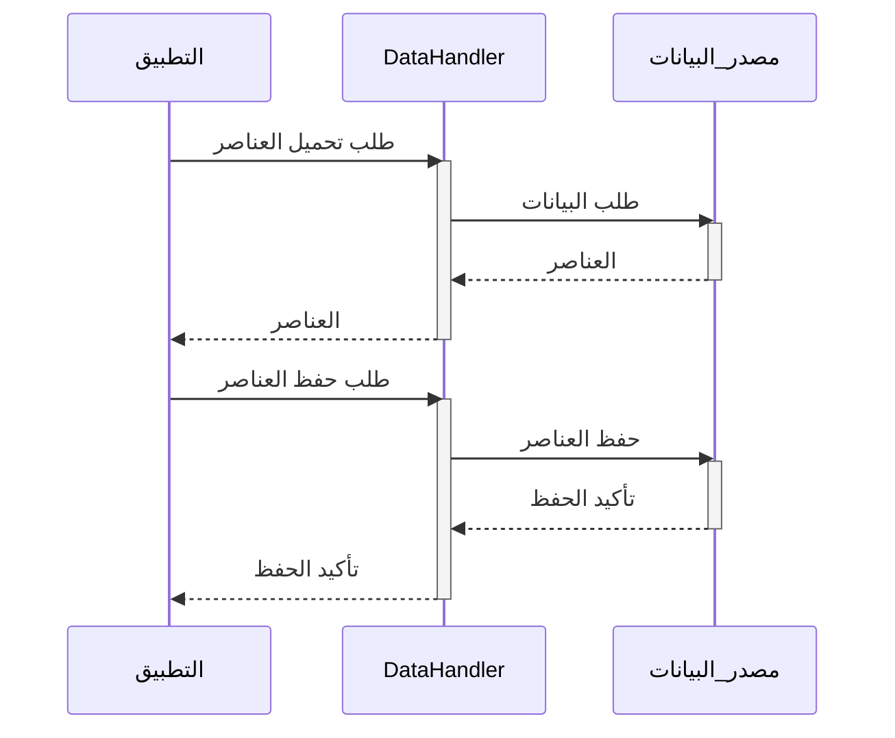

> Previously, we looked at [خط أنابيب المعالجة الرئيسي](03_خط-أنابيب-المعالجة-الرئيسي.md).

# Chapter 4: معالج البيانات
Let's begin exploring this concept. في هذا الفصل، سنتناول مفهوم "معالج البيانات" وكيفية عمله في مشروعنا. هدفنا هو فهم دوره في تحميل وحفظ البيانات، وكيف يتفاعل مع الأجزاء الأخرى من النظام.
## الدافع والغرض
لماذا نحتاج إلى "معالج بيانات"؟ تخيل أن لديك مجموعة من الكتب (العناصر) وتحتاج إلى قراءتها وحفظها مرة أخرى بعد إجراء بعض التعديلات عليها. "معالج البيانات" هو مثل أمين المكتبة المسؤول عن:
*   **تحميل الكتب (العناصر) من الرفوف (مصدر البيانات).**
*   **تسليم الكتب (العناصر) إلى القراء (معالج العناصر).**
*   **استلام الكتب (العناصر) المعدلة وحفظها مرة أخرى على الرفوف (مصدر البيانات).**
بمعنى آخر، يفصل "معالج البيانات" منطق تحميل البيانات ومنطق معالجتها، مما يجعل الكود أكثر تنظيمًا وقابلية للصيانة. إذا قررنا تغيير مكان تخزين الكتب (تغيير مصدر البيانات)، فإننا نعدل فقط "معالج البيانات" دون التأثير على القراء (معالج العناصر).
## المفاهيم الأساسية
"معالج البيانات" هو مكون يقوم بالمهام التالية:
1.  **تحميل البيانات (Loading Data):** يقوم بتحميل البيانات الأولية من مصدر البيانات. مصدر البيانات هذا يمكن أن يكون ملفًا، قاعدة بيانات، API، أو أي مصدر آخر.
2.  **حفظ البيانات (Saving Data):** يقوم بحفظ البيانات المعالجة أو المحدثة مرة أخرى إلى مصدر البيانات.
في مشروعنا، يقوم `DataHandler` بمحاكاة هذه العمليات. بدلاً من الاتصال الفعلي بقاعدة بيانات أو ملف، فإنه يقوم بإنشاء عناصر `Item` وهمية وحفظها.
## كيفية عمله
يعمل `DataHandler` في مشروعنا على النحو التالي:
1.  **التهيئة (Initialization):** عند إنشاء كائن `DataHandler`، يتم تزويده بمسار مصدر البيانات (`dataSourcePath`). هذا المسار يستخدم لتحديد مكان تحميل وحفظ البيانات.
2.  **تحميل العناصر (`loadItems()`):** تقوم هذه الدالة بمحاكاة تحميل العناصر من مصدر البيانات. في الوقت الحالي، تقوم بإنشاء مجموعة من عناصر `Item` ثابتة وإرجاعها.
3.  **حفظ العناصر (`saveItems(items:)`):** تقوم هذه الدالة بمحاكاة حفظ العناصر إلى مصدر البيانات. تقوم ببساطة بطباعة معلومات حول العناصر التي تم حفظها.
## أمثلة برمجية
فيما يلي مقتطفات من الكود توضح كيفية عمل `DataHandler`:
```swift
// المصدر: SampleProject2/DataHandler.swift
import Foundation
/// يدير تحميل وحفظ بيانات العناصر.
/// يحاكي التفاعل مع مصدر بيانات مثل ملف أو قاعدة بيانات.
public class DataHandler {
    private let dataSourcePath: String
    /// يقوم بتهيئة DataHandler بمسار مصدر البيانات.
    public init(dataSourcePath: String) {
        self.dataSourcePath = dataSourcePath
        print("DataHandler initialized for source: \(self.dataSourcePath)")
    }
    /// يحاكي تحميل العناصر من مصدر البيانات.
    /// - Returns: مصفوفة من كائنات Item.
    public func loadItems() -> [Item] {
        print("Simulating loading items from \(self.dataSourcePath)...")
        let items = [
            Item(itemId: 1, name: "Gadget Alpha", value: 150.75),
            Item(itemId: 2, name: "Widget Beta", value: 85.0),
            Item(itemId: 3, name: "Thingamajig Gamma", value: 210.5),
            Item(itemId: 4, name: "Doohickey Delta", value: 55.2)
        ]
        print("Loaded \(items.count) items.")
        return items
    }
    /// يحاكي حفظ العناصر المعالجة مرة أخرى إلى مصدر البيانات.
    /// - Parameter items: مصفوفة من كائنات Item لحفظها.
    /// - Returns: صحيح إذا تم محاكاة الحفظ بنجاح.
    public func saveItems(items: [Item]) -> Bool {
        print("Simulating saving \(items.count) items to \(self.dataSourcePath)...")
        for item in items {
            print("Saving item: \(item)")
        }
        print("Finished simulating save operation.")
        return true
    }
}
```
يمكننا أن نرى أن `DataHandler` يتعامل مع تفاصيل تحميل وحفظ البيانات.

يوضح مخطط التسلسل أعلاه تدفق البيانات بين التطبيق، و `DataHandler`، ومصدر البيانات.
## العلاقات والارتباطات
يتفاعل "معالج البيانات" بشكل وثيق مع [إعدادات التطبيق](02_إعدادات-التطبيق.md) للحصول على مسار مصدر البيانات، ومع [نموذج العنصر](03_نموذج-العنصر.md) لتمثيل البيانات التي يتم تحميلها وحفظها، ومع [معالج العناصر](05_معالج-العناصر.md) الذي يستقبل العناصر من "معالج البيانات" لمعالجتها. ويمكن رؤية تفاعله أيضا في [خط أنابيب المعالجة الرئيسي](06_خط-أنابيب-المعالجة-الرئيسي.md)
## الخلاصة
في هذا الفصل، تعلمنا عن "معالج البيانات" ودوره في تحميل وحفظ البيانات في مشروعنا. إنه مكون حيوي لفصل منطق الوصول إلى البيانات عن منطق المعالجة.
This concludes our look at this topic.

> Next, we will examine [معالج العناصر](05_معالج-العناصر.md).


---

*Generated by [SourceLens AI](https://github.com/openXFlow/sourceLensAI) using LLM: `gemini` (cloud) - model: `gemini-2.0-flash` | Language Profile: `Python`*