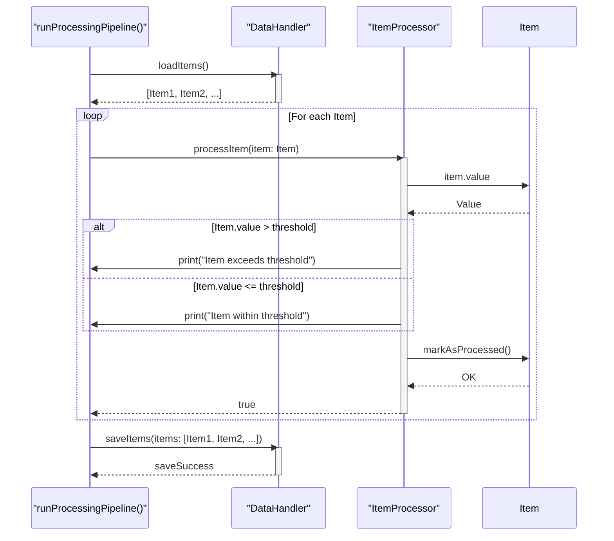

> Previously, we looked at [معالج البيانات](04_معالج-البيانات.md).

# Chapter 5: معالج العناصر
Let's begin exploring this concept. في هذا الفصل، سنتعمق في فهم "معالج العناصر" أو `ItemProcessor`، وهو مكون أساسي في مشروعنا `20250704_1347_code-swift-sample-project`. سنشرح دوره، وكيف يعمل، وكيفية استخدامه لمعالجة البيانات بشكل فردي.
يهدف هذا الفصل إلى تزويدكم بالمعرفة اللازمة لفهم وظيفة `ItemProcessor` وكيفية تفاعله مع المكونات الأخرى في المشروع.
لماذا نحتاج إلى معالج العناصر؟ تخيل أن لديك مصنعًا ينتج منتجات مختلفة. كل منتج يمر عبر محطات عمل مختلفة. "معالج العناصر" يشبه إحدى هذه المحطات. دوره هو أخذ كل منتج (عنصر بيانات) على حدة، وإجراء فحوصات وتعديلات معينة عليه (تطبيق المنطق) قبل أن ينتقل إلى المحطة التالية. بدون هذه المحطة، قد لا تتم معالجة المنتجات بشكل صحيح، مما يؤدي إلى مشاكل في المنتج النهائي.
**المفاهيم الأساسية:**
*   **العنصر (Item):** يمثل وحدة البيانات الفردية التي يتم معالجتها. راجع [نموذج العنصر](03_نموذج-العنصر.md) للحصول على مزيد من التفاصيل حول هيكل `Item`.
*   **العتبة (Threshold):** قيمة محددة تُستخدم للمقارنة مع قيمة العنصر. إذا تجاوزت قيمة العنصر هذه العتبة، فقد يتم اتخاذ إجراءات معينة.
*   **المنطق (Logic):** مجموعة القواعد والعمليات التي يتم تطبيقها على كل عنصر. في مثالنا، المنطق بسيط: مقارنة قيمة العنصر بالعتبة.
*   **تمت المعالجة (Processed):** حالة تشير إلى أن العنصر قد تم فحصه وتعديله بواسطة `ItemProcessor`.
**كيف يعمل معالج العناصر؟**
`ItemProcessor` لديه مسؤولية رئيسية واحدة: معالجة عناصر البيانات الفردية بناءً على قواعد محددة. فيما يلي نظرة عامة عالية المستوى لما يحدث داخل `ItemProcessor`:
1.  **الاستقبال:** يستقبل `ItemProcessor` كائن `Item` واحدًا للمعالجة.
2.  **التدقيق:** يتم فحص قيمة العنصر ومقارنتها بقيمة `threshold`.
3.  **التصرف:** بناءً على نتيجة المقارنة، يتم تنفيذ إجراءات معينة. في مثالنا، يتم طباعة رسالة تشير إلى ما إذا كانت قيمة العنصر تتجاوز العتبة أم لا.
4.  **التأشير:** يتم وضع علامة على العنصر بأنه تمت معالجته باستخدام الدالة `item.markAsProcessed()`.
5.  **الإرجاع:** ترجع الدالة `processItem` قيمة منطقية (`Bool`) للإشارة إلى نجاح المعالجة.
**مثال على الكود:**
```swift
/// Processes a single item, marking it as processed and applying logic.
/// - Parameter item: The Item object to process.
/// - Returns: True if processing was successful.
public func processItem(item: Item) -> Bool {
    print("Processing item ID: \(item.itemId), Name: '\(item.name)', Value: \(item.value)") // طباعة معلومات حول العنصر الذي تتم معالجته
    if item.value > Double(self.threshold) { // التحقق مما إذا كانت قيمة العنصر تتجاوز العتبة
        print("Item '\(item.name)' (ID: \(item.itemId)) value \(item.value) exceeds threshold \(self.threshold).") // طباعة رسالة إذا تجاوزت القيمة العتبة
    } else {
        print("Item '\(item.name)' (ID: \(item.itemId)) value \(item.value) is within threshold \(self.threshold).") // طباعة رسالة إذا كانت القيمة ضمن العتبة
    }
    item.markAsProcessed() // وضع علامة على العنصر بأنه تمت معالجته
    return true
}
```
يوضح هذا المقتطف الدالة `processItem` في `ItemProcessor`. تقوم هذه الدالة بمعالجة عنصر واحد (`item`).  تقوم أولاً بطباعة معلومات حول العنصر. بعد ذلك، تتحقق مما إذا كانت قيمة `item.value` أكبر من قيمة `threshold` المخزنة في `ItemProcessor`. بناءً على هذه المقارنة، يتم طباعة رسالة مناسبة.  أخيرًا، يتم استدعاء `item.markAsProcessed()` لتحديث حالة العنصر، ثم يتم إرجاع `true` للإشارة إلى النجاح.
**كيفية استخدام `ItemProcessor`:**
يتم استخدام `ItemProcessor` داخل `runProcessingPipeline` في الملف `main.swift`. بعد تحميل البيانات بواسطة `DataHandler`، يتم تمرير كل عنصر من العناصر المحملة إلى `ItemProcessor` للمعالجة.
```swift
// Sources/SampleProject2/main.swift
import Foundation
/// Executes the main data processing pipeline.
func runProcessingPipeline() {
    print("Starting Sample Project 2 processing pipeline...")
    do {
        // 1. Initialize components using configuration
        let dataPath = AppConfig.getDataPath()
        let threshold = AppConfig.getThreshold()
        let dataHandler = DataHandler(dataSourcePath: dataPath)
        let itemProcessor = ItemProcessor(threshold: threshold)
        // 2. Load data
        let itemsToProcess = dataHandler.loadItems()
        guard !itemsToProcess.isEmpty else {
            print("No items loaded. Exiting pipeline.")
            return
        }
        print("Successfully loaded \(itemsToProcess.count) items.")
        // 3. Process data items
        for item in itemsToProcess {
            print("Passing item to processor: \(item)")
            _ = itemProcessor.processItem(item: item)
        }
        // 4. Save processed data
        let saveSuccess = dataHandler.saveItems(items: itemsToProcess)
        if saveSuccess {
            print("Processed items saved successfully.")
        } else {
            print("Failed to save processed items.")
        }
    } catch {
        // Swift's structured error handling
        print("A critical error occurred: \(error.localizedDescription)")
    }
    print("Sample Project 2 processing pipeline finished.")
}
```
**رسم تخطيطي للتسلسل:**
يوضح هذا الرسم التخطيطي للتسلسل كيفية تفاعل `runProcessingPipeline` مع `ItemProcessor`:

يشير الرسم التخطيطي إلى أن `runProcessingPipeline` (RPP) يستدعي `loadItems()` من `DataHandler` (DH) لتحميل قائمة بالعناصر (`Item`). ثم، في حلقة، تمرر `runProcessingPipeline` كل عنصر إلى `processItem(item: Item)` في `ItemProcessor` (IP). داخل `processItem`, يتم الوصول إلى `item.value` ويتم مقارنتها بالعتبة. اعتمادًا على النتيجة، تتم طباعة رسالة. ثم يتم استدعاء `markAsProcessed()` على `Item`.  أخيرًا، يتم استدعاء `saveItems()` من `DataHandler` لحفظ العناصر المعالجة.
**العلاقات والارتباطات:**
*   يرتبط هذا الفصل ارتباطًا وثيقًا بـ [نموذج العنصر](03_نموذج-العنصر.md) حيث يوضح كيفية معالجة كائنات `Item`.
*   يعتمد `ItemProcessor` على [إعدادات التطبيق](02_إعدادات-التطبيق.md) للحصول على قيمة `threshold`.
*   `ItemProcessor` هو جزء لا يتجزأ من [خط أنابيب المعالجة الرئيسي](06_خط-أنابيب-المعالجة-الرئيسي.md) الذي يوضح كيفية استخدامه في سياق أوسع.
*   يستخدم `ItemProcessor` مكون [معالج البيانات](04_معالج-البيانات.md) لاستقبال العناصر ومعالجتها.
في هذا الفصل، قمنا بفحص `ItemProcessor`، وهو مكون أساسي لمعالجة البيانات في مشروعنا. لقد تعلمنا الغرض منه، وكيف يعمل، وكيف يتفاعل مع المكونات الأخرى.
This concludes our look at this topic.

> Next, we will examine [نموذج العنصر](06_نموذج-العنصر.md).


---

*Generated by [SourceLens AI](https://github.com/openXFlow/sourceLensAI) using LLM: `gemini` (cloud) - model: `gemini-2.0-flash` | Language Profile: `Python`*