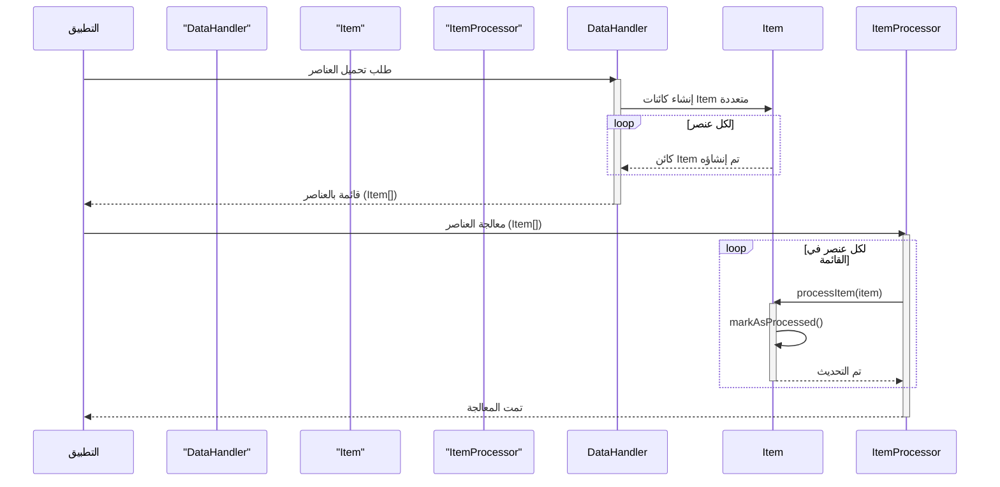

> Previously, we looked at [معالج العناصر](05_معالج-العناصر.md).

# Chapter 3: نموذج العنصر
Let's begin exploring this concept. يهدف هذا الفصل إلى شرح الغرض من "نموذج العنصر" وكيفية استخدامه في مشروعنا `20250704_1347_code-swift-sample-project`. سنستكشف خصائصه وكيفية تمثيله لعنصر بيانات فردي.
**لماذا نحتاج إلى نموذج العنصر؟**
تخيل أنك تتعامل مع كمية كبيرة من البيانات، مثل قائمة المنتجات في متجر عبر الإنترنت. كل منتج لديه خصائص مثل الاسم والسعر والمعرف. بدلاً من التعامل مع هذه البيانات بشكل عشوائي، نقوم بتنظيمها في "نموذج العنصر". يعمل هذا النموذج بمثابة قالب أو هيكل موحد لكل عنصر بيانات.
يمكن تشبيه "نموذج العنصر" بقالب لصنع الكعك. القالب يحدد شكل وحجم الكعكة، وبالمثل، يحدد "نموذج العنصر" خصائص عنصر البيانات. هذا يسمح لنا بالتعامل مع البيانات بطريقة منظمة وفعالة.
**مكونات نموذج العنصر**
في مشروعنا، يتم تمثيل "نموذج العنصر" بواسطة الكلاس `Item` في ملف `Item.swift`. دعونا نلقي نظرة على خصائصه:
*   `itemId`:  معرف فريد للعنصر (Int).
*   `name`: اسم العنصر (String).
*   `value`: قيمة مرتبطة بالعنصر (Double).
*   `processed`: حالة معالجة العنصر (Bool). يشير إلى ما إذا كان العنصر قد تمت معالجته أم لا.
```swift
// Sources/SampleProject2/Item.swift
import Foundation
/// Represents a single data item to be processed.
/// يمثل عنصر بيانات واحد تتم معالجته.
public class Item: CustomStringConvertible {
    public let itemId: Int
    public let name: String
    public let value: Double
    public var processed: Bool
    /// Initializes a new instance of the Item class.
    /// لتهيئة نسخة جديدة من الكلاس Item.
    public init(itemId: Int, name: String, value: Double, processed: Bool = false) {
        self.itemId = itemId
        self.name = name
        self.value = value
        self.processed = processed
    }
    /// Sets the processed flag to true, updating the item's state.
    /// لتعيين قيمة العلم processed إلى true، وتحديث حالة العنصر.
    public func markAsProcessed() {
        print("Model Item \(self.itemId): Marking '\(self.name)' as processed.")
        self.processed = true
    }
    /// Returns a user-friendly string representation of the item.
    /// لإرجاع وصف نصي للعنصر.
    public var description: String {
        let status = processed ? "Processed" : "Pending"
        return "Item(ID=\(itemId), Name='\(name)', Value=\(String(format: "%.2f", value)), Status=\(status))"
    }
}
```
يوفر الكلاس `Item` أيضًا دالة `markAsProcessed()` لتعليم العنصر على أنه تمت معالجته.  خاصية `description` توفر وصفًا سهل الاستخدام للعنصر، مما يسهل طباعته وتصحيح الأخطاء.
**كيف يعمل نموذج العنصر؟**
يتم إنشاء مثيلات من الكلاس `Item` لتمثيل عناصر البيانات الفردية. يتم استخدام هذه المثيلات في جميع أنحاء التطبيق لمعالجة البيانات. على سبيل المثال، يمكن لـ `DataHandler` تحميل قائمة `Item` من مصدر بيانات، ويمكن لـ `ItemProcessor` معالجة كل `Item` على حدة.
```swift
// Sample usage (not an actual code snippet, just for illustration)
let newItem = Item(itemId: 5, name: "Gizmo Epsilon", value: 120.0)
print(newItem.description) // Output: Item(ID=5, Name='Gizmo Epsilon', Value=120.00, Status=Pending)
newItem.markAsProcessed()
print(newItem.description) // Output: Item(ID=5, Name='Gizmo Epsilon', Value=120.00, Status=Processed)
```
توضح الشيفرة أعلاه كيفية إنشاء كائن `Item` جديد وكيفية تغيير حالته باستخدام الدالة `markAsProcessed()`. يتم استخدام خاصية `description` لطباعة معلومات حول الكائن.
**رسم توضيحي لتسلسل العمليات**

يشرح الرسم التخطيطي أعلاه تدفق العمليات: يقوم `DataHandler` بتحميل العناصر، ويقوم `ItemProcessor` بمعالجة كل عنصر، ويقوم الكائن `Item` بتحديث حالته الداخلية.
**العلاقات والارتباطات**
يرتبط "نموذج العنصر" ارتباطًا وثيقًا بـ [معالج البيانات](04_معالج-البيانات.md) و [معالج العناصر](05_معالج-العناصر.md). يقوم `DataHandler` بتحميل وتخزين مثيلات `Item`، بينما يقوم `ItemProcessor` بمعالجة هذه المثيلات.
**ملخص**
"نموذج العنصر" (`Item`) هو تمثيل لعنصر بيانات فردي في تطبيقنا. يوفر هيكلًا موحدًا لتنظيم البيانات ومعالجتها. من خلال فهم خصائصه ووظيفته، يمكننا بناء تطبيق أكثر كفاءة وقابلية للصيانة.
This concludes our look at this topic.

> Next, we will examine [Architecture Diagrams](07_diagrams.md).


---

*Generated by [SourceLens AI](https://github.com/openXFlow/sourceLensAI) using LLM: `gemini` (cloud) - model: `gemini-2.0-flash` | Language Profile: `Python`*