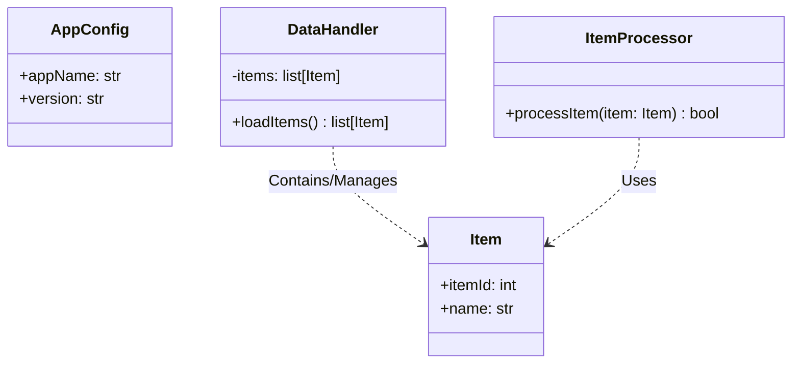
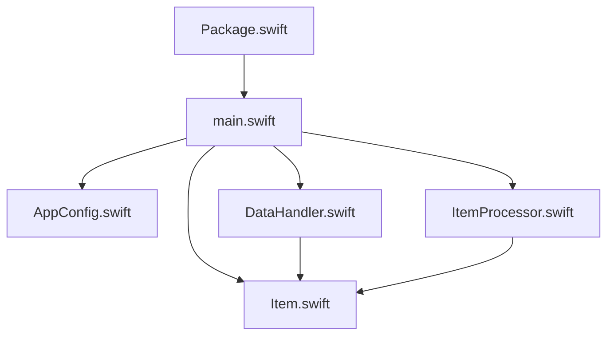
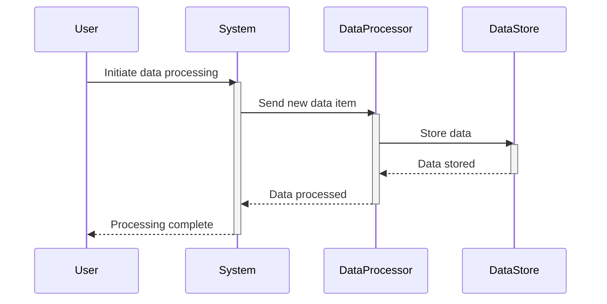
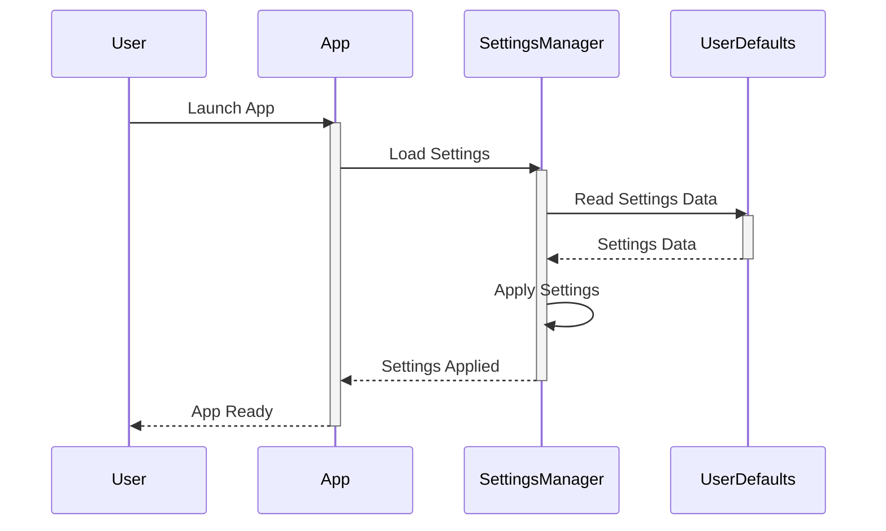
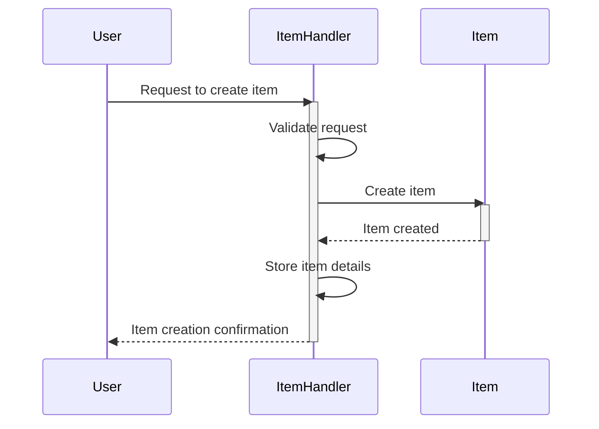
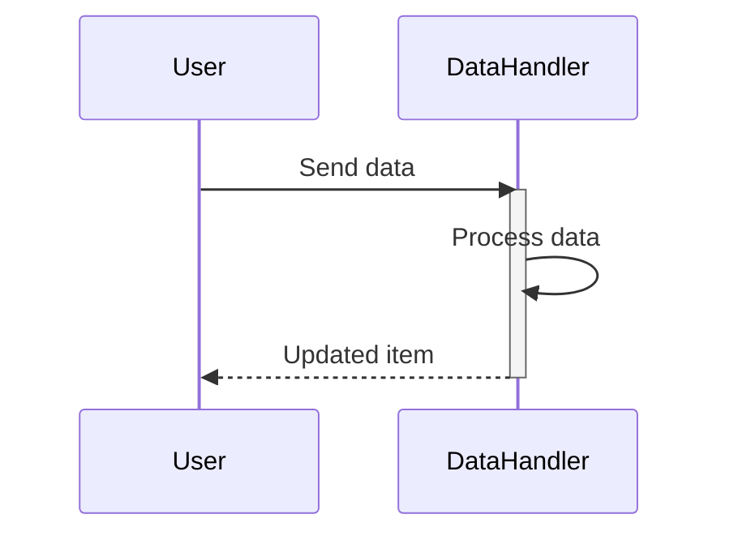
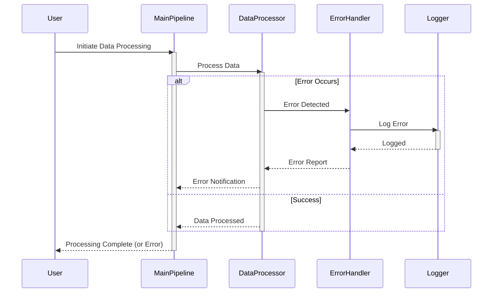

> Previously, we looked at [نموذج العنصر](06_نموذج-العنصر.md).

# Architecture Diagrams
## Class Diagram
Key classes and their relationships in **20250704_1347_code-swift-sample-project**.

## Package Dependencies
High-level module and package structure of **20250704_1347_code-swift-sample-project**.

## Sequence Diagrams
These diagrams illustrate various interaction scenarios, showcasing operations between components for specific use cases.
### The main processing pipeline handles a new data item.

### The app settings are loaded and applied at startup.

### An item is created and managed by the item handler.

### Data is processed by the data handler, resulting in an updated item.

### An error occurs during data processing within the main pipeline.

> Next, we will examine [Code Inventory](08_code_inventory.md).

---

*Generated by [SourceLens AI](https://github.com/openXFlow/sourceLensAI) using LLM: `gemini` (cloud) - model: `gemini-2.0-flash` | Language Profile: `Python`*