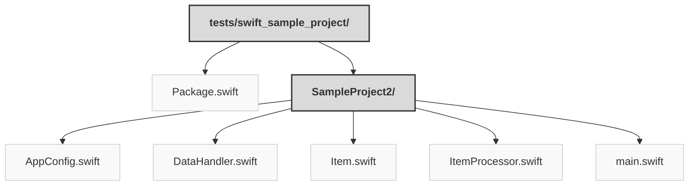

> Previously, we looked at [Architecture Diagrams](07_diagrams.md).

# Code Inventory: 20250704_1347_code-swift-sample-project
## File Structure

## File Descriptions Summary
*   **`Package.swift`**: // swift-tools-version: 5.9
*   **`AppConfig.swift`**: // Sources/SampleProject2/AppConfig.swift
*   **`DataHandler.swift`**: // Sources/SampleProject2/DataHandler.swift
*   **`Item.swift`**: // Sources/SampleProject2/Item.swift
*   **`ItemProcessor.swift`**: // Sources/SampleProject2/ItemProcessor.swift
*   **`main.swift`**: // Sources/SampleProject2/main.swift
---
## Detailed File Content
No detailed structural information could be generated for the files based on the selected parser.

> Next, we will examine [Project Review](09_project_review.md).

---

*Generated by [SourceLens AI](https://github.com/openXFlow/sourceLensAI) using LLM: `gemini` (cloud) - model: `gemini-2.0-flash` | Language Profile: `Python`*