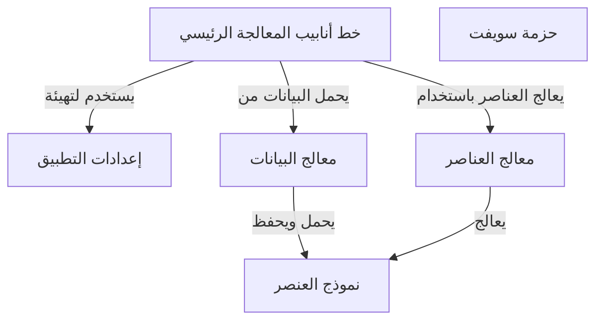

# Tutorial: 20250704_1347_code-swift-sample-project

يقوم هذا المشروع بمعالجة البيانات من خلال **تحميلها**، ثم معالجتها، ثم **حفظها**.  تُستخدم إعدادات التطبيق لتهيئة *معالج البيانات* و *معالج العناصر*.  يقوم خط أنابيب المعالجة الرئيسي بتنسيق تدفق البيانات بين هذه المكونات.

**Source Directory:** `C:\_jd_programming\python\11_sourceLens_project\sourceLens\tests\swift_sample_project`

## Abstraction Relationships

## Chapters

1. [إعدادات التطبيق](01_إعدادات-التطبيق.md)
2. [حزمة سويفت](02_حزمة-سويفت.md)
3. [خط أنابيب المعالجة الرئيسي](03_خط-أنابيب-المعالجة-الرئيسي.md)
4. [معالج البيانات](04_معالج-البيانات.md)
5. [معالج العناصر](05_معالج-العناصر.md)
6. [نموذج العنصر](06_نموذج-العنصر.md)
7. [Architecture Diagrams](07_diagrams.md)
8. [Code Inventory](08_code_inventory.md)
9. [Project Review](09_project_review.md)

---

*Generated by [SourceLens AI](https://github.com/openXFlow/sourceLensAI) using LLM: `gemini` (cloud) - model: `gemini-2.0-flash` | Language Profile: `Python`*