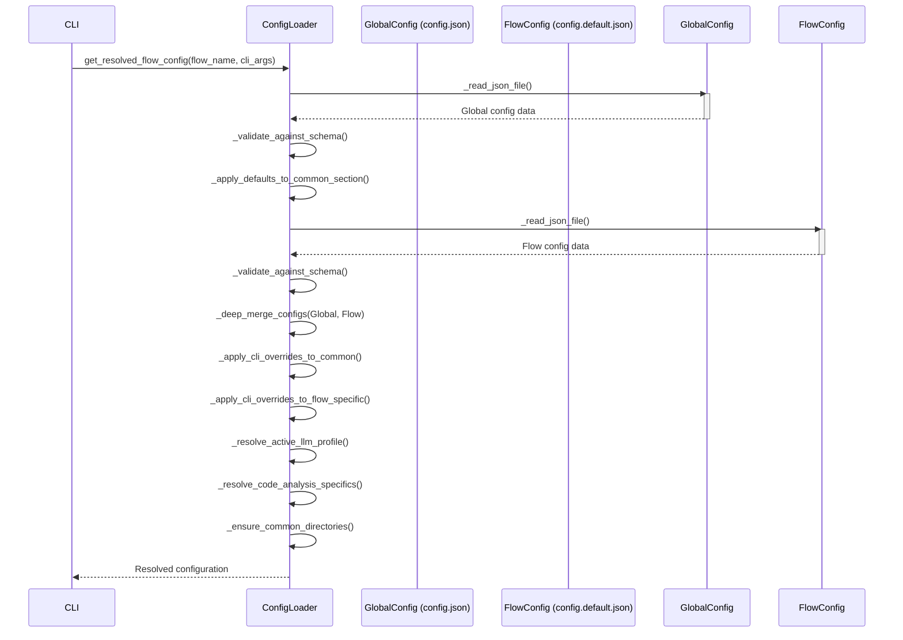

> Previously, we looked at the [Project Overview](index.md).

# Chapter 1: Configuration Management
Let's begin exploring this concept. This chapter aims to provide a comprehensive understanding of configuration management within the `20250704_1434_code-sourcelensai` project. We'll explore how the application loads, validates, and utilizes configuration settings, enabling flexible and adaptable behavior.
## Why Configuration Management?
Imagine building a house. The blueprints are like the code, but you need to adjust the design based on the location, the owner's preferences, and available materials. Configuration management is similar; it allows us to tailor the application's behavior without changing the core code.
In essence, configuration management provides the means to:
*   **Adapt to different environments:** The application might need different settings for development, testing, and production environments.
*   **Customize behavior:** Users can tweak certain parameters to suit their specific needs.
*   **Simplify maintenance:** Centralized configuration makes it easier to update and manage settings.
## Core Components
The heart of configuration management in `20250704_1434_code-sourcelensai` lies in the `ConfigLoader` class and its associated schema files. Let's break down these components:
1.  **`config.json` (Global Configuration):** This file stores the application's global settings, including common settings for all flows, LLM profiles, and language profiles. It establishes a baseline configuration.
2.  **`config.default.json` (Flow-Specific Configuration):** Each flow (e.g., `FL01_code_analysis`, `FL02_web_crawling`) has its own `config.default.json` file, containing default settings specific to that flow.
3.  **JSON Schema Files:** These files (e.g., `COMMON_SCHEMA`, `CODE_ANALYSIS_GLOBAL_OVERRIDES_SCHEMA`) define the structure and validation rules for the configuration data. They ensure that the configuration settings are valid and consistent.
4.  **`ConfigLoader` Class:** This class is responsible for loading, validating, and merging the configuration settings from the global configuration file, flow-specific default configuration file, environment variables, and command-line arguments.
## How it Works: The Configuration Loading Process
The `ConfigLoader` orchestrates the following steps to provide a fully resolved configuration for each flow:
1.  **Load Global Configuration:** Loads the `config.json` file.
2.  **Validate Global Configuration:** Validates the loaded configuration against the `GLOBAL_ROOT_CONFIG_SCHEMA`.
3.  **Apply Defaults to Common Section:** Applies default values to the 'common' section.
4.  **Load Flow-Specific Default Configuration:** Loads the `config.default.json` file for the current flow.
5.  **Validate Flow-Specific Configuration:** Validates the flow-specific configuration against a schema if provided.
6.  **Merge Configurations:** Deeply merges the global configuration and the flow-specific default configuration. Global settings provide a foundation, and flow settings augment or override it.
7.  **Apply Global Flow-Specific Overrides:** Overrides from the global config (e.g., `FL01_code_analysis` block in `config.json`) are applied to flow settings.
8.  **Apply CLI Overrides:** Applies any settings passed via command-line arguments, giving the user the highest level of control.
9.  **Resolve LLM Profile:** Finds and resolves the active LLM profile, merging environment variables for API keys and other settings.
10. **Resolve Code Analysis Specifics:** For the code analysis flow, resolves the GitHub token and language profile.
11. **Ensure Directory Existence:** Creates necessary directories like log and cache directories.
This process ensures a hierarchy of configuration, allowing for sensible defaults, easy customization, and adaptability across different environments.

The above sequence diagram illustrates the flow of configuration loading and merging, starting from a CLI call to the `ConfigLoader` and culminating in a resolved configuration.
## Code Examples
Here's a snippet illustrating how the `ConfigLoader` reads a JSON file:
```python
def _read_json_file(self, file_path: Path) -> ConfigDict:
    """Read and parse a JSON configuration file."""
    if not file_path.is_file():
        raise FileNotFoundError(f"Configuration file not found: '{file_path}'")
    try:
        with file_path.open(encoding="utf-8") as f:
            loaded_data: Any = json.load(f)
            if not isinstance(loaded_data, dict):
                msg = f"Configuration in '{file_path}' is not a valid JSON object (dictionary)."
                raise ConfigError(msg)
            return cast(ConfigDict, loaded_data)
    except json.JSONDecodeError as e:
        raise ConfigError(f"Invalid JSON syntax in '{file_path}': {e!s}") from e
    except OSError as e:
        raise ConfigError(f"Could not read configuration file '{file_path}': {e!s}") from e
```
This function handles file existence checks, JSON parsing, and error handling. If the file doesn't exist or contains invalid JSON, it raises a `ConfigError`.
And here's an example of deep merging of dictionaries:
```python
def _deep_merge_configs(self, base_config: ConfigDict, override_config: ConfigDict) -> ConfigDict:
    """Deeply merge `override_config` into `base_config`. Modifies `base_config` in-place."""
    for key, value in override_config.items():
        if isinstance(value, dict) and key in base_config and isinstance(base_config[key], dict):
            self._deep_merge_configs(base_config[key], value)
        else:
            base_config[key] = value
    return base_config
```
This function recursively merges dictionaries, ensuring that nested dictionaries are also merged correctly. This is crucial for combining settings from different sources.
## Configuration Validation
Validation is performed using the `jsonschema` library. Schema files are defined as Python dictionaries, specifying the expected structure and data types for configuration settings. The `_validate_against_schema` method checks that the loaded configuration conforms to the defined schema, raising a `ConfigError` if any validation rules are violated.
## Environment Variable Resolution
The `_resolve_value_from_env` method allows loading values from environment variables. This is particularly useful for sensitive information like API keys, allowing them to be configured outside of the codebase.
## Relationships to Other Modules
The resolved configuration, obtained through this process, is then used by other modules such as [File Fetching](02_file-fetching.md), [LLM API Abstraction](03_llm-api-abstraction.md), and the [Flow Engine](04_flow-engine.md) to perform their respective tasks. Accurate configuration is crucial for proper operation of the whole system.
This concludes our look at this topic.

> Next, we will examine [Data Validation and Error Handling](02_data-validation-and-error-handling.md).


---

*Generated by [SourceLens AI](https://github.com/openXFlow/sourceLensAI) using LLM: `gemini` (cloud) - model: `gemini-2.0-flash` | Language Profile: `Python`*