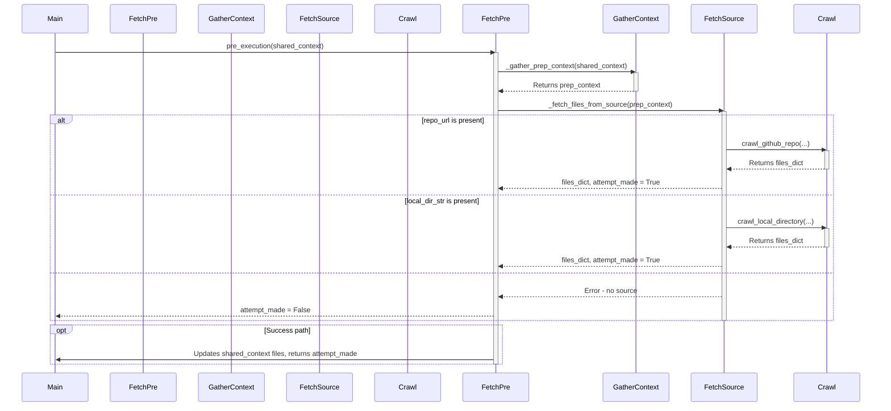

> Previously, we looked at [Data Validation and Error Handling](02_data-validation-and-error-handling.md).

# Chapter 2: File Fetching
Let's begin exploring this concept. In this chapter, we'll delve into the "File Fetching" component of the `20250704_1434_code-sourcelensai` project. Our goal is to understand how the system retrieves source code and other content from different locations.
**Why File Fetching?**
Imagine you're building a house. Before you can start construction, you need to gather all the necessary materials: wood, bricks, cement, etc. Similarly, before `20250704_1434_code-sourcelensai` can perform any analysis or processing, it needs to gather the relevant files. The "File Fetching" component is responsible for this crucial first step. It acts as the supply chain, bringing in data from various sources.
**Key Concepts:**
The File Fetching component has the following capabilities:
*   **Source Variety:** It can fetch data from:
    *   Local directories on your computer.
    *   Remote GitHub repositories.
    *   Web URLs, including single pages or entire sitemaps.
*   **Filtering:** It allows you to specify patterns to include or exclude certain files. For example, you might only want to analyze `.py` files or exclude test directories.
*   **Size Limits:** It can enforce maximum file size limits to prevent processing extremely large files that could slow down or crash the system.
*   **Abstraction:** The fetching logic is encapsulated within nodes, allowing other parts of the system to request files without needing to know the details of *how* those files are retrieved.
**How it Works: Two Key Nodes**
The project currently features two primary nodes responsible for file fetching:
1.  `FetchCode`: This node focuses on retrieving source code files. It handles both local directories and GitHub repositories.
2.  `FetchWebPage`: This node handles fetching content from web URLs, sitemaps, and local text/markdown files. It leverages the `crawl4ai` library for web crawling.
Let's examine each node in more detail.
**1. The `FetchCode` Node**
The `FetchCode` node is located in `src/FL01_code_analysis/nodes/n01_fetch_code.py`.  Its primary responsibility is to populate the `shared_context` (a central data store discussed further in [Configuration Management](01_configuration-management.md)) with the fetched file data and the project name.
The core logic is encapsulated in the `pre_execution` method. This method performs the following steps:
1.  **Gather Context:** It retrieves configuration parameters (project name, repository URL/local directory, include/exclude patterns, maximum file size) from the `shared_context`. It validates this data.
2.  **Fetch Files:**  Based on the configuration, it uses either `crawl_github_repo` (for GitHub repositories) or `crawl_local_directory` (for local directories) to fetch the files.
3.  **Update Shared Context:** It adds the fetched files (as a list of `(filepath, content)` tuples) to the `shared_context` under the key `"files"`.
4.  **Handle Errors:** If any errors occur during the process, it logs the error and proceeds with an empty file list.
Here's a simplified sequence diagram illustrating the process:

This diagram shows how `pre_execution` orchestrates the fetching process, delegating to helper functions for context gathering and source crawling.
A crucial aspect of the `FetchCode` node is its error handling. If the node is configured for a "critical" operation (defined by the `CRITICAL_FETCH_MODES` set, which by default includes the `"code"` mode), and no files are fetched, the `post_execution` method will raise a `NoFilesFetchedError`. This prevents the pipeline from proceeding if the required code cannot be retrieved. This highlights the [Data Validation and Error Handling](06_data-validation-and-error-handling.md) within the project.
**2. The `FetchWebPage` Node**
The `FetchWebPage` node, found in `src/FL02_web_crawling/nodes/n01_fetch_web_page.py`, is responsible for fetching and converting web content into Markdown format. It uses the `crawl4ai` library for this purpose.
The `pre_execution` method determines the crawl target (URL, sitemap, or file) and sets up the crawl parameters.  Similar to `FetchCode`, it populates a dictionary of parameters. The main work happens asynchronously in the `execution` method, which:
1.  **Initializes the crawler:** Creates an instance of `crawl4ai.AsyncWebCrawler` with specified configurations.
2.  **Crawls the target:** Depending on the type of target (URL, sitemap, or file), calls different helper functions to perform the actual crawling using functions from crawl4ai.
3.  **Saves the output:** Converts the fetched content to Markdown and saves it to a local file.
The post-execution method populates the `shared_context["files"]` list with the contents of the crawled files when `processing_mode` is set to `llm_extended`. This is important because this population allows those files to be used in subsequent processing steps such as those described in [LLM API Abstraction](03_llm-api-abstraction.md).
**Code Examples:**
Let's look at snippets from the `FetchCode` node to illustrate the configuration and file crawling:
```python
# Gathering context from shared_context
def _gather_prep_context(self, shared_context: SLSharedContext) -> _PrepContext:
    project_name_str = self._get_required_shared(shared_context, "project_name")
    repo_url = shared_context.get("repo_url")
    local_dir = shared_context.get("local_dir")
    # ... other parameters
    context: _PrepContext = {
        "project_name": project_name_str,
        "repo_url": str(repo_url) if isinstance(repo_url, str) else None,
        "local_dir_str": str(local_dir) if isinstance(local_dir, str) else None,
        # ... other parameters
    }
    return context
```
This code shows how the `_gather_prep_context` method retrieves essential parameters from the `shared_context`. The node uses the `_get_required_shared` method to enforce that `project_name` is provided in the `shared_context`.
```python
# Fetching files from a GitHub repository
from sourcelens.utils.github import crawl_github_repo
def _fetch_files_from_source(self, context: _PrepContext) -> tuple[dict[str, str], bool]:
    files_dict: dict[str, str] = {}
    fetch_attempt_made = False
    if context["repo_url"]:
        files_dict = crawl_github_repo(
            repo_url=context["repo_url"],
            token=context["github_token"],
            include_patterns=context["include_patterns"],
            exclude_patterns=context["exclude_patterns"],
            max_file_size=context["max_file_size"],
            use_relative_paths=context["use_relative_paths"],
        )
        fetch_attempt_made = True
    # ... (handling for local directories)
    return files_dict, fetch_attempt_made
```
This shows the delegation to `crawl_github_repo` for fetching from GitHub, passing along the configuration parameters.
**Configuration:**
The behavior of the File Fetching component is heavily influenced by the configuration parameters stored in the `shared_context`. As described in [Configuration Management](01_configuration-management.md), these parameters can be set through command-line arguments or configuration files. This allows you to easily control which files are fetched, from where, and how they are processed.
**Example Configuration Scenario:**
Imagine you want to analyze the source code of a specific file in a GitHub repository. You would need to set the following configuration parameters:
*   `project_name`:  A descriptive name for the project.
*   `repo_url`: The URL of the GitHub repository.
*   `include_patterns`: A set containing the specific filename you are interested in.
*   `exclude_patterns`:  A set containing any files or directories you want to exclude.
*   `max_file_size`: The maximum file size (in bytes) that you want to process.
By setting these parameters, you can tailor the File Fetching component to your specific needs.
This concludes our look at this topic.

> Next, we will examine [Flow Engine](04_flow-engine.md).


---

*Generated by [SourceLens AI](https://github.com/openXFlow/sourceLensAI) using LLM: `gemini` (cloud) - model: `gemini-2.0-flash` | Language Profile: `Python`*