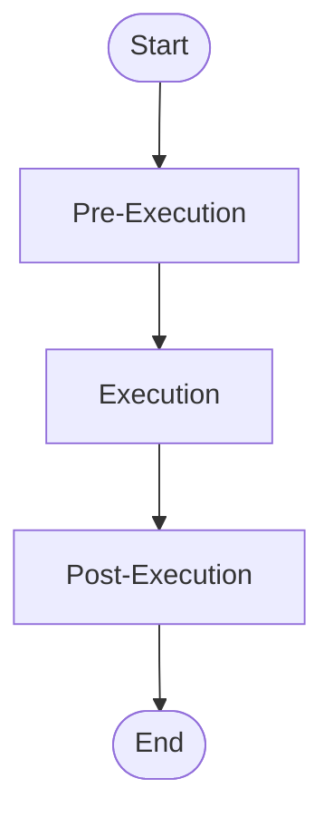
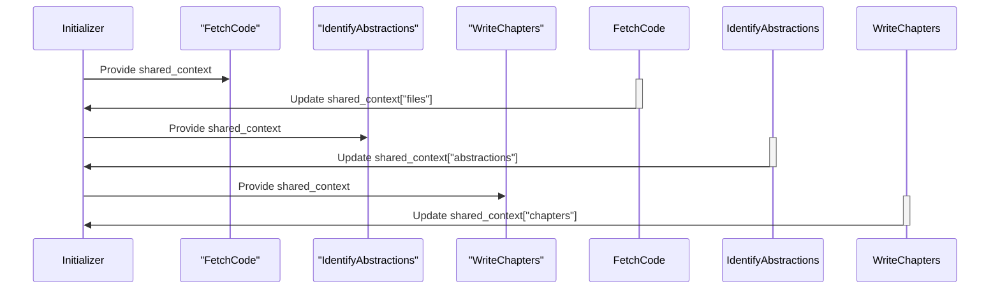

> Previously, we looked at [File Fetching](03_file-fetching.md).

# Chapter 4: Flow Engine
Let's begin exploring this concept. This chapter aims to provide an understanding of the Flow Engine, the core orchestration mechanism within the `20250704_1434_code-sourcelensai` project. We'll delve into its purpose, key components, and practical usage, using examples from the codebase.
The Flow Engine is the backbone of the `20250704_1434_code-sourcelensai` project. It's what allows us to define complex workflows, connecting various processing steps in a logical and manageable way. Think of it as a conductor of an orchestra: each instrument (processing node) plays its part, but it's the conductor (Flow Engine) that ensures they all play together harmoniously to create a beautiful symphony (the final output). Without the Flow Engine, our processing nodes would be isolated islands, unable to collaborate to achieve our desired result: the generation of helpful documentation and insights from source code.
Key reasons for using a Flow Engine:
*   **Modularity:** It allows us to break down complex tasks into smaller, more manageable nodes.
*   **Reusability:** Individual nodes can be reused across different flows.
*   **Maintainability:** Changes to one node don't necessarily affect the entire flow.
*   **Flexibility:** Easily create new flows by rearranging existing nodes or adding new ones.
*   **Testability:** Individual nodes can be tested independently.
The two fundamental building blocks of our Flow Engine are the `Flow` and `BaseNode` classes.
*   **`BaseNode`:** This is the abstract base class for all processing nodes in the workflow. Each node performs a specific task, such as fetching code, analyzing relationships, or generating diagrams. A `BaseNode` defines a standard lifecycle with three key methods:
    *   `pre_execution(shared_context)`: Prepares the input data for the node. It extracts information from the `shared_context`, a dictionary that holds data shared between nodes.
    *   `execution(prepared_inputs)`: Executes the core logic of the node, using the prepared input data.
    *   `post_execution(shared_context, prepared_inputs, execution_outputs)`: Processes the output of the node, updates the `shared_context` with the results, and determines the next step in the flow.
*   **`Flow`:** This class orchestrates the execution of a sequence of `BaseNode` instances. It defines the overall workflow and manages the transitions between nodes. It takes a start node in its constructor. The `Flow` determines which node should be executed next.
Here's a simple `mermaid` flowchart to illustrate the basic flow of execution:

This diagram illustrates a single `BaseNode`'s lifecycle. The flow starts, goes through preparation, then execution, then post-processing, and finally ends.
The `Flow` class uses the `>>` operator to define the sequence of nodes. For example: `node1 >> node2 >> node3`. The `next` method also allows specifying conditional transitions using actions.
To use the Flow Engine, you first create instances of `BaseNode` subclasses, implement their `pre_execution`, `execution`, and `post_execution` methods to perform specific tasks, and then chain them together using the `>>` operator or the `next` method to define the workflow.
Here is how the Code Analysis flow is created in `src/FL01_code_analysis/flow.py`:
```python
from sourcelens.core import BaseNode
from sourcelens.core import Flow as SourceLensFlow
from .nodes import (
    AnalyzeRelationships,
    CombineTutorial,
    FetchCode,
    GenerateDiagramsNode,
    GenerateProjectReview,
    GenerateSourceIndexNode,
    IdentifyAbstractions,
    IdentifyScenariosNode,
    OrderChapters,
    WriteChapters,
)
def create_code_analysis_flow(initial_context: dict[str, Any]) -> SourceLensFlow:
    """Create and configure the flow for code analysis and tutorial generation.
    Args:
        initial_context: The initial shared context dictionary.
    Returns:
        An instance of `SourceLensFlow` for code analysis.
    """
    fetch_code = FetchCode()
    id_abstr = IdentifyAbstractions()
    an_rels = AnalyzeRelationships()
    ord_chaps = OrderChapters()
    id_scens = IdentifyScenariosNode()
    gen_diags = GenerateDiagramsNode()
    wr_chaps = WriteChapters()
    gen_src_idx = GenerateSourceIndexNode()
    gen_proj_rev = GenerateProjectReview()
    comb_tut = CombineTutorial()
    start_node: BaseNode = fetch_code
    (
        start_node
        >> id_abstr
        >> an_rels
        >> ord_chaps
        >> id_scens
        >> gen_diags
        >> wr_chaps
        >> gen_src_idx
        >> gen_proj_rev
        >> comb_tut
    )
    return SourceLensFlow(start=start_node)
```
This code snippet shows how the individual nodes are chained together to form the complete code analysis pipeline. The `fetch_code` node starts the flow, followed by abstraction identification, relationship analysis, chapter ordering, scenario identification, diagram generation, chapter writing, source index generation, project review generation, and finally, tutorial combination.
The `create_code_analysis_flow` function instantiates each node and chains them together using the `>>` operator. Finally, a `SourceLensFlow` object is created with the `fetch_code` node as the starting point. The `initial_context` dictionary holds the initial values of the shared context for the execution.
In `src/FL01_code_analysis/cli.py`, `run_standalone_code_analysis` shows how to import and run a flow:
```python
import importlib
# ... inside run_standalone_code_analysis function ...
flow_module = importlib.import_module("FL01_code_analysis.flow")
create_code_analysis_flow_func = getattr(flow_module, "create_code_analysis_flow")
code_pipeline = create_code_analysis_flow_func(initial_context)
code_pipeline.run_standalone(initial_context)
```
This shows how `importlib` dynamically loads the code analysis flow and then invokes `run_standalone`. The result of the code analysis is found in the `final_output_dir` key of the `initial_context` dictionary after the pipeline runs.
You can find the abstract base classes `BaseNode`, `BaseBatchNode`, and the `Flow` class definitions themselves in `src/sourcelens/core/flow_engine_sync.py` and `src/sourcelens/core/base_node.py`.
The concept of *shared context* is central to how the Flow Engine functions. The `shared_context` (often a dictionary) is the data that is passed from node to node. Each node receives the context, modifies it (adds new data, updates existing data), and then passes it on to the next node. This allows nodes to collaborate and build upon each other's results.
For example, the `FetchCode` node might fetch source code and store it in the `shared_context` under the key `"files"`. The `IdentifyAbstractions` node would then read the source code from `shared_context["files"]`, identify the abstractions (classes, functions, etc.), and store the results back into the `shared_context` under the key `"abstractions"`.
In the `src/FL01_code_analysis/cli.py` file, the `_prepare_standalone_initial_context` method builds the context initially before running the pipeline.
Here's a simplified `mermaid` sequence diagram to show how nodes interact using the shared context:

This diagram shows how `shared_context` is passed to different nodes and how each node modifies it.
Refer back to [Configuration Management](01_configuration-management.md) to understand how the initial configurations are loaded into the system, and [File Fetching](02_file-fetching.md) to understand how source code is loaded into the system to begin processing. Also see [LLM API Abstraction](03_llm-api-abstraction.md) for more details on configuring the LLM providers used in various nodes. [Data Validation and Error Handling](06_data-validation-and-error-handling.md) are also vital for robust pipeline execution.
This concludes our look at this topic.

> Next, we will examine [LLM API Abstraction](05_llm-api-abstraction.md).


---

*Generated by [SourceLens AI](https://github.com/openXFlow/sourceLensAI) using LLM: `gemini` (cloud) - model: `gemini-2.0-flash` | Language Profile: `Python`*