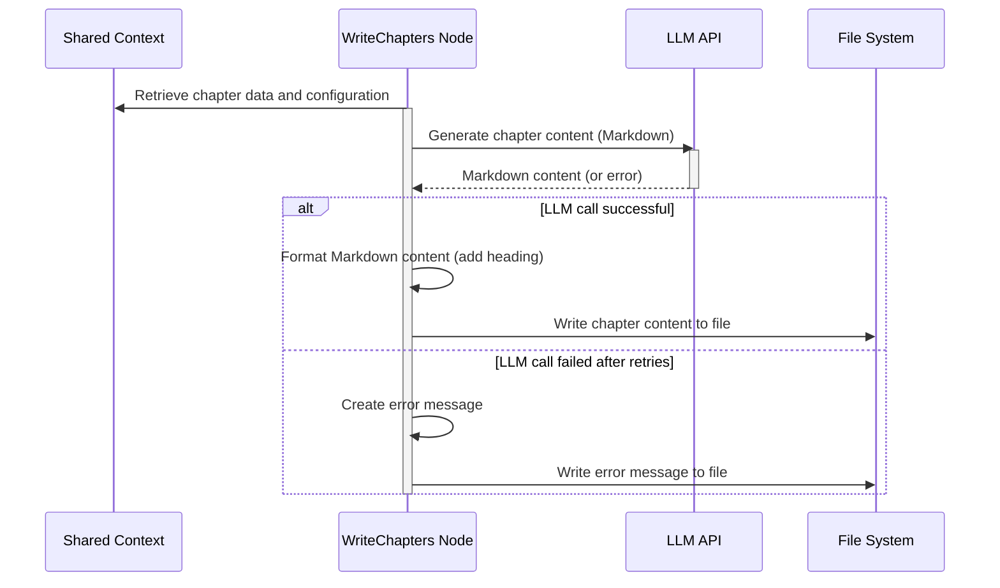

> Previously, we looked at [LLM API Abstraction](05_llm-api-abstraction.md).

# Chapter 5: Markdown Output Generation
Let's begin exploring this concept. In this chapter, we will delve into how the `20250704_1434_code-sourcelensai` project generates Markdown files, the format used for these tutorial chapters. Our goal is to understand the components and processes involved in creating structured and informative Markdown output from the analysis results.
This area is crucial because it transforms the raw data and analysis results into a human-readable and easily distributable format. Think of it like a chef taking raw ingredients and turning them into a delicious meal. The analysis provides the ingredients, and the Markdown generation process is the recipe that creates the final product: the tutorial itself. Without this step, the insights gained from the code analysis would be difficult to share and understand.
The Markdown output generation involves several key components and steps:
1.  **Data Gathering:** Relevant data, such as chapter content, code snippets, and metadata (chapter number, title), is collected from the shared context. This context is populated by the preceding steps in the pipeline, like [LLM API Abstraction](03_llm-api-abstraction.md) and [Flow Engine](04_flow-engine.md).
2.  **Content Formatting:** The collected data is then formatted according to Markdown syntax. This includes creating headings, lists, code blocks, and links.
3.  **Chapter Structure:** Individual chapter content is arranged into a logical structure, typically starting with a heading and followed by descriptive text and code examples.
4.  **Index Generation:** A main index file (`web_summary_index.md` or similar) is created, providing an overview of all available chapters and their corresponding links.
5.  **Special Content Generation:** Components like AI-generated source indices and project reviews are generated.
6.  **Navigation and Footer Inclusion:** Hyperlinks between chapters and a consistent footer are added for enhanced navigation and proper attribution.
7.  **File Writing:** Finally, the formatted Markdown content is written to `.md` files.
The main node responsible for generating chapter-specific content is `WriteChapters` located in `src/FL01_code_analysis/nodes/n07_write_chapters.py`. This node orchestrates the generation of Markdown content for individual tutorial chapters. It uses an LLM to generate the content for each chapter based on its corresponding abstraction, context from other chapters, and relevant code snippets.
Here's a simplified view of the Markdown generation process for the `WriteChapters` node:

The `GenerateSourceIndexNode` in `src/FL01_code_analysis/nodes/n08_generate_source_index.py` focuses on generating an index file, which provides a summary of the project's source code structure. This involves analyzing the file system and creating a Markdown file with links to different files and modules.
The `GenerateProjectReview` node, located in `src/FL01_code_analysis/nodes/n09_generate_project_review.py`, creates an AI-powered project review. This node uses an LLM to analyze the project's code and generate a summary of its key characteristics, potential areas for discussion, and an overall rating. The output is then formatted into Markdown.
The `CombineWebSummary` node in `src/FL02_web_crawling/nodes/n08_combine_web_summary.py` assembles web summary content, including standard text chapters, content inventories, and reviews, into a single output directory. This node also adds navigation links and footers to the generated Markdown files.
Here's a snippet from the `WriteChapters` node that demonstrates how chapter metadata is prepared:
```python
# Copyright (C) 2025 Jozef Darida (LinkedIn/Xing)
# ... (License and other comments omitted for brevity)
def _prepare_chapter_metadata(
    self, abstractions: CodeAbstractionsList, chapter_order: ChapterOrderListInternal
) -> tuple[dict[int, ChapterMetadata], list[str]]:
    """Prepare metadata for each chapter based on abstractions and order."""
    # ... (Implementation as shown in the original code snippet)
    return chapter_metadata_map, all_chapters_listing_md
```
This method takes a list of code abstractions and a chapter order and generates metadata for each chapter, including the chapter number, name, filename, and a Markdown-formatted list of all chapters.
The `_process_single_chapter_item` method in `WriteChapters` handles the actual generation of chapter content.
```python
# Copyright (C) 2025 Jozef Darida (LinkedIn/Xing)
# ... (License and other comments omitted for brevity)
def _process_single_chapter_item(self, item: WriteChapterPreparedItem) -> SingleChapterExecutionResult:
    """Generate Markdown content for a single chapter."""
    # ... (Implementation as shown in the original code snippet)
    return chapter_content.strip()
```
This method extracts the prompt context and LLM configuration from the prepared item, calls the LLM to generate the chapter content, and formats the LLM's response, ensuring a correct H1 heading.
This system helps maintain consistency and structure throughout the generated tutorial.
The `GenerateSourceIndexNode` generates a `mermaid` diagram to visualise file structure using the method `generate_file_structure_mermaid`.
The key takeaway from this chapter is that the Markdown output generation process is a crucial step in transforming raw data and analysis results into a human-readable and easily distributable format. The system's design, with dedicated nodes for different aspects of Markdown generation, allows for flexibility and maintainability.
This concludes our look at this topic.

> Next, we will examine [Architecture Diagrams](07_diagrams.md).


---

*Generated by [SourceLens AI](https://github.com/openXFlow/sourceLensAI) using LLM: `gemini` (cloud) - model: `gemini-2.0-flash` | Language Profile: `Python`*