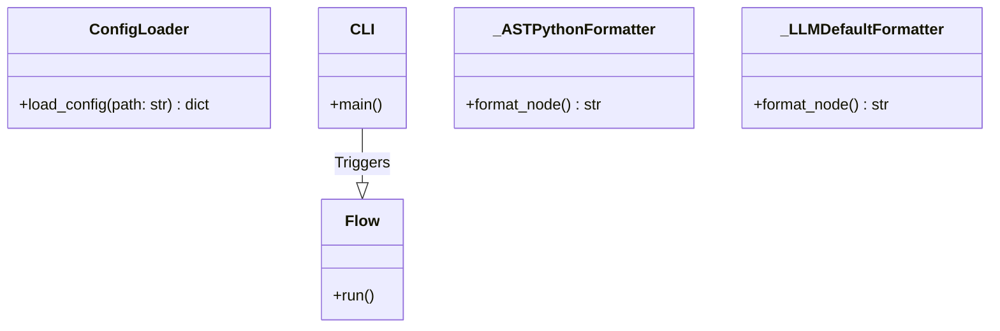
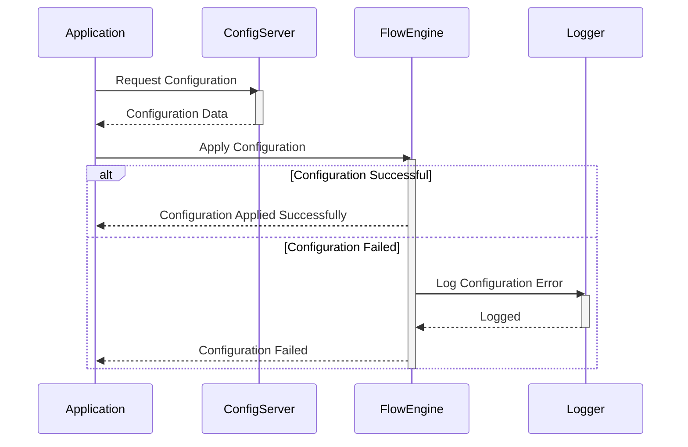
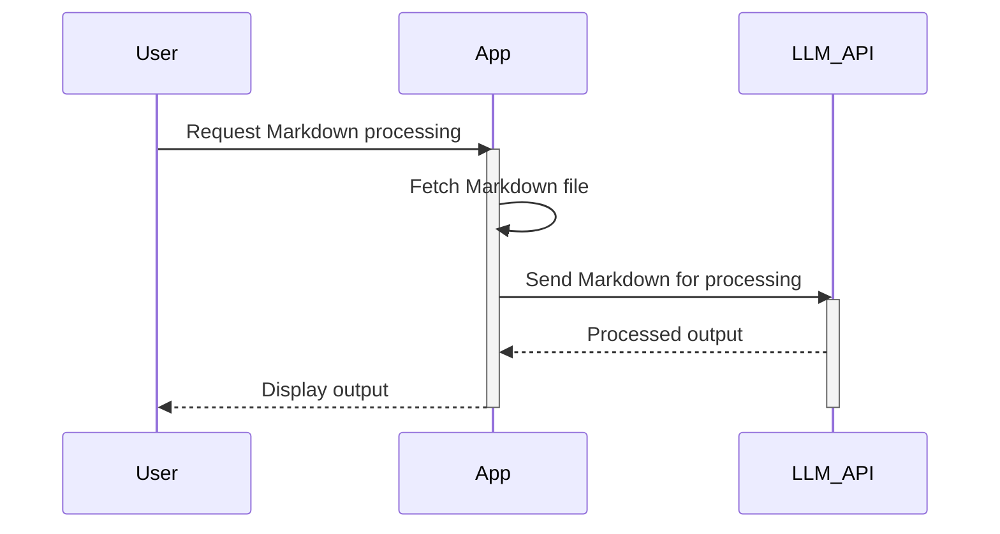
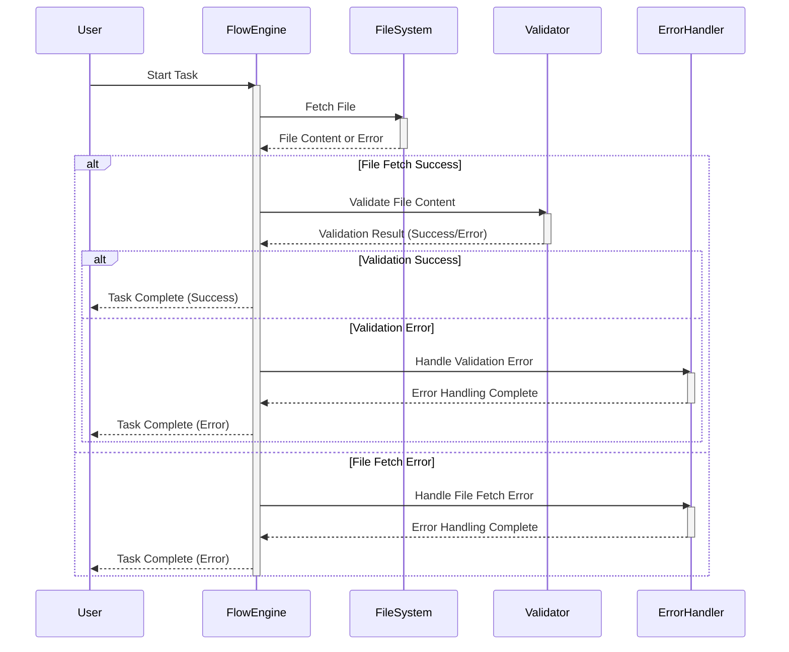
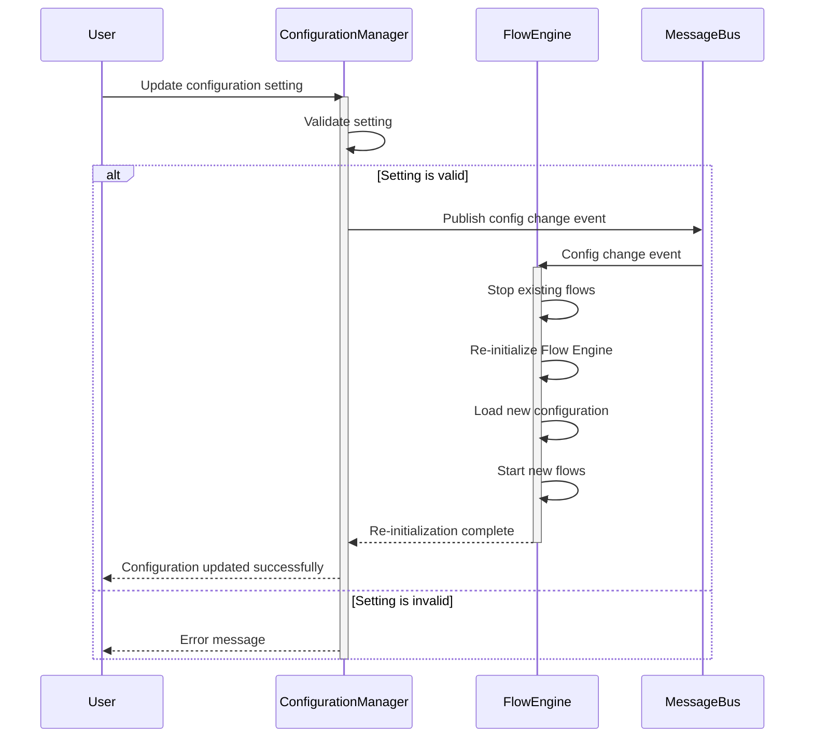
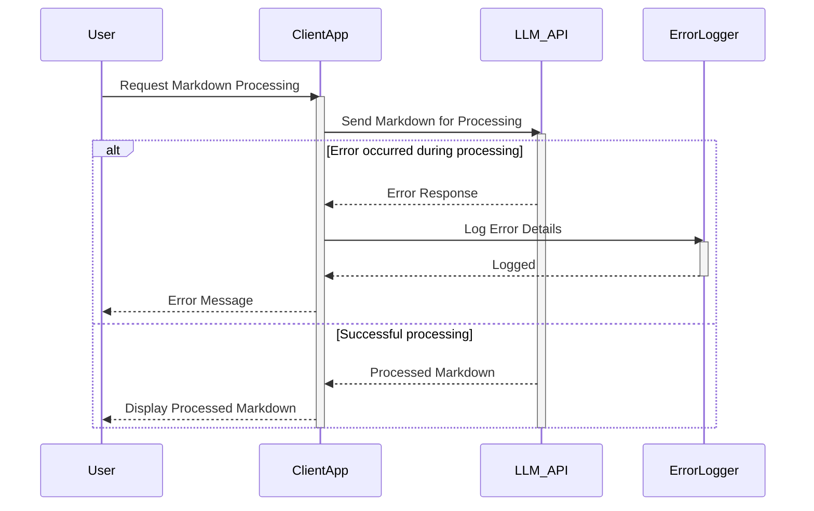

> Previously, we looked at [Markdown Output Generation](06_markdown-output-generation.md).

# Architecture Diagrams
## Class Diagram
Key classes and their relationships in **20250704_1434_code-sourcelensai**.

## Package Dependencies
High-level module and package structure of **20250704_1434_code-sourcelensai**.

```mermaid
graph TD
    A(".gitignore")
    B("config.json")
    C("config.example.json")
    D("README.md")
    E("requirements.txt")
    F("src/FL01_code_analysis/cli.py")
    G("src/FL01_code_analysis/config_loader.py")
    H("src/FL01_code_analysis/flow.py")
    I("src/FL01_code_analysis/nodes/n01_fetch_code.py")
    J("src/FL01_code_analysis/nodes/n02_identify_abstractions.py")
    K("src/FL01_code_analysis/nodes/n03_analyze_relationships.py")
    L("src/FL01_code_analysis/nodes/n04_order_chapters.py")
    M("src/FL01_code_analysis/nodes/n05_identify_scenarios.py")
    N("src/FL01_code_analysis/nodes/n06_generate_diagrams.py")
    O("src/FL01_code_analysis/nodes/n07_write_chapters.py")
    P("src/FL01_code_analysis/nodes/n08_generate_source_index.py")
    Q("src/FL01_code_analysis/nodes/n09_generate_project_review.py")
    R("src/FL01_code_analysis/nodes/n10_combine_tutorial.py")
    S("src/FL01_code_analysis/prompts/abstraction_prompts.py")
    T("src/FL01_code_analysis/prompts/chapter_prompts.py")
    U("src/FL01_code_analysis/prompts/project_review_prompts.py")
    V("src/FL01_code_analysis/prompts/scenario_prompts.py")
    W("src/FL01_code_analysis/prompts/source_index_prompts.py")
    X("src/FL01_code_analysis/prompts/_common.py")
    Y("src/FL02_web_crawling/cli.py")
    Z("src/FL02_web_crawling/flow.py")
    AA("src/FL02_web_crawling/nodes/n01b_segment_web_content.py")
    BB("src/FL02_web_crawling/nodes/n01c_youtube_content.py")
    CC("src/FL02_web_crawling/nodes/n01_fetch_web_page.py")
    DD("src/FL02_web_crawling/nodes/n02_identify_web_concepts.py")
    EE("src/FL02_web_crawling/nodes/n03_analyze_web_relationships.py")
    FF("src/FL02_web_crawling/nodes/n04_order_web_chapters.py")
    GG("src/FL02_web_crawling/nodes/n05_write_web_chapters.py")
    HH("src/FL02_web_crawling/nodes/n06_generate_web_inventory.py")
    F --> G
    H --> I
    H --> J
    H --> K
    H --> L
    H --> M
    H --> N
    H --> O
    H --> P
    H --> Q
    H --> R
    I --> S
    J --> S
    K --> X
    Q --> U
    P --> W
    Y --> Z
    Z --> AA
    Z --> BB
    Z --> CC
    Z --> DD
    Z --> EE
    Z --> FF
    Z --> GG
    Z --> HH
    G --> B
    F --> H
    Y --> Z
```

## Sequence Diagrams
These diagrams illustrate various interaction scenarios, showcasing operations between components for specific use cases.
### Fetching configuration settings at startup and applying them to the flow engine.

### User initiates a process that involves fetching a markdown file, processing it using the LLM API, and generating output.

### The Flow Engine executes a task involving fetching a file and encountering a validation error, triggering error handling.

### User updates a configuration setting that triggers a re-initialization of the Flow Engine.

### The LLM API returns an unexpected error during markdown processing, requiring error handling and reporting.

> Next, we will examine [Code Inventory](08_code_inventory.md).

---

*Generated by [SourceLens AI](https://github.com/openXFlow/sourceLensAI) using LLM: `gemini` (cloud) - model: `gemini-2.0-flash` | Language Profile: `Python`*