> Previously, we looked at [Architecture Diagrams](07_diagrams.md).

# Code Inventory: 20250704_1434_code-sourcelensai
## File Structure

```mermaid
graph TD
    ROOT_DIR_MERMAID_0[./]
    FILE_0[.gitignore]
    FILE_1[config.example.json]
    FILE_2[config.json]
    FILE_3[LICENSE]
    FILE_4[pyproject.toml]
    FILE_5[README.md]
    FILE_6[requirements.txt]
    FILE_7[cli.py]
    FILE_8[config.default.json]
    FILE_9[config_loader.py]
    FILE_10[flow.py]
    FILE_11[py.typed]
    FILE_12[__init__.py]
    FILE_13[n01_fetch_code.py]
    FILE_14[n02_identify_abstractions.py]
    FILE_15[n03_analyze_relationships.py]
    FILE_16[n04_order_chapters.py]
    FILE_17[n05_identify_scenarios.py]
    FILE_18[n06_generate_diagrams.py]
    FILE_19[n07_write_chapters.py]
    FILE_20[n08_generate_source_index.py]
    FILE_21[n09_generate_project_review.py]
    FILE_22[n10_combine_tutorial.py]
    FILE_23[py.typed]
    FILE_24[__init__.py]
    FILE_25[py.typed]
    FILE_26[_ast_python_formatter.py]
    FILE_27[_llm_default_formatter.py]
    FILE_28[__init__.py]
    FILE_29[abstraction_prompts.py]
    FILE_30[chapter_prompts.py]
    FILE_31[project_review_prompts.py]
    FILE_32[py.typed]
    FILE_33[scenario_prompts.py]
    FILE_34[source_index_prompts.py]
    FILE_35[_common.py]
    FILE_36[__init__.py]
    FILE_37[cli.py]
    FILE_38[config.default.json]
    FILE_39[flow.py]
    FILE_40[py.typed]
    FILE_41[__init__.py]
    FILE_42[n01b_segment_web_content.py]
    FILE_43[n01c_youtube_content.py]
    FILE_44[n01_fetch_web_page.py]
    FILE_45[n02_identify_web_concepts.py]
    FILE_46[n03_analyze_web_relationships.py]
    FILE_47[n04_order_web_chapters.py]
    FILE_48[n05_write_web_chapters.py]
    FILE_49[n06_generate_web_inventory.py]
    FILE_50[n07b_translate_youtube_transcript.py]
    FILE_51[n07_generate_web_review.py]
    FILE_52[n08_combine_web_summary.py]
    FILE_53[py.typed]
    FILE_54[__init__.py]
    FILE_55[chapter_prompts.py]
    FILE_56[concept_prompts.py]
    FILE_57[deduplication_prompts.py]
    FILE_58[inventory_prompts.py]
    FILE_59[py.typed]
    FILE_60[relationship_prompts.py]
    FILE_61[review_prompts.py]
    FILE_62[translation_prompts.py]
    FILE_63[web_content_prompts.py]
    FILE_64[_common.py]
    FILE_65[__init__.py]
    FILE_66[config_loader.py]
    FILE_67[main.py]
    FILE_68[py.typed]
    FILE_69[__init__.py]
    FILE_70[base_node.py]
    FILE_71[common_types.py]
    FILE_72[flow_engine_async.py]
    FILE_73[flow_engine_sync.py]
    FILE_74[py.typed]
    FILE_75[__init__.py]
    FILE_76[class_diagram_prompts.py]
    FILE_77[file_structure_diagram.py]
    FILE_78[mind_map_diagram_prompts.py]
    FILE_79[package_diagram_prompts.py]
    FILE_80[py.typed]
    FILE_81[relationship_flowchart_prompts.py]
    FILE_82[sequence_diagram_prompts.py]
    FILE_83[_common_guidelines.py]
    FILE_84[__init__.py]
    FILE_85[github.py]
    FILE_86[helpers.py]
    FILE_87[llm_api.py]
    FILE_88[local.py]
    FILE_89[py.typed]
    FILE_90[validation.py]
    FILE_91[_cloud_llm_api.py]
    FILE_92[_exceptions.py]
    FILE_93[_local_llm_api.py]
    FILE_94[__init__.py]
    DIR_src_1[src/]
    DIR_src_FL01_code_analysis_2[FL01_code_analysis/]
    DIR_src_FL01_code_analysis_nodes_3[nodes/]
    DIR_src_FL01_code_analysis_nodes_index_formatters_4[index_formatters/]
    DIR_src_FL01_code_analysis_prompts_5[prompts/]
    DIR_src_FL02_web_crawling_6[FL02_web_crawling/]
    DIR_src_FL02_web_crawling_nodes_7[nodes/]
    DIR_src_FL02_web_crawling_prompts_8[prompts/]
    DIR_src_sourcelens_9[sourcelens/]
    DIR_src_sourcelens_core_10[core/]
    DIR_src_sourcelens_mermaid_diagrams_11[mermaid_diagrams/]
    DIR_src_sourcelens_utils_12[utils/]
    ROOT_DIR_MERMAID_0 --> DIR_src_1
    DIR_src_1 --> DIR_src_FL01_code_analysis_2
    DIR_src_FL01_code_analysis_2 --> DIR_src_FL01_code_analysis_nodes_3
    DIR_src_FL01_code_analysis_nodes_3 --> DIR_src_FL01_code_analysis_nodes_index_formatters_4
    DIR_src_FL01_code_analysis_nodes_index_formatters_4 --> FILE_25
    DIR_src_FL01_code_analysis_nodes_index_formatters_4 --> FILE_26
    DIR_src_FL01_code_analysis_nodes_index_formatters_4 --> FILE_27
    DIR_src_FL01_code_analysis_nodes_index_formatters_4 --> FILE_28
    DIR_src_FL01_code_analysis_nodes_3 --> FILE_13
    DIR_src_FL01_code_analysis_nodes_3 --> FILE_14
    DIR_src_FL01_code_analysis_nodes_3 --> FILE_15
    DIR_src_FL01_code_analysis_nodes_3 --> FILE_16
    DIR_src_FL01_code_analysis_nodes_3 --> FILE_17
    DIR_src_FL01_code_analysis_nodes_3 --> FILE_18
    DIR_src_FL01_code_analysis_nodes_3 --> FILE_19
    DIR_src_FL01_code_analysis_nodes_3 --> FILE_20
    DIR_src_FL01_code_analysis_nodes_3 --> FILE_21
    DIR_src_FL01_code_analysis_nodes_3 --> FILE_22
    DIR_src_FL01_code_analysis_nodes_3 --> FILE_23
    DIR_src_FL01_code_analysis_nodes_3 --> FILE_24
    DIR_src_FL01_code_analysis_2 --> DIR_src_FL01_code_analysis_prompts_5
    DIR_src_FL01_code_analysis_prompts_5 --> FILE_29
    DIR_src_FL01_code_analysis_prompts_5 --> FILE_30
    DIR_src_FL01_code_analysis_prompts_5 --> FILE_31
    DIR_src_FL01_code_analysis_prompts_5 --> FILE_32
    DIR_src_FL01_code_analysis_prompts_5 --> FILE_33
    DIR_src_FL01_code_analysis_prompts_5 --> FILE_34
    DIR_src_FL01_code_analysis_prompts_5 --> FILE_35
    DIR_src_FL01_code_analysis_prompts_5 --> FILE_36
    DIR_src_FL01_code_analysis_2 --> FILE_7
    DIR_src_FL01_code_analysis_2 --> FILE_8
    DIR_src_FL01_code_analysis_2 --> FILE_9
    DIR_src_FL01_code_analysis_2 --> FILE_10
    DIR_src_FL01_code_analysis_2 --> FILE_11
    DIR_src_FL01_code_analysis_2 --> FILE_12
    DIR_src_1 --> DIR_src_FL02_web_crawling_6
    DIR_src_FL02_web_crawling_6 --> DIR_src_FL02_web_crawling_nodes_7
    DIR_src_FL02_web_crawling_nodes_7 --> FILE_42
    DIR_src_FL02_web_crawling_nodes_7 --> FILE_43
    DIR_src_FL02_web_crawling_nodes_7 --> FILE_44
    DIR_src_FL02_web_crawling_nodes_7 --> FILE_45
    DIR_src_FL02_web_crawling_nodes_7 --> FILE_46
    DIR_src_FL02_web_crawling_nodes_7 --> FILE_47
    DIR_src_FL02_web_crawling_nodes_7 --> FILE_48
    DIR_src_FL02_web_crawling_nodes_7 --> FILE_49
    DIR_src_FL02_web_crawling_nodes_7 --> FILE_50
    DIR_src_FL02_web_crawling_nodes_7 --> FILE_51
    DIR_src_FL02_web_crawling_nodes_7 --> FILE_52
    DIR_src_FL02_web_crawling_nodes_7 --> FILE_53
    DIR_src_FL02_web_crawling_nodes_7 --> FILE_54
    DIR_src_FL02_web_crawling_6 --> DIR_src_FL02_web_crawling_prompts_8
    DIR_src_FL02_web_crawling_prompts_8 --> FILE_55
    DIR_src_FL02_web_crawling_prompts_8 --> FILE_56
    DIR_src_FL02_web_crawling_prompts_8 --> FILE_57
    DIR_src_FL02_web_crawling_prompts_8 --> FILE_58
    DIR_src_FL02_web_crawling_prompts_8 --> FILE_59
    DIR_src_FL02_web_crawling_prompts_8 --> FILE_60
    DIR_src_FL02_web_crawling_prompts_8 --> FILE_61
    DIR_src_FL02_web_crawling_prompts_8 --> FILE_62
    DIR_src_FL02_web_crawling_prompts_8 --> FILE_63
    DIR_src_FL02_web_crawling_prompts_8 --> FILE_64
    DIR_src_FL02_web_crawling_prompts_8 --> FILE_65
    DIR_src_FL02_web_crawling_6 --> FILE_37
    DIR_src_FL02_web_crawling_6 --> FILE_38
    DIR_src_FL02_web_crawling_6 --> FILE_39
    DIR_src_FL02_web_crawling_6 --> FILE_40
    DIR_src_FL02_web_crawling_6 --> FILE_41
    DIR_src_1 --> DIR_src_sourcelens_9
    DIR_src_sourcelens_9 --> DIR_src_sourcelens_core_10
    DIR_src_sourcelens_core_10 --> FILE_70
    DIR_src_sourcelens_core_10 --> FILE_71
    DIR_src_sourcelens_core_10 --> FILE_72
    DIR_src_sourcelens_core_10 --> FILE_73
    DIR_src_sourcelens_core_10 --> FILE_74
    DIR_src_sourcelens_core_10 --> FILE_75
    DIR_src_sourcelens_9 --> DIR_src_sourcelens_mermaid_diagrams_11
    DIR_src_sourcelens_mermaid_diagrams_11 --> FILE_76
    DIR_src_sourcelens_mermaid_diagrams_11 --> FILE_77
    DIR_src_sourcelens_mermaid_diagrams_11 --> FILE_78
    DIR_src_sourcelens_mermaid_diagrams_11 --> FILE_79
    DIR_src_sourcelens_mermaid_diagrams_11 --> FILE_80
    DIR_src_sourcelens_mermaid_diagrams_11 --> FILE_81
    DIR_src_sourcelens_mermaid_diagrams_11 --> FILE_82
    DIR_src_sourcelens_mermaid_diagrams_11 --> FILE_83
    DIR_src_sourcelens_mermaid_diagrams_11 --> FILE_84
    DIR_src_sourcelens_9 --> DIR_src_sourcelens_utils_12
    DIR_src_sourcelens_utils_12 --> FILE_85
    DIR_src_sourcelens_utils_12 --> FILE_86
    DIR_src_sourcelens_utils_12 --> FILE_87
    DIR_src_sourcelens_utils_12 --> FILE_88
    DIR_src_sourcelens_utils_12 --> FILE_89
    DIR_src_sourcelens_utils_12 --> FILE_90
    DIR_src_sourcelens_utils_12 --> FILE_91
    DIR_src_sourcelens_utils_12 --> FILE_92
    DIR_src_sourcelens_utils_12 --> FILE_93
    DIR_src_sourcelens_utils_12 --> FILE_94
    DIR_src_sourcelens_9 --> FILE_66
    DIR_src_sourcelens_9 --> FILE_67
    DIR_src_sourcelens_9 --> FILE_68
    DIR_src_sourcelens_9 --> FILE_69
    ROOT_DIR_MERMAID_0 --> FILE_0
    ROOT_DIR_MERMAID_0 --> FILE_1
    ROOT_DIR_MERMAID_0 --> FILE_2
    ROOT_DIR_MERMAID_0 --> FILE_3
    ROOT_DIR_MERMAID_0 --> FILE_4
    ROOT_DIR_MERMAID_0 --> FILE_5
    ROOT_DIR_MERMAID_0 --> FILE_6
    %% Styling for better readability
    classDef dir fill:#dadada,stroke:#333,stroke-width:2px,color:#333,font-weight:bold;
    classDef file fill:#f9f9f9,stroke:#ccc,stroke-width:1px,color:#333;
    class ROOT_DIR_MERMAID_0 dir;
    class FILE_0 file;
    class FILE_1 file;
    class FILE_2 file;
    class FILE_3 file;
    class FILE_4 file;
    class FILE_5 file;
    class FILE_6 file;
    class FILE_7 file;
    class FILE_8 file;
    class FILE_9 file;
    class FILE_10 file;
    class FILE_11 file;
    class FILE_12 file;
    class FILE_13 file;
    class FILE_14 file;
    class FILE_15 file;
    class FILE_16 file;
    class FILE_17 file;
    class FILE_18 file;
    class FILE_19 file;
    class FILE_20 file;
    class FILE_21 file;
    class FILE_22 file;
    class FILE_23 file;
    class FILE_24 file;
    class FILE_25 file;
    class FILE_26 file;
    class FILE_27 file;
    class FILE_28 file;
    class FILE_29 file;
    class FILE_30 file;
    class FILE_31 file;
    class FILE_32 file;
    class FILE_33 file;
    class FILE_34 file;
    class FILE_35 file;
    class FILE_36 file;
    class FILE_37 file;
    class FILE_38 file;
    class FILE_39 file;
    class FILE_40 file;
    class FILE_41 file;
    class FILE_42 file;
    class FILE_43 file;
    class FILE_44 file;
    class FILE_45 file;
    class FILE_46 file;
    class FILE_47 file;
    class FILE_48 file;
    class FILE_49 file;
    class FILE_50 file;
    class FILE_51 file;
    class FILE_52 file;
    class FILE_53 file;
    class FILE_54 file;
    class FILE_55 file;
    class FILE_56 file;
    class FILE_57 file;
    class FILE_58 file;
    class FILE_59 file;
    class FILE_60 file;
    class FILE_61 file;
    class FILE_62 file;
    class FILE_63 file;
    class FILE_64 file;
    class FILE_65 file;
    class FILE_66 file;
    class FILE_67 file;
    class FILE_68 file;
    class FILE_69 file;
    class FILE_70 file;
    class FILE_71 file;
    class FILE_72 file;
    class FILE_73 file;
    class FILE_74 file;
    class FILE_75 file;
    class FILE_76 file;
    class FILE_77 file;
    class FILE_78 file;
    class FILE_79 file;
    class FILE_80 file;
    class FILE_81 file;
    class FILE_82 file;
    class FILE_83 file;
    class FILE_84 file;
    class FILE_85 file;
    class FILE_86 file;
    class FILE_87 file;
    class FILE_88 file;
    class FILE_89 file;
    class FILE_90 file;
    class FILE_91 file;
    class FILE_92 file;
    class FILE_93 file;
    class FILE_94 file;
    class DIR_src_1 dir;
    class DIR_src_FL01_code_analysis_2 dir;
    class DIR_src_FL01_code_analysis_nodes_3 dir;
    class DIR_src_FL01_code_analysis_nodes_index_formatters_4 dir;
    class DIR_src_FL01_code_analysis_prompts_5 dir;
    class DIR_src_FL02_web_crawling_6 dir;
    class DIR_src_FL02_web_crawling_nodes_7 dir;
    class DIR_src_FL02_web_crawling_prompts_8 dir;
    class DIR_src_sourcelens_9 dir;
    class DIR_src_sourcelens_core_10 dir;
    class DIR_src_sourcelens_mermaid_diagrams_11 dir;
    class DIR_src_sourcelens_utils_12 dir;
```

## File Descriptions Summary
*   **`.gitignore`**: Byte-compiled / optimized / DLL files
*   **`config.example.json`**: {
*   **`config.json`**: {
*   **`LICENSE`**: GNU GENERAL PUBLIC LICENSE
*   **`pyproject.toml`**: [build-system]
*   **`README.md`**: <h1 align="center">sourceLens:  AI-powered tool to generate tutorials from source code or codebas...
*   **`requirements.txt`**: This file lists the runtime dependencies for a full installation
*   **`cli.py`**: Copyright (C) 2025 Jozef Darida (LinkedIn/Xing)
*   **`config.default.json`**: {
*   **`config_loader.py`**: Copyright (C) 2025 Jozef Darida (LinkedIn/Xing)
*   **`flow.py`**: Copyright (C) 2025 Jozef Darida (LinkedIn/Xing)
*   **`py.typed`**: Content not available for summary.
*   **`__init__.py`**: Copyright (C) 2025 Jozef Darida (LinkedIn/Xing)
*   **`n01_fetch_code.py`**: Copyright (C) 2025 Jozef Darida (LinkedIn/Xing)
*   **`n02_identify_abstractions.py`**: Copyright (C) 2025 Jozef Darida (LinkedIn/Xing)
*   **`n03_analyze_relationships.py`**: Copyright (C) 2025 Jozef Darida (LinkedIn/Xing)
*   **`n04_order_chapters.py`**: Copyright (C) 2025 Jozef Darida (LinkedIn/Xing)
*   **`n05_identify_scenarios.py`**: Copyright (C) 2025 Jozef Darida (LinkedIn/Xing)
*   **`n06_generate_diagrams.py`**: Copyright (C) 2025 Jozef Darida (LinkedIn/Xing)
*   **`n07_write_chapters.py`**: Copyright (C) 2025 Jozef Darida (LinkedIn/Xing)
*   **`n08_generate_source_index.py`**: Copyright (C) 2025 Jozef Darida (LinkedIn/Xing)
*   **`n09_generate_project_review.py`**: Copyright (C) 2025 Jozef Darida (LinkedIn/Xing)
*   **`n10_combine_tutorial.py`**: Copyright (C) 2025 Jozef Darida (LinkedIn/Xing)
*   **`py.typed`**: Content not available for summary.
*   **`__init__.py`**: Copyright (C) 2025 Jozef Darida (LinkedIn/Xing)
*   **`py.typed`**: Content not available for summary.
*   **`_ast_python_formatter.py`**: Copyright (C) 2025 Jozef Darida (LinkedIn/Xing)
*   **`_llm_default_formatter.py`**: Copyright (C) 2025 Jozef Darida (LinkedIn/Xing)
*   **`__init__.py`**: Copyright (C) 2025 Jozef Darida (LinkedIn/Xing)
*   **`abstraction_prompts.py`**: Copyright (C) 2025 Jozef Darida (LinkedIn/Xing)
*   **`chapter_prompts.py`**: Copyright (C) 2025 Jozef Darida (LinkedIn/Xing)
*   **`project_review_prompts.py`**: Copyright (C) 2025 Jozef Darida (LinkedIn/Xing)
*   **`py.typed`**: Content not available for summary.
*   **`scenario_prompts.py`**: Copyright (C) 2025 Jozef Darida (LinkedIn/Xing)
*   **`source_index_prompts.py`**: Copyright (C) 2025 Jozef Darida (LinkedIn/Xing)
*   **`_common.py`**: Copyright (C) 2025 Jozef Darida (LinkedIn/Xing)
*   **`__init__.py`**: Copyright (C) 2025 Jozef Darida (LinkedIn/Xing)
*   **`cli.py`**: Copyright (C) 2025 Jozef Darida (LinkedIn/Xing)
*   **`config.default.json`**: {
*   **`flow.py`**: Copyright (C) 2025 Jozef Darida (LinkedIn/Xing)
*   **`py.typed`**: Content not available for summary.
*   **`__init__.py`**: Copyright (C) 2025 Jozef Darida (LinkedIn/Xing)
*   **`n01b_segment_web_content.py`**: Copyright (C) 2025 Jozef Darida (LinkedIn/Xing)
*   **`n01c_youtube_content.py`**: Copyright (C) 2025 Jozef Darida (LinkedIn/Xing)
*   **`n01_fetch_web_page.py`**: Copyright (C) 2025 Jozef Darida (LinkedIn/Xing)
*   **`n02_identify_web_concepts.py`**: Copyright (C) 2025 Jozef Darida (LinkedIn/Xing)
*   **`n03_analyze_web_relationships.py`**: Copyright (C) 2025 Jozef Darida (LinkedIn/Xing)
*   **`n04_order_web_chapters.py`**: Copyright (C) 2025 Jozef Darida (LinkedIn/Xing)
*   **`n05_write_web_chapters.py`**: Copyright (C) 2025 Jozef Darida (LinkedIn/Xing)
*   **`n06_generate_web_inventory.py`**: Copyright (C) 2025 Jozef Darida (LinkedIn/Xing)
*   **`n07b_translate_youtube_transcript.py`**: Copyright (C) 2025 Jozef Darida (LinkedIn/Xing)
*   **`n07_generate_web_review.py`**: Copyright (C) 2025 Jozef Darida (LinkedIn/Xing)
*   **`n08_combine_web_summary.py`**: Copyright (C) 2025 Jozef Darida (LinkedIn/Xing)
*   **`py.typed`**: Content not available for summary.
*   **`__init__.py`**: Copyright (C) 2025 Jozef Darida (LinkedIn/Xing)
*   **`chapter_prompts.py`**: Copyright (C) 2025 Jozef Darida (LinkedIn/Xing)
*   **`concept_prompts.py`**: Copyright (C) 2025 Jozef Darida (LinkedIn/Xing)
*   **`deduplication_prompts.py`**: Copyright (C) 2025 Jozef Darida (LinkedIn/Xing)
*   **`inventory_prompts.py`**: Copyright (C) 2025 Jozef Darida (LinkedIn/Xing)
*   **`py.typed`**: Content not available for summary.
*   **`relationship_prompts.py`**: Copyright (C) 2025 Jozef Darida (LinkedIn/Xing)
*   **`review_prompts.py`**: Copyright (C) 2025 Jozef Darida (LinkedIn/Xing)
*   **`translation_prompts.py`**: Copyright (C) 2025 Jozef Darida (LinkedIn/Xing)
*   **`web_content_prompts.py`**: Copyright (C) 2025 Jozef Darida (LinkedIn/Xing)
*   **`_common.py`**: Copyright (C) 2025 Jozef Darida (LinkedIn/Xing)
*   **`__init__.py`**: Copyright (C) 2025 Jozef Darida (LinkedIn/Xing)
*   **`config_loader.py`**: Copyright (C) 2025 Jozef Darida (LinkedIn/Xing)
*   **`main.py`**: Copyright (C) 2025 Jozef Darida (LinkedIn/Xing)
*   **`py.typed`**: Content not available for summary.
*   **`__init__.py`**: Copyright (C) 2025 Jozef Darida (LinkedIn/Xing)
*   **`base_node.py`**: Copyright (C) 2025 Jozef Darida (LinkedIn/Xing)
*   **`common_types.py`**: Copyright (C) 2025 Jozef Darida (LinkedIn/Xing)
*   **`flow_engine_async.py`**: Copyright (C) 2025 Jozef Darida (LinkedIn/Xing)
*   **`flow_engine_sync.py`**: Copyright (C) 2025 Jozef Darida (LinkedIn/Xing)
*   **`py.typed`**: Content not available for summary.
*   **`__init__.py`**: Copyright (C) 2025 Jozef Darida (LinkedIn/Xing)
*   **`class_diagram_prompts.py`**: Copyright (C) 2025 Jozef Darida (LinkedIn/Xing)
*   **`file_structure_diagram.py`**: Copyright (C) 2025 Jozef Darida (LinkedIn/Xing)
*   **`mind_map_diagram_prompts.py`**: Content not available for summary.
*   **`package_diagram_prompts.py`**: Copyright (C) 2025 Jozef Darida (LinkedIn/Xing)
*   **`py.typed`**: Content not available for summary.
*   **`relationship_flowchart_prompts.py`**: Copyright (C) 2025 Jozef Darida (LinkedIn/Xing)
*   **`sequence_diagram_prompts.py`**: Copyright (C) 2025 Jozef Darida (LinkedIn/Xing)
*   **`_common_guidelines.py`**: Copyright (C) 2025 Jozef Darida (LinkedIn/Xing)
*   **`__init__.py`**: Copyright (C) 2025 Jozef Darida (LinkedIn/Xing)
*   **`github.py`**: Copyright (C) 2025 Jozef Darida (LinkedIn/Xing)
*   **`helpers.py`**: Copyright (C) 2025 Jozef Darida (LinkedIn/Xing)
*   **`llm_api.py`**: Copyright (C) 2025 Jozef Darida (LinkedIn/Xing)
*   **`local.py`**: Copyright (C) 2025 Jozef Darida (LinkedIn/Xing)
*   **`py.typed`**: Content not available for summary.
*   **`validation.py`**: Copyright (C) 2025 Jozef Darida (LinkedIn/Xing)
*   **`_cloud_llm_api.py`**: Copyright (C) 2025 Jozef Darida (LinkedIn/Xing)
*   **`_exceptions.py`**: Copyright (C) 2025 Jozef Darida (LinkedIn/Xing)
*   **`_local_llm_api.py`**: Copyright (C) 2025 Jozef Darida (LinkedIn/Xing)
*   **`__init__.py`**: Copyright (C) 2025 Jozef Darida (LinkedIn/Xing)
---
## Detailed File Content
##
###### 1) src/FL01_code_analysis/
#  cli.py
... Command-Line Interface for standalone execution of the Code Analysis Flow.
*   **`def _derive_name_from_code_source_cli(args: argparse.Namespace) -> str:`**
    ... Derive an output name for code sources based on repository URL or local directory.
*   **`def _derive_name_if_auto_cli(args: argparse.Namespace, current_name: str) -> str:`**
    ... Derive output name if the current name indicates auto-detection.
*   **`def _get_local_dir_display_root_cli(local_dir_str: Optional[str]) -> str:`**
    ... Return the display root for local directories for CLI output or context.
*   **`def _get_timestamp_prefix_cli() -> str:`**
    ... Generate a timestamp prefix in YYYYMMDD_HHMM format for CLI runs.
*   **`def _initialize_flow_config_and_logging(args: argparse.Namespace) -> "ResolvedFlowConfigData":`**
    ... Initialize ConfigLoader, resolve config for this flow, and set up logging.
*   **`def _initialize_flow_config_and_logging_logic(args: argparse.Namespace) -> "ResolvedFlowConfigData":`**
    ... Core logic for initializing configuration and logging for standalone flow.
*   **`def _prepare_standalone_initial_context(args: argparse.Namespace, resolved_flow_config: "ResolvedFlowConfigData") -> "SharedContextDict":`**
    ... Prepare the initial shared context for a standalone code analysis run.
*   **`def parse_code_analysis_args() -> argparse.Namespace:`**
    ... Parse command-line arguments specific to the Code Analysis Flow.
*   **`def run_standalone_code_analysis() -> None:`**
    ... Run the code analysis flow independently as a standalone script.
*   **`def setup_flow_logging(log_config: dict[str, Any]) -> None:`**
    ... Set up basic logging for this flow's standalone execution.
### **`class DummyConfigLoaderForFlowCLI()`**
... A simplified configuration loader for standalone flow CLI execution.
#### *Class variables:*
*   **`_global_config_data: "ConfigDict"`**
*   **`_logger_dummy: logging.Logger`**
#### *Methods:*
*   **`def __init__(self, global_config_path_str: Optional[str] = ...) -> None:`**
    ... Initialize the DummyConfigLoader.
*   **`def _apply_simplified_cli_overrides(self, cfg: "ConfigDict", cli_args: argparse.Namespace, flow_nm: str) -> None:`**
    ... Apply a simplified set of CLI overrides for the dummy loader.
*   **`def _deep_merge_configs(self, base: "ConfigDict", override: "ConfigDict") -> "ConfigDict":`**
    ... Deeply merge the `override` dictionary into the `base` dictionary.
*   **`def _read_json_file(self, fp: "Path") -> "ConfigDict":`**
    ... Read and parse a JSON configuration file.
*   **`def get_resolved_flow_config(self, flow_name: str, flow_default_config_path: "Path", cli_args: Optional[argparse.Namespace] = ...) -> "ResolvedFlowConfigData":`**
    ... Get resolved configuration for the flow for standalone CLI execution.
---
##
###### 2) src/FL01_code_analysis/
#  config_loader.py
... Load, validate, and process configuration for the SourceLens application.
*   **`def load_global_config(config_path_str: str = ...) -> "ConfigDict":`**
    ... Load, validate, and process the main global application configuration.
### **`class ConfigError()`**
... Custom exception for configuration loading or validation errors.
### **`class ConfigLoader()`**
... Handles loading, validation, and processing of application configurations.
#### *Class variables:*
*   **`_global_config_data: "ConfigDict"`**
*   **`_global_config_path: "Path"`**
*   **`_logger: logging.Logger`**
#### *Methods:*
*   **`def __init__(self, global_config_path_str: str) -> None:`**
    ... Initialize ConfigLoader with the path to the global configuration file.
*   **`def _apply_cli_overrides_to_common(common_block: "ConfigDict", cli_args_dict: "ConfigDict") -> None:`**
    ... Apply CLI overrides specifically to the 'common' configuration block.
*   **`def _apply_cli_overrides_to_flow_specific(flow_specific_block: "ConfigDict", cli_args_dict: "ConfigDict", flow_name: str) -> None:`**
    ... Apply CLI overrides to the flow-specific configuration block.
*   **`def _apply_defaults_to_common_section(self, config_dict: "ConfigDict") -> None:`**
    ... Apply default values to the 'common' section if keys are missing.
*   **`def _apply_direct_llm_cli_overrides_to_profile(self, resolved_profile: "LlmProfileDict", cli_llm_overrides: "ConfigDict") -> None:`**
    ... Apply direct LLM overrides from CLI (model, api_key, base_url) to a resolved profile.
*   **`def _deep_merge_configs(self, base_config: "ConfigDict", override_config: "ConfigDict") -> "ConfigDict":`**
    ... Deeply merge `override_config` into `base_config`. Modifies `base_config` in-place.
*   **`def _ensure_common_directories(self, resolved_config: "ConfigDict") -> None:`**
    ... Ensure common directories like log and cache directories exist.
*   **`def _ensure_directory_exists(self, dir_path_str: Optional[str], dir_purpose: str, default_path: str) -> None:`**
    ... Ensure a specified directory exists, creating it if necessary.
*   **`def _ensure_jsonschema_available(self) -> None:`**
    ... Check if jsonschema library is available and raise ImportError if not.
*   **`def _load_and_validate_global_config(self) -> None:`**
    ... Load and validate the main global configuration file against its schema.
*   **`def _log_debug_resolved_config(self, resolved_config: "ConfigDict", flow_name: str) -> None:`**
    ... Log the final resolved config for debugging, redacting sensitive info.
*   **`def _read_json_file(self, file_path: "Path") -> "ConfigDict":`**
    ... Read and parse a JSON configuration file.
*   **`def _resolve_active_language_profile(self, active_lang_profile_id: Optional[str], language_profiles_from_global: list["LanguageProfileDict"]) -> Optional["LanguageProfileDict"]:`**
    ... Find and return the active language profile.
*   **`def _resolve_active_llm_profile(self, active_llm_id_from_flow_config: Optional[str], cli_llm_overrides: "ConfigDict", llm_profiles_from_global: list["LlmProfileDict"], llm_default_options_from_common: "LlmDefaultOptionsDict") -> "LlmProfileDict":`**
    ... Find, resolve (env vars), and merge an LLM profile including CLI overrides.
*   **`def _resolve_code_analysis_specifics(self, resolved_config: "ConfigDict", flow_name: str) -> None:`**
    ... Resolve GitHub token and language profile for code analysis flow.
*   **`def _resolve_value_from_env(self, env_var_name: Optional[str], value_purpose: str) -> Optional[str]:`**
    ... Resolve a value from an environment variable if `env_var_name` is provided.
*   **`def _resolve_vertex_ai_specific_env_vars(self, resolved_profile: "LlmProfileDict", profile_id_for_log: str) -> None:`**
    ... Resolve Vertex AI specific environment variables if not already set.
*   **`def _validate_against_schema(self, instance: "ConfigDict", schema: "ConfigDict", file_description: str) -> None:`**
    ... Validate a configuration instance against a given JSON schema.
*   **`def get_resolved_flow_config(self, flow_name: str, flow_default_config_path: "Path", flow_schema: Optional["ConfigDict"] = ..., cli_args: Optional[argparse.Namespace] = ...) -> "ConfigDict":`**
    ... Load, merge, and resolve configuration for a specific flow.
---
##
###### 3) src/FL01_code_analysis/
#  flow.py
... Defines the main processing flow for Code Analysis.
*   **`def _configure_llm_node_params_for_code_flow(llm_config: "LlmConfigDict") -> tuple[int, int]:`**
    ... Extract LLM retry and wait parameters from the LLM configuration.
*   **`def create_code_analysis_flow(initial_context: "SharedContextDict") -> "SourceLensFlow":`**
    ... Create and configure the flow for code analysis and tutorial generation.
---
##
###### 4) src/FL01_code_analysis/
#  __init__.py
... FL01_code_analysis: SourceLens Flow for Code Analysis and Tutorial Generation.
---
##
###### 5) src/FL01_code_analysis/nodes/
#  n01_fetch_code.py
... Node responsible for fetching source code from GitHub or local directories.
### **`class FetchCode()`**
... Fetch source code files from GitHub or a local directory.
#### *Methods:*
*   **`def _derive_project_name_fallback(self, shared_context: "SLSharedContext") -> str:`**
    ... Attempt to derive a project name if not already fully resolved in shared_context.
*   **`def _fetch_files_from_source(self, context: _PrepContext) -> tuple[dict[str, str], bool]:`**
    ... Fetch files based on the provided context (repo or local dir).
*   **`def _gather_prep_context(self, shared_context: "SLSharedContext") -> _PrepContext:`**
    ... Gather and validate context needed for fetching files.
*   **`def execution(self, prepared_inputs: "FetchPreparedInputs") -> "FetchExecutionResult":`**
    ... Execute the main logic for FetchCode (which is a no-op).
*   **`def post_execution(self, shared_context: "SLSharedContext", prepared_inputs: "FetchPreparedInputs", execution_outputs: "FetchExecutionResult") -> None:`**
    ... Finalize the FetchCode node's operation, logging and potentially raising an error.
*   **`def pre_execution(self, shared_context: "SLSharedContext") -> "FetchPreparedInputs":`**
    ... Prepare parameters, fetch files, and update shared context.
### **`class NoFilesFetchedError()`**
... Raised when FetchCode finds no files matching criteria for a critical operation.
### **`class _PrepContext()`**
... Internal context for pre_execution method sub-functions.
#### *Class variables:*
*   **`exclude_patterns: set[str]`**
*   **`github_token: Optional[str]`**
*   **`include_patterns: set[str]`**
*   **`is_file_fetching_critical: bool`**
*   **`local_dir_str: Optional[str]`**
*   **`max_file_size: int`**
*   **`project_name: str`**
*   **`repo_url: Optional[str]`**
*   **`use_relative_paths: bool`**
---
##
###### 6) src/FL01_code_analysis/nodes/
#  n02_identify_abstractions.py
... Node responsible for identifying core abstractions from the codebase using an LLM.
### **`class IdentifyAbstractions()`**
... Identify core abstractions from the codebase using an LLM.
#### *Methods:*
*   **`def _parse_and_validate_indices(self, raw_indices: list[Any], path_to_index_map: "PathToIndexMap", file_count: int, item_name: str) -> list[int]:`**
    ... Parse and validate file indices from LLM response for one abstraction item.
*   **`def _parse_single_index(self, idx_entry: "RawLLMIndexEntry", path_to_index_map: "PathToIndexMap", file_count: int) -> Optional[int]:`**
    ... Parse a single file index entry from the LLM response.
*   **`def _process_raw_abstractions(self, raw_abstractions_list: list[Any], files_data_ref: "FilePathContentList", file_count: int) -> "CodeAbstractionsList":`**
    ... Process and validate a list of raw abstraction items from LLM response.
*   **`def _try_parse_index_from_string(self, entry_str: str, path_to_index_map: "PathToIndexMap") -> Optional[int]:`**
    ... Attempt to parse an integer index from a string entry.
*   **`def execution(self, prepared_inputs: "IdentifyAbstractionsPreparedInputs") -> "IdentifyAbstractionsExecutionResult":`**
    ... Execute LLM call, parse, and validate identified abstractions.
*   **`def post_execution(self, shared_context: "SLSharedContext", prepared_inputs: "IdentifyAbstractionsPreparedInputs", execution_outputs: "IdentifyAbstractionsExecutionResult") -> None:`**
    ... Update the shared context with identified abstractions.
*   **`def pre_execution(self, shared_context: "SLSharedContext") -> "IdentifyAbstractionsPreparedInputs":`**
    ... Prepare context and parameters for abstraction identification LLM prompt.
---
##
###### 7) src/FL01_code_analysis/nodes/
#  n03_analyze_relationships.py
... Node responsible for analyzing relationships between identified abstractions using an LLM.
### **`class AnalyzeRelationships()`**
... Analyze relationships between identified abstractions using an LLM.
#### *Methods:*
*   **`def _build_relationship_context(self, abstractions: "CodeAbstractionsList", files_data: "FilePathContentList") -> tuple[str, str]:`**
    ... Build context string and abstraction listing for the LLM prompt.
*   **`def _call_llm_and_validate_response(self, prompt: str, llm_config: dict[str, Any], cache_config: dict[str, Any]) -> Optional[dict[str, Any]]:`**
    ... Call the LLM and perform initial YAML validation for relationship data.
*   **`def _parse_and_validate_relationships(self, raw_rels_list: list[Any], num_abstractions: int) -> tuple[list[CodeRelationshipDetailItem], set[int]]:`**
    ... Parse and validate the list of relationship details from LLM response.
*   **`def _parse_single_relationship(self, rel_item: dict[str, Any], num_abstractions: int) -> Optional[tuple[CodeRelationshipDetailItem, set[int]]]:`**
    ... Parse and validate a single relationship item from LLM response.
*   **`def _process_validated_yaml_data(self, relationships_data_yaml: Optional[dict[str, Any]], num_abstractions: int) -> "AnalyzeRelationshipsExecutionResult":`**
    ... Process validated YAML data to extract and refine relationship details.
*   **`def execution(self, prepared_inputs: "AnalyzeRelationshipsPreparedInputs") -> "AnalyzeRelationshipsExecutionResult":`**
    ... Execute LLM call to analyze relationships, parse, and validate.
*   **`def post_execution(self, shared_context: "SLSharedContext", prepared_inputs: "AnalyzeRelationshipsPreparedInputs", execution_outputs: "AnalyzeRelationshipsExecutionResult") -> None:`**
    ... Update shared context with analyzed relationships.
*   **`def pre_execution(self, shared_context: "SLSharedContext") -> "AnalyzeRelationshipsPreparedInputs":`**
    ... Prepare context for relationship analysis LLM prompt.
---
##
###### 8) src/FL01_code_analysis/nodes/
#  n04_order_chapters.py
... Node responsible for determining the logical order of tutorial chapters.
### **`class OrderChapters()`**
... Determine the optimal chapter order for the tutorial using an LLM.
#### *Methods:*
*   **`def _build_order_chapters_context(self, abstractions: "CodeAbstractionsList", relationships: "CodeRelationshipsDict", language: str) -> tuple[str, str, str]:`**
    ... Build context string, abstraction listing, and language note for prompt.
*   **`def _parse_and_validate_order(self, ordered_indices_raw: list[Any], num_abstractions: int) -> "ChapterOrderList":`**
    ... Parse and validate the chapter order list from LLM response.
*   **`def _parse_single_index_entry(self, entry: "RawLLMIndexEntry", position: int) -> int:`**
    ... Parse a single entry from the LLM's ordered list of indices.
*   **`def execution(self, prepared_inputs: "OrderChaptersPreparedInputs") -> "OrderChaptersExecutionResult":`**
    ... Call LLM to determine chapter order and validate the response.
*   **`def post_execution(self, shared_context: "SLSharedContext", prepared_inputs: "OrderChaptersPreparedInputs", execution_outputs: "OrderChaptersExecutionResult") -> None:`**
    ... Update the shared context with the determined chapter order.
*   **`def pre_execution(self, shared_context: "SLSharedContext") -> "OrderChaptersPreparedInputs":`**
    ... Prepare context for the LLM chapter ordering prompt.
---
##
###### 9) src/FL01_code_analysis/nodes/
#  n05_identify_scenarios.py
... Node responsible for identifying relevant interaction scenarios for diagrams.
### **`class IdentifyScenariosNode()`**
... Identify key interaction scenarios within the analyzed codebase using an LLM.
#### *Methods:*
*   **`def execution(self, prepared_inputs: "IdentifyScenariosPreparedInputs") -> "IdentifyScenariosExecutionResult":`**
    ... Call the LLM to identify relevant scenarios and validate the response.
*   **`def execution_fallback(self, prepared_inputs: "IdentifyScenariosPreparedInputs", exc: "Exception") -> "IdentifyScenariosExecutionResult":`**
    ... Handle fallback if all LLM execution attempts fail for scenario identification.
*   **`def post_execution(self, shared_context: "SLSharedContext", prepared_inputs: "IdentifyScenariosPreparedInputs", execution_outputs: "IdentifyScenariosExecutionResult") -> None:`**
    ... Update the shared context with the list of identified scenarios.
*   **`def pre_execution(self, shared_context: "SLSharedContext") -> "IdentifyScenariosPreparedInputs":`**
    ... Prepare context for the scenario identification LLM prompt.
---
##
###### 10) src/FL01_code_analysis/nodes/
#  n06_generate_diagrams.py
... Node responsible for generating architectural diagrams using an LLM.
### **`class GenerateDiagramsNode()`**
... Generate architectural diagrams using an LLM based on analyzed project data.
#### *Methods:*
*   **`def _call_llm_for_diagram(self, prompt: str, llm_config: "LlmConfigDict", cache_config: "CacheConfigDict", diagram_type: str, expected_keywords: Optional[list[str]] = ...) -> "DiagramMarkup":`**
    ... Call LLM for diagram generation and validate the response.
*   **`def _clean_llm_diagram_output(self, raw_markup: str) -> str:`**
    ... Clean the raw markup from LLM, removing potential code fences.
*   **`def _gather_diagram_context_data(self, shared_context: "SLSharedContext", diagram_gen_cfg: "DiagramGenerationConfigDict", llm_cfg: "LlmConfigDict", cache_cfg: "CacheConfigDict") -> "GenerateDiagramsPreparedInputs":`**
    ... Gather all core context data required for generating diagrams.
*   **`def _generate_class_diagram(self, prepared_inputs: dict[str, Any]) -> "DiagramMarkup":`**
    ... Generate the class hierarchy diagram.
*   **`def _generate_package_diagram(self, prepared_inputs: dict[str, Any]) -> "DiagramMarkup":`**
    ... Generate the package dependency diagram.
*   **`def _generate_relationship_flowchart(self, prepared_inputs: dict[str, Any]) -> "DiagramMarkup":`**
    ... Generate the relationship flowchart diagram.
*   **`def _generate_sequence_diagrams(self, prepared_inputs: dict[str, Any]) -> "SequenceDiagramsListInternal":`**
    ... Generate sequence diagrams based on identified scenarios.
*   **`def _get_structure_context(self, files_data: Optional["FilesDataListInternal"]) -> str:`**
    ... Prepare a string summarizing the project file structure for prompts.
*   **`def _prepare_diagram_flags_and_configs(self, shared_context: "SLSharedContext") -> tuple["DiagramGenerationConfigDict", "LlmConfigDict", "CacheConfigDict"]:`**
    ... Extract diagram generation flags and LLM/cache configurations from shared context.
*   **`def execution(self, prepared_inputs: "GenerateDiagramsPreparedInputs") -> "GenerateDiagramsExecutionResult":`**
    ... Generate diagrams based on prepared context and configuration flags.
*   **`def post_execution(self, shared_context: "SLSharedContext", prepared_inputs: "GenerateDiagramsPreparedInputs", execution_outputs: "GenerateDiagramsExecutionResult") -> None:`**
    ... Update shared context with generated diagram markups.
*   **`def pre_execution(self, shared_context: "SLSharedContext") -> "GenerateDiagramsPreparedInputs":`**
    ... Prepare context and configuration flags for diagram generation.
---
##
###### 11) src/FL01_code_analysis/nodes/
#  n07_write_chapters.py
... Node responsible for generating Markdown content for individual tutorial chapters.
### **`class WriteChapters()`**
... Write individual tutorial chapters using an LLM via batch processing.
#### *Methods:*
*   **`def _call_llm_for_chapter_with_retry(self, prompt_context: "WriteChapterContext", llm_config: "LlmConfigDictTyped", cache_config: "CacheConfigDictTyped", chapter_num_log: Any, abstraction_name_log: Any) -> str:`**
    ... Call LLM for a single chapter, with internal retry logic using node's settings.
*   **`def _prepare_chapter_metadata(self, abstractions: "CodeAbstractionsList", chapter_order: "ChapterOrderListInternal") -> tuple[dict[int, ChapterMetadata], list[str]]:`**
    ... Prepare metadata for each chapter based on abstractions and order.
*   **`def _prepare_single_chapter_item(self, chapter_index_in_order: int, abstraction_index: int, abstractions: "CodeAbstractionsList", files_data: "OptionalFilePathContentList", project_name: str, chapter_metadata_map: dict[int, "ChapterMetadata"], chapter_order: "ChapterOrderListInternal", full_chapter_structure_md: str, language: str, llm_config: "LlmConfigDictTyped", cache_config: "CacheConfigDictTyped") -> "WriteChapterPreparedItem":`**
    ... Prepare the data item (context) for generating a single chapter.
*   **`def _process_single_chapter_item(self, item: "WriteChapterPreparedItem") -> "SingleChapterExecutionResult":`**
    ... Generate Markdown content for a single chapter.
*   **`def execution(self, items_iterable: Iterable["WriteChapterPreparedItem"]) -> "WriteChaptersExecutionResultList":`**
    ... Generate Markdown content for each chapter item in the batch.
*   **`def post_execution(self, shared_context: "SLSharedContext", prepared_items_iterable: Iterable["WriteChapterPreparedItem"], execution_results_list: "WriteChaptersExecutionResultList") -> None:`**
    ... Update the shared context with the list of generated chapter content or error messages.
*   **`def pre_execution(self, shared_context: "SLSharedContext") -> Iterable["WriteChapterPreparedItem"]:`**
    ... Prepare an iterable of data items, each for generating one chapter.
---
##
###### 12) src/FL01_code_analysis/nodes/
#  n08_generate_source_index.py
... Node responsible for generating a source code index/inventory file.
*   **`def _get_summary_doc_from_file_content_for_node(content: Optional[str]) -> str:`**
    ... Extract a brief summary from file content (first line heuristic).
### **`class GenerateSourceIndexNode()`**
... Generates a Markdown file listing files, classes, and functions by dispatching to formatters.
#### *Methods:*
*   **`def _format_file_summary_list(self, files_data: "OptionalFilePathContentList") -> list[str]:`**
    ... Format a summary list of files for the main index page.
*   **`def _format_source_index_content(self, project_name: str, files_data: "OptionalFilePathContentList", project_scan_root_display: str, parser_type: str, language: str, llm_config: "ResolvedLlmConfigDict", cache_config: "ResolvedCacheConfigDict") -> str:`**
    ... Assemble the full source index Markdown content.
*   **`def _generate_detailed_content_ast(self, project_name: str, files_data_for_ast: "OptionalFilePathContentList", project_scan_root_display: str) -> tuple[str, int]:`**
    ... Generate detailed content using AST formatter for Python files.
*   **`def _generate_detailed_content_generic(self, files_data: "OptionalFilePathContentList", project_scan_root_display: str, parser_type: str) -> tuple[str, int]:`**
    ... Generate a generic file list if no specific parser (AST/LLM) is used.
*   **`def _generate_detailed_content_llm(self, project_name: str, files_data: "OptionalFilePathContentList", project_scan_root_display: str, language: str, llm_config: "ResolvedLlmConfigDict", cache_config: "ResolvedCacheConfigDict") -> tuple[str, int]:`**
    ... Generate detailed content using LLM formatter.
*   **`def execution(self, prepared_inputs: "SourceIndexPreparedInputs") -> "SourceIndexExecutionResult":`**
    ... Generate the Markdown content for the source index.
*   **`def post_execution(self, shared_context: "SLSharedContext", prepared_inputs: "SourceIndexPreparedInputs", execution_outputs: "SourceIndexExecutionResult") -> None:`**
    ... Store the generated source index content in shared context.
*   **`def pre_execution(self, shared_context: "SLSharedContext") -> "SourceIndexPreparedInputs":`**
    ... Prepare data and configuration for source index generation.
---
##
###### 13) src/FL01_code_analysis/nodes/
#  n09_generate_project_review.py
... Node responsible for generating an AI-powered project review.
### **`class GenerateProjectReview()`**
... Generate an AI-powered project review based on analyzed project data.
#### *Methods:*
*   **`def _format_list_section(self, title: str, items: list[str]) -> list[str]:`**
    ... Format a list section for the Markdown review.
*   **`def _format_rating_section(self, review_data: dict[str, Any], project_name: str) -> list[str]:`**
    ... Format the AI-Generated Expert Rating section.
*   **`def _format_review_yaml_to_markdown(self, review_data: dict[str, Any], project_name: str) -> str:`**
    ... Format the structured YAML data from LLM into Markdown.
*   **`def execution(self, prepared_inputs: "ProjectReviewPreparedInputs") -> "ProjectReviewExecutionResult":`**
    ... Generate the project review using an LLM.
*   **`def execution_fallback(self, prepared_inputs: "ProjectReviewPreparedInputs", exc: "Exception") -> "ProjectReviewExecutionResult":`**
    ... Handle fallback if all execution attempts for project review fail.
*   **`def post_execution(self, shared_context: "SLSharedContext", prepared_inputs: "ProjectReviewPreparedInputs", execution_outputs: "ProjectReviewExecutionResult") -> None:`**
    ... Store the generated project review content in shared context.
*   **`def pre_execution(self, shared_context: "SLSharedContext") -> "ProjectReviewPreparedInputs":`**
    ... Prepare necessary data and context for generating the project review.
---
##
###### 14) src/FL01_code_analysis/nodes/
#  n10_combine_tutorial.py
... Node responsible for combining generated tutorial components into final files.
### **`class CombineTutorial()`**
... Combine generated tutorial components into final Markdown files.
#### *Methods:*
*   **`def _add_and_assign_numbers_to_special_chapters(self, all_chapters_list: "AllChaptersDataListInternal", shared_context: "SLSharedContext", output_opts_from_flow_config: "OutputOptionsConfigDictInternal", diagram_cfg_from_flow_config: "DiagramConfigDictInternal", starting_chapter_number: int) -> int:`**
    ... Add enabled special chapters to the list and assign them sequential numbers.
*   **`def _add_diagram_markup(self, ctx: "DiagramMarkupContext") -> bool:`**
    ... Add a diagram's markup and description to a list of content parts.
*   **`def _add_footers(self, all_chapters_data: "AllChaptersDataListInternal", footer_text: str) -> None:`**
    ... Append the standard footer to all chapter contents, replacing existing ones.
*   **`def _add_navigation_links(self, all_chapters_data: "AllChaptersDataListInternal", index_filename: str) -> None:`**
    ... Add or update 'Previously...' and 'Next...' navigation links in all chapter contents.
*   **`def _add_next_link(self, chapter_data: "ChapterFileDataInternal", next_link_text: Optional[str]) -> None:`**
    ... Ensure the 'Next...' navigation link exists once at the end of chapter content.
*   **`def _add_prev_link(self, chapter_data: "ChapterFileDataInternal", prev_link_text: Optional[str]) -> None:`**
    ... Ensure the 'Previously...' navigation link exists once before H1 heading.
*   **`def _add_sequence_diagrams_markup(self, content_parts: list[str], seq_diag_markups: "SequenceDiagramsList", identified_scenarios: "IdentifiedScenarioListInternal", diagram_format: str) -> bool:`**
    ... Add multiple sequence diagrams with descriptions to a list of content parts.
*   **`def _assemble_chapters(self, shared_context: "SLSharedContext", data_for_combine: "SharedDataForCombineInternal") -> "AllChaptersDataListInternal":`**
    ... Assemble all standard and special chapter data, then sort and assign final numbers/filenames.
*   **`def _create_diagrams_chapter_content(self, shared_context: "SLSharedContext", diagram_config: "DiagramConfigDictInternal") -> Optional[str]:`**
    ... Create the Markdown content for the "Architecture Diagrams" special chapter.
*   **`def _get_chapter_sort_key(self, ch_data: "ChapterFileDataInternal") -> tuple[int, int, str]:`**
    ... Provide a sort key for chapters to ensure correct ordering in index.md.
*   **`def _get_special_chapter_base_name(self, chapter_type: "ChapterTypeLiteral") -> str:`**
    ... Return the base filename for a special chapter type.
*   **`def _initialize_combine_data(self, shared_context: "SLSharedContext") -> tuple["SharedDataForCombineInternal", "FooterInfo", "Path"]:`**
    ... Initialize data structures needed for combining the tutorial.
*   **`def _prepare_index_chapters(self, context: "IndexContext") -> list[str]:`**
    ... Prepare the chapters listing section of the index.md file.
*   **`def _prepare_index_content(self, context: "IndexContext") -> str:`**
    ... Prepare the full Markdown content for the index.md file.
*   **`def _prepare_index_diagram(self, context: "IndexContext") -> list[str]:`**
    ... Prepare the relationship diagram section for the index.md file.
*   **`def _prepare_index_header(self, context: "IndexContext") -> list[str]:`**
    ... Prepare the header section of the index.md file.
*   **`def _prepare_special_chapter_data(self, content_key_or_direct_content: str, title: str, chapter_type: "ChapterTypeLiteral", *, shared_context: Optional["SLSharedContext"] = ..., is_direct_content: bool = ...) -> Optional["ChapterFileDataInternal"]:`**
    ... Prepare data structure for a special chapter (diagrams, inventory, review).
*   **`def _prepare_standard_chapters_data(self, abstractions: "CodeAbstractionsList", chapter_order: "ChapterOrderListInternal", chapters_content: "ChapterContentListInternal") -> "AllChaptersDataListInternal":`**
    ... Prepare initial data structure for standard chapter files from abstractions.
*   **`def _process_and_write_tutorial_files(self, shared_context: "SLSharedContext", data_for_combine: "SharedDataForCombineInternal", footer_info: "FooterInfo", output_path_obj: "Path") -> bool:`**
    ... Orchestrate chapter assembly, formatting, and writing all tutorial files.
*   **`def _retrieve_shared_data(self, shared_context: "SLSharedContext") -> "SharedDataForCombineInternal":`**
    ... Retrieve all necessary data from shared context for combination logic.
*   **`def _write_output_files(self, output_path: "Path", index_content: str, all_chapter_files_data: "AllChaptersDataListInternal") -> bool:`**
    ... Write the index.md and all generated chapter files to disk.
*   **`def execution(self, prepared_inputs: "CombinePreparedInputs") -> "CombineExecutionResult":`**
    ... Execute step for CombineTutorial (no-op).
*   **`def post_execution(self, shared_context: "SLSharedContext", prepared_inputs: "CombinePreparedInputs", execution_outputs: "CombineExecutionResult") -> None:`**
    ... Post-execution step for CombineTutorial.
*   **`def pre_execution(self, shared_context: "SLSharedContext") -> "CombinePreparedInputs":`**
    ... Prepare all tutorial content and trigger writing of output files.
**`@dataclass`**
### **`class DiagramMarkupContext()`**
... Context for adding diagram markup to a content list.
#### *Class variables:*
*   **`content_parts: list[str]`**
*   **`diagram_description: str`**
*   **`diagram_format: str`**
*   **`diagram_title: str`**
*   **`log_message: str`**
*   **`markup: "DiagramMarkup"`**
**`@dataclass(frozen=True)`**
### **`class FooterInfo()`**
... Encapsulate information needed to generate the file footer.
#### *Class variables:*
*   **`is_local: bool`**
*   **`model_name: str`**
*   **`provider_name: str`**
*   **`source_language: str`**
#### *Methods:*
*   **`def format_footer(self) -> str:`**
    ... Generate the formatted footer string.
**`@dataclass(frozen=True)`**
### **`class IndexContext()`**
... Encapsulate context needed to prepare the index.md file content.
#### *Class variables:*
*   **`chapter_files_data: "AllChaptersDataListInternal"`**
*   **`diagram_config: "DiagramConfigDictInternal"`**
*   **`footer_info: "FooterInfo"`**
*   **`include_rel_flowchart: bool`**
*   **`local_dir: Optional[str]`**
*   **`project_name: str`**
*   **`relationship_flowchart_markup: "DiagramMarkup"`**
*   **`relationships_data: "CodeRelationshipsDict"`**
*   **`repo_url: Optional[str]`**
#### *Methods:*
*   **`def __post_init__(self) -> None:`**
    ... Set derived diagram flags after initialization.
---
##
###### 15) src/FL01_code_analysis/nodes/
#  __init__.py
... Nodes sub-package for the Code Analysis Flow (FL01_code_analysis).
---
##
###### 16) src/FL01_code_analysis/nodes/index_formatters/
#  _ast_python_formatter.py
... AST-based formatter for Python source code index.
*   **`def _append_class_attributes_md_ast(lines: list[str], attributes: list["ClassAttributeStructure"]) -> None:`**
    ... No function docstring found.
*   **`def _append_class_md_ast(lines: list[str], class_name: str, class_data: "ClassStructure") -> None:`**
    ... No function docstring found.
*   **`def _append_class_methods_md_ast(lines: list[str], methods: list["ClassMethodStructure"]) -> None:`**
    ... No function docstring found.
*   **`def _append_module_functions_md_ast(lines: list[str], module_functions: list["FunctionStructure"]) -> None:`**
    ... No function docstring found.
*   **`def _ensure_newline_ast(lines: list[str]) -> None:`**
    ... No function docstring found.
*   **`def _format_file_entry_ast(file_display_path: str, structure: "ModuleStructure", file_number: int) -> list[str]:`**
    ... No function docstring found.
*   **`def format_python_index_from_ast(project_name: str, files_data: "FileDataList", project_scan_root_display: str) -> str:`**
    ... Format the 'Detailed File Content' for Python projects using AST parsing.
### **`class PythonCodeVisitor()`**
... An AST visitor to extract classes, methods, and functions from Python code.
#### *Class variables:*
*   **`_current_class_name: Optional[str]`**
*   **`_source_code_lines: list[str]`**
*   **`classes: dict[str, "ClassStructure"]`**
*   **`functions: list["FunctionStructure"]`**
*   **`module_doc: Optional[str]`**
#### *Methods:*
*   **`def __init__(self) -> None:`**
    ... Initialize the visitor, resetting its internal state.
*   **`def _format_arguments(self, args_node: ast.arguments) -> str:`**
    ... Format function arguments.
*   **`def _format_return_annotation(self, returns_node: Optional[ast.expr]) -> str:`**
    ... Format the return type annotation.
*   **`def _format_single_arg(self, arg_node: ast.arg, *, has_default: bool, is_self_or_cls: bool) -> str:`**
    ... Format a single argument node.
*   **`def _get_annotation_str(self, node: Optional[ast.expr], *, is_self_arg: bool = ...) -> str:`**
    ... Attempt to get the source string for a type annotation node.
*   **`def _get_decorator_name_str(self, decorator_func_node: ast.expr) -> str:`**
    ... Return the name part of a decorator.
*   **`def _get_decorator_str(self, decorator_node: ast.expr) -> str:`**
    ... Convert a decorator AST node to string.
*   **`def _get_first_line_of_docstring(self, node: "DocstringParentNode") -> str:`**
    ... Extract the first line of a docstring from an AST node.
*   **`def _is_forward_ref_candidate(self, name: str) -> bool:`**
    ... Heuristically determine if a name is a candidate for forward reference quoting.
*   **`def _parse_annotation_segment(self, segment: str, *, is_self_arg: bool) -> str:`**
    ... Parse an annotation string obtained from ast.get_source_segment.
*   **`def _parse_node_based_annotation(self, node: ast.expr, *, is_self_arg: bool) -> str:`**
    ... Parse an annotation based on the AST node type (fallback).
*   **`def parse(self, code: str) -> "ModuleStructure":`**
    ... No method docstring found.
*   **`def visit_AsyncFunctionDef(self, node: ast.AsyncFunctionDef) -> None:`**
    ... No method docstring found.
*   **`def visit_ClassDef(self, node: ast.ClassDef) -> None:`**
    ... No method docstring found.
*   **`def visit_FunctionDef(self, node: ast.FunctionDef) -> None:`**
    ... No method docstring found.
*   **`def visit_Module(self, node: ast.Module) -> None:`**
    ... No method docstring found.
---
##
###### 17) src/FL01_code_analysis/nodes/index_formatters/
#  _llm_default_formatter.py
... LLM-based default formatter for source code index.
*   **`def _append_class_attributes_md_llm(lines: list[str], attributes: list["ClassAttributeStructure"]) -> None:`**
    ... Append formatted class attributes to the Markdown lines.
*   **`def _append_class_md_llm(lines: list[str], class_name: str, class_data: "ClassStructure") -> None:`**
    ... Append formatted class definition to the Markdown lines.
*   **`def _append_class_methods_md_llm(lines: list[str], methods: list["ClassMethodStructure"]) -> None:`**
    ... Append formatted class methods to the Markdown lines.
*   **`def _append_enum_values_md_llm(lines: list[str], values: list[str]) -> None:`**
    ... Append formatted enum values to the Markdown lines.
*   **`def _append_generic_item_md_llm(lines: list[str], item_info: dict[str, Any], item_type_name: str) -> None:`**
    ... Append a generic item (struct, enum, interface) to Markdown lines.
*   **`def _append_generic_list_md_llm(lines: list[str], items: list[dict[str, Any]], item_type_name: str) -> None:`**
    ... Append a list of generic items (structs, enums, interfaces) to Markdown.
*   **`def _append_interface_methods_md_llm(lines: list[str], methods: list["ClassMethodStructure"]) -> None:`**
    ... Append formatted interface methods to the Markdown lines.
*   **`def _append_module_functions_md_llm(lines: list[str], module_functions: list["FunctionStructure"]) -> None:`**
    ... Append formatted module-level functions to the Markdown lines.
*   **`def _append_struct_fields_md_llm(lines: list[str], fields: list["StructFieldStructure"]) -> None:`**
    ... Append formatted struct fields to the Markdown lines.
*   **`def _ensure_newline_llm(lines: list[str]) -> None:`**
    ... Ensure the list has a newline character at the end if not empty.
*   **`def _format_file_entry_llm(file_display_path: str, structure: "ModuleStructure", file_number: int) -> list[str]:`**
    ... Format the Markdown entry for a single file using its LLM-parsed structure.
*   **`def _format_file_header_and_docstring_llm(lines: list[str], file_display_path: str, structure: "ModuleStructure", file_number: int) -> None:`**
    ... Format the header and module-level docstring for a file entry.
*   **`def format_index_from_llm(files_data: "FileDataList", project_scan_root_display: str, project_language: str, llm_config: "LlmConfigDictTyped", cache_config: "CacheConfigDictTyped") -> str:`**
    ... Format the 'Detailed File Content' section of the source index using LLM.
*   **`def get_structure_from_llm(file_path: str, file_content: str, project_language: str, llm_config: "LlmConfigDictTyped", cache_config: "CacheConfigDictTyped") -> "ModuleStructure":`**
    ... Get file structure using LLM for a given file.
---
##
###### 18) src/FL01_code_analysis/nodes/index_formatters/
#  __init__.py
... Formatters for generating the source code index content.
---
##
###### 19) src/FL01_code_analysis/prompts/
#  abstraction_prompts.py
... Prompts related to identifying and analyzing code abstractions.
### **`class AbstractionPrompts()`**
... Container for prompts related to code abstractions and relationships.
#### *Methods:*
*   **`def format_analyze_relationships_prompt(project_name: str, context: str, abstraction_listing: str, num_abstractions: int, language: str) -> str:`**
    ... Format prompt for LLM to analyze relationships between abstractions.
*   **`def format_identify_abstractions_prompt(project_name: str, context: str, file_listing: str, language: str) -> str:`**
    ... Format the prompt for the LLM to identify core abstractions from code.
---
##
###### 20) src/FL01_code_analysis/prompts/
#  chapter_prompts.py
... Provide prompts for ordering and writing tutorial chapters.
### **`class ChapterPrompts()`**
... Container for static methods that format prompts for chapter structuring and writing.
#### *Methods:*
*   **`def _prepare_chapter_instructions(data: "WriteChapterContext", hints: dict[str, str], transitions: tuple[str, str]) -> str:`**
    ... Compile a list of detailed instructions for the LLM to write a chapter.
*   **`def _prepare_chapter_language_hints(language: str) -> dict[str, str]:`**
    ... Prepare language-specific hint strings for the chapter writing prompt.
*   **`def _prepare_chapter_transitions(data: "WriteChapterContext", lang_hints: dict[str, str]) -> tuple[str, str]:`**
    ... Prepare introductory and concluding transition phrases for a chapter.
*   **`def format_order_chapters_prompt(project_name: str, abstraction_listing: str, context: str, num_abstractions: int, list_lang_note: str) -> str:`**
    ... Format a prompt for the LLM to determine the optimal tutorial chapter order.
*   **`def format_write_chapter_prompt(context: "WriteChapterContext") -> str:`**
    ... Format a detailed LLM prompt for writing a single tutorial chapter.
---
##
###### 21) src/FL01_code_analysis/prompts/
#  project_review_prompts.py
... Prompts for generating an AI-powered project review.
### **`class ProjectReviewPrompts()`**
... Container for prompts related to generating a project review.
#### *Class variables:*
*   **`PROJECT_REVIEW_SCHEMA: Final[dict[str, Any]]`**
*   **`_RATING_SCALE_TEXT: Final[str]`**
#### *Methods:*
*   **`def _format_abstractions_for_prompt(abstractions: "CodeAbstractionsList") -> str:`**
    ... Format the list of abstractions for inclusion in a prompt.
*   **`def _format_file_structure_for_prompt(files_data: "FilePathContentList") -> str:`**
    ... Format a summary of the file structure for inclusion in a prompt.
*   **`def _format_relationships_for_prompt(relationships: "CodeRelationshipsDict", abstractions: "CodeAbstractionsList") -> str:`**
    ... Format relationships for inclusion in a prompt.
*   **`def _get_content_generation_instructions(target_language: str) -> str:`**
    ... Return a list of detailed instructions for the LLM on review content generation.
*   **`def _get_language_instruction(language: str) -> str:`**
    ... Prepare language specific instruction for the project review prompt.
*   **`def _get_yaml_example_structure(project_name: str, target_language: str) -> str:`**
    ... Return the YAML example structure string for the project review prompt.
*   **`def format_project_review_prompt(project_name: str, abstractions_data: "CodeAbstractionsList", relationships_data: "CodeRelationshipsDict", files_data: "FilePathContentList", language: str) -> str:`**
    ... Format the prompt for the LLM to generate a structured project review.
---
##
###### 22) src/FL01_code_analysis/prompts/
#  scenario_prompts.py
... Prompts related to identifying interaction scenarios for diagrams.
### **`class ScenarioPrompts()`**
... Container for prompts related to identifying interaction scenarios.
#### *Methods:*
*   **`def format_identify_scenarios_prompt(project_name: str, abstraction_listing: str, context_summary: str, max_scenarios: int) -> str:`**
    ... Format prompt for LLM to identify key interaction scenarios.
---
##
###### 23) src/FL01_code_analysis/prompts/
#  source_index_prompts.py
... Prompts related to generating source code index details using an LLM.
### **`class SourceIndexPrompts()`**
... Container for prompts related to LLM-based source code analysis for indexing.
#### *Class variables:*
*   **`_LANGUAGE_INSTRUCTIONS_MAP: Final[dict[str, str]]`**
#### *Methods:*
*   **`def _get_language_specific_instructions(project_language_lower: str) -> str:`**
    ... Return language-specific instructions for the LLM prompt using a map.
*   **`def format_analyze_file_content_prompt(file_path: str, file_content: str, project_language: str) -> str:`**
    ... Format prompt for LLM to analyze a single file's content for the source index.
---
##
###### 24) src/FL01_code_analysis/prompts/
#  _common.py
... Define common dataclasses and constants SPECIFIC to FL01 Code Analysis prompts.
**`@dataclass(frozen=True)`**
### **`class WriteChapterContext()`**
... Encapsulate context for the `format_write_chapter_prompt` for code analysis.
#### *Class variables:*
*   **`abstraction_description: str`**
*   **`abstraction_name: str`**
*   **`chapter_num: int`**
*   **`file_context_str: str`**
*   **`full_chapter_structure: str`**
*   **`language: str`**
*   **`next_chapter_meta: Optional["ChapterMetadata"]`**
*   **`prev_chapter_meta: Optional["ChapterMetadata"]`**
*   **`previous_context_info: str`**
*   **`project_name: str`**
---
##
###### 25) src/FL01_code_analysis/prompts/
#  __init__.py
... Prompts sub-package for the Code Analysis Flow (FL01_code_analysis).
---
##
###### 26) src/FL02_web_crawling/
#  cli.py
... Command-Line Interface for standalone execution of the Web Crawling Flow.
*   **`def _derive_base_name_and_type_prefix_for_web_source_cli(args: argparse.Namespace) -> tuple[str, str, Optional[str], Optional[str]]:`**
    ... Derive a base name, type prefix, video ID, and title for web sources for CLI.
*   **`def _derive_project_name_if_auto_cli(args: argparse.Namespace, current_name_from_config: str) -> str:`**
    ... Derive project name if config indicates auto-detection for web flow CLI.
*   **`def _get_timestamp_prefix_cli() -> str:`**
    ... Generate a timestamp prefix in YYYYMMDD_HHMM format for CLI runs.
*   **`def _initialize_flow_config_and_logging(args: argparse.Namespace) -> "ResolvedFlowConfigData":`**
    ... Initialize ConfigLoader, resolve config for web flow, and set up logging.
*   **`def _initialize_flow_config_and_logging_logic(args: argparse.Namespace) -> "ResolvedFlowConfigData":`**
    ... Perform core logic for initializing config and logging for standalone web flow.
*   **`def _prepare_standalone_initial_context(args: argparse.Namespace, resolved_flow_config: "ResolvedFlowConfigData") -> "SharedContextDict":`**
    ... Prepare `initial_context` for a standalone web crawling and analysis run.
*   **`def parse_web_crawling_args() -> argparse.Namespace:`**
    ... Parse command-line arguments specific to the Web Crawling Flow.
*   **`def run_standalone_web_crawling() -> None:`**
    ... Run the web crawling and analysis flow independently as a standalone script.
*   **`def setup_flow_logging(log_config: dict[str, Any]) -> None:`**
    ... Set up basic logging for this flow's standalone execution.
### **`class DummyConfigLoaderForFlowCLI()`**
... A simplified configuration loader for standalone web flow CLI execution.
#### *Class variables:*
*   **`_global_config_data: "ConfigDict"`**
*   **`_logger_dummy: logging.Logger`**
#### *Methods:*
*   **`def __init__(self, global_config_path_str: Optional[str] = ...) -> None:`**
    ... Initialize the DummyConfigLoader for the web flow.
*   **`def _apply_simplified_cli_overrides(self, cfg: "ConfigDict", cli_args: argparse.Namespace, flow_nm: str) -> None:`**
    ... Apply simplified CLI overrides for the web dummy loader.
*   **`def _deep_merge_configs(self, base: "ConfigDict", override: "ConfigDict") -> "ConfigDict":`**
    ... Deeply merge `override` into `base`. Modifies `base` in-place.
*   **`def _read_json_file(self, fp: "Path") -> "ConfigDict":`**
    ... Read and parse a JSON configuration file.
*   **`def get_resolved_flow_config(self, flow_name: str, flow_default_config_path: "Path", cli_args: Optional[argparse.Namespace] = ...) -> "ResolvedFlowConfigData":`**
    ... Get resolved configuration for the web flow for standalone CLI.
---
##
###### 27) src/FL02_web_crawling/
#  flow.py
... Defines the main processing flow for Web Content Analysis.
*   **`def _build_general_web_pipeline(initial_context: "SharedContextDict", processing_mode: str, primary_input_url: Optional[str]) -> tuple["PipelineNodeType", list[str]]:`**
    ... Build the pipeline for general web URL or file processing.
*   **`def _build_llm_extended_pipeline_core(current_node_tracker: "PipelineNodeType", initial_context: "SharedContextDict", flow_description_parts: list[str]) -> tuple["PipelineNodeType", list[str]]:`**
    ... Build the core LLM-dependent part of the web crawling pipeline.
*   **`def _build_youtube_pipeline(initial_context: "SharedContextDict", processing_mode: str, max_r_llm: int, r_wait_llm: int) -> tuple["PipelineNodeType", list[str]]:`**
    ... Build the pipeline for YouTube URL processing.
*   **`def _configure_llm_node_params(llm_config: "LlmConfigDict") -> tuple[int, int]:`**
    ... Extract LLM retry and wait parameters from the LLM configuration.
*   **`def _is_youtube_url_in_flow(url: Optional[str]) -> bool:`**
    ... Check if the given URL is a YouTube video URL.
*   **`def create_web_crawling_flow(initial_context: "SharedContextDict") -> "SourceLensFlow":`**
    ... Create and configure the flow for web content processing.
---
##
###### 28) src/FL02_web_crawling/
#  __init__.py
... FL02_web_crawling: SourceLens Flow for Web Content Crawling and Analysis.
---
##
###### 29) src/FL02_web_crawling/nodes/
#  n01b_segment_web_content.py
... Node responsible for segmenting crawled web page content into smaller chunks.
### **`class SegmentWebContent()`**
... Segments web content (Markdown) into smaller chunks based on headings.
#### *Methods:*
*   **`def _create_dynamic_regexes(self, heading_levels: list[int]) -> tuple[re.Pattern[str], re.Pattern[str]]:`**
    ... Create dynamic regexes based on specified heading levels.
*   **`def _generate_chunks_from_content(self, filepath: str, content: str, min_chunk_len: int, heading_levels: list[int]) -> Generator["WebContentChunk", None, None]:`**
    ... Generate WebContentChunk objects from a single document's content.
*   **`def _yield_final_content_chunk(self, filepath: str, content: str, min_chunk_len: int, last_pos_processed: int, num_existing_chunks: int) -> Optional["WebContentChunk"]:`**
    ... Yield a chunk for content after the last recognized heading, if significant.
*   **`def _yield_initial_or_full_content_chunk(self, filepath: str, content: str, min_chunk_len: int, initial_content_regex: re.Pattern[str]) -> tuple[Optional["WebContentChunk"], int]:`**
    ... Yield a chunk for initial content or full content if no headings found.
*   **`def _yield_section_chunks(self, filepath: str, content: str, min_chunk_len: int, heading_regex: re.Pattern[str], start_offset: int) -> tuple[list["WebContentChunk"], int]:`**
    ... Yield chunks for sections found by heading_regex, starting from an offset.
*   **`def execution(self, prepared_inputs: "SegmentWebContentPreparedInputs") -> "SegmentWebContentExecutionResult":`**
    ... Segment the content of each fetched web document into chunks.
*   **`def post_execution(self, shared_context: "SLSharedContext", prepared_inputs: "SegmentWebContentPreparedInputs", execution_outputs: "SegmentWebContentExecutionResult") -> None:`**
    ... Store the list of generated web content chunks in the shared context.
*   **`def pre_execution(self, shared_context: "SLSharedContext") -> "SegmentWebContentPreparedInputs":`**
    ... Prepare the list of (filepath, content, params) tuples for segmentation.
---
##
###### 30) src/FL02_web_crawling/nodes/
#  n01c_youtube_content.py
... Node responsible for fetching and processing content from YouTube videos using yt-dlp.
**`@dataclass`**
### **`class CliDownloadParams()`**
... Parameters for downloading subtitles via yt-dlp CLI.
#### *Class variables:*
*   **`actual_video_id: str`**
*   **`preferred_format: str`**
*   **`temp_dir_path: "Path"`**
*   **`youtube_url: str`**
**`@dataclass`**
### **`class DownloadedSubtitleInfo()`**
... Hold information about a successfully downloaded and parsed subtitle.
#### *Class variables:*
*   **`lang_code: str`**
*   **`text: str`**
*   **`type: "SubtitleType"`**
### **`class FetchYouTubeContent()`**
... Fetch YouTube video transcripts and metadata using the yt-dlp library.
#### *Class variables:*
*   **`_DOWNLOAD_AUDIO_MP3_SECRET_FEATURE_ENABLED: Final[bool]`**
*   **`_yt_dlp_custom_logger: "YtdlpLogger"`**
#### *Methods:*
*   **`def __init__(self, max_retries: int = ..., wait: int = ...) -> None:`**
    ... Initialize the FetchYouTubeContent node.
*   **`def _add_description_to_pipeline_files_yt(self, shared_context: "SLSharedContext", video_title: str, description: str) -> None:`**
    ... Add the video description as a Markdown file to `shared_context["files"]`.
*   **`def _attempt_library_download(self, params: "LibraryDownloadParams", target: "SubtitleAttemptTarget") -> Optional["Path"]:`**
    ... Attempt subtitle download using yt-dlp as a Python library.
*   **`def _attempt_single_transcript_download(self, video_info: "VideoAndFormatInfo", target: "SubtitleAttemptTarget", shared_ctx_ref: "SLSharedContext", llm_cfg: "LlmConfigDict", cache_cfg: "CacheConfigDict") -> Optional["DownloadedSubtitleInfo"]:`**
    ... Attempt to download, parse, and LLM-deduplicate a single transcript.
*   **`def _build_subtitle_attempt_order(self, metadata: "VideoMetadata", expected_langs: list[str], *, prefer_manual: bool, fallback_auto: bool) -> list["SubtitleAttemptTarget"]:`**
    ... Build the prioritized list of (language, type) for subtitle download attempts.
*   **`def _clean_vtt_header_and_metadata_blocks_regex(self, vtt_content: str) -> str:`**
    ... Remove WEBVTT header, Kind, Language, NOTE, and STYLE blocks from VTT content.
*   **`def _conditionally_download_audio_wrapper(self, youtube_url_str_arg: str, video_id_str_arg: str, sanitized_title_str_arg: str, run_specific_dir_path: "Path", *, cli_extract_audio_flag_param: bool) -> Optional[str]:`**
    ... Wrap logic to conditionally trigger audio download based on internal and CLI flags.
*   **`def _create_initial_context_payload(self, prepared_inputs: "FetchYouTubeContentPreparedInputsYtdlp", execution_outputs: "FetchYouTubeContentExecutionResultYtdlp", final_video_id: Optional[str], final_video_title: Optional[str]) -> "YouTubeContextUpdateInfo":`**
    ... Create the initial `YouTubeContextUpdateInfo` object for `post_execution`.
*   **`def _deduplicate_transcript_with_llm(self, initial_transcript_content: str, parse_ctx: "VttParseContext") -> str:`**
    ... Perform advanced deduplication on transcript text using an LLM.
*   **`def _download_and_save_audio(self, youtube_url: str, video_id: str, sanitized_title: str, run_specific_dir: "Path") -> Optional[str]:`**
    ... Download audio track as MP3 using yt-dlp.
*   **`def _download_subtitles_via_cli(self, params: "CliDownloadParams", target: "SubtitleAttemptTarget") -> tuple[bool, Optional[Path]]:`**
    ... Download subtitles using yt-dlp CLI as a fallback.
*   **`def _extract_data_for_context_payload(self, execution_outputs: "FetchYouTubeContentExecutionResultYtdlp", prepared_inputs: "FetchYouTubeContentPreparedInputsYtdlp", shared_context: "SLSharedContext") -> tuple[Optional[str], Optional[str]]:`**
    ... Extract final video ID and title for creating the context update payload.
*   **`def _extract_video_id(self, url: str) -> Optional[str]:`**
    ... Extract the 11-character YouTube video ID from various URL formats.
*   **`def _get_transcripts_output_dir(self, run_specific_output_dir: "Path") -> "Path":`**
    ... Determine and return the path to the 'transcripts' subdirectory.
*   **`def _get_video_metadata_with_yt_dlp(self, youtube_url: str, video_id_for_log: str, shared_context: "SLSharedContext") -> Optional["VideoMetadata"]:`**
    ... Fetch and parse video metadata using yt-dlp's info extraction.
*   **`def _handle_cli_process_output(self, process: subprocess.Popen[str]) -> None:`**
    ... Log stdout and stderr from the yt-dlp CLI process.
*   **`def _handle_llm_extended_mode_for_yt(self, shared_context_obj_val: "SLSharedContext", context_payload_obj_val: "YouTubeContextUpdateInfo") -> None:`**
    ... Add video description to shared_context["files"] if in "llm_extended" mode.
*   **`def _handle_vtt_text_line_for_dedup_regex(self, cleaned_text_line_str_val: str, processed_lines_list_val: list[str], current_minute_header_str_val: Optional[str], last_added_text_line_str_val: Optional[str]) -> tuple[Optional[str], Optional[str]]:`**
    ... Handle a VTT text line for the regex-based deduplication logic.
*   **`def _handle_vtt_timestamp_line_for_dedup_regex(self, line_content_str_val: str, processed_lines_list_val: list[str], current_minute_header_str_val: Optional[str]) -> tuple[Optional[str], Optional[str]]:`**
    ... Handle a VTT timestamp line for the regex-based deduplication logic.
*   **`def _log_missing_transcript_info_error(self, context_payload_obj_val: "YouTubeContextUpdateInfo", final_sanitized_title_str_val: str, original_text_str_val: Optional[str]) -> None:`**
    ... Log an error message if critical information for saving a transcript is missing.
*   **`def _parse_vtt_to_plain_text(self, vtt_content_str: str, parse_ctx: "VttParseContext") -> str:`**
    ... Extract, clean, and format plain text from VTT content, including LLM deduplication.
*   **`def _parse_vtt_to_plain_text_regex_fallback(self, vtt_content_str: str, video_title_str: str, original_lang_code_str: str, youtube_url_str: Optional[str]) -> str:`**
    ... Provide a fallback VTT parser using regex if `webvtt-py` is unavailable or fails.
*   **`def _process_and_save_transcript_wrapper(self, shared_context_obj_item: "SLSharedContext", context_payload_obj_item: "YouTubeContextUpdateInfo", prepared_inputs_obj_item: "FetchYouTubeContentPreparedInputsYtdlp") -> None:`**
    ... Wrap the logic for processing and saving the original transcript.
*   **`def _process_video_subtitles(self, youtube_url: str, metadata: "VideoMetadata", prep_inputs: "FetchYouTubeContentPreparedInputsYtdlp", llm_config: "LlmConfigDict", cache_config: "CacheConfigDict") -> Optional["DownloadedSubtitleInfo"]:`**
    ... Iterate preferred languages/types to download the best available subtitle.
*   **`def _process_vtt_lines_for_time_blocks_regex(self, vtt_lines_list_val: list[str]) -> list[str]:`**
    ... Process VTT content lines for regex fallback method.
*   **`def _save_standalone_transcript_file_yt(self, save_data: "StandaloneTranscriptSaveData") -> Optional[str]:`**
    ... Save the standalone transcript (original or translated) to a file.
*   **`def _save_transcript_and_update_payload(self, context_payload_obj_item: "YouTubeContextUpdateInfo", prepared_inputs_dict_item: "FetchYouTubeContentPreparedInputsYtdlp", original_text_str_item: str, final_sanitized_title_str_item: str) -> None:`**
    ... Save the standalone original transcript file and update the context payload.
*   **`def _update_shared_context_yt(self, shared_context: "SLSharedContext", context_info: "YouTubeContextUpdateInfo") -> None:`**
    ... Update various YouTube-related keys in the `shared_context` dictionary.
*   **`def execution(self, prepared_inputs: "FetchYouTubeContentPreparedInputsYtdlp") -> "FetchYouTubeContentExecutionResultYtdlp":`**
    ... Execute fetching of YouTube transcript and metadata using yt-dlp.
*   **`def execution_fallback(self, prepared_inputs: "FetchYouTubeContentPreparedInputsYtdlp", exc: "Exception") -> "FetchYouTubeContentExecutionResultYtdlp":`**
    ... Handle fallback if all `execution` attempts for yt-dlp fail.
*   **`def post_execution(self, shared_context: "SLSharedContext", prepared_inputs: "FetchYouTubeContentPreparedInputsYtdlp", execution_outputs: "FetchYouTubeContentExecutionResultYtdlp") -> None:`**
    ... Finalize YouTube content processing, save files, and update shared_context.
*   **`def pre_execution(self, shared_context: "SLSharedContext") -> "FetchYouTubeContentPreparedInputsYtdlp":`**
    ... Prepare inputs for fetching YouTube content using yt-dlp.
**`@dataclass`**
### **`class LibraryDownloadParams()`**
... Parameters for downloading subtitles via yt-dlp library.
#### *Class variables:*
*   **`actual_video_id: str`**
*   **`preferred_format: str`**
*   **`temp_dir_path: "Path"`**
*   **`youtube_url: str`**
**`@dataclass`**
### **`class StandaloneTranscriptSaveData()`**
... Data required for saving a standalone transcript file.
#### *Class variables:*
*   **`is_translated: bool`**
*   **`original_lang: str`**
*   **`original_text: str`**
*   **`output_format: str`**
*   **`sanitized_video_title: str`**
*   **`transcripts_output_dir: "Path"`**
*   **`video_id: str`**
*   **`video_title: str`**
*   **`youtube_url: Optional[str]`**
**`@dataclass`**
### **`class SubtitleAttemptTarget()`**
... Represent a specific subtitle (language and type) to attempt to download.
#### *Class variables:*
*   **`lang_code: str`**
*   **`type: "SubtitleType"`**
### **`class SubtitleType()`**
... Define types of subtitles available or requested from YouTube.
#### *Class variables:*
*   **`AUTOMATIC: Any # (Assigned)`**
*   **`MANUAL: Any # (Assigned)`**
*   **`NONE: Any # (Assigned)`**
**`@dataclass`**
### **`class VideoAndFormatInfo()`**
... Combined video and preferred format information for subtitle download.
#### *Class variables:*
*   **`actual_video_id: str`**
*   **`preferred_format: str`**
*   **`youtube_url: str`**
**`@dataclass`**
### **`class VideoMetadata()`**
... Hold essential video metadata extracted from YouTube.
#### *Class variables:*
*   **`available_auto_langs: list[str]`**
*   **`available_manual_langs: list[str]`**
*   **`description: Optional[str]`**
*   **`id: str`**
*   **`raw_auto_captions_info: dict[str, Any]`**
*   **`raw_subtitles_info: dict[str, Any]`**
*   **`title: str`**
*   **`upload_date: Optional[str]`**
*   **`uploader: Optional[str]`**
*   **`view_count: Optional[int]`**
**`@dataclass`**
### **`class VttParseContext()`**
... Context for VTT parsing, including video metadata and LLM configurations.
#### *Class variables:*
*   **`cache_config: "CacheConfigDict"`**
*   **`llm_config: "LlmConfigDict"`**
*   **`original_lang_code: str`**
*   **`video_title: str`**
*   **`youtube_url: Optional[str]`**
**`@dataclass`**
### **`class YouTubeContextUpdateInfo()`**
... Hold information for updating shared_context regarding YouTube processing.
#### *Class variables:*
*   **`downloaded_audio_path: Optional[str]`**
*   **`original_lang: Optional[str]`**
*   **`original_transcript_text: Optional[str]`**
*   **`processed_successfully: bool`**
*   **`run_specific_output_dir: Optional["Path"]`**
*   **`standalone_transcript_path: Optional[str]`**
*   **`upload_date: Optional[str]`**
*   **`uploader: Optional[str]`**
*   **`video_description: Optional[str]`**
*   **`video_id: Optional[str]`**
*   **`video_title: Optional[str]`**
*   **`view_count: Optional[int]`**
*   **`youtube_url: Optional[str]`**
### **`class YouTubeWebVTTCleaner()`**
... Clean YouTube WebVTT subtitles for _orig.md generation with basic deduplication.
#### *Class variables:*
*   **`vtt: "ImportedWebVTT"`**
#### *Methods:*
*   **`def __init__(self, vtt_input: Union[str, io.StringIO], logger_instance: Optional[logging.Logger] = ...) -> None:`**
    ... Initialize the WebVTT cleaner.
*   **`def _clean_caption_text_for_display(self, text: str) -> str:`**
    ... Clean caption text for final display (remove HTML, normalize whitespace).
*   **`def _find_close_text_duplicates(self, max_time_gap_seconds: int = ...) -> list[list[int]]:`**
    ... Find VTT captions that have identical text and are close in time.
*   **`def _find_empty_captions(self) -> list[int]:`**
    ... Find indices of VTT captions that are empty or contain only whitespace.
*   **`def _find_exact_duplicates(self) -> list[list[int]]:`**
    ... Find groups of VTT captions that are exactly identical in text and timing.
*   **`def _log_cleaning_stats(self, original_caption_count: int, cleaned_caption_count: int) -> None:`**
    ... Log statistics about the VTT caption cleaning process.
*   **`def _log_message(self, level: int, message: str, *args: Any) -> None:`**
    ... Log a message using the provided logger or print as a fallback.
*   **`def _normalize_for_comparison(self, text: str) -> str:`**
    ... Normalize text for comparison (lowercase, no HTML, collapse whitespace).
*   **`def _seconds_to_time_header(self, seconds: int) -> str:`**
    ... Convert total seconds to [MM:SS] format for time block headers.
*   **`def _time_to_seconds(self, time_str: str) -> int:`**
    ... Convert WebVTT time string (HH:MM:SS.mmm or MM:SS.mmm) to total seconds.
*   **`def clean_for_orig_md(self) -> "ImportedWebVTT":`**
    ... Perform VTT cleaning optimized for generating the initial _orig.md file.
*   **`def generate_orig_md_content(self, context: "VttParseContext", time_block_minutes: int = ...) -> str:`**
    ... Generate Markdown content for _orig.md with time blocks from cleaned captions.
### **`class YtdlpLogger()`**
... Redirect yt-dlp's internal logging messages to SourceLens's logging system.
#### *Class variables:*
*   **`_node_logger: logging.Logger`**
#### *Methods:*
*   **`def __init__(self, node_logger: logging.Logger) -> None:`**
    ... Initialize the YtdlpLogger.
*   **`def debug(self, msg: str) -> None:`**
    ... Log debug messages from yt-dlp to the node's logger.
*   **`def error(self, msg: str) -> None:`**
    ... Log error messages from yt-dlp to the node's logger.
*   **`def warning(self, msg: str) -> None:`**
    ... Log warning messages from yt-dlp to the node's logger.
---
##
###### 31) src/FL02_web_crawling/nodes/
#  n01_fetch_web_page.py
... Node responsible for fetching web page content using Crawl4AI.
*   **`def _is_youtube_url_in_node(url: Optional[str]) -> bool:`**
    ... Check if the given URL is a YouTube video URL.
### **`class FetchWebPage()`**
... Fetch web content, convert to Markdown, and save locally.
#### *Class variables:*
*   **`shared_context_during_execution: "SLSharedContext"`**
#### *Methods:*
*   **`async def _crawl_sitemap_urls(self, crawler: "ImportedAsyncWebCrawlerC4AI", sitemap_url: str, output_path_base: "Path", run_config_single_page: "ImportedCrawlerRunConfigC4AI") -> list["Path"]:`**
    ... Fetch URLs from sitemap and crawl each as a single page.
*   **`async def _execute_crawling_async(self, prepared_inputs: "FetchWebPreparedInputs") -> "FetchWebExecutionResult":`**
    ... Asynchronous execution logic for crawling.
*   **`async def _handle_file_target_async(self, crawler: "ImportedAsyncWebCrawlerC4AI", target_value: str, prepared_inputs: "FetchWebPreparedInputs") -> list["Path"]:`**
    ... Handle crawling for a 'file' target type (remote or local).
*   **`async def _handle_url_target_async(self, crawler: "ImportedAsyncWebCrawlerC4AI", target_value: str, prepared_inputs: "FetchWebPreparedInputs") -> list["Path"]:`**
    ... Handle crawling for a 'url' target type, including deep crawl.
*   **`async def _save_markdown_from_result(self, crawl_result: "ImportedCrawlResultC4AI", base_save_dir: "Path", *, is_youtube_target: bool, depth_override: Optional[int] = ...) -> Optional["Path"]:`**
    ... Save Markdown content from a CrawlResult to a structured file path.
*   **`def __init__(self, max_retries: int = ..., wait: int = ...) -> None:`**
    ... Initialize the FetchWebPage node.
*   **`def _determine_crawl_parameters(self, shared_context: "SLSharedContext", web_opts: "WebOptionsDict", *, is_youtube_target_url: bool) -> dict[str, Any]:`**
    ... Determine crawl parameters based on context and config.
*   **`def _determine_crawl_target_and_initial_skip(self, shared_context: "SLSharedContext") -> tuple[Optional[CrawlTargetInfo], Optional[str]]:`**
    ... Determine crawl target and if initial skip is needed.
*   **`def _handle_llm_extended_processing(self, shared_context: "SLSharedContext", saved_files_abs: list[str], intended_output_dir: "Path") -> None:`**
    ... Populate `shared_context["files"]` for "llm_extended" mode.
*   **`def _resolve_output_paths_for_target(self, shared_context: "SLSharedContext") -> "Path":`**
    ... Resolve the specific output path for crawled content from this node.
*   **`def execution(self, prepared_inputs: "FetchWebPreparedInputs") -> "FetchWebExecutionResult":`**
    ... Execute web crawling based on prepared inputs.
*   **`def post_execution(self, shared_context: "SLSharedContext", prepared_inputs: "FetchWebPreparedInputs", execution_outputs: "FetchWebExecutionResult") -> None:`**
    ... Store paths of saved files and conditionally populate `shared_context["files"]`.
*   **`def pre_execution(self, shared_context: "SLSharedContext") -> "FetchWebPreparedInputs":`**
    ... Prepare parameters for web crawling.
---
##
###### 32) src/FL02_web_crawling/nodes/
#  n02_identify_web_concepts.py
... Node responsible for identifying core concepts from crawled web content using an LLM.
### **`class IdentifyWebConcepts()`**
... Identify core concepts from web content chunks using an LLM.
#### *Methods:*
*   **`def _prepare_content_for_llm_prompt(self, web_content_chunks: "WebContentChunkList") -> tuple[str, str]:`**
    ... Prepare concatenated content snippets and chunk listing for the LLM prompt.
*   **`def _validate_concept_source_ids(self, concept_item: dict[str, Any], all_valid_chunk_ids: list[str]) -> list[str]:`**
    ... Validate that source_chunk_ids in a concept item are valid and known chunk_ids.
*   **`def execution(self, prepared_inputs: "IdentifyWebConceptsPreparedInputs") -> "IdentifyWebConceptsExecutionResult":`**
    ... Execute LLM call, parse, and validate identified web concepts from chunks.
*   **`def post_execution(self, shared_context: "SLSharedContext", prepared_inputs: "IdentifyWebConceptsPreparedInputs", execution_outputs: "IdentifyWebConceptsExecutionResult") -> None:`**
    ... Update the shared context with identified web concepts.
*   **`def pre_execution(self, shared_context: "SLSharedContext") -> "IdentifyWebConceptsPreparedInputs":`**
    ... Prepare context and parameters for web concept identification LLM prompt.
---
##
###### 33) src/FL02_web_crawling/nodes/
#  n03_analyze_web_relationships.py
... Node responsible for analyzing relationships between identified web concepts using an LLM.
### **`class AnalyzeWebRelationships()`**
... Analyze relationships between identified web content concepts using an LLM.
#### *Methods:*
*   **`def _build_concepts_listing_for_prompt(self, concepts: "WebContentConceptsList") -> str:`**
    ... Build a string listing concepts and their summaries for the LLM prompt.
*   **`def _parse_and_validate_llm_relationships(self, relationships_data_yaml: dict[str, Any], num_concepts: int) -> "WebContentRelationshipsDict":`**
    ... Parse and validate relationship details from the LLM's YAML response.
*   **`def execution(self, prepared_inputs: "AnalyzeWebRelationshipsPreparedInputs") -> "AnalyzeWebRelationshipsExecutionResult":`**
    ... Execute LLM call to analyze web concept relationships, parse, and validate.
*   **`def post_execution(self, shared_context: "SLSharedContext", prepared_inputs: "AnalyzeWebRelationshipsPreparedInputs", execution_outputs: "AnalyzeWebRelationshipsExecutionResult") -> None:`**
    ... Update the shared context with analyzed web concept relationships.
*   **`def pre_execution(self, shared_context: "SLSharedContext") -> "AnalyzeWebRelationshipsPreparedInputs":`**
    ... Prepare context for the web relationship analysis LLM prompt.
---
##
###### 34) src/FL02_web_crawling/nodes/
#  n04_order_web_chapters.py
... Node responsible for determining the logical order of tutorial chapters for web content.
### **`class OrderWebChapters()`**
... Determine the optimal chapter order for a web content summary/tutorial using an LLM.
#### *Methods:*
*   **`def _build_web_chapters_context(self, concepts: "WebContentConceptsList", relationships: "WebContentRelationshipsDict") -> tuple[str, str]:`**
    ... Build concept listing and relationship summary for the order prompt.
*   **`def _parse_and_validate_web_order(self, ordered_indices_raw: list[Any], num_concepts: int) -> "WebChapterOrderList":`**
    ... Parse and validate the chapter order list for web concepts from LLM response.
*   **`def _parse_single_index_entry(self, entry: "RawLLMIndexEntry", position: int) -> int:`**
    ... Parse a single entry from the LLM's ordered list of concept indices.
*   **`def execution(self, prepared_inputs: "OrderWebChaptersPreparedInputs") -> "OrderWebChaptersExecutionResult":`**
    ... Call LLM to determine web chapter order and validate the response.
*   **`def post_execution(self, shared_context: "SLSharedContext", prepared_inputs: "OrderWebChaptersPreparedInputs", execution_outputs: "OrderWebChaptersExecutionResult") -> None:`**
    ... Update the shared context with the determined web chapter order.
*   **`def pre_execution(self, shared_context: "SLSharedContext") -> "OrderWebChaptersPreparedInputs":`**
    ... Prepare context for the LLM web chapter ordering prompt.
---
##
###### 35) src/FL02_web_crawling/nodes/
#  n05_write_web_chapters.py
... Node responsible for generating Markdown content for individual web content chapters.
### **`class WriteWebChapters()`**
... Write individual web content summary chapters using an LLM via batch processing.
#### *Methods:*
*   **`def _call_llm_for_web_chapter_with_retry(self, prompt_context: "WriteWebChapterContext", llm_config: "LlmConfigDict", cache_config: "CacheConfigDict", chapter_num_log: Any, concept_name_log: Any) -> str:`**
    ... Call LLM for a single web chapter, with internal retry logic.
*   **`def _get_context_from_shared(self, shared_context: "SLSharedContext") -> dict[str, Any]:`**
    ... Retrieve and validate necessary data from shared_context for pre_execution.
*   **`def _get_relevant_snippets_for_concept(self, concept_item: "WebContentConceptItem", web_content_chunks: "WebContentChunkList") -> str:`**
    ... Retrieve and concatenate content snippets from relevant chunks for a given concept.
*   **`def _prepare_web_chapter_metadata(self, concepts: "WebContentConceptsList", chapter_order: "WebChapterOrderList") -> tuple[dict[int, WebChapterMetadataInternal], list[str]]:`**
    ... Prepare metadata for each web chapter based on concepts and their order.
*   **`def _process_single_web_chapter_item(self, item: "WriteWebChapterPreparedItem") -> "SingleWebChapterExecutionResult":`**
    ... Generate Markdown content for a single web chapter based on the prepared item.
*   **`def execution(self, items_iterable: Iterable["WriteWebChapterPreparedItem"]) -> "WriteWebChaptersExecutionResultList":`**
    ... Generate Markdown content for each web chapter item in the batch.
*   **`def post_execution(self, shared_context: "SLSharedContext", prepared_items_iterable: Iterable["WriteWebChapterPreparedItem"], execution_results_list: "WriteWebChaptersExecutionResultList") -> None:`**
    ... Update shared context with generated web chapter content or error messages.
*   **`def pre_execution(self, shared_context: "SLSharedContext") -> Iterable["WriteWebChapterPreparedItem"]:`**
    ... Prepare an iterable of data items, each for generating one web chapter.
---
##
###### 36) src/FL02_web_crawling/nodes/
#  n06_generate_web_inventory.py
... Node responsible for generating an inventory of crawled web document chunks with summaries.
### **`class GenerateWebInventory()`**
... Generates an inventory of crawled web document chunks, each with an LLM-generated summary or fall...
#### *Methods:*
*   **`def _format_inventory_markdown(self, project_name: str, summaries: "WebInventoryExecutionResultList") -> str:`**
    ... Format the final Markdown content for the web chunk inventory file.
*   **`def _get_fallback_snippet(self, full_content_snippet: str, max_words: int = ...) -> str:`**
    ... Create a fallback snippet from the beginning of the content.
*   **`def _summarize_single_chunk(self, item: "WebInventoryPreparedItem") -> "SingleChunkSummaryResult":`**
    ... Generate a summary for a single web document chunk using LLM, with fallback.
*   **`def execution(self, items_iterable: Iterable["WebInventoryPreparedItem"]) -> "WebInventoryExecutionResultList":`**
    ... Generate summary for each web document chunk in the batch.
*   **`def post_execution(self, shared_context: "SLSharedContext", prepared_inputs: Iterable["WebInventoryPreparedItem"], execution_outputs: "WebInventoryExecutionResultList") -> None:`**
    ... Format the inventory and store it in shared_context.
*   **`def pre_execution(self, shared_context: "SLSharedContext") -> Iterable["WebInventoryPreparedItem"]:`**
    ... Prepare an iterable of items, each for summarizing one web document chunk.
---
##
###### 37) src/FL02_web_crawling/nodes/
#  n07b_translate_youtube_transcript.py
... Node responsible for translating and reformatting a YouTube transcript.
### **`class TranslateYouTubeTranscript()`**
... Translate and reformat a YouTube transcript using an LLM.
#### *Methods:*
*   **`def _get_language_full_name(self, lang_code: Optional[str]) -> str:`**
    ... Get the full name of a language from its code.
*   **`def execution(self, prepared_inputs: "TranslateYouTubeTranscriptPreparedInputs") -> "TranslateYouTubeTranscriptExecutionResult":`**
    ... Translate and reformat the transcript content using an LLM.
*   **`def execution_fallback(self, prepared_inputs: "TranslateYouTubeTranscriptPreparedInputs", exc: "Exception") -> "TranslateYouTubeTranscriptExecutionResult":`**
    ... Handle fallback if all translation/reformatting attempts fail.
*   **`def post_execution(self, shared_context: "SLSharedContext", prepared_inputs: "TranslateYouTubeTranscriptPreparedInputs", execution_outputs: "TranslateYouTubeTranscriptExecutionResult") -> None:`**
    ... Save the final (translated/reformatted) transcript and update shared_context.
*   **`def pre_execution(self, shared_context: "SLSharedContext") -> "TranslateYouTubeTranscriptPreparedInputs":`**
    ... Prepare data for translating and reformatting the YouTube transcript.
---
##
###### 38) src/FL02_web_crawling/nodes/
#  n07_generate_web_review.py
... Node responsible for generating an AI-powered review of crawled web content.
### **`class GenerateWebReview()`**
... Generate an AI-powered review of analyzed web content.
#### *Methods:*
*   **`def _format_review_yaml_to_markdown(self, review_data: dict[str, Any], collection_name: str) -> str:`**
    ... Format the structured YAML data from LLM into Markdown.
*   **`def execution(self, prepared_inputs: "WebReviewPreparedInputs") -> "WebReviewExecutionResult":`**
    ... Generate the web content review using an LLM.
*   **`def execution_fallback(self, prepared_inputs: "WebReviewPreparedInputs", exc: "Exception") -> "WebReviewExecutionResult":`**
    ... Handle fallback if all execution attempts for web review fail.
*   **`def post_execution(self, shared_context: "SLSharedContext", prepared_inputs: "WebReviewPreparedInputs", execution_outputs: "WebReviewExecutionResult") -> None:`**
    ... Store the generated web content review in shared_context.
*   **`def pre_execution(self, shared_context: "SLSharedContext") -> "WebReviewPreparedInputs":`**
    ... Prepare necessary data and context for generating the web content review.
---
##
###### 39) src/FL02_web_crawling/nodes/
#  n08_combine_web_summary.py
... Node responsible for combining generated web content summary components into final files.
### **`class CombineWebSummary()`**
... Combine generated web content summary components into final Markdown files.
#### *Methods:*
*   **`def _add_footers(self, all_chapters_data: "AllWebChaptersDataList", footer_text: str) -> None:`**
    ... Append the standard footer to all web chapter contents.
*   **`def _add_llm_generated_chapters_to_list(self, all_chapters_list: "AllWebChaptersDataList", shared_context: "SLSharedContext", data: "SharedDataForWebCombine") -> int:`**
    ... Add standard, inventory, and review chapters to the list.
*   **`def _add_navigation_links(self, all_chapters_data: "AllWebChaptersDataList", index_filename: str) -> None:`**
    ... Add or update 'Previously...' and 'Next...' links in all web chapters.
*   **`def _add_next_link(self, chapter_data: "WebChapterFileData", next_link_text: Optional[str]) -> None:`**
    ... Ensure the 'Next...' navigation link exists once at the end of chapter content.
*   **`def _add_prev_link(self, chapter_data: "WebChapterFileData", prev_link_text: Optional[str]) -> None:`**
    ... Ensure the 'Previously...' navigation link exists once before H1 heading.
*   **`def _add_youtube_specific_files_to_list(self, all_chapters_list: "AllWebChaptersDataList", shared_context: "SLSharedContext", data: "SharedDataForWebCombine", target_lang: str) -> Optional[str]:`**
    ... Add YouTube page summary and transcript files to the list.
*   **`def _assemble_all_web_chapters(self, shared_context: "SLSharedContext", data: "SharedDataForWebCombine", *, is_yt_content: bool) -> tuple["AllWebChaptersDataList", Optional[str]]:`**
    ... Assemble all chapter data, including special YouTube handling.
*   **`def _finalize_chapter_numbering_and_filenames(self, all_chapters_list: "AllWebChaptersDataList") -> None:`**
    ... Sort chapters, re-number main content, and generate filenames.
*   **`def _get_special_chapter_base_name(self, chapter_type: "WebChapterTypeLiteral") -> str:`**
    ... Return the base filename for a special web chapter type.
*   **`def _initialize_output_context(self, shared_context: "SLSharedContext", retrieved_data: "SharedDataForWebCombine") -> tuple["WebFooterInfo", "Path"]:`**
    ... Initialize footer info and determine the output path.
*   **`def _prepare_special_web_chapter_data(self, content_key: str, title: str, chapter_type: "WebChapterTypeLiteral", shared_context: "SLSharedContext", filename_override: Optional[str] = ...) -> Optional["WebChapterFileData"]:`**
    ... Prepare data structure for a special web chapter.
*   **`def _prepare_standard_web_chapters_data(self, concepts: "WebContentConceptsList", chapter_order: "WebChapterOrderList", chapters_content: "WebChapterContentList") -> "AllWebChaptersDataList":`**
    ... Prepare initial data structure for standard web chapter files.
*   **`def _prepare_web_index_content(self, context: "WebIndexContext") -> str:`**
    ... Prepare the full Markdown content for the web summary index.md file.
*   **`def _retrieve_shared_data_for_web_combine(self, shared_context: "SLSharedContext") -> "SharedDataForWebCombine":`**
    ... Retrieve all necessary data from shared context for web summary combination.
*   **`def _write_all_files(self, output_path: "Path", index_content: str, all_chapters: "AllWebChaptersDataList", footer_str: str) -> bool:`**
    ... Write index and chapter files to disk.
*   **`def execution(self, prepared_inputs: "CombineWebSummaryPreparedInputs") -> "CombineWebSummaryExecutionResult":`**
    ... Indicate that the main work is done in pre_execution.
*   **`def post_execution(self, shared_context: "SLSharedContext", prepared_inputs: "CombineWebSummaryPreparedInputs", execution_outputs: "CombineWebSummaryExecutionResult") -> None:`**
    ... Post-execution step for CombineWebSummary.
*   **`def pre_execution(self, shared_context: "SLSharedContext") -> "CombineWebSummaryPreparedInputs":`**
    ... Prepare all web summary content and write output files.
**`@dataclass(frozen=True)`**
### **`class WebFooterInfo()`**
... Encapsulate information for the web summary file footer.
#### *Class variables:*
*   **`is_local: bool`**
*   **`model_name: str`**
*   **`provider_name: str`**
*   **`target_language: str`**
#### *Methods:*
*   **`def format_footer(self) -> str:`**
    ... Generate the formatted footer string.
**`@dataclass(frozen=True)`**
### **`class WebIndexContext()`**
... Encapsulate context for the web summary index.md file.
#### *Class variables:*
*   **`chapter_files_data: "AllWebChaptersDataList"`**
*   **`collection_name: str`**
*   **`footer_info: "WebFooterInfo"`**
*   **`is_youtube_content: bool`**
*   **`original_source_url: Optional[str]`**
*   **`web_relationships_data: "WebContentRelationshipsDict"`**
*   **`youtube_page_filename: Optional[str]`**
---
##
###### 40) src/FL02_web_crawling/nodes/
#  __init__.py
... Nodes sub-package for the Web Crawling and Analysis Flow (FL02_web_crawling).
---
##
###### 41) src/FL02_web_crawling/prompts/
#  chapter_prompts.py
... Prompts related to ordering and writing chapters for web content.
### **`class WebChapterPrompts()`**
... Container for prompts related to web content chapter structuring and writing.
#### *Methods:*
*   **`def _prepare_web_chapter_language_hints(target_language: str) -> dict[str, str]:`**
    ... Prepare language-specific hint strings for writing web chapters.
*   **`def _prepare_web_chapter_transitions(target_language_lower: str) -> tuple[str, str]:`**
    ... Prepare intro/concluding transition phrases for a web chapter.
*   **`def format_order_web_chapters_prompt(document_collection_name: str, concepts_listing_with_summaries: str, relationships_summary: str, num_concepts: int, target_language: str) -> str:`**
    ... Format prompt for LLM to determine chapter order for web content.
*   **`def format_write_web_chapter_prompt(context: "WriteWebChapterContext") -> str:`**
    ... Format prompt for LLM to write a single chapter based on web content chunks.
---
##
###### 42) src/FL02_web_crawling/prompts/
#  concept_prompts.py
... Prompts related to identifying core concepts from web content.
### **`class WebConceptPrompts()`**
... Container for prompts related to identifying web content concepts.
#### *Methods:*
*   **`def format_identify_web_concepts_prompt(document_collection_name: str, content_context: str, document_listing: str, target_language: str, max_concepts: int = ...) -> str:`**
    ... Format prompt for LLM to identify key concepts from web content chunks.
---
##
###### 43) src/FL02_web_crawling/prompts/
#  deduplication_prompts.py
... Prompts for advanced deduplication of original transcript text while preserving time blocks.
### **`class OriginalTranscriptDeduplicationPrompts()`**
... Provide methods to format prompts for cleaning and deduplicating original transcript text.
#### *Class variables:*
*   **`DEDUPLICATION_PROMPT_TEMPLATE: Final[str]`**
#### *Methods:*
*   **`def format_deduplicate_transcript_prompt(text_to_clean: str) -> str:`**
    ... Format a prompt for the LLM to clean and deduplicate original transcript text.
---
##
###### 44) src/FL02_web_crawling/prompts/
#  inventory_prompts.py
... Prompts related to generating an inventory or summary of web documents.
### **`class WebInventoryPrompts()`**
... Container for prompts related to web content inventory and summarization.
#### *Methods:*
*   **`def format_summarize_web_document_prompt(document_path: str, document_content_snippet: str, target_language: str, max_summary_sentences: int = ...) -> str:`**
    ... Format prompt for LLM to summarize a single web document or chunk.
---
##
###### 45) src/FL02_web_crawling/prompts/
#  relationship_prompts.py
... Prompts related to analyzing relationships between identified web content concepts.
### **`class WebRelationshipPrompts()`**
... Container for prompts related to analyzing web content relationships.
#### *Methods:*
*   **`def format_analyze_web_relationships_prompt(document_collection_name: str, concepts_listing_with_summaries: str, num_concepts: int, target_language: str, max_relationships: int = ...) -> str:`**
    ... Format prompt for LLM to analyze relationships between web concepts.
---
##
###### 46) src/FL02_web_crawling/prompts/
#  review_prompts.py
... Prompts for generating an AI-powered review of web content.
### **`class WebReviewPrompts()`**
... Container for prompts related to generating a review of web content.
#### *Methods:*
*   **`def _format_concepts_for_review_prompt(concepts: "WebContentConceptsList", target_language: str) -> str:`**
    ... Format the list of web concepts for the review prompt.
*   **`def _format_inventory_for_review_prompt(inventory_md: Optional[str]) -> str:`**
    ... Format the content inventory for the review prompt.
*   **`def _format_relationships_for_review_prompt(relationships: "WebContentRelationshipsDict", target_language: str) -> str:`**
    ... Format the relationships summary for the review prompt.
*   **`def _get_web_review_language_instruction(target_language: str) -> str:`**
    ... Prepare language specific instruction for the web review.
*   **`def _get_web_review_yaml_example(collection_name: str, target_language: str) -> str:`**
    ... Return the YAML example structure string for the web review prompt.
*   **`def format_generate_web_review_prompt(document_collection_name: str, concepts_data: "WebContentConceptsList", relationships_data: "WebContentRelationshipsDict", inventory_content: Optional[str], target_language: str) -> str:`**
    ... Format the prompt for the LLM to generate a review of web content.
---
##
###### 47) src/FL02_web_crawling/prompts/
#  translation_prompts.py
... Prompts related to translating text content using an LLM.
### **`class TranslationPrompts()`**
... Provide methods to format prompts for text translation and reformatting.
#### *Class variables:*
*   **`BASIC_TRANSLATION_PROMPT_TEMPLATE: Final[str]`**
*   **`_TRANSLATION_INSTRUCTION_SIMPLIFIED_PART1: Final[str]`**
*   **`_TRANSLATION_OUTPUT_EXAMPLE_SIMPLIFIED_PART2: Final[str]`**
#### *Methods:*
*   **`def format_translate_text_prompt(text_to_translate: str, source_language_name: str, target_language_name: str) -> str:`**
    ... Format a prompt for the LLM to translate and reformat a given text.
---
##
###### 48) src/FL02_web_crawling/prompts/
#  web_content_prompts.py
... Prompts related to identifying and analyzing concepts from web content.
### **`class WebContentPrompts()`**
... Container for prompts related to web content analysis.
#### *Methods:*
*   **`def format_analyze_web_relationships_prompt(document_collection_name: str, concepts_listing_with_summaries: str, num_concepts: int, target_language: str, max_relationships: int = ...) -> str:`**
    ... Format prompt for LLM to analyze relationships between web concepts.
*   **`def format_identify_web_concepts_prompt(document_collection_name: str, content_context: str, document_listing: str, target_language: str, max_concepts: int = ...) -> str:`**
    ... Format prompt for LLM to identify key concepts from web content.
---
##
###### 49) src/FL02_web_crawling/prompts/
#  _common.py
... Define common dataclasses and constants SPECIFIC to FL02 Web Crawling prompts.
**`@dataclass(frozen=True)`**
### **`class WriteWebChapterContext()`**
... Encapsulate all context needed to format the write web chapter prompt.
#### *Class variables:*
*   **`chapter_num: int`**
*   **`concept_name: str`**
*   **`concept_summary: str`**
*   **`document_collection_name: str`**
*   **`full_chapter_structure_md: str`**
*   **`next_chapter_meta: Optional["WebChapterMetadata"]`**
*   **`prev_chapter_meta: Optional["WebChapterMetadata"]`**
*   **`relevant_document_snippets: str`**
*   **`target_language: str`**
---
##
###### 50) src/FL02_web_crawling/prompts/
#  __init__.py
... Prompts sub-package for the Web Crawling and Analysis Flow (FL02_web_crawling).
---
##
###### 51) src/sourcelens/
#  config_loader.py
... Load, validate, and process configuration for the SourceLens application.
*   **`def load_global_config(config_path_str: str = ...) -> "ConfigDict":`**
    ... Load, validate, and process the main global application configuration.
### **`class ConfigError()`**
... Custom exception for configuration loading or validation errors.
### **`class ConfigLoader()`**
... Handles loading, validation, and processing of application configurations.
#### *Class variables:*
*   **`COMMON_SCHEMA: Final["ConfigDict"]`**
*   **`PROFILES_SCHEMA: Final["ConfigDict"]`**
*   **`_global_config_data: "ConfigDict"`**
*   **`_global_config_path: "Path"`**
*   **`_logger: logging.Logger`**
#### *Methods:*
*   **`def __init__(self, global_config_path_str: str) -> None:`**
    ... Initialize ConfigLoader with the path to the global configuration file.
*   **`def _apply_cli_overrides(self, resolved_config: "ConfigDict", cli_overrides_dict: "ConfigDict", flow_name: str) -> None:`**
    ... Apply collected CLI overrides to the resolved configuration.
*   **`def _apply_cli_overrides_to_common(common_block: "ConfigDict", cli_args_dict: "ConfigDict") -> None:`**
    ... Apply CLI overrides specifically to the 'common' configuration block.
*   **`def _apply_cli_overrides_to_flow_specific(flow_specific_block: "ConfigDict", cli_args_dict: "ConfigDict", flow_name: str) -> None:`**
    ... Apply CLI overrides to the flow-specific configuration block.
*   **`def _apply_defaults_to_common_section(self, config_dict: "ConfigDict") -> None:`**
    ... Apply default values from schema to the 'common' section if keys are missing.
*   **`def _apply_direct_llm_cli_overrides_to_profile(self, resolved_profile_param: "LlmProfileDict", cli_llm_overrides: "ConfigDict") -> None:`**
    ... Apply direct LLM overrides from CLI (model, api_key, base_url) to a resolved profile.
*   **`def _collect_cli_overrides(self, cli_args: Optional[argparse.Namespace]) -> "ConfigDict":`**
    ... Collect relevant CLI arguments into a dictionary for easier processing.
*   **`def _deep_merge_configs(self, base_config: "ConfigDict", override_config: "ConfigDict") -> "ConfigDict":`**
    ... Deeply merge `override_config` into `base_config`. Modifies `base_config` in-place.
*   **`def _ensure_common_directories(self, resolved_config: "ConfigDict") -> None:`**
    ... Ensure common directories like log and cache directories exist.
*   **`def _ensure_directory_exists(self, dir_path_str: Optional[str], dir_purpose: str, default_path: str) -> None:`**
    ... Ensure a specified directory exists, creating it if necessary.
*   **`def _ensure_jsonschema_available(self) -> None:`**
    ... Check if jsonschema library is available and raise ImportError if not.
*   **`def _finalize_llm_profile_with_env_and_cli(self, profile_to_finalize: "LlmProfileDict", active_llm_id: Optional[str], cli_llm_overrides: "ConfigDict") -> None:`**
    ... Finalize LLM profile by resolving ENV vars and applying CLI overrides. Modifies in-place.
*   **`def _get_initial_llm_profile(self, active_llm_id: Optional[str], llm_profiles_list: list["LlmProfileDict"], llm_default_options: "LlmDefaultOptionsDict") -> "LlmProfileDict":`**
    ... Get the initial LLM profile by merging defaults with the specified active profile from the provid...
*   **`def _log_debug_resolved_config(self, resolved_config: "ConfigDict", flow_name: str) -> None:`**
    ... Log the final resolved config for debugging, redacting sensitive info.
*   **`def _merge_profiles(self, resolved_config: "ConfigDict") -> None:`**
    ... Merge LLM and Language profiles from global and flow-default configs.
*   **`def _prepare_initial_resolved_config(self, default_flow_cfg: "ConfigDict") -> "ConfigDict":`**
    ... Prepare the initial resolved_config by copying global and merging flow defaults.
*   **`def _read_json_file(self, file_path: "Path") -> "ConfigDict":`**
    ... Read and parse a JSON configuration file.
*   **`def _resolve_active_language_profile(self, active_lang_profile_id: Optional[str], language_profiles_list_param: list["LanguageProfileDict"]) -> Optional["LanguageProfileDict"]:`**
    ... Find and return the active language profile from the provided list.
*   **`def _resolve_active_llm_profile(self, active_llm_id_from_flow_config: Optional[str], cli_llm_overrides: "ConfigDict", llm_profiles_from_config: list["LlmProfileDict"], llm_default_options_from_common: "LlmDefaultOptionsDict") -> "LlmProfileDict":`**
    ... Find, resolve (env vars), and merge an LLM profile including CLI overrides. (Orchestrator).
*   **`def _resolve_code_analysis_specifics(self, resolved_config: "ConfigDict", flow_name: str) -> None:`**
    ... Resolve GitHub token and language profile for code analysis flow.
*   **`def _resolve_llm_and_flow_specifics(self, resolved_config: "ConfigDict", cli_overrides_dict: "ConfigDict", flow_name: str) -> None:`**
    ... Resolve LLM profile and other flow-specific configurations.
*   **`def _resolve_value_from_env(self, env_var_name: Optional[str], value_purpose: str) -> Optional[str]:`**
    ... Resolve a value from an environment variable if `env_var_name` is provided.
*   **`def _resolve_vertex_ai_specific_env_vars(self, resolved_profile_param: "LlmProfileDict", profile_id_for_log: str) -> None:`**
    ... Resolve Vertex AI specific environment variables if not already set.
*   **`def _resolve_web_crawling_specifics(self, resolved_config: "ConfigDict", flow_name: str) -> None:`**
    ... Resolve and apply defaults for web crawling specific configurations.
*   **`def _validate_against_schema(self, instance: "ConfigDict", schema: "ConfigDict", file_description: str) -> None:`**
    ... Validate a configuration instance against a given JSON schema.
*   **`def get_resolved_flow_config(self, flow_name: str, flow_default_config_path: "Path", flow_schema: Optional["ConfigDict"] = ..., cli_args: Optional[argparse.Namespace] = ...) -> "ConfigDict":`**
    ... Load, merge, and resolve configuration for a specific flow.
---
##
###### 52) src/sourcelens/
#  main.py
... Command-line interface entry point for the sourceLens application.
*   **`def _add_code_analysis_context_overrides(initial_context: "SharedContextDict", args: argparse.Namespace, resolved_flow_config: "ResolvedFlowConfigData") -> None:`**
    ... Add specific context items for FL01_code_analysis flow to the initial context.
*   **`def _add_web_crawling_context_overrides(initial_context: "SharedContextDict", args: argparse.Namespace, resolved_flow_config: "ResolvedFlowConfigData", yt_video_id: Optional[str], yt_video_title: Optional[str]) -> None:`**
    ... Add specific context items for FL02_web_crawling flow to the initial context.
*   **`def _check_operation_mode_enabled(internal_flow_name: str, resolved_config: "ResolvedFlowConfigData") -> None:`**
    ... Verify if the determined flow is enabled in the configuration.
*   **`def _derive_base_name_for_code_source(args: argparse.Namespace) -> str:`**
    ... Derive a base name for code analysis sources (repository URL or local directory).
*   **`def _derive_base_name_for_web_source(args: argparse.Namespace) -> tuple[str, str, Optional[str], Optional[str]]:`**
    ... Derive a base name, type prefix, video ID, and title for web sources.
*   **`def _derive_project_name_from_source(args: argparse.Namespace, config_output_name: str, internal_flow_name: str) -> tuple[str, Optional[str], Optional[str]]:`**
    ... Derive the final project name for the run, including timestamp and type prefix.
*   **`def _get_flow_creator_function(internal_flow_name: str) -> Callable[[SharedContextDict], "SourceLensFlow"]:`**
    ... Dynamically import and retrieve the flow creation function for the specified flow.
*   **`def _get_internal_flow_name(cli_flow_command: str) -> str:`**
    ... Map CLI flow command (e.g., "code") to internal flow package name.
*   **`def _get_local_dir_display_root(local_dir: Optional[str]) -> str:`**
    ... Return the display root for local directories, normalizing the path.
*   **`def _get_timestamp_prefix() -> str:`**
    ... Generate a timestamp prefix in YYYYMMDD_HHMM format.
*   **`def _handle_flow_completion(initial_context: "SharedContextDict", internal_flow_name: str) -> None:`**
    ... Handle logging and printing messages after the main processing flow completes.
*   **`def _initialize_app_config_and_logging(args: argparse.Namespace) -> tuple["ResolvedFlowConfigData", str]:`**
    ... Initialize configuration loader, resolve flow-specific config, and set up logging.
*   **`def _log_run_flow_startup_info(initial_context: "SharedContextDict", internal_flow_name: str) -> None:`**
    ... Log essential startup information before running the processing flow.
*   **`def _prepare_common_initial_context(args: argparse.Namespace, resolved_flow_config: "ResolvedFlowConfigData", internal_flow_name: str, final_project_name: str) -> "SharedContextDict":`**
    ... Prepare the common part of the initial_context for any flow.
*   **`def _prepare_runtime_initial_context(args: argparse.Namespace, resolved_flow_config: "ResolvedFlowConfigData", internal_flow_name: str) -> "SharedContextDict":`**
    ... Prepare the initial shared context for the specific flow to be run.
*   **`def _run_flow(initial_context: "SharedContextDict", internal_flow_name: str) -> None:`**
    ... Instantiate and execute the appropriate processing flow based on `internal_flow_name`.
*   **`def _validate_flow_output_or_exit(initial_context: "SharedContextDict", internal_flow_name: str) -> None:`**
    ... Validate if essential output was generated by the flow; exit if not.
*   **`def main() -> None:`**
    ... Run the main command-line entry point for the SourceLens application.
*   **`def parse_arguments() -> argparse.Namespace:`**
    ... Parse command-line arguments for the SourceLens tool using subparsers.
*   **`def setup_logging(log_config: dict[str, Any]) -> None:`**
    ... Configure application-wide logging based on the provided configuration.
### **`class _MissingModuleForNoFilesFetchedErrorNFSub()`**
... No class docstring found.
### **`class _PlaceholderNoFilesFetchedErrorNFSub()`**
... No class docstring found.
---
##
###### 53) src/sourcelens/
#  __init__.py
... SourceLens Package.
---
##
###### 54) src/sourcelens/core/
#  base_node.py
... Abstract base classes for processing nodes in the SourceLens workflow.
### **`class BaseBatchNode()`**
... Abstract Base Class for batch processing nodes in SourceLens.
#### *Class variables:*
*   **`_logger: logging.Logger`**
*   **`_supports_stacklevel: bool`**
#### *Methods:*
*   **`def __init__(self, max_retries: int = ..., wait: int = ...) -> None:`**
    ... Initialize the BaseBatchNode with retry and logging capabilities.
*   **`def _get_required_shared(self, shared_context: "SLSharedContext", key: str) -> Any:`**
    ... Safely retrieve a required value from the shared context dictionary.
*   **`def _log_debug(self, message: str, *args: object) -> None:`**
    ... Log a debug message using the node's logger.
*   **`def _log_error(self, message: str, *args: object, exc_info: bool = ...) -> None:`**
    ... Log an error message, optionally including exception info.
*   **`def _log_info(self, message: str, *args: object) -> None:`**
    ... Log an informational message using the node's logger.
*   **`def _log_warning(self, message: str, *args: object) -> None:`**
    ... Log a warning message using the node's logger.
*   **`def execution(self, items_iterable: Iterable["SLBatchItem"]) -> list["SLBatchItemExecutionResult"]:`**
    ... Execute the core logic for all items in the batch.
*   **`def post_execution(self, shared_context: "SLSharedContext", prepared_items_iterable: Iterable["SLBatchItem"], execution_results_list: list["SLBatchItemExecutionResult"]) -> None:`**
    ... Update the shared context with the results from all batch items.
*   **`def pre_execution(self, shared_context: "SLSharedContext") -> Iterable["SLBatchItem"]:`**
    ... Prepare an iterable of `SLBatchItem` items for batch processing.
### **`class BaseNode()`**
... Abstract Base Class for standard processing nodes in SourceLens.
#### *Class variables:*
*   **`_logger: logging.Logger`**
*   **`_supports_stacklevel: bool`**
#### *Methods:*
*   **`def __init__(self, max_retries: int = ..., wait: int = ...) -> None:`**
    ... Initialize the BaseNode with retry parameters and a logger.
*   **`def _get_required_shared(self, shared_context: "SLSharedContext", key: str) -> Any:`**
    ... Safely retrieve a required value from the shared context dictionary.
*   **`def _log_debug(self, message: str, *args: object) -> None:`**
    ... Log a debug message using the node's logger.
*   **`def _log_error(self, message: str, *args: object, exc_info: bool = ...) -> None:`**
    ... Log an error message, optionally including exception info.
*   **`def _log_info(self, message: str, *args: object) -> None:`**
    ... Log an informational message using the node's logger.
*   **`def _log_warning(self, message: str, *args: object) -> None:`**
    ... Log a warning message using the node's logger.
*   **`def execution(self, prepared_inputs: "SLPreparedInputs") -> "SLExecutionResult":`**
    ... Execute the core logic of the node.
*   **`def post_execution(self, shared_context: "SLSharedContext", prepared_inputs: "SLPreparedInputs", execution_outputs: "SLExecutionResult") -> None:`**
    ... Update the shared context with the execution results.
*   **`def pre_execution(self, shared_context: "SLSharedContext") -> "SLPreparedInputs":`**
    ... Prepare input data for the main execution phase.
---
##
###### 55) src/sourcelens/core/
#  common_types.py
... Define common TypeAliases and constants for data structures used across SourceLens.
**`@dataclass(frozen=True)`**
### **`class SequenceDiagramContext()`**
... Encapsulate context for sequence diagram generation prompts.
#### *Class variables:*
*   **`abstractions: "CodeAbstractionsList"`**
*   **`diagram_format: str`**
*   **`project_name: str`**
*   **`relationships: "CodeRelationshipsDict"`**
*   **`scenario_description: str`**
*   **`scenario_name: str`**
---
##
###### 56) src/sourcelens/core/
#  flow_engine_async.py
... Asynchronous core of the PocketFlow-like workflow engine for SourceLens.
*   **`async def _exec_one_item_async_with_retry(node_instance: AsyncBatchNode[Any, "ItemType", BatchItemExecutionResultType] | AsyncParallelBatchNode[Any, "ItemType", "BatchItemExecutionResultType"], item: "ItemType") -> "BatchItemExecutionResultType":`**
    ... Execute a single item's async processing with retry logic.
### **`class AsyncBatchFlow()`**
... Asynchronous BatchFlow. Runs the async sub-flow for each item sequentially.
#### *Methods:*
*   **`async def _run_node_lifecycle_async(self, shared_context: "SharedContextType") -> None:`**
    ... Asynchronously run the sub-flow for each item in the batch.
*   **`async def pre_execution_async(self, shared_context: "SharedContextType") -> TypingIterable[dict[str, Any]]:`**
    ... Prepare an iterable of parameter dictionaries for batch processing.
### **`class AsyncBatchNode()`**
... Asynchronous BatchNode. Processes items sequentially using their async execution.
#### *Methods:*
*   **`async def _execution_internal_async(self, items_iterable: TypingIterable["ItemType"]) -> list["BatchItemExecutionResultType"]:`**
    ... Asynchronously execute each item in the batch, applying retry logic individually.
*   **`async def execution_async(self, item: "ItemType") -> "BatchItemExecutionResultType":`**
    ... Execute asynchronous core logic for a single batch item.
*   **`async def execution_fallback_async(self, item: "ItemType", exc: "Exception") -> "BatchItemExecutionResultType":`**
    ... Handle fallback for a single failed batch item.
### **`class AsyncFlow()`**
... Asynchronous version of Flow, capable of running async and sync nodes.
#### *Methods:*
*   **`async def _orchestrate_async(self, shared_context: "SharedContextType", flow_runtime_params: Optional[dict[str, Any]] = ...) -> Optional[str]:`**
    ... Orchestrate internal asynchronous logic for the flow.
*   **`async def _run_node_lifecycle_async(self, shared_context: "SharedContextType") -> Optional[str]:`**
    ... Run internal asynchronous lifecycle for the flow.
*   **`async def post_execution_async(self, shared_context: "SharedContextType", prepared_inputs: "FlowPreparedInputsType", execution_outputs: Optional[str]) -> Optional[str]:`**
    ... Post-process asynchronously the entire flow.
*   **`async def pre_execution_async(self, shared_context: "SharedContextType") -> "FlowPreparedInputsType":`**
    ... Prepare for the asynchronous flow execution.
### **`class AsyncNode()`**
... Asynchronous version of Node, using async/await for its main operations.
#### *Methods:*
*   **`async def _execution_internal_async(self, prepared_inputs: "PreparedInputsType") -> "ExecutionResultType":`**
    ... Wrap internal asynchronous execution with retry logic.
*   **`async def _run_node_lifecycle_async(self, shared_context: "SharedContextType") -> Optional[str]:`**
    ... Run internal asynchronous lifecycle: pre_execution_async, _execution_internal_async, post_executi...
*   **`async def execution_async(self, prepared_inputs: "PreparedInputsType") -> "ExecutionResultType":`**
    ... Execute asynchronous core logic.
*   **`async def execution_fallback_async(self, prepared_inputs: "PreparedInputsType", exc: "Exception") -> "ExecutionResultType":`**
    ... Handle asynchronous fallback logic if all execution retries fail.
*   **`async def post_execution_async(self, shared_context: "SharedContextType", prepared_inputs: "PreparedInputsType", execution_outputs: "ExecutionResultType") -> Optional[str]:`**
    ... Update shared context asynchronously after execution and determine next action.
*   **`async def pre_execution_async(self, shared_context: "SharedContextType") -> "PreparedInputsType":`**
    ... Prepare asynchronous input data for the main execution phase.
*   **`async def run_standalone_async(self, shared_context: "SharedContextType") -> Optional[str]:`**
    ... Run the asynchronous node's full lifecycle standalone.
*   **`def _execution_internal(self, prepared_inputs: "PreparedInputsType") -> "ExecutionResultType":`**
    ... Raise RuntimeError if synchronous _execution_internal is called on an AsyncNode.
*   **`def _run_node_lifecycle(self, shared_context: "SharedContextType") -> Optional[str]:`**
    ... Raise RuntimeError if synchronous _run_node_lifecycle is called on an AsyncNode.
*   **`def execution(self, prepared_inputs: "PreparedInputsType") -> "ExecutionResultType":`**
    ... Raise RuntimeError if synchronous execution is called on an AsyncNode.
*   **`def post_execution(self, shared_context: "SharedContextType", prepared_inputs: "PreparedInputsType", execution_outputs: "ExecutionResultType") -> Optional[str]:`**
    ... Raise RuntimeError if synchronous post_execution is called on an AsyncNode.
*   **`def pre_execution(self, shared_context: "SharedContextType") -> "PreparedInputsType":`**
    ... Raise RuntimeError if synchronous pre_execution is called on an AsyncNode.
### **`class AsyncParallelBatchFlow()`**
... Asynchronous BatchFlow that runs the async sub-flow for each item in parallel.
#### *Methods:*
*   **`async def _run_node_lifecycle_async(self, shared_context: "SharedContextType") -> None:`**
    ... Asynchronously run the sub-flow for each item in parallel using asyncio.gather.
*   **`async def pre_execution_async(self, shared_context: "SharedContextType") -> TypingIterable[dict[str, Any]]:`**
    ... Prepare an iterable of parameter dictionaries for parallel batch processing.
### **`class AsyncParallelBatchNode()`**
... Asynchronous BatchNode that processes items in parallel using asyncio.gather.
#### *Methods:*
*   **`async def _execution_internal_async(self, items_iterable: TypingIterable["ItemType"]) -> list["BatchItemExecutionResultType"]:`**
    ... Asynchronously execute all items in the batch in parallel with retry for each.
*   **`async def execution_async(self, item: "ItemType") -> "BatchItemExecutionResultType":`**
    ... Execute asynchronous core logic for a single batch item (called in parallel).
*   **`async def execution_fallback_async(self, item: "ItemType", exc: "Exception") -> "BatchItemExecutionResultType":`**
    ... Handle fallback for a single failed batch item in parallel context.
---
##
###### 57) src/sourcelens/core/
#  flow_engine_sync.py
... Synchronous core of the PocketFlow-like workflow engine for SourceLens.
### **`class BaseNode()`**
... Base class for all synchronous nodes in a workflow, using generic types
#### *Methods:*
*   **`def __init__(self: BaseNode["SharedContextType", "PreparedInputsType", "ExecutionResultType"]) -> None:`**
    ... Initialize a BaseNode, setting up parameters and successors storage.
*   **`def __rshift__(self: BaseNode["SharedContextType", "PreparedInputsType", "ExecutionResultType"], other: BaseNode[Any, Any, Any]) -> BaseNode[Any, Any, Any]:`**
    ... Define the default next node using the `>>` operator.
*   **`def __sub__(self: BaseNode["SharedContextType", "PreparedInputsType", "ExecutionResultType"], action: str) -> _ConditionalTransition["SharedContextType", "PreparedInputsType", "ExecutionResultType"]:`**
    ... Initiate a conditional transition definition using the `-` operator.
*   **`def _execution_internal(self: BaseNode["SharedContextType", "PreparedInputsType", "ExecutionResultType"], prepared_inputs: "PreparedInputsType") -> "ExecutionResultType":`**
    ... Wrap internal main execution logic.
*   **`def _run_node_lifecycle(self: BaseNode["SharedContextType", "PreparedInputsType", "ExecutionResultType"], shared_context: "SharedContextType") -> Optional[str]:`**
    ... Orchestrate the node's lifecycle: pre_execution, execution, post_execution.
*   **`def execution(self: BaseNode["SharedContextType", "PreparedInputsType", "ExecutionResultType"], prepared_inputs: "PreparedInputsType") -> "ExecutionResultType":`**
    ... Execute the core logic of the node.
*   **`def next(self: BaseNode["SharedContextType", "PreparedInputsType", "ExecutionResultType"], node: BaseNode[Any, Any, Any], action: str = ...) -> BaseNode[Any, Any, Any]:`**
    ... Define the next node in the flow for a given action.
*   **`def post_execution(self: BaseNode["SharedContextType", "PreparedInputsType", "ExecutionResultType"], shared_context: "SharedContextType", prepared_inputs: "PreparedInputsType", execution_outputs: "ExecutionResultType") -> Optional[str]:`**
    ... Update the shared context with results and determine the next flow action.
*   **`def pre_execution(self: BaseNode["SharedContextType", "PreparedInputsType", "ExecutionResultType"], shared_context: "SharedContextType") -> "PreparedInputsType":`**
    ... Prepare input data for the main execution phase.
*   **`def run_standalone(self: BaseNode["SharedContextType", "PreparedInputsType", "ExecutionResultType"], shared_context: "SharedContextType") -> Optional[str]:`**
    ... Run the node's full lifecycle as a standalone operation.
*   **`def set_params(self: BaseNode["SharedContextType", "PreparedInputsType", "ExecutionResultType"], params: dict[str, Any]) -> None:`**
    ... Set parameters that can be used by the node during its lifecycle.
### **`class BatchFlow()`**
... A synchronous flow that processes a batch of items.
#### *Methods:*
*   **`def _run_node_lifecycle(self: BatchFlow["SharedContextType"], shared_context: "SharedContextType") -> None:`**
    ... Run the batch flow by orchestrating the sub-flow for each item.
*   **`def execution(self, prepared_batch_inputs: TypingIterable[dict[str, Any]]) -> Optional[str]:`**
    ... Execute phase for BatchFlow (typically a no-op).
*   **`def post_execution(self: BatchFlow["SharedContextType"], shared_context: "SharedContextType", prepared_batch_params: TypingIterable[dict[str, Any]], orchestration_result_for_batch: Optional[str]) -> None:`**
    ... Post-process the entire batch flow execution.
*   **`def pre_execution(self, shared_context: "SharedContextType") -> TypingIterable[dict[str, Any]]:`**
    ... Prepare an iterable of parameter dictionaries for batch processing.
### **`class BatchNode()`**
... A synchronous node that processes a batch of items.
#### *Methods:*
*   **`def execution(self: BatchNode["SharedContextType", TypingIterable[ItemType], list[BatchItemExecutionResultType]], items_iterable: TypingIterable["ItemType"]) -> list["BatchItemExecutionResultType"]:`**
    ... Execute core logic for all items in the batch.
*   **`def execution_fallback(self: BatchNode["SharedContextType", TypingIterable[ItemType], list[BatchItemExecutionResultType]], items_iterable: TypingIterable["ItemType"], exc: "Exception") -> list["BatchItemExecutionResultType"]:`**
    ... Handle fallback logic if the entire batch processing (`execution`) fails all retries.
### **`class Flow()`**
... Orchestrates the synchronous execution of a sequence of connected nodes.
#### *Methods:*
*   **`def __init__(self: Flow["SharedContextType", "FlowPreparedInputsType"], start: Optional[BaseNode[Any, Any, Any]] = ...) -> None:`**
    ... Initialize a Flow.
*   **`def _orchestrate(self: Flow["SharedContextType", "FlowPreparedInputsType"], shared_context: "SharedContextType", flow_runtime_params: Optional[dict[str, Any]]) -> Optional[str]:`**
    ... Orchestrate the execution of the sequence of nodes within this flow.
*   **`def _run_node_lifecycle(self: Flow["SharedContextType", "FlowPreparedInputsType"], shared_context: "SharedContextType") -> Optional[str]:`**
    ... Execute the full lifecycle of this Flow node.
*   **`def execution(self: Flow["SharedContextType", "FlowPreparedInputsType"], prepared_flow_inputs: "FlowPreparedInputsType") -> Optional[str]:`**
    ... Execute phase for the Flow itself (typically triggers orchestration).
*   **`def get_next_node(self: Flow["SharedContextType", "FlowPreparedInputsType"], current_node: BaseNode[Any, Any, Any], action: Optional[str]) -> Optional[BaseNode[Any, Any, Any]]:`**
    ... Determine the next node in the flow based on the last action.
*   **`def post_execution(self: Flow["SharedContextType", "FlowPreparedInputsType"], shared_context: "SharedContextType", prepared_flow_inputs: "FlowPreparedInputsType", orchestration_result: Optional[str]) -> Optional[str]:`**
    ... Post-process the entire flow's execution.
*   **`def pre_execution(self: Flow["SharedContextType", "FlowPreparedInputsType"], shared_context: "SharedContextType") -> "FlowPreparedInputsType":`**
    ... Prepare for the flow execution (typically a no-op for the Flow itself).
*   **`def start_with(self: Flow["SharedContextType", "FlowPreparedInputsType"], start_node: BaseNode[Any, Any, Any]) -> BaseNode[Any, Any, Any]:`**
    ... Set the starting node of the flow.
### **`class Node()`**
... A synchronous node with built-in retry logic for its main `execution` phase.
#### *Methods:*
*   **`def __init__(self: Node["SharedContextType", "PreparedInputsType", "ExecutionResultType"], max_retries: int = ..., wait: int = ...) -> None:`**
    ... Initialize a Node with retry parameters.
*   **`def _execution_internal(self: Node["SharedContextType", "PreparedInputsType", "ExecutionResultType"], prepared_inputs: "PreparedInputsType") -> "ExecutionResultType":`**
    ... Wrap the main `execution` logic with a retry mechanism.
*   **`def execution_fallback(self: Node["SharedContextType", "PreparedInputsType", "ExecutionResultType"], prepared_inputs: "PreparedInputsType", exc: "Exception") -> "ExecutionResultType":`**
    ... Handle fallback logic if all `execution` attempts fail.
### **`class _ConditionalTransition()`**
... Helper class for defining conditional transitions using `node - "action" >> next_node` syntax.
#### *Methods:*
*   **`def __init__(self: _ConditionalTransition["SharedContextType", "PreparedInputsType", "ExecutionResultType"], src_node: BaseNode["SharedContextType", "PreparedInputsType", "ExecutionResultType"], action: str) -> None:`**
    ... Initialize a conditional transition.
*   **`def __rshift__(self: _ConditionalTransition["SharedContextType", "PreparedInputsType", "ExecutionResultType"], target_node: BaseNode[Any, Any, Any]) -> BaseNode[Any, Any, Any]:`**
    ... Complete the conditional transition by specifying the target node.
---
##
###### 58) src/sourcelens/core/
#  __init__.py
... Core Package for SourceLens flow execution engine and base node definitions.
---
##
###### 59) src/sourcelens/mermaid_diagrams/
#  class_diagram_prompts.py
... Prompt formatting logic for Class Diagram generation.
*   **`def format_class_diagram_prompt(project_name: str, code_context: str, diagram_format: str = ...) -> str:`**
    ... Format a prompt for the LLM to generate a class diagram.
---
##
###### 60) src/sourcelens/mermaid_diagrams/
#  file_structure_diagram.py
... Generates Mermaid code for a file structure diagram.
*   **`def generate_file_structure_mermaid(project_scan_root_display: str, files_data: "OptionalFilePathContentList") -> str:`**
    ... Generate Mermaid code for a file structure diagram.
---
##
###### 61) src/sourcelens/mermaid_diagrams/
#  package_diagram_prompts.py
... Prompt formatting logic for Package Diagram generation.
*   **`def format_package_diagram_prompt(project_name: str, structure_context: str, diagram_format: str = ...) -> str:`**
    ... Format a prompt for the LLM to generate a package/module dependency diagram.
---
##
###### 62) src/sourcelens/mermaid_diagrams/
#  relationship_flowchart_prompts.py
... Prompt formatting logic for Relationship Flowchart diagrams.
*   **`def _escape_mermaid_quotes(text: Union[str, int, float]) -> str:`**
    ... Convert input to string and escape double quotes for Mermaid.
*   **`def format_relationship_flowchart_prompt(project_name: str, abstractions: "CodeAbstractionsList", relationships: "CodeRelationshipsDict", diagram_format: str = ..., structure_context: Optional[str] = ...) -> str:`**
    ... Format a prompt for the LLM to generate a relationship flowchart.
---
##
###### 63) src/sourcelens/mermaid_diagrams/
#  sequence_diagram_prompts.py
... Prompt formatting logic for Sequence Diagram generation.
*   **`def format_sequence_diagram_prompt(context: "SequenceDiagramContext") -> str:`**
    ... Format a prompt for the LLM to generate a robust, error-free Mermaid sequence diagram.
---
##
###### 64) src/sourcelens/mermaid_diagrams/
#  _common_guidelines.py
... Guidelines for LLM on generating inline Mermaid diagrams within chapter content.
---
##
###### 65) src/sourcelens/mermaid_diagrams/
#  __init__.py
... Mermaid Diagrams Generation Utilities for SourceLens.
---
##
###### 66) src/sourcelens/utils/
#  github.py
... Utilities for fetching and processing code from GitHub repositories.
*   **`def _check_content_size(content: str, max_file_size: int, display_path: str) -> Optional[str]:`**
    ... Check if the size of the decoded content string exceeds the maximum file size.
*   **`def _clone_and_walk_repo(repo_url: str, ref: Optional[str], subdir_in_repo: Optional[str], include_patterns: "PatternsSet", exclude_patterns: "PatternsSet", max_file_size: int, *, use_relative_paths: bool) -> "FilePathContentDict":`**
    ... Clone a Git repository temporarily and walk the specified subdirectory (or root).
*   **`def _ensure_gitpython_available() -> None:`**
    ... Raise ImportError if GitPython library is not available.
*   **`def _ensure_requests_available() -> None:`**
    ... Raise ImportError if requests library is not available.
*   **`def _fetch_content_via_api(item: "GitHubApiItem", headers: "HeadersDict", max_file_size: int) -> Optional[str]:`**
    ... Fetch and decode content for a single file item from GitHub API response.
*   **`def _fetch_github_api(owner: str, repo: str, specific_path: str, ref: Optional[str], token: Optional[str], include_patterns: "PatternsSet", exclude_patterns: "PatternsSet", max_file_size: int, *, use_relative_paths: bool) -> "FilePathContentDict":`**
    ... Fetch files recursively using the GitHub Contents API by iteratively processing a path stack.
*   **`def _fetch_github_api_contents(api_url: str, headers: "HeadersDict", ref: Optional[str]) -> Union["GitHubApiContents", "GitHubApiItem"]:`**
    ... Fetch contents from a given GitHub API URL.
*   **`def _handle_rate_limit(response: Any) -> None:`**
    ... Handle GitHub API rate limit errors by waiting until the reset time.
*   **`def _parse_github_url(repo_url: str) -> "ParsedGitHubUrl":`**
    ... Parse GitHub URL into owner, repo_name, ref, and specific_path.
*   **`def _parse_github_url_http(parsed_url: Any, path_components: list[str]) -> "ParsedGitHubUrl":`**
    ... Parse HTTP/HTTPS GitHub URLs.
*   **`def _parse_github_url_ssh(parsed_url: Any) -> "ParsedGitHubUrl":`**
    ... Parse SSH GitHub URLs.
*   **`def _perform_git_clone_and_checkout(repo_url: str, ref: Optional[str], target_dir: "Path") -> None:`**
    ... Perform git clone and checkout operations.
*   **`def _process_api_item(item: "GitHubApiItem", specific_path: str, headers: "HeadersDict", include_patterns: "PatternsSet", exclude_patterns: "PatternsSet", max_file_size: int, *, use_relative_paths: bool, files: "FilePathContentDict", skipped_files_info: list["SkippedFileInfo"], path_stack: list[str]) -> None:`**
    ... Process a single item (file or directory) from the GitHub API contents response.
*   **`def _process_cloned_file(abs_filepath: "Path", repo_root: "Path", walk_base_path: "Path", include_patterns: "PatternsSet", exclude_patterns: "PatternsSet", max_file_size: int, *, use_relative_paths: bool) -> Optional[tuple[str, str]]:`**
    ... Process a single file found during a Git clone directory walk.
*   **`def _should_include_file(file_path: str, filename: str, include_patterns: "PatternsSet", exclude_patterns: "PatternsSet") -> bool:`**
    ... Determine if a file should be included based on patterns.
*   **`def _try_fetch_blob_api(item: "GitHubApiItem", headers: "HeadersDict", max_file_size: int, display_path: str) -> Optional[str]:`**
    ... Attempt to fetch content using the blob API URL from a GitHub API item.
*   **`def _try_fetch_download_url(item: "GitHubApiItem", headers: "HeadersDict", display_path: str) -> Optional[str]:`**
    ... Attempt to fetch content using the 'download_url' from a GitHub API item.
*   **`def _try_fetch_inline_base64(item: "GitHubApiItem", max_file_size: int, display_path: str) -> Optional[str]:`**
    ... Attempt to fetch content from an inline base64 encoded 'content' field of a GitHub API item.
*   **`def crawl_github_repo(repo_url: str, token: Optional[str] = ..., max_file_size: int = ..., include_patterns: "PatternsSet" = ..., exclude_patterns: "PatternsSet" = ..., *, use_relative_paths: bool = ..., prefer_api: bool = ...) -> "FilePathContentDict":`**
    ... Crawl files from a GitHub repository using API or Git clone.
### **`class GithubApiError()`**
... Custom exception for GitHub API or cloning errors.
#### *Methods:*
*   **`def __init__(self, message: str, status_code: Optional[int] = ...) -> None:`**
    ... Initialize GithubApiError.
---
##
###### 67) src/sourcelens/utils/
#  helpers.py
... General utility functions for the SourceLens application.
*   **`def _parse_raw_indices(raw_indices: Iterable[Any]) -> set[int]:`**
    ... Parse an iterable of raw indices into a set of integers, logging errors.
*   **`def _validate_and_filter_indices(indices_to_filter: Iterable[int], max_allowable_index: int) -> tuple[set[int], list[int]]:`**
    ... Validate and filter a list of raw indices.
*   **`def get_content_for_indices(files_data: "FilePathContentList", indices: Iterable[Any]) -> "ContentMap":`**
    ... Retrieve the file path and content for a specific set of file indices.
*   **`def get_youtube_video_title_and_id(url_string: str) -> tuple[Optional[str], Optional[str]]:`**
    ... Extract video ID and fetch title for a given YouTube URL using yt-dlp.
*   **`def is_youtube_url(url_string: Optional[str]) -> bool:`**
    ... Check if the given URL string matches known YouTube video URL patterns.
*   **`def sanitize_filename(name: str, *, allow_underscores: bool = ..., max_len: int = ...) -> str:`**
    ... Sanitize a string to be suitable for use as a filename component.
---
##
###### 68) src/sourcelens/utils/
#  llm_api.py
... Main entry point for LLM API interactions.
*   **`def _get_llm_response(prompt: str, llm_config: "LlmConfigDict") -> str:`**
    ... Dispatch the LLM API call to the appropriate provider-specific function.
*   **`def call_llm(prompt: str, llm_config: "LlmConfigDict", cache_config: "CacheConfigDict") -> str:`**
    ... Call the configured LLM API with caching and error handling.
*   **`def get_cache_manager() -> Callable[[CacheConfigDict], "CacheProtocol"]:`**
    ... Return a factory function that manages a singleton cache instance.
### **`class CacheProtocol()`**
... Define the interface for a cache object.
#### *Methods:*
*   **`def get(self, prompt: str) -> Optional[str]:`**
    ... Retrieve an item from the cache based on the prompt.
*   **`def put(self, prompt: str, response: str) -> None:`**
    ... Store an item (prompt-response pair) in the cache.
### **`class DummyCache()`**
... Implement a no-op cache that does not store any data.
#### *Methods:*
*   **`def get(self, prompt: str) -> Optional[str]:`**
    ... Simulate getting from cache, always returns None.
*   **`def put(self, prompt: str, response: str) -> None:`**
    ... Simulate putting into cache, performs no action.
### **`class LlmCache()`**
... Implement a simple file-based JSON cache for LLM prompts and responses.
#### *Class variables:*
*   **`cache: dict[str, str]`**
*   **`cache_file_path: "Path"`**
#### *Methods:*
*   **`def __init__(self, cache_file_path: "Path") -> None:`**
    ... Initialize LlmCache and load existing cache from file.
*   **`def _ensure_cache_dir(self) -> None:`**
    ... Ensure the cache directory exists, creating it if necessary.
*   **`def _load_cache(self) -> dict[str, str]:`**
    ... Load the cache from the JSON file.
*   **`def _save_cache(self) -> None:`**
    ... Save the current state of the cache to the JSON file.
*   **`def get(self, prompt: str) -> Optional[str]:`**
    ... Retrieve an item from the cache based on the prompt.
*   **`def put(self, prompt: str, response: str) -> None:`**
    ... Store an item (prompt-response pair) in the cache and save it.
---
##
###### 69) src/sourcelens/utils/
#  local.py
... Utilities for fetching and processing code from local directories.
*   **`def _process_directory_contents(current_root_path_str: str, dir_names: list[str], file_names_in_dir: list[str], base_dir_path: "Path", include_patterns: "PatternsSet", exclude_patterns: "PatternsSet", max_file_size: Optional[int], *, use_relative_paths: bool, files_dict: "FilePathContentDict") -> int:`**
    ... Process files in a directory and prunes subdirectories.
*   **`def _process_local_file(abs_filepath: "Path", max_file_size: Optional[int]) -> Optional[str]:`**
    ... Read and return content of a single local file if size and readability are valid.
*   **`def _should_include_file(file_path: str, filename: str, include_patterns: "PatternsSetFB", exclude_patterns: "PatternsSetFB") -> bool:`**
    ... Provide basic fallback filter if github._should_include_file is unavailable.
*   **`def crawl_local_directory(directory: str, include_patterns: "PatternsSet" = ..., exclude_patterns: "PatternsSet" = ..., max_file_size: Optional[int] = ..., *, use_relative_paths: bool = ...) -> "FilePathContentDict":`**
    ... Crawl files recursively in a local directory, applying filters.
---
##
###### 70) src/sourcelens/utils/
#  validation.py
... Utilities for validating data structures, particularly YAML output from LLMs.
*   **`def _ensure_jsonschema_available() -> None:`**
    ... Raise ImportError if jsonschema library or its core components are not available.
*   **`def _ensure_yaml_available() -> None:`**
    ... Raise ImportError if PyYAML library is not available or SafeLoader is missing.
*   **`def _extract_yaml_block(raw_string: str) -> Optional[str]:`**
    ... Extract the first YAML code block from a string.
*   **`def _validate_with_jsonschema(instance: "YamlData", schema: dict[str, Any], context_description: str) -> None:`**
    ... Validate data against a JSON schema using the jsonschema library.
*   **`def validate_yaml_dict(raw_llm_output: str, dict_schema: "JsonSchemaType" = ...) -> dict[str, Any]:`**
    ... Extract, parse, and optionally validate a YAML dictionary from LLM output.
*   **`def validate_yaml_list(raw_llm_output: str, item_schema: "JsonSchemaType" = ..., list_schema: "JsonSchemaType" = ...) -> list[Any]:`**
    ... Extract, parse, and optionally validate a YAML list from LLM output.
### **`class ValidationFailure()`**
... Custom exception raised when LLM response validation fails.
#### *Methods:*
*   **`def __init__(self, message: str, raw_output: Optional[str] = ...) -> None:`**
    ... Initialize ValidationFailure exception.
---
##
###### 71) src/sourcelens/utils/
#  _cloud_llm_api.py
... Handles API calls to specific cloud-based LLM providers (Gemini, Perplexity, etc.).
*   **`def _prepare_perplexity_payload(prompt: str, model_name: str) -> "PerplexityPayload":`**
    ... Prepare the payload for the Perplexity API request.
*   **`def _process_perplexity_response(response_data: dict[str, Any], status_code: int) -> str:`**
    ... Process and extract content from Perplexity API JSON response.
*   **`def _validate_perplexity_config(llm_config: "LlmConfigDict") -> tuple[str, str]:`**
    ... Validate and extract API key and model for Perplexity.
*   **`def call_gemini(prompt: str, llm_config: "LlmConfigDict") -> str:`**
    ... Handle API call to Google Gemini.
*   **`def call_perplexity(prompt: str, llm_config: "LlmConfigDict") -> str:`**
    ... Handle API call to Perplexity AI.
---
##
###### 72) src/sourcelens/utils/
#  _exceptions.py
... Custom exceptions used within the SourceLens utilities, particularly for LLM interactions.
### **`class LlmApiError()`**
... Custom exception for LLM API call failures.
#### *Methods:*
*   **`def __init__(self, message: str, status_code: Optional[int] = ..., provider: Optional[str] = ...) -> None:`**
    ... Initialize the LLM API Error.
---
##
###### 73) src/sourcelens/utils/
#  _local_llm_api.py
... Handles API calls to local LLM servers, specifically those exposing an
*   **`def _prepare_local_llm_payload(prompt: str, model_name: str) -> "OpenAIPayload":`**
    ... Prepare the JSON payload for an OpenAI-compatible local LLM.
*   **`def _process_local_llm_response(response_data: dict[str, Any], status_code: int) -> str:`**
    ... Process the JSON response from an OpenAI-compatible local LLM.
*   **`def _validate_local_llm_request_config(llm_config: "LlmConfigDict") -> tuple[str, str]:`**
    ... Validate and extract essential configuration for a local LLM request.
*   **`def call_local_openai_compatible(prompt: str, llm_config: "LlmConfigDict") -> str:`**
    ... Handle API call to a local OpenAI-compatible server.
---
##
###### 74) src/sourcelens/utils/
#  __init__.py
... Utilities Package for SourceLens.
---

> Next, we will examine [Project Review](09_project_review.md).

---

*Generated by [SourceLens AI](https://github.com/openXFlow/sourceLensAI) using LLM: `gemini` (cloud) - model: `gemini-2.0-flash` | Language Profile: `Python`*