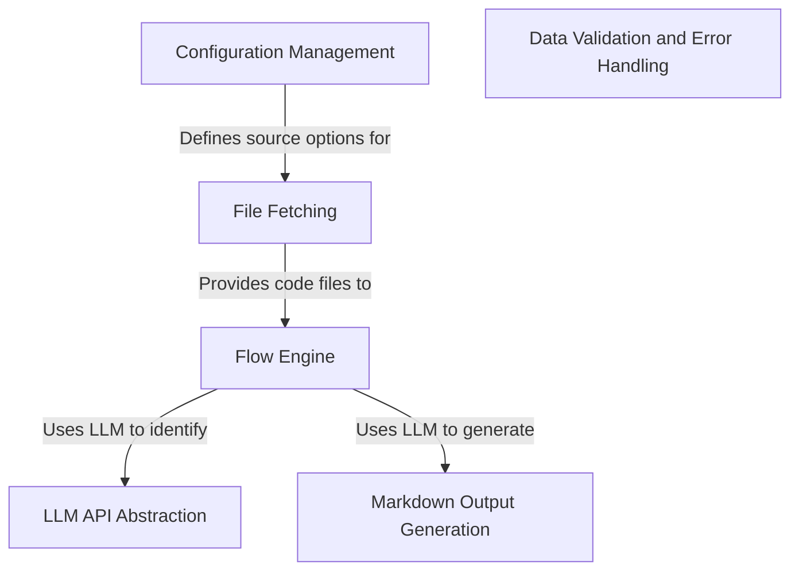

# Tutorial: 20250704_1434_code-sourcelensai

The project automates code analysis and documentation. It starts by **fetching code files** and then uses an *LLM API* to understand code **abstractions** and generate documentation.  Finally, the system generates organized output in *Markdown format*.

**Source Repository:** [https://github.com/openXFlow/sourceLensAI](https://github.com/openXFlow/sourceLensAI)

## Abstraction Relationships

## Chapters

1. [Configuration Management](01_configuration-management.md)
2. [Data Validation and Error Handling](02_data-validation-and-error-handling.md)
3. [File Fetching](03_file-fetching.md)
4. [Flow Engine](04_flow-engine.md)
5. [LLM API Abstraction](05_llm-api-abstraction.md)
6. [Markdown Output Generation](06_markdown-output-generation.md)
7. [Architecture Diagrams](07_diagrams.md)
8. [Code Inventory](08_code_inventory.md)
9. [Project Review](09_project_review.md)

---

*Generated by [SourceLens AI](https://github.com/openXFlow/sourceLensAI) using LLM: `gemini` (cloud) - model: `gemini-2.0-flash` | Language Profile: `Python`*