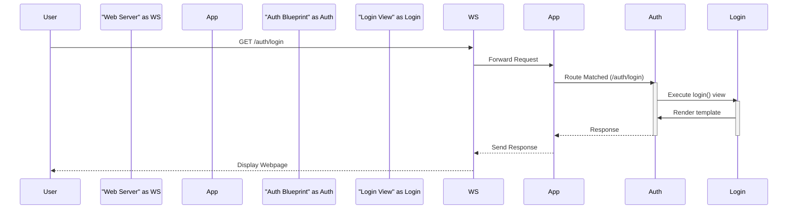

> Previously, we looked at the [Project Overview](index.md).

# Chapter 9: Blueprints
Let's begin exploring this concept. In this chapter, we'll dive into Flask Blueprints, a powerful tool for organizing and structuring your web applications. Our goal is to understand what Blueprints are, why they are useful, and how to use them in our `20250705_1300_code-flask` project.
**Why Blueprints? The Modular Kitchen Analogy**
Imagine building a house. You wouldn't just pile all the materials together and hope for the best, right? You'd organize things into rooms: the kitchen, the living room, the bedrooms, and so on. Each room has its own specific purpose and set of features.
Flask Blueprints are similar to the rooms in a house. They allow you to break down your Flask application into smaller, manageable, and reusable components. Instead of having one giant, monolithic application, you can have a collection of smaller "blueprints," each responsible for a specific part of your application's functionality.
For example, you might have:
*   A blueprint for handling user authentication (login, registration, profile).
*   A blueprint for your blog or content management system (CMS).
*   A blueprint for your API endpoints.
This modular approach offers several advantages:
*   **Organization:** Makes your code easier to understand and maintain.
*   **Reusability:** Blueprints can be reused in multiple projects or even multiple times within the same project.
*   **Testability:** Smaller components are easier to test in isolation.
*   **Teamwork:** Different developers can work on different blueprints simultaneously.
**Key Concepts of Blueprints**
At its core, a Blueprint is a container for a set of operations. It can include:
*   **Routes:** URL rules associated with specific view functions.
*   **Templates:** HTML files used to render dynamic content.
*   **Static files:** Images, CSS, JavaScript, and other static assets.
*   **Other resources:** Custom filters, context processors, etc.
The `Blueprint` class, found in `src/flask/blueprints.py`, is what we use to create these modular units. Let's examine its basic structure:
```python
--- File: src/flask/blueprints.py ---
from __future__ import annotations
# ... imports ...
class Blueprint(SansioBlueprint):
    def __init__(
        self,
        name: str,
        import_name: str,
        static_folder: str | os.PathLike[str] | None = None,
        static_url_path: str | None = None,
        template_folder: str | os.PathLike[str] | None = None,
        url_prefix: str | None = None,
        subdomain: str | None = None,
        url_defaults: dict[str, t.Any] | None = None,
        root_path: str | None = None,
        cli_group: str | None = _sentinel,  # type: ignore
    ) -> None:
        super().__init__(
            name,
            import_name,
            static_folder,
            static_url_path,
            template_folder,
            url_prefix,
            subdomain,
            url_defaults,
            root_path,
            cli_group,
        )
```
The `__init__` method takes several important arguments:
*   **`name`**: The name of the blueprint. This is used internally by Flask and should be unique.
*   **`import_name`**: The name of the module or package where the blueprint is located. This is usually `__name__`.
*   **`static_folder`**: The path to the folder containing static files (optional).
*   **`static_url_path`**: The URL path to serve static files from (optional).
*   **`template_folder`**: The path to the folder containing templates (optional).
*   **`url_prefix`**: A prefix that will be added to all the blueprint's URL rules (optional).  This is a very common and helpful parameter!
*   **`subdomain`**: A subdomain to match for all routes in the blueprint.
*   **`url_defaults`**: A dict of default values for URLs in the blueprint.
*   **`root_path`**: The path to the blueprint's root directory.
*   **`cli_group`**: The name of the Click command group for registering CLI commands for this blueprint.
**How Blueprints Work: A Step-by-Step Guide**
1.  **Create a Blueprint:** Instantiate the `Blueprint` class, providing a name and import name.
2.  **Define Routes:** Use the blueprint's `route()` decorator to associate URLs with view functions, just like you would with the main Flask application.
3.  **Register the Blueprint:** Use the `app.register_blueprint()` method to register the blueprint with your Flask application.
Let's illustrate this with a simple example:
```python
# src/auth/auth_blueprint.py
from flask import Blueprint, render_template
auth_bp = Blueprint('auth', __name__, template_folder='templates')
@auth_bp.route('/login')
def login():
    return render_template('login.html')
@auth_bp.route('/register')
def register():
    return render_template('register.html')
# In your main app file (e.g., app.py)
from flask import Flask
# Assuming the blueprint is in src/auth/auth_blueprint.py
from src.auth.auth_blueprint import auth_bp
app = Flask(__name__)
app.register_blueprint(auth_bp, url_prefix='/auth')  # VERY COMMON AND HELPFUL!
```
In this example:
*   We create a blueprint named `'auth'` and tell it to look for templates inside the `templates` folder within the blueprint's directory.
*   We define two routes: `/login` and `/register`, which render the `login.html` and `register.html` templates, respectively.
*   We register the blueprint with the Flask application using `app.register_blueprint()`.  The `url_prefix='/auth'` means that all routes defined in the `auth_bp` blueprint will be prefixed with `/auth`. So, the actual URLs will be `/auth/login` and `/auth/register`.
**Blueprint Registration and URL Prefixes**
The `url_prefix` parameter is crucial for avoiding naming conflicts and organizing your application's URLs.  Without it, if you have two routes with the same name in different blueprints, Flask won't know which one to use!
**Important Blueprint Methods**
The `Blueprint` class inherits from `SansioBlueprint` and provides several useful methods:
*   `send_static_file(filename)`:  Serves static files from the blueprint's static folder.
*   `open_resource(resource, mode='rb', encoding='utf-8')`: Opens a resource file relative to the blueprint's root path.  Useful for accessing data files associated with the blueprint.
**Sequence Diagram: Request Handling with Blueprints**
Here's a sequence diagram illustrating how a request is handled when a Blueprint is involved:

This diagram shows the request flow:
1.  A user requests the `/auth/login` URL.
2.  The web server forwards the request to the Flask application.
3.  The Flask application's routing system matches the request to the `auth` Blueprint.
4.  The `auth` Blueprint executes the `login()` view function.
5.  The `login()` view renders a template.
6.  The Flask application sends the response back to the web server, which then sends it to the user.
**Blueprint CLI Integration**
Blueprints can also have their own CLI (Command Line Interface) commands. This is achieved through the `blueprint.cli` attribute which is an instance of `AppGroup`. This allows you to add custom commands that are specific to the blueprint's functionality, as seen in `src/flask/blueprints.py`.
You can add a CLI command like so:
```python
from flask import Blueprint
from flask.cli import with_appcontext, click
bp = Blueprint("my_blueprint", __name__)
@bp.cli.command("do-something")
@with_appcontext
def do_something():
    """Does something blueprint-specific."""
    click.echo("Doing something in my_blueprint!")
# In app.py
from flask import Flask
from my_blueprint import bp
app = Flask(__name__)
app.register_blueprint(bp)
```
This allows you to execute `flask my_blueprint do-something` from the command line. See [CLI (Command Line Interface)](10_cli-command-line-interface.md) for more details on CLI command creation and usage.
**Relationships to Other Concepts**
Blueprints build upon the concepts we've already covered, such as:
*   [Flask Application Instance](01_flask-application-instance.md): Blueprints are registered with the main Flask application instance.
*   [Routing System](03_routing-system.md): Blueprints define their own routes, which are then integrated into the application's overall routing system.
*   [Template Engine Integration](06_template-engine-integration.md): Blueprints can use templates to render dynamic content.
This concludes our look at this topic.

> Next, we will examine [CLI (Command Line Interface)](02_cli-command-line-interface.md).


---

*Generated by [SourceLens AI](https://github.com/openXFlow/sourceLensAI) using LLM: `gemini` (cloud) - model: `gemini-2.0-flash` | Language Profile: `Python`*