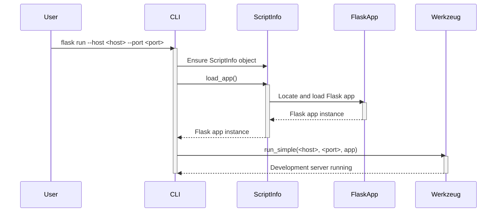

> Previously, we looked at [Blueprints](01_blueprints.md).

# Chapter 10: CLI (Command Line Interface)
Let's begin exploring this concept. This chapter will guide you through using the command-line interface (CLI) provided with the `20250705_1300_code-flask` project to manage and run your Flask applications. We'll cover how to start the development server, access a shell with the application context, and inspect the defined routes.
**Motivation/Purpose**
Imagine you're building a house. You could assemble every brick and nail by hand, or you could use tools like a hammer and a saw to speed things up. Similarly, when developing Flask applications, you *could* manually set up the server, debugger, and other settings every time you want to run your app. But that's tedious!
The CLI is like a toolbox for your Flask app. It provides convenient commands to perform common tasks, such as:
*   Running the development server with automatic reloading and debugging.
*   Opening a Python shell with the application's context, allowing you to interact with your models and data.
*   Listing all the defined routes in your application, which is helpful for understanding your API.
**Key Concepts Breakdown**
The CLI in `20250705_1300_code-flask` is built using the `click` library, a popular Python package for creating command-line interfaces. The core components are:
1.  **`FlaskGroup`:** A subclass of `click.Group` that automatically loads commands defined in your Flask application.
2.  **Commands:** Individual actions that can be executed from the command line, such as `run`, `shell`, and `routes`.
3.  **Options:** Flags and arguments that modify the behavior of commands, such as `--host`, `--port`, and `--debug`.
4.  **Application Context:** A context that makes application-specific objects and configurations available within the shell and route commands.
**Usage / How it Works**
The CLI is accessed through the `flask` command in your terminal. Here's a breakdown of common usage scenarios:
1.  **Running the Development Server:**
    Use the `flask run` command to start the development server. By default, it runs on `127.0.0.1` (localhost) at port `5000`.
    ```bash
    flask run
    ```
    You can customize the host and port using the `--host` and `--port` options:
    ```bash
    flask run --host 0.0.0.0 --port 8000
    ```
    The `--debug` flag enables the debugger and reloader:
    ```bash
    flask run --debug
    ```
2.  **Accessing the Shell:**
    The `flask shell` command opens an interactive Python shell with the application context loaded. This allows you to interact with your application's models, database, and other components.
    ```bash
    flask shell
    ```
3.  **Listing Routes:**
    The `flask routes` command displays all the registered routes in your application, along with their endpoints and HTTP methods.
    ```bash
    flask routes
    ```
**Code Examples (Short & Essential)**
The entry point for the CLI is `src/flask/__main__.py`:
```python
--- File: src/flask/__main__.py ---
from .cli import main
main()
```
This simply imports the `main` function from `src/flask/cli.py` and executes it.
The `FlaskGroup` in `src/flask/cli.py` handles the registration and execution of commands:
```python
--- File: src/flask/cli.py ---
cli = FlaskGroup(
    name="flask",
    help="""\
A general utility script for Flask applications.
An application to load must be given with the '--app' option,
'FLASK_APP' environment variable, or with a 'wsgi.py' or 'app.py' file
in the current directory.
""",
)
def main() -> None:
    cli.main()
```
**Inline Diagrams (Optional)**
Here's a sequence diagram illustrating how the `flask run` command starts the development server:

This diagram shows how the `flask run` command invokes the `run_simple` function from the Werkzeug library to start the development server, after loading the Flask application.
**Relationships & Cross-Linking**
The CLI relies on the [Flask Application Instance](01_flask-application-instance.md) to load and run the application. It also utilizes [Configuration Management](02_configuration-management.md) to configure the application's behavior. The `flask routes` command interacts with the [Routing System](03_routing-system.md) to display the defined routes. The `flask shell` command operates within the [Request Context](04_request-context.md) when executing commands.
**Conclusion**
The CLI provides a convenient way to manage and run your Flask applications during development. It simplifies common tasks like starting the development server, accessing a shell with the application context, and inspecting the defined routes, enabling you to focus on building your application's core functionality.
This concludes our look at this topic.

> Next, we will examine [Configuration Management](03_configuration-management.md).


---

*Generated by [SourceLens AI](https://github.com/openXFlow/sourceLensAI) using LLM: `gemini` (cloud) - model: `gemini-2.0-flash` | Language Profile: `Python`*