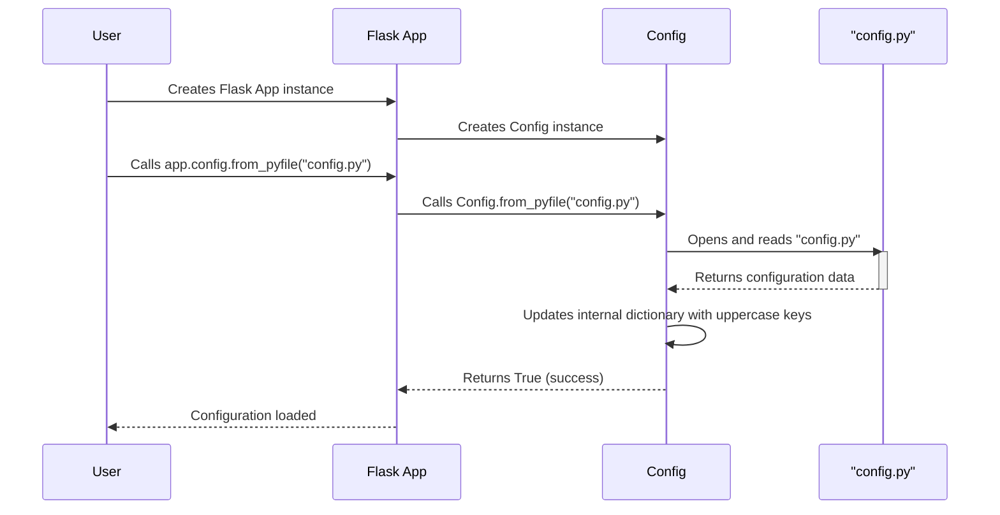

> Previously, we looked at [CLI (Command Line Interface)](02_cli-command-line-interface.md).

# Chapter 2: Configuration Management
Let's begin exploring this concept. This chapter aims to explain how application settings are loaded, stored, and accessed in the `20250705_1300_code-flask` project.
**Why Configuration Management?**
Imagine you're building a house. You need to decide on things like the paint color, the type of flooring, and the appliances. These choices are the *configuration* of your house.
In software, configuration management is similar. It allows you to customize your application's behavior without changing its core code. This is crucial for several reasons:
*   **Flexibility:** Different environments (development, testing, production) often require different settings.
*   **Maintainability:** Configuration changes are easier and safer than code changes.
*   **Security:** Sensitive information like API keys or database passwords can be stored separately and securely.
In the `20250705_1300_code-flask` project, configuration management handles these aspects, providing a central place to manage settings.
**Key Concepts Breakdown**
The `src/flask/config.py` file defines the `Config` class, which inherits from Python's built-in `dict`. This class acts as a dictionary, but with added functionality for loading configurations from various sources. Let's break down the important components:
*   **`Config` Class:** The heart of the configuration system. It's a dictionary-like object that stores key-value pairs representing application settings.
*   **`ConfigAttribute` Class:** This class allows you to access config values directly as attributes of the Flask application instance.
*   **Loading Methods:** These methods (`from_pyfile`, `from_object`, `from_envvar`, `from_file`, `from_mapping`, `from_prefixed_env`) load configuration data from different sources.
**Usage / How it Works**
The `Config` class provides several methods for loading configuration data:
1.  **`from_pyfile(filename, silent=False)`:** Loads configuration from a Python file. Only uppercase variables in the file are added to the configuration.
2.  **`from_object(obj)`:** Loads configuration from a Python object (module or class). Again, only uppercase attributes are considered.
3.  **`from_envvar(variable_name, silent=False)`:** Loads a configuration file path from an environment variable.
4.  **`from_file(filename, load, silent=False, text=True)`:** Loads configuration from a file using a custom loading function (e.g., JSON or TOML).
5.  **`from_mapping(mapping=None, **kwargs)`:** Updates the configuration directly from a dictionary or keyword arguments.
6. **`from_prefixed_env(prefix="FLASK", *, loads=json.loads)`:** Loads configuration from environment variables with a specific prefix.
The `silent` parameter in `from_pyfile`, `from_envvar`, and `from_file` controls whether the application should raise an error if the configuration file is not found.
**Code Examples**
Here are some examples of how to use the `Config` class:
*   **Loading from a Python file:**
```python
# Assuming app is a Flask application instance
app.config.from_pyfile('config.py')
```
*   **Loading from an object:**
```python
# Assuming app is a Flask application instance
class ConfigClass:
    DEBUG = True
    SECRET_KEY = 'mysecretkey'
app.config.from_object(ConfigClass)
```
*   **Loading from an environment variable:**
```python
# Assuming app is a Flask application instance
# and the environment variable 'MY_APP_CONFIG' is set to 'path/to/config.py'
app.config.from_envvar('MY_APP_CONFIG')
```
*   **Loading from JSON file:**
```python
import json
# Assuming app is a Flask application instance
app.config.from_file("config.json", load=json.load)
```
**Configuration Loading Process (Sequence Diagram)**
Here's a sequence diagram illustrating the typical configuration loading process using `from_pyfile`:

The diagram shows how the Flask application delegates the configuration loading to the `Config` object, which then interacts with the configuration file.
**Accessing Configuration Values**
You can access configuration values using the dictionary-like interface of the `Config` object:
```python
# Assuming app is a Flask application instance and DEBUG is set in the config
debug_mode = app.config['DEBUG']
```
Or, if you are using the `ConfigAttribute` class, you can access the config values directly:
```python
# Assuming app is a Flask application instance and DEBUG is defined as a ConfigAttribute
debug_mode = app.debug # app.debug is an instance of ConfigAttribute that forwards to app.config['DEBUG']
```
**Relationships & Cross-Linking**
The configuration settings loaded using this system will be used extensively in other parts of the application. For example, the `SECRET_KEY` setting is crucial for [Session Management](07_session-management.md). The database connection settings might be used in multiple parts of the application, and accessed during the handling of [Request Context](04_request-context.md).
**`get_namespace` Function**
The `get_namespace` function is particularly useful for grouping related configuration settings.
```python
app.config['IMAGE_STORE_TYPE'] = 'fs'
app.config['IMAGE_STORE_PATH'] = '/var/app/images'
image_store_config = app.config.get_namespace('IMAGE_STORE_')
print(image_store_config)  # Output: {'type': 'fs', 'path': '/var/app/images'}
```
**`from_prefixed_env` Function**
The `from_prefixed_env` is a convenient method to load configuration from environment variables using a common prefix. This keeps your configuration separate from your code.
```python
# Assuming environment variables FLASK_DEBUG=True and FLASK_API_KEY=secret
app.config.from_prefixed_env()
print(app.config['DEBUG'])  # Output: True
print(app.config['API_KEY']) # Output: secret
```
This concludes our look at this topic.

> Next, we will examine [Flask Application Instance](04_flask-application-instance.md).


---

*Generated by [SourceLens AI](https://github.com/openXFlow/sourceLensAI) using LLM: `gemini` (cloud) - model: `gemini-2.0-flash` | Language Profile: `Python`*