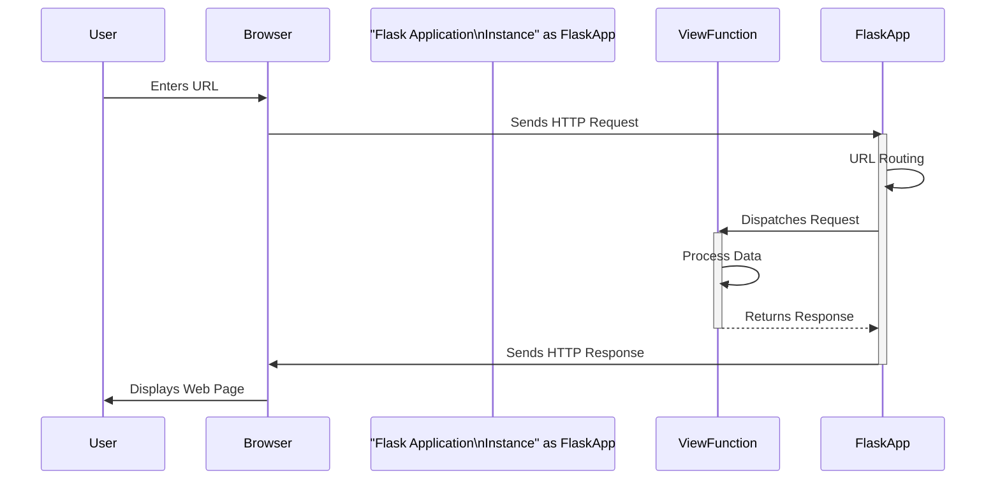

> Previously, we looked at [Configuration Management](03_configuration-management.md).

# Chapter 1: Flask Application Instance
Let's begin exploring this concept. In this chapter, we'll dissect the `Flask Application Instance`, the very heart of any Flask web application. Our goal is to understand what it is, why it's essential, and how to use it effectively.
**What is the Flask Application Instance?**
Imagine a control panel for a spaceship. This panel manages all the critical functions: steering, navigation, communication, and life support. The Flask Application Instance is similar; it's the central control point for your web application. It's a Python object that manages configuration, URL routing, handling incoming requests, and generating outgoing responses. It's where you register your website's different parts, like the pages users can visit, how to handle errors, and much more.
**Why Does It Exist?**
Without this central object, your web application would be a disorganized mess. The Flask Application Instance provides structure and organization, allowing you to build complex web applications in a manageable way. It enables Flask to keep track of all the different pieces of your application and how they interact.
**Key Concepts Breakdown:**
The Flask Application Instance manages many responsibilities, but we can break down the most important ones:
*   **Configuration:** Loading and managing settings (like database connection details, debugging mode, and secret keys). We'll dive deeper into this in [Configuration Management](02_configuration-management.md).
*   **Routing:** Mapping URLs (like `/`, `/about`, or `/contact`) to specific Python functions that handle those requests. This is the foundation of how users navigate your website and will be discussed further in [Routing System](03_routing-system.md).
*   **Request Handling:** Receiving and processing incoming requests from users. This involves accessing data sent by the user (like form submissions or URL parameters) and making it available to your code. The details are covered in [Request Context](04_request-context.md).
*   **Response Generation:** Creating and sending responses back to the user's browser. This could be an HTML page, a JSON object, or a redirect to another page. More on this in [Response Handling](05_response-handling.md).
**How it Works (High-Level):**
1.  **Creation:** You create an instance of the `Flask` class. This is typically done at the beginning of your application's main script.
2.  **Configuration:** You load configuration settings into the instance.
3.  **Routing:** You define routes, associating URLs with view functions.
4.  **Running:** You start the Flask development server, which listens for incoming requests.
5.  **Request/Response Cycle:**
    *   A user sends a request to your application.
    *   The Flask Application Instance receives the request.
    *   It uses its routing system to determine which view function should handle the request.
    *   The view function processes the request and returns a response.
    *   The Flask Application Instance sends the response back to the user.

The diagram above illustrates the request/response lifecycle managed by the Flask Application Instance.
**Code Examples:**
Here's a simple example of creating a Flask Application Instance:
```python
from flask import Flask
# Create a Flask application instance
app = Flask(__name__)
# Define a route
@app.route('/')
def hello_world():
  return 'Hello, World!'
# Run the application
if __name__ == '__main__':
  app.run(debug=True) #debug=True will enable debugging mode
```
Explanation:
*   `from flask import Flask`: Imports the `Flask` class.
*   `app = Flask(__name__)`: Creates an instance of the `Flask` class. `__name__` is a special Python variable that represents the name of the current module. Flask uses this to determine the root path of the application.
*   `@app.route('/')`: This is a decorator that registers a route. In this case, it associates the `/` URL with the `hello_world` function.
*   `def hello_world():`: This is the view function that will be executed when a user visits the `/` URL. It simply returns the string 'Hello, World!'.
*   `if __name__ == '__main__': app.run(debug=True)`: This runs the Flask development server when the script is executed directly.  `debug=True` enables debug mode, which provides helpful error messages and automatic reloading when you make changes to your code.
**Relationship to Other Chapters:**
The Flask Application Instance is the foundation upon which all other Flask components are built. Chapters such as [Configuration Management](02_configuration-management.md), [Routing System](03_routing-system.md), [Request Context](04_request-context.md) and [Response Handling](05_response-handling.md) all rely on the existence and proper functioning of this central object.
**Conclusion:**
The Flask Application Instance is the core of any Flask web application. It manages configuration, routing, request handling, and response generation, providing a structured and organized way to build complex web applications. Understanding this concept is crucial for developing robust and maintainable Flask applications.
This concludes our look at this topic.

> Next, we will examine [JSON Handling](05_json-handling.md).


---

*Generated by [SourceLens AI](https://github.com/openXFlow/sourceLensAI) using LLM: `gemini` (cloud) - model: `gemini-2.0-flash` | Language Profile: `Python`*