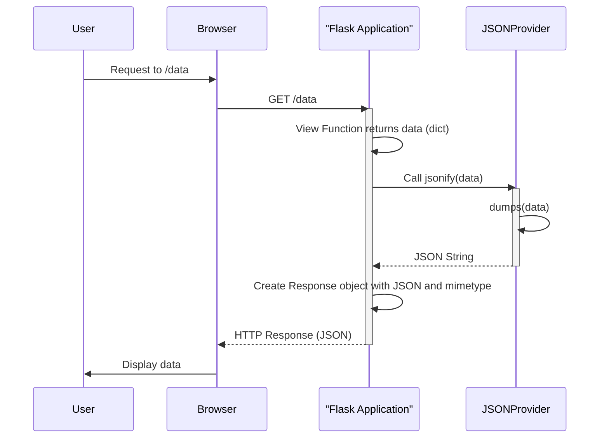

> Previously, we looked at [Flask Application Instance](04_flask-application-instance.md).

# Chapter 8: JSON Handling
Let's begin exploring this concept. This chapter delves into the JSON handling utilities provided by the `20250705_1300_code-flask` project. Our goal is to understand how this project simplifies working with JSON data, including serialization (converting Python objects to JSON) and deserialization (converting JSON to Python objects).
**Why JSON Handling is Important**
Imagine you're a translator. You need to convert information from English to Spanish and vice versa. JSON handling in our project is similar. Web applications frequently exchange data with servers in JSON format. It's a universal language for data transmission on the web.
The `20250705_1300_code-flask` project abstracts away the complexities of dealing directly with the underlying JSON library (usually Python's built-in `json` module). This abstraction allows for:
*   **Consistency:** Ensures that JSON serialization and deserialization are handled uniformly across the application.
*   **Customization:** Allows the developer to easily swap out the JSON library (e.g., use a faster or more feature-rich library) or customize the encoding/decoding process.
*   **Type Handling:** Provides mechanisms for handling Python data types that are not natively supported by JSON (e.g., dates, UUIDs).
**Key Components**
The JSON handling system in `20250705_1300_code-flask` revolves around these key components:
*   **`flask.json` Module:** Provides the main entry points for JSON operations: `dumps`, `dump`, `loads`, `load`, and `jsonify`. These functions act as wrappers around the underlying JSON library.
*   **`JSONProvider` Class:** An abstract base class that defines the interface for JSON handling.  It's responsible for the actual serialization and deserialization logic. The application can configure a specific `JSONProvider` to use.
*   **`DefaultJSONProvider` Class:** A concrete implementation of `JSONProvider` that uses Python's built-in `json` library. It also provides default handling for common Python data types like dates, UUIDs, and dataclasses.
*   **`jsonify` Function:** A convenience function for creating JSON responses directly from view functions.  It takes Python objects as input and returns a `flask.Response` object with the `application/json` mimetype.
*   **Tagged JSON Serializer:** Used for serializing session data and other complex data structures that may contain objects not directly supported by standard JSON. It uses a tag system to compactly represent these objects.
**How it Works**
The `flask.json` module acts as a facade, providing a simplified interface for interacting with JSON data. When you call `dumps`, `dump`, `loads`, or `load`, the system first checks if an application context exists (`current_app`).
*   **With Application Context:** If an application context is active, the functions delegate the JSON operations to the `app.json` attribute, which is an instance of the `JSONProvider` (typically `DefaultJSONProvider`).  This allows the application to customize the JSON handling behavior.
*   **Without Application Context:** If no application context is active, the functions use Python's built-in `json` library directly with some default settings.
The `jsonify` function simplifies the creation of JSON responses. It serializes the given arguments using the application's JSON provider and returns a `Response` object with the appropriate `Content-Type` header.
Here's a simple sequence diagram illustrating how `jsonify` works:

The diagram shows that when a view function returns data and `jsonify` is used, it internally uses the configured `JSONProvider` to serialize the data into a JSON string before returning it as part of the HTTP response.
**Code Examples**
Here's how you would typically use the JSON handling utilities within a Flask view function:
```python
from flask import Flask, jsonify
app = Flask(__name__)
@app.route('/api/data')
def get_data():
    data = {'message': 'Hello, world!', 'status': 'OK'}
    return jsonify(data)
if __name__ == '__main__':
    app.run(debug=True)
```
In this example, the `get_data` view function returns a Python dictionary. The `jsonify` function automatically converts this dictionary to a JSON response with the `application/json` mimetype.
Here's an example of how to customize the `DefaultJSONProvider`:
```python
from flask import Flask
from flask.json.provider import DefaultJSONProvider
import datetime
class CustomJSONProvider(DefaultJSONProvider):
    def default(self, obj):
        if isinstance(obj, datetime.timedelta):
            return str(obj.total_seconds()) # Return seconds as string
        return super().default(obj)
    #Override the default sort_keys setting
    sort_keys = False
app = Flask(__name__)
app.json_provider_class = CustomJSONProvider
@app.route('/api/timedelta')
def get_timedelta():
    delta = datetime.timedelta(seconds=60)
    return app.json.response(delta=delta)
```
This example shows how to customize the JSON serialization by subclassing `DefaultJSONProvider` and overriding the `default` method to handle the `datetime.timedelta` object. Also, it shows how to override the `sort_keys` attribute.
**Tagged JSON**
The `TaggedJSONSerializer` is used to serialize complex data structures often used in session management. It encodes Python objects that aren't natively JSON-serializable by "tagging" them with a short string representing their type. When deserializing, it uses these tags to reconstruct the original Python objects. This is useful for preserving data types when storing them in session cookies.
You can register custom tags to handle specific data types. Refer to the `src/flask/json/tag.py` file for example implementations like `TagUUID` and `TagDateTime`.
**Relationship to Other Components**
JSON handling is tightly integrated with the [Response Handling](05_response-handling.md) and [Session Management](07_session-management.md) components. The `jsonify` function simplifies response creation, and the `TaggedJSONSerializer` is used for session data serialization. Understanding [Flask Application Instance](01_flask-application-instance.md) is essential because the JSON provider can be configured at the application level.
This concludes our look at this topic.

> Next, we will examine [Request Context](06_request-context.md).


---

*Generated by [SourceLens AI](https://github.com/openXFlow/sourceLensAI) using LLM: `gemini` (cloud) - model: `gemini-2.0-flash` | Language Profile: `Python`*