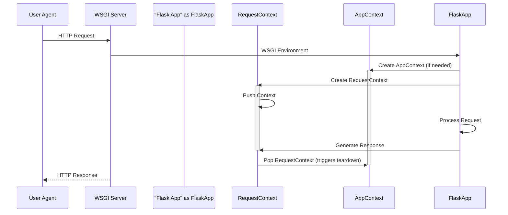

> Previously, we looked at [JSON Handling](05_json-handling.md).

# Chapter 4: Request Context
Let's begin exploring this concept. In this chapter, we'll unravel the mystery of the Request Context within our `20250705_1300_code-flask` project. Our goal is to understand what it is, why it's essential, and how it manages data specific to each incoming web request.
The Request Context is a crucial abstraction for web applications. Imagine a bustling restaurant. Each table represents a new request from a customer (the web browser). The Request Context is like the waiter assigned to that specific table. The waiter takes orders (request data), remembers preferences (session data), brings the food (generates the response), and clears the table when the customers are finished (request teardown).  Without the waiter (Request Context), chaos would ensue – orders mixed up, wrong food delivered, and a generally unpleasant experience.
In technical terms, the Request Context does the following:
*   **Manages Request Data:** Provides access to information about the incoming HTTP request, such as form data, headers, and URL parameters.
*   **Handles Sessions:** Allows the application to maintain state across multiple requests from the same user.
*   **Provides a URL Adapter:** Facilitates URL matching and generation.
*   **Offers a Request-Specific Namespace:** Provides a place to store data that is only relevant to the current request.
*   **Ensures Proper Cleanup:** Executes teardown functions to release resources (like database connections) when the request is complete.
Now, let's break down the key components involved:
*   **`request`:** This is a proxy to the actual `Request` object, which contains all the information about the incoming HTTP request. It provides access to data such as form submissions, headers, cookies, and more.
*   **`session`:** This is a proxy to the session object. It allows you to store and retrieve data associated with a specific user across multiple requests.
*   **`g`:** This is a context-local object that serves as a namespace for storing data during a request. It's a convenient place to stash variables that you want to access from different parts of your code.
*   **URL Adapter:** The URL adapter (typically handled internally) is responsible for matching the incoming request URL to a specific view function.
So, how does the Request Context work? Here's the general flow:
1.  **Request Arrives:** When a web request hits our Flask application, the application first creates an `AppContext` if one doesn't exist, as described in [Flask Application Instance](01_flask-application-instance.md).
2.  **Request Context Created and Pushed:** A `RequestContext` object is created, encapsulating the request object and other request-specific data. This context is then "pushed" onto a stack, making it the active context.
3.  **Request Handling:** The application processes the request, using the `request`, `session`, and `g` proxies to access request data, manage user sessions, and store request-specific variables.
4.  **Response Generation:** The application generates an HTTP response.  See [Response Handling](05_response-handling.md).
5.  **Request Context Popped:** After the response has been sent to the client, the `RequestContext` is "popped" from the stack. This triggers any teardown functions that have been registered, ensuring that resources are cleaned up properly.

*Explanation:*  This sequence diagram shows the flow of creating and using the Request Context.  The User Agent sends a request, which gets passed through the WSGI server to the Flask application. The application then creates an AppContext (if necessary) and then creates and pushes the RequestContext. After processing the request, the RequestContext is popped (triggering teardown activities) and the HTTP response is sent back to the user.
Let's illustrate with a simple example:
```python
from flask import Flask, request, g
app = Flask(__name__)
@app.route('/')
def index():
    # Accessing request data
    user_agent = request.headers.get('User-Agent')
    # Storing data in the request context
    g.user_ip = request.remote_addr
    return f'Hello! Your User-Agent is: {user_agent} and your IP is {g.user_ip}'
```
In this example, within the `index` view function, we access the user's User-Agent string using `request.headers.get('User-Agent')`. We also store the user's IP address in the `g` object. Both `request` and `g` are only available because a Request Context is active.
The `after_this_request` decorator is also helpful for running code *after* a request, before the Request Context is torn down. It's commonly used for adding headers or modifying the response:
```python
from flask import Flask, request, after_this_request
app = Flask(__name__)
@app.route('/')
def index():
    @after_this_request
    def add_header(response):
        response.headers['X-Custom-Header'] = 'MyValue'
        return response
    return 'Hello, World!'
```
Finally, the `copy_current_request_context` decorator is used in asynchronous programming to pass the current request context to a separate thread or process. This allows you to safely access `request` and `session` within the asynchronous task.
The App Context, mentioned briefly here, is closely related to the Request Context, as you can see in the code snippets. It stores application-level data. Refer to [Flask Application Instance](01_flask-application-instance.md) for a deeper understanding. Also, be aware that [Session Management](07_session-management.md) relies on the Request Context to function correctly.
This concludes our look at this topic.

> Next, we will examine [Response Handling](07_response-handling.md).


---

*Generated by [SourceLens AI](https://github.com/openXFlow/sourceLensAI) using LLM: `gemini` (cloud) - model: `gemini-2.0-flash` | Language Profile: `Python`*