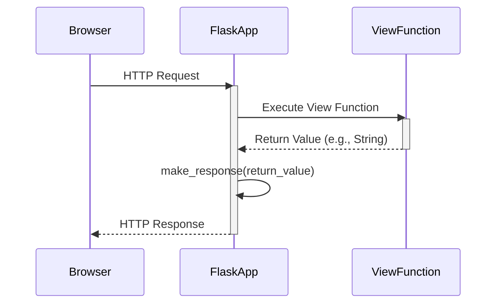

> Previously, we looked at [Request Context](06_request-context.md).

# Chapter 5: Response Handling
Let's begin exploring this concept. In this chapter, we'll delve into how `20250705_1300_code-flask` handles responses, which are the messages the server sends back to the client (like a web browser) after receiving a request. Our goal is to understand how these responses are created, modified, and ultimately delivered.
**Why Response Handling?**
Think of a restaurant. You (the client/browser) place an order (the request). The kitchen (the server) prepares your meal and then... what? The waiter (response handling) brings the meal back to you. Without the waiter, you'd never get your food! Response handling is the mechanism that takes the results of your request processing and packages them into something the client can understand and use.  It includes setting headers, status codes (like "OK" or "Not Found"), and the actual data (like HTML, JSON, or an image).
**Key Components**
The core of response handling revolves around the `Response` class and the `make_response` helper function.
*   **`Response` class:** Represents an HTTP response. It's like a container holding the data (body), status code, headers, and other metadata of the response.  The `Response` class is a subclass of `werkzeug.wrappers.Response`, inheriting its functionalities and adding Flask-specific features.
*   **`make_response` function:**  A convenience function that converts various return values from your view functions into a proper `Response` object.
**How Response Handling Works**
When a user visits a route, the corresponding view function is executed. This view function can return different types of data.  Flask needs a consistent way to handle these various return types and turn them into valid HTTP responses. `make_response` does this work.
Here's a simplified breakdown of the response handling process:
1.  **Request Arrives:** A client (e.g., a web browser) sends a request to the server.
2.  **Routing:** The routing system (see [Routing System](03_routing-system.md)) determines which view function should handle the request.
3.  **View Function Execution:** The view function is executed.
4.  **Return Value Processing:** The view function returns a value. This could be:
    *   A string (e.g., HTML content)
    *   A tuple (e.g., a string and a status code, or a string, status code, and headers)
    *   A `Response` object
5.  **`make_response` Conversion:** If the return value is not already a `Response` object, `make_response` is automatically called (or you can call it manually). It converts the return value into a `Response` object.
6.  **Response Delivery:** The `Response` object is then sent back to the client.
**Example:**
Let's say your view function returns a simple string:
```python
from flask import Flask
app = Flask(__name__)
@app.route('/')
def index():
    return 'Hello, World!'
```
In this case, Flask implicitly calls `make_response` to convert the string `"Hello, World!"` into a `Response` object with a status code of 200 (OK) and a `text/html` content type.
**The `Response` Object**
The `Response` object provides several attributes and methods to control the response. Key attributes include:
*   `data`: The body of the response (e.g., HTML content, JSON data).
*   `status_code`: The HTTP status code (e.g., 200, 404, 500).
*   `headers`: A dictionary-like object containing the HTTP headers.
*   `mimetype`: The MIME type of the response (e.g., `text/html`, `application/json`).
You can modify these attributes to customize the response.
**`make_response` in Detail**
The `make_response` function provides flexibility in defining the response. It handles various return value formats:
*   **String:** The string becomes the response body, the status code is set to 200, and the content type is set to `text/html`.
*   **`Response` Object:**  If you return a `Response` object directly, `make_response` simply returns it without modification. This allows for complete control over the response.
*   **Tuple:** A tuple is interpreted as `(response, status)` or `(response, headers)` or `(response, status, headers)`.  `response` can be a string or a `Response` object. `status` should be an integer representing the HTTP status code. `headers` should be a dictionary or a list of tuples containing HTTP headers.
**Adding Headers**
HTTP headers provide additional information about the response. You can add headers using the `Response.headers` attribute.
```python
from flask import Flask, make_response
app = Flask(__name__)
@app.route('/header_example')
def header_example():
    response = make_response("This is an example with headers.")
    response.headers['X-Custom-Header'] = 'My Value'
    response.headers['Content-Type'] = 'text/plain'  # Override default
    return response
```
In this example, we create a `Response` object, add a custom header `X-Custom-Header`, and change the `Content-Type` header to `text/plain`.
**Error Handling**
Flask provides the `abort` function (imported from `flask.helpers`) for raising HTTP errors.  This is especially useful for cases where a request cannot be fulfilled. The `abort` function generates a `Response` object with the appropriate error code.
```python
from flask import Flask, abort
app = Flask(__name__)
@app.route('/user/<int:user_id>')
def get_user(user_id):
    if user_id > 100:
        abort(404)  # User not found
    return f"User ID: {user_id}"
```
If a user tries to access a user ID greater than 100, a 404 "Not Found" error will be returned.  `abort` is a helper function that handles the creation and returning of the `Response` object automatically.
**Sequence Diagram of a Basic Response**
Here's a sequence diagram illustrating the basic flow of a request and response in Flask:

This diagram shows how the Flask application intercepts the request, calls the appropriate view function, processes the return value from the view function using `make_response`, and then sends the generated HTTP response back to the browser.
This concludes our look at this topic.

> Next, we will examine [Routing System](08_routing-system.md).


---

*Generated by [SourceLens AI](https://github.com/openXFlow/sourceLensAI) using LLM: `gemini` (cloud) - model: `gemini-2.0-flash` | Language Profile: `Python`*