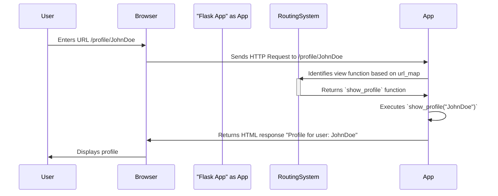

> Previously, we looked at [Response Handling](07_response-handling.md).

# Chapter 3: Routing System
Let's begin exploring this concept. This chapter aims to explain the routing system in `20250705_1300_code-flask`, enabling you to understand how URLs are mapped to specific functions within the application.
Imagine your application as a city. Users want to visit different locations (web pages) within your city. The routing system is like the city's road network and traffic control, guiding users to the correct destination based on the address (URL) they enter. It's the mechanism that takes a web request (a specific URL) and figures out which piece of your application should handle it.
**Key Concepts:**
1.  **URL Map:** The central registry of all defined routes. It contains the rules that define how URLs are matched. In `20250705_1300_code-flask`, this is represented by Werkzeug's `Map` class, accessed via `app.url_map`.
2.  **Rules:** Each entry in the URL map is a `Rule`. A rule associates a URL pattern (e.g., `/users/<username>`) with an endpoint (a name for the associated view function, such as `'show_user'`). Rules specify the HTTP methods allowed (e.g., GET, POST) and other constraints.
3.  **Endpoints:** Endpoints are string identifiers associated with view functions. They are crucial for building URLs using `url_for`.
4.  **View Functions:** These are the Python functions that are executed when a matching URL is requested. They process the request and return a response.
5.  **`url_for`:** This function takes an endpoint name and a set of keyword arguments and returns the URL associated with that endpoint. It effectively reverses the routing process, allowing you to dynamically generate URLs within your application.
**Usage / How it Works:**
The routing process works as follows:
1.  A user sends a request to your application with a specific URL (e.g., `http://example.com/profile/john`).
2.  The application receives the request and examines the URL.
3.  The routing system iterates through the `url_map`, comparing the requested URL against the defined rules.
4.  If a matching rule is found, the associated view function for that `endpoint` is executed. The system extracts any variable parts of the URL (e.g., `john` for the `username` in `/profile/<username>`) and passes them as arguments to the view function.
5.  The view function processes the request and returns a response, which is then sent back to the user.
6.  If no matching rule is found, an error (typically a 404 Not Found error) is raised.
The `url_for` function enables you to generate URLs dynamically, without hardcoding them in your templates or code. You provide the endpoint name and any necessary parameters, and `url_for` constructs the corresponding URL based on the defined rules.
```python
--- File: src/flask/app.py ---
    def add_url_rule(
        self,
        rule: str,
        endpoint: str | None = None,
        view_func: ft.RouteCallable | None = None,
        provide_automatic_options: bool | None = None,
        **options: t.Any,
    ) -> None:
        if endpoint is None:
            endpoint = _endpoint_from_view_func(view_func)  # type: ignore
        options["endpoint"] = endpoint
        methods = options.pop("methods", None)
        # if the methods are not given and the view_func object knows its
        # methods we can use that instead.  If neither exists, we go with
        # a tuple of only ``GET`` as default.
        if methods is None:
            methods = getattr(view_func, "methods", None) or ("GET",)
        if isinstance(methods, str):
            raise TypeError(
                "Allowed methods must be a list of strings, for"
                ' example: @app.route(..., methods=["POST"])'
            )
        methods = {item.upper() for item in methods}
        rule_obj = self.url_rule_class(rule, methods=methods, **options)
        self.url_map.add(rule_obj)
        if view_func is not None:
            self.view_functions[endpoint] = view_func
```
This snippet shows how `add_url_rule` method adds `Rule` to the internal `url_map`, associating URL patterns with view functions based on an `endpoint`.
```python
--- File: src/flask/app.py ---
    def url_for(
        self,
        /,
        endpoint: str,
        *,
        _anchor: str | None = None,
        _method: str | None = None,
        _scheme: str | None = None,
        _external: bool | None = None,
        **values: t.Any,
    ) -> str:
        """Generate a URL to the given endpoint with the given values."""
        ...
        try:
            rv = url_adapter.build(  # type: ignore[union-attr]
                endpoint,
                values,
                method=_method,
                url_scheme=_scheme,
                force_external=_external,
            )
        except BuildError as error:
            values.update(
                _anchor=_anchor, _method=_method, _scheme=_scheme, _external=_external
            )
            return self.handle_url_build_error(error, endpoint, values)
        if _anchor is not None:
            _anchor = _url_quote(_anchor, safe="%!#$&'()*+,/:;=?@")
            rv = f"{rv}#{_anchor}"
        return rv
```
The `url_for` function uses the `url_adapter` to build the URL based on the endpoint and provided values.
Here's an example of how routing works with Flask:
```python
# Assuming app is a Flask application instance
@app.route('/')
def index():
    return 'Hello, World!'
@app.route('/profile/<username>')
def show_profile(username):
    return f'Profile for user: {username}'
# Example Usage
with app.test_request_context():
    print(url_for('index'))  # Output: /
    print(url_for('show_profile', username='JohnDoe')) # Output: /profile/JohnDoe
```
In this example:
*   `/` is associated with the `index` function.
*   `/profile/<username>` is associated with the `show_profile` function.

This sequence diagram illustrates the flow of a request through the routing system. The User enters a URL. The Browser sends a request to the application. The Routing System identifies the view function. The application then returns a response back to the browser and displays it for the user.
Understanding the routing system is fundamental to building web applications with `20250705_1300_code-flask`. It allows you to structure your application logically and provide a clear and predictable URL structure for your users.
We will encounter routing concepts again when looking at [Blueprints](09_blueprints.md) to organize routing in more complex applications.
This concludes our look at this topic.

> Next, we will examine [Session Management](09_session-management.md).


---

*Generated by [SourceLens AI](https://github.com/openXFlow/sourceLensAI) using LLM: `gemini` (cloud) - model: `gemini-2.0-flash` | Language Profile: `Python`*