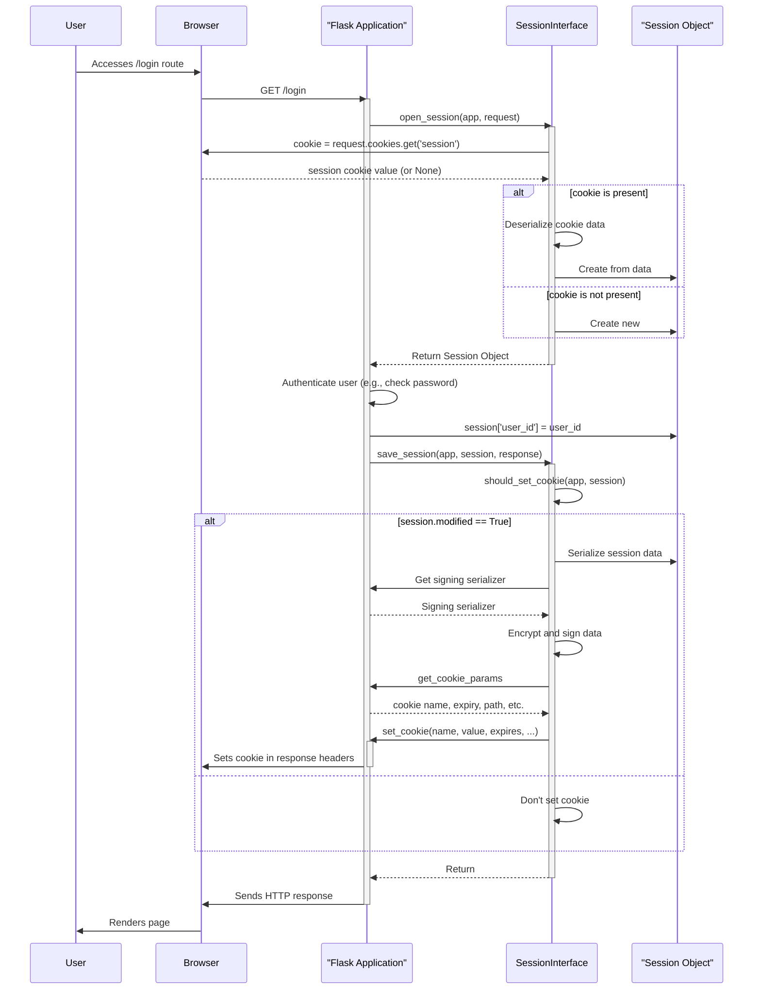

> Previously, we looked at [Routing System](08_routing-system.md).

# Chapter 7: Session Management
Let's begin exploring this concept. In this chapter, we'll understand how our `20250705_1300_code-flask` application manages user sessions, allowing us to store information about a user across multiple requests.
Think of session management like a coat check at a theatre. When you arrive (visit the application), you hand over your coat (provide some information, like login credentials). The coat check attendant (the session management system) gives you a ticket (a session cookie). You can then enjoy the show (browse the application), and when you leave (close the browser or log out), you return the ticket to retrieve your coat. This allows the theatre (the application) to remember who you are and what you entrusted to them. Without the ticket (session cookie), the theatre wouldn't know it was your coat when you come back.
The core idea of session management is to maintain state between HTTP requests. Since HTTP is stateless, the server treats each request as independent. Session management allows us to associate multiple requests with the same user, enabling features like login persistence, shopping carts, and personalized content.
Here's a breakdown of the key components involved in session management in Flask, and specifically how they are implemented in `20250705_1300_code-flask`:
1.  **Session Object:** A dictionary-like object stored on the server (or in an encrypted cookie) that holds data associated with a particular user's session. In `20250705_1300_code-flask`, this is typically a `SecureCookieSession` object.
2.  **Session ID (Cookie):** A unique identifier (a long, random string) sent to the user's browser as a cookie. This cookie allows the server to identify the user's session on subsequent requests. The cookie's name is configurable, defaulting to "session."
3.  **Session Interface:** An object responsible for creating, retrieving, and saving sessions. The default implementation in Flask, `SecureCookieSessionInterface`, uses encrypted cookies to store session data on the client-side.
Here's how session management generally works:
1.  **User Accesses the Application:** The user visits a page on your Flask application.
2.  **Session Creation (if necessary):** If the user doesn't have a session cookie, or if the existing session has expired, a new session is created. Flask creates a session object (e.g., `SecureCookieSession`).
3.  **Data Storage:** The application stores user-specific data in the session object. For example: `session['username'] = 'john_doe'`.
4.  **Cookie Sending:** The session ID and (optionally) session data are serialized and stored in a cookie, which is sent to the user's browser in the HTTP response.
5.  **Subsequent Requests:** On subsequent requests from the same user, the browser automatically includes the session cookie in the HTTP request headers.
6.  **Session Retrieval:** Flask retrieves the session ID from the cookie and uses it to load the corresponding session data from the storage (in the case of `SecureCookieSessionInterface`, it decrypts the cookie to get the session data).
7.  **Accessing Session Data:** The application can then access and modify the session data through the `session` object.
8.  **Session Saving:** Before sending the response, Flask saves the updated session data back to the cookie (or server-side storage, if a different session interface is used).
Let's look at some code snippets to illustrate how this works within the `20250705_1300_code-flask` project. The default session management uses secure cookies.
```python
--- File: src/flask/sessions.py ---
class SecureCookieSession(CallbackDict[str, t.Any], SessionMixin):
    """Base class for sessions based on signed cookies."""
    modified = False
    accessed = False
    def __init__(
        self,
        initial: c.Mapping[str, t.Any] | c.Iterable[tuple[str, t.Any]] | None = None,
    ) -> None:
        def on_update(self: te.Self) -> None:
            self.modified = True
            self.accessed = True
        super().__init__(initial, on_update)
    def __getitem__(self, key: str) -> t.Any:
        self.accessed = True
        return super().__getitem__(key)
    def get(self, key: str, default: t.Any = None) -> t.Any:
        self.accessed = True
        return super().get(key, default)
```
This `SecureCookieSession` class shows that access and modification are tracked. The `modified` flag signals that the cookie needs to be re-sent to the client with updated data, and the `accessed` flag signals that a `Vary: Cookie` header should be added to the response.
Here's an example of how the cookie is set:
```python
--- File: src/flask/sessions.py ---
class SecureCookieSessionInterface(SessionInterface):
    # ... (other methods) ...
    def save_session(
        self, app: Flask, session: SessionMixin, response: Response
    ) -> None:
        # ... (code to determine cookie parameters) ...
        if not self.should_set_cookie(app, session):
            return
        expires = self.get_expiration_time(app, session)
        val = self.get_signing_serializer(app).dumps(dict(session))  # type: ignore[union-attr]
        response.set_cookie(
            name,
            val,
            expires=expires,
            httponly=httponly,
            domain=domain,
            path=path,
            secure=secure,
            partitioned=partitioned,
            samesite=samesite,
        )
        response.vary.add("Cookie")
```
This code snippet demonstrates how the `set_cookie` method of the Flask response object is used to set the session cookie in the user's browser.  The cookie value is generated using a serializer and a signing serializer, which encrypts and signs the data.
Here's a sequence diagram visualizing how a typical session flow occurs with the `SecureCookieSessionInterface`:

The diagram shows the interaction between the user, browser, Flask application, session interface, and session object during a login process.  The key is the serialization and signing/encryption of the session data when saving the session to the cookie.
It's crucial to set the `SECRET_KEY` configuration variable in your Flask application. Without it, Flask will not be able to securely encrypt the session cookie, and users will see an error message. You can learn more about configuration in the [Configuration Management](02_configuration-management.md) chapter.
Session management is integrated with other aspects of Flask, such as the [Request Context](04_request-context.md) and [Response Handling](05_response-handling.md). The `session` object is available within the request context, and the `save_session` method is called before the response is sent to the client.
This concludes our look at this topic.

> Next, we will examine [Template Engine Integration](10_template-engine-integration.md).


---

*Generated by [SourceLens AI](https://github.com/openXFlow/sourceLensAI) using LLM: `gemini` (cloud) - model: `gemini-2.0-flash` | Language Profile: `Python`*