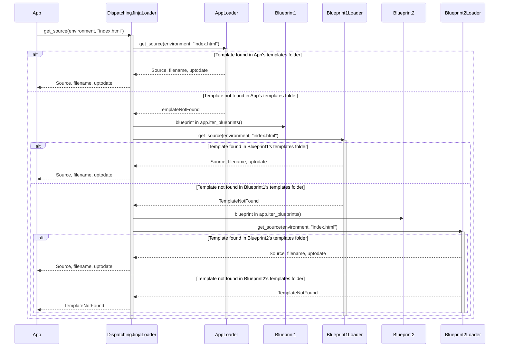

> Previously, we looked at [Session Management](09_session-management.md).

# Chapter 6: Template Engine Integration
Let's begin exploring this concept. This chapter will guide you through the integration of the Jinja2 templating engine within our `20250705_1300_code-flask` project. We'll cover how templates are loaded, how data is passed to them, and how the final output is rendered.
**Why Template Engines?**
Imagine building a website. You have a basic structure (HTML), but you want to dynamically display data that changes based on user input or database information. Instead of manually constructing HTML strings in your Python code (which quickly becomes messy), a template engine like Jinja2 provides a clean and efficient way to separate presentation (HTML) from application logic (Python).
Think of it like a mail merge: you have a template letter, and you insert specific details (name, address, etc.) from a database into the template to create personalized letters.  Jinja2 does the same thing for web pages.
**Key Concepts**
1.  **Jinja2 Environment:** The central object in Jinja2.  It's responsible for storing the configuration, loaders, and filters used for rendering templates. In our project, the `Environment` class (in `src/flask/templating.py`) extends Jinja2's `BaseEnvironment` to provide Flask-specific features, especially regarding blueprint support.
2.  **Template Loaders:**  Responsible for finding and loading template files. The `DispatchingJinjaLoader` in our project handles template loading from both the main application and any registered blueprints.  It iterates through possible locations until it finds the requested template.
3.  **Template Context:**  A dictionary containing the data that will be available within the template.  This is how your Python code passes variables to the template for rendering.
4.  **`render_template()`:** The core function for rendering templates.  It takes the template name and a context dictionary as input, and returns the rendered HTML string.
**How it Works**
The template engine integration in `20250705_1300_code-flask` follows these general steps:
1.  **Template Identification:**  The `render_template()` function is called with the name of the template to render (e.g., `"index.html"`).
2.  **Template Loading:** The `DispatchingJinjaLoader` searches for the template file within the application's template folder and any blueprint template folders.  The location is configurable and explained in [Configuration Management](02_configuration-management.md).
3.  **Context Preparation:** A context dictionary is created, containing any variables passed to `render_template()`.  Flask also automatically adds some standard variables like `request`, `session`, and `g` (application-specific global data), provided through the `_default_template_ctx_processor()` function.
4.  **Rendering:** Jinja2 renders the template, replacing variables with their values from the context.
5.  **Output:** The rendered HTML string is returned, ready to be sent as the response to the client.
**Code Examples**
Here's a simplified example of how `render_template` might be used within a route:
```python
# File: example.py (Illustrative)
from flask import Flask
from flask import render_template
app = Flask(__name__)
@app.route("/")
def index():
    user = "Alice"
    return render_template("index.html", name=user)
```
In this example:
*   We import `render_template` from `flask`.
*   The `index` view function calls `render_template("index.html", name=user)`. This tells Flask to render the `index.html` template and pass the `user` variable (aliased as `name` in the template) to it.
Here's how `index.html` might look:
```html
<!-- File: templates/index.html -->
<!DOCTYPE html>
<html>
<head>
    <title>My Website</title>
</head>
<body>
    <h1>Hello, {{ name }}!</h1>
</body>
</html>
```
Jinja2 will replace `{{ name }}` with the value of the `name` variable from the context (in this case, `"Alice"`).
**Template Loading Explanation**
The following diagram illustrates how the `DispatchingJinjaLoader` searches for templates:




This sequence diagram demonstrates the process of locating a template file, showing how the application and its blueprints are searched in order.
**Template Context Processors**
Template context processors are functions that automatically inject variables into the template context for *every* template rendered. Flask provides a way to register context processors using the `app.context_processor` decorator. The `_default_template_ctx_processor()` shown in `src/flask/templating.py` is an internal example of this.
**Streaming Templates**
The `stream_template` function allows you to render templates incrementally, sending parts of the output to the client as they become available. This is useful for large templates, as it can improve perceived performance by allowing the browser to start rendering the page before the entire template is processed.
This concludes our look at this topic.

> Next, we will examine [Architecture Diagrams](11_diagrams.md).


---

*Generated by [SourceLens AI](https://github.com/openXFlow/sourceLensAI) using LLM: `gemini` (cloud) - model: `gemini-2.0-flash` | Language Profile: `Python`*