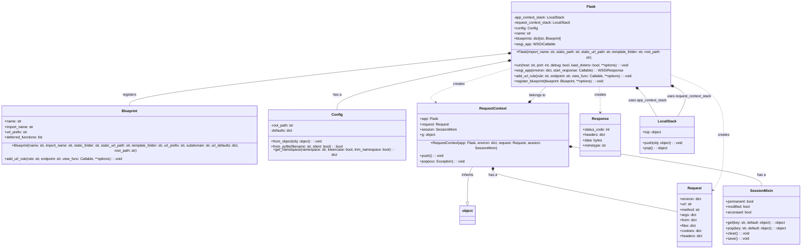
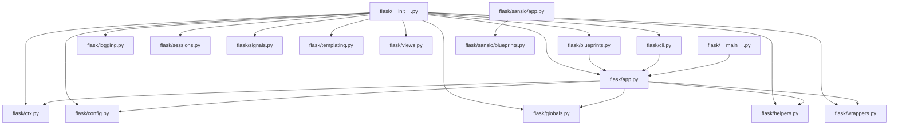
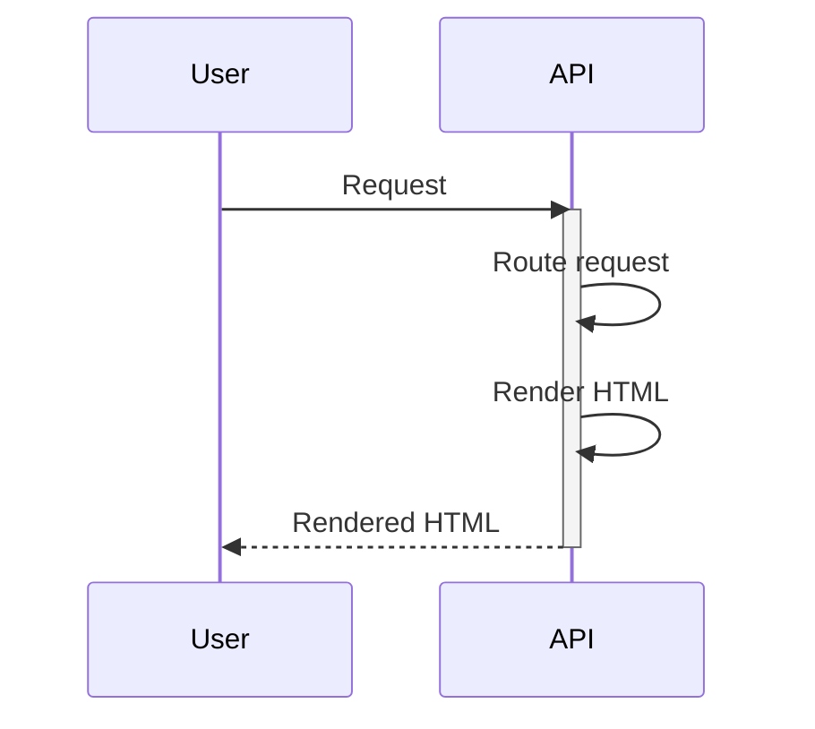
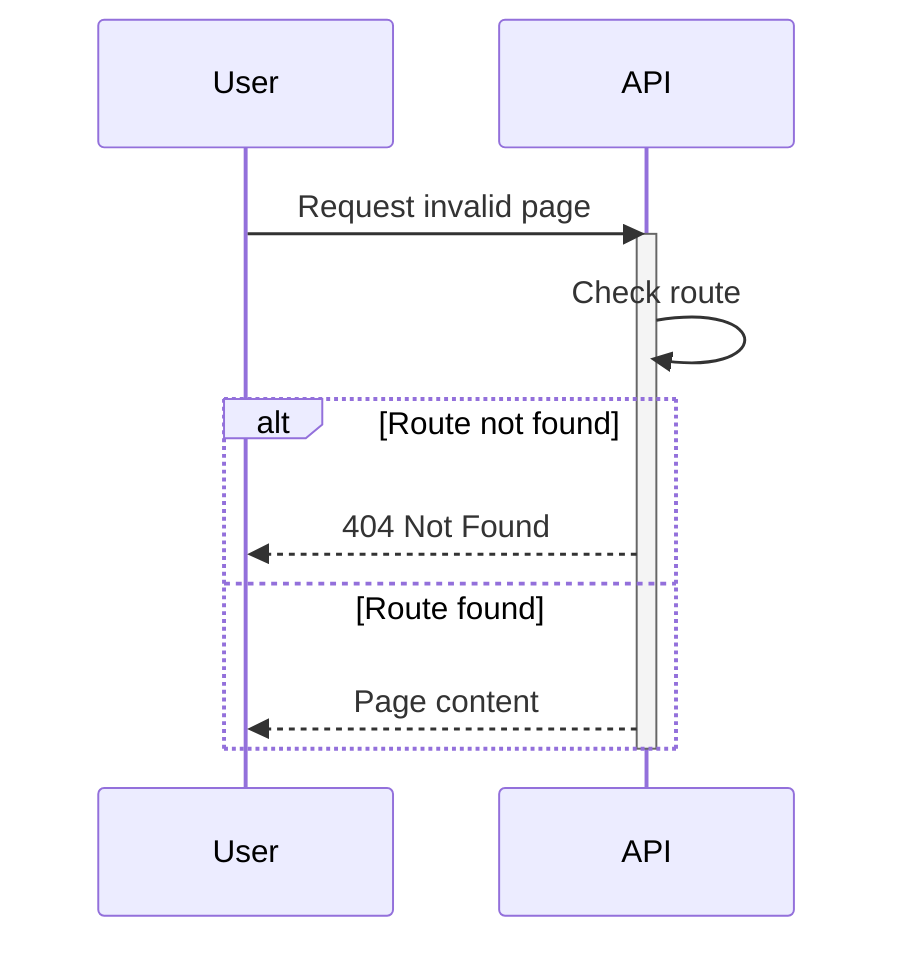
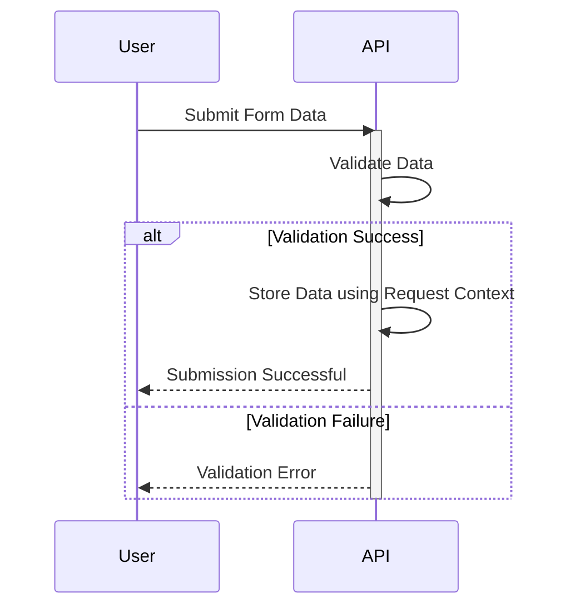
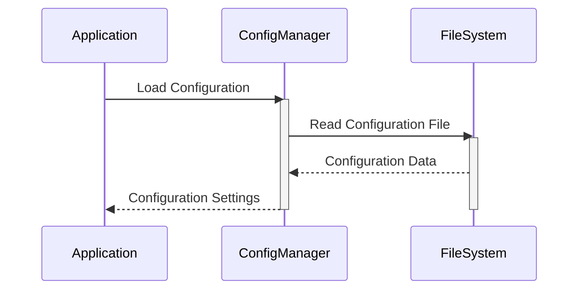
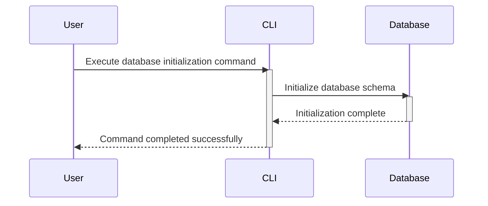

> Previously, we looked at [Template Engine Integration](10_template-engine-integration.md).

# Architecture Diagrams
## Class Diagram
Key classes and their relationships in **20250705_1300_code-flask**.

## Package Dependencies
High-level module and package structure of **20250705_1300_code-flask**.

## Sequence Diagrams
These diagrams illustrate various interaction scenarios, showcasing operations between components for specific use cases.
### User makes a request that triggers a route and receives a rendered HTML page.

### The application handles a 404 error when a user requests a non-existent page.

### User submits a form, data is validated, and stored using request context.

### Application loads configuration settings at startup using the configuration management system.

### A command-line task initializes the database via the CLI.

> Next, we will examine [Code Inventory](12_code_inventory.md).

---

*Generated by [SourceLens AI](https://github.com/openXFlow/sourceLensAI) using LLM: `gemini` (cloud) - model: `gemini-2.0-flash` | Language Profile: `Python`*