> Previously, we looked at [Architecture Diagrams](11_diagrams.md).

# Code Inventory: 20250705_1300_code-flask
## File Structure

```mermaid
graph TD
    ROOT_DIR_MERMAID_0[./]
    FILE_0[.editorconfig]
    FILE_1[.gitignore]
    FILE_2[.pre-commit-config.yaml]
    FILE_3[.readthedocs.yaml]
    FILE_4[CHANGES.rst]
    FILE_5[LICENSE.txt]
    FILE_6[README.md]
    FILE_7[pyproject.toml]
    FILE_8[__init__.py]
    FILE_9[__main__.py]
    FILE_10[app.py]
    FILE_11[blueprints.py]
    FILE_12[cli.py]
    FILE_13[config.py]
    FILE_14[ctx.py]
    FILE_15[debughelpers.py]
    FILE_16[globals.py]
    FILE_17[helpers.py]
    FILE_18[logging.py]
    FILE_19[py.typed]
    FILE_20[sessions.py]
    FILE_21[signals.py]
    FILE_22[templating.py]
    FILE_23[typing.py]
    FILE_24[views.py]
    FILE_25[wrappers.py]
    FILE_26[README.md]
    FILE_27[app.py]
    FILE_28[blueprints.py]
    FILE_29[scaffold.py]
    FILE_30[__init__.py]
    FILE_31[provider.py]
    FILE_32[tag.py]
    FILE_33[devcontainer.json]
    FILE_34[on-create-command.sh]
    DIR_src_1[src/]
    DIR_src_flask_2[flask/]
    DIR_src_flask_sansio_3[sansio/]
    DIR_src_flask_json_4[json/]
    DIR__devcontainer_5[.devcontainer/]
    ROOT_DIR_MERMAID_0 --> DIR_src_1
    DIR_src_1 --> DIR_src_flask_2
    DIR_src_flask_2 --> DIR_src_flask_sansio_3
    DIR_src_flask_sansio_3 --> FILE_26
    DIR_src_flask_sansio_3 --> FILE_27
    DIR_src_flask_sansio_3 --> FILE_28
    DIR_src_flask_sansio_3 --> FILE_29
    DIR_src_flask_2 --> DIR_src_flask_json_4
    DIR_src_flask_json_4 --> FILE_30
    DIR_src_flask_json_4 --> FILE_31
    DIR_src_flask_json_4 --> FILE_32
    DIR_src_flask_2 --> FILE_8
    DIR_src_flask_2 --> FILE_9
    DIR_src_flask_2 --> FILE_10
    DIR_src_flask_2 --> FILE_11
    DIR_src_flask_2 --> FILE_12
    DIR_src_flask_2 --> FILE_13
    DIR_src_flask_2 --> FILE_14
    DIR_src_flask_2 --> FILE_15
    DIR_src_flask_2 --> FILE_16
    DIR_src_flask_2 --> FILE_17
    DIR_src_flask_2 --> FILE_18
    DIR_src_flask_2 --> FILE_19
    DIR_src_flask_2 --> FILE_20
    DIR_src_flask_2 --> FILE_21
    DIR_src_flask_2 --> FILE_22
    DIR_src_flask_2 --> FILE_23
    DIR_src_flask_2 --> FILE_24
    DIR_src_flask_2 --> FILE_25
    ROOT_DIR_MERMAID_0 --> DIR__devcontainer_5
    DIR__devcontainer_5 --> FILE_33
    DIR__devcontainer_5 --> FILE_34
    ROOT_DIR_MERMAID_0 --> FILE_0
    ROOT_DIR_MERMAID_0 --> FILE_1
    ROOT_DIR_MERMAID_0 --> FILE_2
    ROOT_DIR_MERMAID_0 --> FILE_3
    ROOT_DIR_MERMAID_0 --> FILE_4
    ROOT_DIR_MERMAID_0 --> FILE_5
    ROOT_DIR_MERMAID_0 --> FILE_6
    ROOT_DIR_MERMAID_0 --> FILE_7
    %% Styling for better readability
    classDef dir fill:#dadada,stroke:#333,stroke-width:2px,color:#333,font-weight:bold;
    classDef file fill:#f9f9f9,stroke:#ccc,stroke-width:1px,color:#333;
    class ROOT_DIR_MERMAID_0 dir;
    class FILE_0 file;
    class FILE_1 file;
    class FILE_2 file;
    class FILE_3 file;
    class FILE_4 file;
    class FILE_5 file;
    class FILE_6 file;
    class FILE_7 file;
    class FILE_8 file;
    class FILE_9 file;
    class FILE_10 file;
    class FILE_11 file;
    class FILE_12 file;
    class FILE_13 file;
    class FILE_14 file;
    class FILE_15 file;
    class FILE_16 file;
    class FILE_17 file;
    class FILE_18 file;
    class FILE_19 file;
    class FILE_20 file;
    class FILE_21 file;
    class FILE_22 file;
    class FILE_23 file;
    class FILE_24 file;
    class FILE_25 file;
    class FILE_26 file;
    class FILE_27 file;
    class FILE_28 file;
    class FILE_29 file;
    class FILE_30 file;
    class FILE_31 file;
    class FILE_32 file;
    class FILE_33 file;
    class FILE_34 file;
    class DIR_src_1 dir;
    class DIR_src_flask_2 dir;
    class DIR_src_flask_sansio_3 dir;
    class DIR_src_flask_json_4 dir;
    class DIR__devcontainer_5 dir;
```

## File Descriptions Summary
*   **`.editorconfig`**: root = true
*   **`.gitignore`**: .idea/
*   **`.pre-commit-config.yaml`**: repos:
*   **`.readthedocs.yaml`**: version: 2
*   **`CHANGES.rst`**: Version 3.2.0
*   **`LICENSE.txt`**: Copyright 2010 Pallets
*   **`README.md`**: 
 timedelta | None:`**
    ... No function docstring found.
### **`class Flask()`**
... The flask object implements a WSGI application and acts as the central
#### *Class variables:*
*   **`default_config: Any # (Assigned)`**
*   **`request_class: type["Request"]`**
*   **`response_class: type["Response"]`**
*   **`session_interface: "SessionInterface"`**
#### *Methods:*
*   **`def __call__(self, environ: "WSGIEnvironment", start_response: "StartResponse") -> cabc.Iterable[bytes]:`**
    ... The WSGI server calls the Flask application object as the
*   **`def __init__(self, import_name: str, static_url_path: str | None = ..., static_folder: str | os.PathLike[str] | None = ..., static_host: str | None = ..., host_matching: bool = ..., subdomain_matching: bool = ..., template_folder: str | os.PathLike[str] | None = ..., instance_path: str | None = ..., instance_relative_config: bool = ..., root_path: str | None = ...):`**
    ... No method docstring found.
*   **`def app_context(self) -> "AppContext":`**
    ... Create an :class:`~flask.ctx.AppContext`. Use as a ``with``
*   **`def async_to_sync(self, func: t.Callable[..., t.Coroutine[t.Any, t.Any, t.Any]]) -> t.Callable[..., t.Any]:`**
    ... Return a sync function that will run the coroutine function.
*   **`def create_jinja_environment(self) -> "Environment":`**
    ... Create the Jinja environment based on :attr:`jinja_options`
*   **`def create_url_adapter(self, request: Request | None) -> MapAdapter | None:`**
    ... Creates a URL adapter for the given request. The URL adapter
*   **`def dispatch_request(self) -> ft.ResponseReturnValue:`**
    ... Does the request dispatching.  Matches the URL and returns the
*   **`def do_teardown_appcontext(self, exc: BaseException | None = ...) -> None:`**
    ... Called right before the application context is popped.
*   **`def do_teardown_request(self, exc: BaseException | None = ...) -> None:`**
    ... Called after the request is dispatched and the response is
*   **`def ensure_sync(self, func: t.Callable[..., t.Any]) -> t.Callable[..., t.Any]:`**
    ... Ensure that the function is synchronous for WSGI workers.
*   **`def finalize_request(self, rv: ft.ResponseReturnValue | HTTPException, from_error_handler: bool = ...) -> "Response":`**
    ... Given the return value from a view function this finalizes
*   **`def full_dispatch_request(self) -> "Response":`**
    ... Dispatches the request and on top of that performs request
*   **`def get_send_file_max_age(self, filename: str | None) -> int | None:`**
    ... Used by :func:`send_file` to determine the ``max_age`` cache
*   **`def handle_exception(self, e: "Exception") -> "Response":`**
    ... Handle an exception that did not have an error handler
*   **`def handle_http_exception(self, e: "HTTPException") -> HTTPException | ft.ResponseReturnValue:`**
    ... Handles an HTTP exception.  By default this will invoke the
*   **`def handle_user_exception(self, e: "Exception") -> HTTPException | ft.ResponseReturnValue:`**
    ... This method is called whenever an exception occurs that
*   **`def log_exception(self, exc_info: tuple[type, "BaseException", TracebackType] | tuple[None, None, None]) -> None:`**
    ... Logs an exception.  This is called by :meth:`handle_exception`
*   **`def make_default_options_response(self) -> "Response":`**
    ... This method is called to create the default ``OPTIONS`` response.
*   **`def make_response(self, rv: ft.ResponseReturnValue) -> "Response":`**
    ... Convert the return value from a view function to an instance of
*   **`def make_shell_context(self) -> dict[str, t.Any]:`**
    ... Returns the shell context for an interactive shell for this
*   **`def open_instance_resource(self, resource: str, mode: str = ..., encoding: str | None = ...) -> t.IO[t.AnyStr]:`**
    ... Open a resource file relative to the application's instance folder
*   **`def open_resource(self, resource: str, mode: str = ..., encoding: str | None = ...) -> t.IO[t.AnyStr]:`**
    ... Open a resource file relative to :attr:`root_path` for reading.
*   **`def preprocess_request(self) -> ft.ResponseReturnValue | None:`**
    ... Called before the request is dispatched. Calls
*   **`def process_response(self, response: "Response") -> "Response":`**
    ... Can be overridden in order to modify the response object
*   **`def raise_routing_exception(self, request: "Request") -> t.NoReturn:`**
    ... Intercept routing exceptions and possibly do something else.
*   **`def request_context(self, environ: "WSGIEnvironment") -> "RequestContext":`**
    ... Create a :class:`~flask.ctx.RequestContext` representing a
*   **`def run(self, host: str | None = ..., port: int | None = ..., debug: bool | None = ..., load_dotenv: bool = ..., **options: t.Any) -> None:`**
    ... Runs the application on a local development server.
*   **`def send_static_file(self, filename: str) -> "Response":`**
    ... The view function used to serve files from
*   **`def test_cli_runner(self, **kwargs: t.Any) -> "FlaskCliRunner":`**
    ... Create a CLI runner for testing CLI commands.
*   **`def test_client(self, use_cookies: bool = ..., **kwargs: t.Any) -> "FlaskClient":`**
    ... Creates a test client for this application.  For information
*   **`def test_request_context(self, *args: t.Any, **kwargs: t.Any) -> "RequestContext":`**
    ... Create a :class:`~flask.ctx.RequestContext` for a WSGI
*   **`def update_template_context(self, context: dict[str, t.Any]) -> None:`**
    ... Update the template context with some commonly used variables.
*   **`def url_for(self, /, endpoint: str, *, _anchor: str | None = ..., _method: str | None = ..., _scheme: str | None = ..., _external: bool | None = ..., **values: t.Any) -> str:`**
    ... Generate a URL to the given endpoint with the given values.
*   **`def wsgi_app(self, environ: "WSGIEnvironment", start_response: "StartResponse") -> cabc.Iterable[bytes]:`**
    ... The actual WSGI application. This is not implemented in
---
##
###### 4) src/flask/
#  blueprints.py
... No module-level docstring found.
### **`class Blueprint()`**
... No class docstring found.
#### *Methods:*
*   **`def __init__(self, name: str, import_name: str, static_folder: str | os.PathLike[str] | None = ..., static_url_path: str | None = ..., template_folder: str | os.PathLike[str] | None = ..., url_prefix: str | None = ..., subdomain: str | None = ..., url_defaults: dict[str, t.Any] | None = ..., root_path: str | None = ..., cli_group: str | None = ...) -> None:`**
    ... No method docstring found.
*   **`def get_send_file_max_age(self, filename: str | None) -> int | None:`**
    ... Used by :func:`send_file` to determine the ``max_age`` cache
*   **`def open_resource(self, resource: str, mode: str = ..., encoding: str | None = ...) -> t.IO[t.AnyStr]:`**
    ... Open a resource file relative to :attr:`root_path` for reading. The
*   **`def send_static_file(self, filename: str) -> "Response":`**
    ... The view function used to serve files from
---
##
###### 5) src/flask/
#  cli.py
... No module-level docstring found.
*   **`def _called_with_wrong_args(f: t.Callable[..., Flask]) -> bool:`**
    ... Check whether calling a function raised a ``TypeError`` because
*   **`def _env_file_callback(ctx: click.Context, param: click.Option, value: str | None) -> str | None:`**
    ... No function docstring found.
*   **`def _path_is_ancestor(path: str, other: str) -> bool:`**
    ... Take ``other`` and remove the length of ``path`` from it. Then join it
*   **`def _set_app(ctx: click.Context, param: click.Option, value: str | None) -> str | None:`**
    ... No function docstring found.
*   **`def _set_debug(ctx: click.Context, param: click.Option, value: bool) -> bool | None:`**
    ... No function docstring found.
*   **`def _validate_key(ctx: click.Context, param: click.Parameter, value: t.Any) -> t.Any:`**
    ... The ``--key`` option must be specified when ``--cert`` is a file.
*   **`def find_app_by_string(module: "ModuleType", app_name: str) -> "Flask":`**
    ... Check if the given string is a variable name or a function. Call
*   **`def find_best_app(module: "ModuleType") -> "Flask":`**
    ... Given a module instance this tries to find the best possible
*   **`def get_version(ctx: click.Context, param: click.Parameter, value: t.Any) -> None:`**
    ... No function docstring found.
*   **`def load_dotenv(path: str | os.PathLike[str] | None = ..., load_defaults: bool = ...) -> bool:`**
    ... Load "dotenv" files to set environment variables. A given path takes
*   **`def locate_app(module_name: str, app_name: str | None, raise_if_not_found: bool = ...) -> Flask | None:`**
    ... No function docstring found.
*   **`def locate_app(module_name: str, app_name: str | None, raise_if_not_found: t.Literal[False] = ...) -> Flask | None:`**
    ... No function docstring found.
*   **`def locate_app(module_name: str, app_name: str | None, raise_if_not_found: t.Literal[True] = ...) -> "Flask":`**
    ... No function docstring found.
*   **`def main() -> None:`**
    ... No function docstring found.
*   **`def prepare_import(path: str) -> str:`**
    ... Given a filename this will try to calculate the python path, add it
*   **`def routes_command(sort: str, all_methods: bool) -> None:`**
    ... Show all registered routes with endpoints and methods.
*   **`def run_command(info: "ScriptInfo", host: str, port: int, reload: bool, debugger: bool, with_threads: bool, cert: ssl.SSLContext | tuple[str, str | None] | t.Literal["adhoc"] | None, extra_files: list[str] | None, exclude_patterns: list[str] | None) -> None:`**
    ... Run a local development server.
*   **`def shell_command() -> None:`**
    ... Run an interactive Python shell in the context of a given
*   **`def show_server_banner(debug: bool, app_import_path: str | None) -> None:`**
    ... Show extra startup messages the first time the server is run,
*   **`def with_appcontext(f: "F") -> "F":`**
    ... Wraps a callback so that it's guaranteed to be executed with the
### **`class AppGroup()`**
... This works similar to a regular click :class:`~click.Group` but it
#### *Methods:*
*   **`def command(self, *args: t.Any, **kwargs: t.Any) -> t.Callable[[t.Callable[..., t.Any]], click.Command]:`**
    ... This works exactly like the method of the same name on a regular
*   **`def group(self, *args: t.Any, **kwargs: t.Any) -> t.Callable[[t.Callable[..., t.Any]], click.Group]:`**
    ... This works exactly like the method of the same name on a regular
### **`class CertParamType()`**
... Click option type for the ``--cert`` option. Allows either an
#### *Class variables:*
*   **`name: Any # (Assigned)`**
#### *Methods:*
*   **`def __init__(self) -> None:`**
    ... No method docstring found.
*   **`def convert(self, value: t.Any, param: click.Parameter | None, ctx: click.Context | None) -> t.Any:`**
    ... No method docstring found.
### **`class FlaskGroup()`**
... Special subclass of the :class:`AppGroup` group that supports
#### *Methods:*
*   **`def __init__(self, add_default_commands: bool = ..., create_app: t.Callable[..., Flask] | None = ..., add_version_option: bool = ..., load_dotenv: bool = ..., set_debug_flag: bool = ..., **extra: t.Any) -> None:`**
    ... No method docstring found.
*   **`def _load_plugin_commands(self) -> None:`**
    ... No method docstring found.
*   **`def get_command(self, ctx: click.Context, name: str) -> click.Command | None:`**
    ... No method docstring found.
*   **`def list_commands(self, ctx: click.Context) -> list[str]:`**
    ... No method docstring found.
*   **`def make_context(self, info_name: str | None, args: list[str], parent: click.Context | None = ..., **extra: t.Any) -> click.Context:`**
    ... No method docstring found.
*   **`def parse_args(self, ctx: click.Context, args: list[str]) -> list[str]:`**
    ... No method docstring found.
### **`class NoAppException()`**
... Raised if an application cannot be found or loaded.
### **`class ScriptInfo()`**
... Helper object to deal with Flask applications.  This is usually not
#### *Methods:*
*   **`def __init__(self, app_import_path: str | None = ..., create_app: t.Callable[..., Flask] | None = ..., set_debug_flag: bool = ..., load_dotenv_defaults: bool = ...) -> None:`**
    ... No method docstring found.
*   **`def load_app(self) -> "Flask":`**
    ... Loads the Flask app (if not yet loaded) and returns it.  Calling
### **`class SeparatedPathType()`**
... Click option type that accepts a list of values separated by the
#### *Methods:*
*   **`def convert(self, value: t.Any, param: click.Parameter | None, ctx: click.Context | None) -> t.Any:`**
    ... No method docstring found.
---
##
###### 6) src/flask/
#  config.py
... No module-level docstring found.
### **`class Config()`**
... Works exactly like a dict but provides ways to fill it from files
#### *Methods:*
*   **`def __init__(self, root_path: str | os.PathLike[str], defaults: dict[str, t.Any] | None = ...) -> None:`**
    ... No method docstring found.
*   **`def __repr__(self) -> str:`**
    ... No method docstring found.
*   **`def from_envvar(self, variable_name: str, silent: bool = ...) -> bool:`**
    ... Loads a configuration from an environment variable pointing to
*   **`def from_file(self, filename: str | os.PathLike[str], load: t.Callable[[t.IO[t.Any]], t.Mapping[str, t.Any]], silent: bool = ..., text: bool = ...) -> bool:`**
    ... Update the values in the config from a file that is loaded
*   **`def from_mapping(self, mapping: t.Mapping[str, t.Any] | None = ..., **kwargs: t.Any) -> bool:`**
    ... Updates the config like :meth:`update` ignoring items with
*   **`def from_object(self, obj: object | str) -> None:`**
    ... Updates the values from the given object.  An object can be of one
*   **`def from_prefixed_env(self, prefix: str = ..., *, loads: t.Callable[[str], t.Any] = ...) -> bool:`**
    ... Load any environment variables that start with ``FLASK_``,
*   **`def from_pyfile(self, filename: str | os.PathLike[str], silent: bool = ...) -> bool:`**
    ... Updates the values in the config from a Python file.  This function
*   **`def get_namespace(self, namespace: str, lowercase: bool = ..., trim_namespace: bool = ...) -> dict[str, t.Any]:`**
    ... Returns a dictionary containing a subset of configuration options
### **`class ConfigAttribute()`**
... Makes an attribute forward to the config
#### *Methods:*
*   **`def __get__(self, obj: "App", owner: type["App"]) -> "T":`**
    ... No method docstring found.
*   **`def __get__(self, obj: App | None, owner: type[App] | None = ...) -> T | te.Self:`**
    ... No method docstring found.
*   **`def __get__(self, obj: None, owner: None) -> te.Self:`**
    ... No method docstring found.
*   **`def __init__(self, name: str, get_converter: t.Callable[[t.Any], T] | None = ...) -> None:`**
    ... No method docstring found.
*   **`def __set__(self, obj: "App", value: t.Any) -> None:`**
    ... No method docstring found.
---
##
###### 7) src/flask/
#  ctx.py
... No module-level docstring found.
*   **`def after_this_request(f: ft.AfterRequestCallable[t.Any]) -> ft.AfterRequestCallable[t.Any]:`**
    ... Executes a function after this request.  This is useful to modify
*   **`def copy_current_request_context(f: "F") -> "F":`**
    ... A helper function that decorates a function to retain the current
*   **`def has_app_context() -> bool:`**
    ... Works like :func:`has_request_context` but for the application
*   **`def has_request_context() -> bool:`**
    ... If you have code that wants to test if a request context is there or
### **`class AppContext()`**
... The app context contains application-specific information. An app
#### *Methods:*
*   **`def __enter__(self) -> "AppContext":`**
    ... No method docstring found.
*   **`def __exit__(self, exc_type: type | None, exc_value: BaseException | None, tb: TracebackType | None) -> None:`**
    ... No method docstring found.
*   **`def __init__(self, app: "Flask") -> None:`**
    ... No method docstring found.
*   **`def pop(self, exc: BaseException | None = ...) -> None:`**
    ... Pops the app context.
*   **`def push(self) -> None:`**
    ... Binds the app context to the current context.
### **`class RequestContext()`**
... The request context contains per-request information. The Flask
#### *Methods:*
*   **`def __enter__(self) -> "RequestContext":`**
    ... No method docstring found.
*   **`def __exit__(self, exc_type: type | None, exc_value: BaseException | None, tb: TracebackType | None) -> None:`**
    ... No method docstring found.
*   **`def __init__(self, app: "Flask", environ: "WSGIEnvironment", request: Request | None = ..., session: SessionMixin | None = ...) -> None:`**
    ... No method docstring found.
*   **`def __repr__(self) -> str:`**
    ... No method docstring found.
*   **`def copy(self) -> "RequestContext":`**
    ... Creates a copy of this request context with the same request object.
*   **`def match_request(self) -> None:`**
    ... Can be overridden by a subclass to hook into the matching
*   **`def pop(self, exc: BaseException | None = ...) -> None:`**
    ... Pops the request context and unbinds it by doing that.  This will
*   **`def push(self) -> None:`**
    ... No method docstring found.
### **`class _AppCtxGlobals()`**
... A plain object. Used as a namespace for storing data during an
#### *Methods:*
*   **`def __contains__(self, item: str) -> bool:`**
    ... No method docstring found.
*   **`def __delattr__(self, name: str) -> None:`**
    ... No method docstring found.
*   **`def __getattr__(self, name: str) -> t.Any:`**
    ... No method docstring found.
*   **`def __iter__(self) -> t.Iterator[str]:`**
    ... No method docstring found.
*   **`def __repr__(self) -> str:`**
    ... No method docstring found.
*   **`def __setattr__(self, name: str, value: t.Any) -> None:`**
    ... No method docstring found.
*   **`def get(self, name: str, default: t.Any | None = ...) -> t.Any:`**
    ... Get an attribute by name, or a default value. Like
*   **`def pop(self, name: str, default: t.Any = ...) -> t.Any:`**
    ... Get and remove an attribute by name. Like :meth:`dict.pop`.
*   **`def setdefault(self, name: str, default: t.Any = ...) -> t.Any:`**
    ... Get the value of an attribute if it is present, otherwise
---
##
###### 8) src/flask/
#  debughelpers.py
... No module-level docstring found.
*   **`def _dump_loader_info(loader: "BaseLoader") -> t.Iterator[str]:`**
    ... No function docstring found.
*   **`def attach_enctype_error_multidict(request: "Request") -> None:`**
    ... Patch ``request.files.__getitem__`` to raise a descriptive error
*   **`def explain_template_loading_attempts(app: "App", template: str, attempts: list[
        tuple[
            BaseLoader,
            Scaffold,
            tuple[str, str | None, t.Callable[[], bool] | None] | None,
        ]
    ]) -> None:`**
    ... This should help developers understand what failed
### **`class DebugFilesKeyError()`**
... Raised from request.files during debugging.  The idea is that it can
#### *Methods:*
*   **`def __init__(self, request: "Request", key: str) -> None:`**
    ... No method docstring found.
*   **`def __str__(self) -> str:`**
    ... No method docstring found.
### **`class FormDataRoutingRedirect()`**
... This exception is raised in debug mode if a routing redirect
#### *Methods:*
*   **`def __init__(self, request: "Request") -> None:`**
    ... No method docstring found.
### **`class UnexpectedUnicodeError()`**
... Raised in places where we want some better error reporting for
---
##
###### 9) src/flask/
#  globals.py
... (No parseable top-level functions or classes, and no module docstring found)
---
##
###### 10) src/flask/
#  helpers.py
... No module-level docstring found.
*   **`def _prepare_send_file_kwargs(**kwargs: t.Any) -> dict[str, t.Any]:`**
    ... No function docstring found.
*   **`def _split_blueprint_path(name: str) -> list[str]:`**
    ... No function docstring found.
*   **`def abort(code: int | BaseResponse, *args: t.Any, **kwargs: t.Any) -> t.NoReturn:`**
    ... Raise an :exc:`~werkzeug.exceptions.HTTPException` for the given
*   **`def flash(message: str, category: str = ...) -> None:`**
    ... Flashes a message to the next request.  In order to remove the
*   **`def get_debug_flag() -> bool:`**
    ... Get whether debug mode should be enabled for the app, indicated by the
*   **`def get_flashed_messages(with_categories: bool = ..., category_filter: t.Iterable[str] = ...) -> list[str] | list[tuple[str, str]]:`**
    ... Pulls all flashed messages from the session and returns them.
*   **`def get_load_dotenv(default: bool = ...) -> bool:`**
    ... Get whether the user has disabled loading default dotenv files by
*   **`def get_root_path(import_name: str) -> str:`**
    ... Find the root path of a package, or the path that contains a
*   **`def get_template_attribute(template_name: str, attribute: str) -> t.Any:`**
    ... Loads a macro (or variable) a template exports.  This can be used to
*   **`def make_response(*args: t.Any) -> "Response":`**
    ... Sometimes it is necessary to set additional headers in a view.  Because
*   **`def redirect(location: str, code: int = ..., Response: type[BaseResponse] | None = ...) -> "BaseResponse":`**
    ... Create a redirect response object.
*   **`def send_file(path_or_file: os.PathLike[t.AnyStr] | str | t.BinaryIO, mimetype: str | None = ..., as_attachment: bool = ..., download_name: str | None = ..., conditional: bool = ..., etag: bool | str = ..., last_modified: datetime | int | float | None = ..., max_age: None | (int | t.Callable[[str | None], int | None]) = ...) -> "Response":`**
    ... Send the contents of a file to the client.
*   **`def send_from_directory(directory: os.PathLike[str] | str, path: os.PathLike[str] | str, **kwargs: t.Any) -> "Response":`**
    ... Send a file from within a directory using :func:`send_file`.
*   **`def stream_with_context(generator_or_function: t.Callable[..., t.Iterator[t.AnyStr]]) -> t.Callable[[t.Iterator[t.AnyStr]], t.Iterator[t.AnyStr]]:`**
    ... No function docstring found.
*   **`def stream_with_context(generator_or_function: t.Iterator[t.AnyStr] | t.Callable[..., t.Iterator[t.AnyStr]]) -> t.Iterator[t.AnyStr] | t.Callable[[t.Iterator[t.AnyStr]], t.Iterator[t.AnyStr]]:`**
    ... Request contexts disappear when the response is started on the server.
*   **`def stream_with_context(generator_or_function: t.Iterator[t.AnyStr]) -> t.Iterator[t.AnyStr]:`**
    ... No function docstring found.
*   **`def url_for(endpoint: str, *, _anchor: str | None = ..., _method: str | None = ..., _scheme: str | None = ..., _external: bool | None = ..., **values: t.Any) -> str:`**
    ... Generate a URL to the given endpoint with the given values.
---
##
###### 11) src/flask/
#  logging.py
... No module-level docstring found.
*   **`def create_logger(app: "App") -> logging.Logger:`**
    ... Get the Flask app's logger and configure it if needed.
*   **`def has_level_handler(logger: logging.Logger) -> bool:`**
    ... Check if there is a handler in the logging chain that will handle the
*   **`def wsgi_errors_stream() -> t.TextIO:`**
    ... Find the most appropriate error stream for the application. If a request
---
##
###### 12) src/flask/
#  sessions.py
... No module-level docstring found.
*   **`def _lazy_sha1(string: bytes = ...) -> t.Any:`**
    ... Don't access ``hashlib.sha1`` until runtime. FIPS builds may not include
### **`class NullSession()`**
... Class used to generate nicer error messages if sessions are not
#### *Class variables:*
*   **`__delitem__: Any # (Assigned)`**
*   **`__setitem__: Any # (Assigned)`**
*   **`clear: Any # (Assigned)`**
*   **`pop: Any # (Assigned)`**
*   **`popitem: Any # (Assigned)`**
*   **`setdefault: Any # (Assigned)`**
*   **`update: Any # (Assigned)`**
#### *Methods:*
*   **`def _fail(self, *args: t.Any, **kwargs: t.Any) -> t.NoReturn:`**
    ... No method docstring found.
### **`class SecureCookieSession()`**
... Base class for sessions based on signed cookies.
#### *Class variables:*
*   **`accessed: Any # (Assigned)`**
*   **`modified: Any # (Assigned)`**
#### *Methods:*
*   **`def __getitem__(self, key: str) -> t.Any:`**
    ... No method docstring found.
*   **`def __init__(self, initial: c.Mapping[str, t.Any] | c.Iterable[tuple[str, t.Any]] | None = ...) -> None:`**
    ... No method docstring found.
*   **`def get(self, key: str, default: t.Any = ...) -> t.Any:`**
    ... No method docstring found.
*   **`def setdefault(self, key: str, default: t.Any = ...) -> t.Any:`**
    ... No method docstring found.
### **`class SecureCookieSessionInterface()`**
... The default session interface that stores sessions in signed cookies
#### *Class variables:*
*   **`digest_method: Any # (Assigned)`**
*   **`key_derivation: Any # (Assigned)`**
*   **`salt: Any # (Assigned)`**
*   **`serializer: Any # (Assigned)`**
*   **`session_class: Any # (Assigned)`**
#### *Methods:*
*   **`def get_signing_serializer(self, app: "Flask") -> URLSafeTimedSerializer | None:`**
    ... No method docstring found.
*   **`def open_session(self, app: "Flask", request: "Request") -> SecureCookieSession | None:`**
    ... No method docstring found.
*   **`def save_session(self, app: "Flask", session: "SessionMixin", response: "Response") -> None:`**
    ... No method docstring found.
### **`class SessionInterface()`**
... The basic interface you have to implement in order to replace the
#### *Class variables:*
*   **`null_session_class: Any # (Assigned)`**
*   **`pickle_based: Any # (Assigned)`**
#### *Methods:*
*   **`def get_cookie_domain(self, app: "Flask") -> str | None:`**
    ... The value of the ``Domain`` parameter on the session cookie. If not set,
*   **`def get_cookie_httponly(self, app: "Flask") -> bool:`**
    ... Returns True if the session cookie should be httponly.  This
*   **`def get_cookie_name(self, app: "Flask") -> str:`**
    ... The name of the session cookie. Uses``app.config["SESSION_COOKIE_NAME"]``.
*   **`def get_cookie_partitioned(self, app: "Flask") -> bool:`**
    ... Returns True if the cookie should be partitioned. By default, uses
*   **`def get_cookie_path(self, app: "Flask") -> str:`**
    ... Returns the path for which the cookie should be valid.  The
*   **`def get_cookie_samesite(self, app: "Flask") -> str | None:`**
    ... Return ``'Strict'`` or ``'Lax'`` if the cookie should use the
*   **`def get_cookie_secure(self, app: "Flask") -> bool:`**
    ... Returns True if the cookie should be secure.  This currently
*   **`def get_expiration_time(self, app: "Flask", session: "SessionMixin") -> datetime | None:`**
    ... A helper method that returns an expiration date for the session
*   **`def is_null_session(self, obj: object) -> bool:`**
    ... Checks if a given object is a null session.  Null sessions are
*   **`def make_null_session(self, app: "Flask") -> "NullSession":`**
    ... Creates a null session which acts as a replacement object if the
*   **`def open_session(self, app: "Flask", request: "Request") -> SessionMixin | None:`**
    ... This is called at the beginning of each request, after
*   **`def save_session(self, app: "Flask", session: "SessionMixin", response: "Response") -> None:`**
    ... This is called at the end of each request, after generating
*   **`def should_set_cookie(self, app: "Flask", session: "SessionMixin") -> bool:`**
    ... Used by session backends to determine if a ``Set-Cookie`` header
### **`class SessionMixin()`**
... Expands a basic dictionary with session attributes.
#### *Class variables:*
*   **`accessed: Any # (Assigned)`**
*   **`modified: Any # (Assigned)`**
*   **`new: Any # (Assigned)`**
#### *Methods:*
*   **`def permanent(self) -> bool:`**
    ... This reflects the ``'_permanent'`` key in the dict.
*   **`def permanent(self, value: bool) -> None:`**
    ... No method docstring found.
---
##
###### 13) src/flask/
#  signals.py
... (No parseable top-level functions or classes, and no module docstring found)
---
##
###### 14) src/flask/
#  templating.py
... No module-level docstring found.
*   **`def _default_template_ctx_processor() -> dict[str, t.Any]:`**
    ... Default template context processor.  Injects `request`,
*   **`def _render(app: "Flask", template: "Template", context: dict[str, t.Any]) -> str:`**
    ... No function docstring found.
*   **`def _stream(app: "Flask", template: "Template", context: dict[str, t.Any]) -> t.Iterator[str]:`**
    ... No function docstring found.
*   **`def render_template(template_name_or_list: str | Template | list[str | Template], **context: t.Any) -> str:`**
    ... Render a template by name with the given context.
*   **`def render_template_string(source: str, **context: t.Any) -> str:`**
    ... Render a template from the given source string with the given
*   **`def stream_template(template_name_or_list: str | Template | list[str | Template], **context: t.Any) -> t.Iterator[str]:`**
    ... Render a template by name with the given context as a stream.
*   **`def stream_template_string(source: str, **context: t.Any) -> t.Iterator[str]:`**
    ... Render a template from the given source string with the given
### **`class DispatchingJinjaLoader()`**
... A loader that looks for templates in the application and all
#### *Methods:*
*   **`def __init__(self, app: "App") -> None:`**
    ... No method docstring found.
*   **`def _get_source_explained(self, environment: "BaseEnvironment", template: str) -> tuple[str, str | None, t.Callable[[], bool] | None]:`**
    ... No method docstring found.
*   **`def _get_source_fast(self, environment: "BaseEnvironment", template: str) -> tuple[str, str | None, t.Callable[[], bool] | None]:`**
    ... No method docstring found.
*   **`def _iter_loaders(self, template: str) -> t.Iterator[tuple[Scaffold, BaseLoader]]:`**
    ... No method docstring found.
*   **`def get_source(self, environment: "BaseEnvironment", template: str) -> tuple[str, str | None, t.Callable[[], bool] | None]:`**
    ... No method docstring found.
*   **`def list_templates(self) -> list[str]:`**
    ... No method docstring found.
### **`class Environment()`**
... Works like a regular Jinja2 environment but has some additional
#### *Methods:*
*   **`def __init__(self, app: "App", **options: t.Any) -> None:`**
    ... No method docstring found.
---
##
###### 15) src/flask/
#  typing.py
... (No parseable top-level functions or classes, and no module docstring found)
---
##
###### 16) src/flask/
#  views.py
... No module-level docstring found.
### **`class MethodView()`**
... Dispatches request methods to the corresponding instance methods.
#### *Methods:*
*   **`def __init_subclass__(cls, **kwargs: t.Any) -> None:`**
    ... No method docstring found.
*   **`def dispatch_request(self, **kwargs: t.Any) -> ft.ResponseReturnValue:`**
    ... No method docstring found.
### **`class View()`**
... Subclass this class and override :meth:`dispatch_request` to
#### *Class variables:*
*   **`decorators: t.ClassVar[list[t.Callable[..., t.Any]]]`**
*   **`init_every_request: t.ClassVar[bool]`**
*   **`methods: t.ClassVar[t.Collection[str] | None]`**
*   **`provide_automatic_options: t.ClassVar[bool | None]`**
#### *Methods:*
*   **`def as_view(cls, name: str, *class_args: t.Any, **class_kwargs: t.Any) -> ft.RouteCallable:`**
    ... Convert the class into a view function that can be registered
*   **`def dispatch_request(self) -> ft.ResponseReturnValue:`**
    ... The actual view function behavior. Subclasses must override
---
##
###### 17) src/flask/
#  wrappers.py
... No module-level docstring found.
### **`class Request()`**
... The request object used by default in Flask.  Remembers the
#### *Class variables:*
*   **`_max_content_length: int | None`**
*   **`_max_form_memory_size: int | None`**
*   **`_max_form_parts: int | None`**
*   **`json_module: t.Any`**
*   **`routing_exception: HTTPException | None`**
*   **`url_rule: Rule | None`**
*   **`view_args: dict[str, t.Any] | None`**
#### *Methods:*
*   **`def _load_form_data(self) -> None:`**
    ... No method docstring found.
*   **`def blueprint(self) -> str | None:`**
    ... The registered name of the current blueprint.
*   **`def blueprints(self) -> list[str]:`**
    ... The registered names of the current blueprint upwards through
*   **`def endpoint(self) -> str | None:`**
    ... The endpoint that matched the request URL.
*   **`def max_content_length(self) -> int | None:`**
    ... The maximum number of bytes that will be read during this request. If
*   **`def max_content_length(self, value: int | None) -> None:`**
    ... No method docstring found.
*   **`def max_form_memory_size(self) -> int | None:`**
    ... The maximum size in bytes any non-file form field may be in a
*   **`def max_form_memory_size(self, value: int | None) -> None:`**
    ... No method docstring found.
*   **`def max_form_parts(self) -> int | None:`**
    ... The maximum number of fields that may be present in a
*   **`def max_form_parts(self, value: int | None) -> None:`**
    ... No method docstring found.
*   **`def on_json_loading_failed(self, e: ValueError | None) -> t.Any:`**
    ... No method docstring found.
### **`class Response()`**
... The response object that is used by default in Flask.  Works like the
#### *Class variables:*
*   **`autocorrect_location_header: Any # (Assigned)`**
*   **`default_mimetype: str | None`**
*   **`json_module: Any # (Assigned)`**
#### *Methods:*
*   **`def max_cookie_size(self) -> int:`**
    ... Read-only view of the :data:`MAX_COOKIE_SIZE` config key.
---
##
###### 18) src/flask/sansio/
#  app.py
... No module-level docstring found.
*   **`def _make_timedelta(value: timedelta | int | None) -> timedelta | None:`**
    ... No function docstring found.
### **`class App()`**
... The flask object implements a WSGI application and acts as the central
#### *Class variables:*
*   **`aborter_class: Any # (Assigned)`**
*   **`app_ctx_globals_class: Any # (Assigned)`**
*   **`config_class: Any # (Assigned)`**
*   **`default_config: dict[str, t.Any]`**
*   **`jinja_environment: Any # (Assigned)`**
*   **`jinja_options: dict[str, t.Any]`**
*   **`json_provider_class: type["JSONProvider"]`**
*   **`permanent_session_lifetime: Any # (Assigned)`**
*   **`response_class: type["Response"]`**
*   **`secret_key: Any # (Assigned)`**
*   **`test_cli_runner_class: type[FlaskCliRunner] | None`**
*   **`test_client_class: type[FlaskClient] | None`**
*   **`testing: Any # (Assigned)`**
*   **`url_map_class: Any # (Assigned)`**
*   **`url_rule_class: Any # (Assigned)`**
#### *Methods:*
*   **`def __init__(self, import_name: str, static_url_path: str | None = ..., static_folder: str | os.PathLike[str] | None = ..., static_host: str | None = ..., host_matching: bool = ..., subdomain_matching: bool = ..., template_folder: str | os.PathLike[str] | None = ..., instance_path: str | None = ..., instance_relative_config: bool = ..., root_path: str | None = ...) -> None:`**
    ... No method docstring found.
*   **`def _check_setup_finished(self, f_name: str) -> None:`**
    ... No method docstring found.
*   **`def _find_error_handler(self, e: "Exception", blueprints: list[str]) -> ft.ErrorHandlerCallable | None:`**
    ... Return a registered error handler for an exception in this order:
*   **`def add_template_filter(self, f: ft.TemplateFilterCallable, name: str | None = ...) -> None:`**
    ... Register a custom template filter.  Works exactly like the
*   **`def add_template_global(self, f: ft.TemplateGlobalCallable, name: str | None = ...) -> None:`**
    ... Register a custom template global function. Works exactly like the
*   **`def add_template_test(self, f: ft.TemplateTestCallable, name: str | None = ...) -> None:`**
    ... Register a custom template test.  Works exactly like the
*   **`def add_url_rule(self, rule: str, endpoint: str | None = ..., view_func: ft.RouteCallable | None = ..., provide_automatic_options: bool | None = ..., **options: t.Any) -> None:`**
    ... No method docstring found.
*   **`def auto_find_instance_path(self) -> str:`**
    ... Tries to locate the instance path if it was not provided to the
*   **`def create_global_jinja_loader(self) -> "DispatchingJinjaLoader":`**
    ... Creates the loader for the Jinja2 environment.  Can be used to
*   **`def create_jinja_environment(self) -> "Environment":`**
    ... No method docstring found.
*   **`def debug(self) -> bool:`**
    ... Whether debug mode is enabled. When using ``flask run`` to start the
*   **`def debug(self, value: bool) -> None:`**
    ... No method docstring found.
*   **`def handle_url_build_error(self, error: "BuildError", endpoint: str, values: dict[str, t.Any]) -> str:`**
    ... Called by :meth:`.url_for` if a
*   **`def inject_url_defaults(self, endpoint: str, values: dict[str, t.Any]) -> None:`**
    ... Injects the URL defaults for the given endpoint directly into
*   **`def iter_blueprints(self) -> t.ValuesView[Blueprint]:`**
    ... Iterates over all blueprints by the order they were registered.
*   **`def jinja_env(self) -> "Environment":`**
    ... The Jinja environment used to load templates.
*   **`def logger(self) -> logging.Logger:`**
    ... A standard Python :class:`~logging.Logger` for the app, with
*   **`def make_aborter(self) -> "Aborter":`**
    ... Create the object to assign to :attr:`aborter`. That object
*   **`def make_config(self, instance_relative: bool = ...) -> "Config":`**
    ... Used to create the config attribute by the Flask constructor.
*   **`def name(self) -> str:`**
    ... The name of the application.  This is usually the import name
*   **`def redirect(self, location: str, code: int = ...) -> "BaseResponse":`**
    ... Create a redirect response object.
*   **`def register_blueprint(self, blueprint: "Blueprint", **options: t.Any) -> None:`**
    ... Register a :class:`~flask.Blueprint` on the application. Keyword
*   **`def select_jinja_autoescape(self, filename: str) -> bool:`**
    ... Returns ``True`` if autoescaping should be active for the given
*   **`def shell_context_processor(self, f: "T_shell_context_processor") -> "T_shell_context_processor":`**
    ... Registers a shell context processor function.
*   **`def should_ignore_error(self, error: BaseException | None) -> bool:`**
    ... This is called to figure out if an error should be ignored
*   **`def teardown_appcontext(self, f: "T_teardown") -> "T_teardown":`**
    ... Registers a function to be called when the application
*   **`def template_filter(self, name: str | None = ...) -> t.Callable[[T_template_filter], T_template_filter]:`**
    ... A decorator that is used to register custom template filter.
*   **`def template_global(self, name: str | None = ...) -> t.Callable[[T_template_global], T_template_global]:`**
    ... A decorator that is used to register a custom template global function.
*   **`def template_test(self, name: str | None = ...) -> t.Callable[[T_template_test], T_template_test]:`**
    ... A decorator that is used to register custom template test.
*   **`def trap_http_exception(self, e: "Exception") -> bool:`**
    ... Checks if an HTTP exception should be trapped or not.  By default
---
##
###### 19) src/flask/sansio/
#  blueprints.py
... No module-level docstring found.
### **`class Blueprint()`**
... Represents a blueprint, a collection of routes and other
#### *Class variables:*
*   **`_got_registered_once: Any # (Assigned)`**
#### *Methods:*
*   **`def __init__(self, name: str, import_name: str, static_folder: str | os.PathLike[str] | None = ..., static_url_path: str | None = ..., template_folder: str | os.PathLike[str] | None = ..., url_prefix: str | None = ..., subdomain: str | None = ..., url_defaults: dict[str, t.Any] | None = ..., root_path: str | None = ..., cli_group: str | None = ...):`**
    ... No method docstring found.
*   **`def _check_setup_finished(self, f_name: str) -> None:`**
    ... No method docstring found.
*   **`def _merge_blueprint_funcs(self, app: "App", name: str) -> None:`**
    ... No method docstring found.
*   **`def add_app_template_filter(self, f: ft.TemplateFilterCallable, name: str | None = ...) -> None:`**
    ... Register a template filter, available in any template rendered by the
*   **`def add_app_template_global(self, f: ft.TemplateGlobalCallable, name: str | None = ...) -> None:`**
    ... Register a template global, available in any template rendered by the
*   **`def add_app_template_test(self, f: ft.TemplateTestCallable, name: str | None = ...) -> None:`**
    ... Register a template test, available in any template rendered by the
*   **`def add_url_rule(self, rule: str, endpoint: str | None = ..., view_func: ft.RouteCallable | None = ..., provide_automatic_options: bool | None = ..., **options: t.Any) -> None:`**
    ... Register a URL rule with the blueprint. See :meth:`.Flask.add_url_rule` for
*   **`def after_app_request(self, f: "T_after_request") -> "T_after_request":`**
    ... Like :meth:`after_request`, but after every request, not only those handled
*   **`def app_context_processor(self, f: "T_template_context_processor") -> "T_template_context_processor":`**
    ... Like :meth:`context_processor`, but for templates rendered by every view, not
*   **`def app_errorhandler(self, code: type[Exception] | int) -> t.Callable[[T_error_handler], T_error_handler]:`**
    ... Like :meth:`errorhandler`, but for every request, not only those handled by
*   **`def app_template_filter(self, name: str | None = ...) -> t.Callable[[T_template_filter], T_template_filter]:`**
    ... Register a template filter, available in any template rendered by the
*   **`def app_template_global(self, name: str | None = ...) -> t.Callable[[T_template_global], T_template_global]:`**
    ... Register a template global, available in any template rendered by the
*   **`def app_template_test(self, name: str | None = ...) -> t.Callable[[T_template_test], T_template_test]:`**
    ... Register a template test, available in any template rendered by the
*   **`def app_url_defaults(self, f: "T_url_defaults") -> "T_url_defaults":`**
    ... Like :meth:`url_defaults`, but for every request, not only those handled by
*   **`def app_url_value_preprocessor(self, f: "T_url_value_preprocessor") -> "T_url_value_preprocessor":`**
    ... Like :meth:`url_value_preprocessor`, but for every request, not only those
*   **`def before_app_request(self, f: "T_before_request") -> "T_before_request":`**
    ... Like :meth:`before_request`, but before every request, not only those handled
*   **`def make_setup_state(self, app: "App", options: dict[str, t.Any], first_registration: bool = ...) -> "BlueprintSetupState":`**
    ... Creates an instance of :meth:`~flask.blueprints.BlueprintSetupState`
*   **`def record(self, func: "DeferredSetupFunction") -> None:`**
    ... Registers a function that is called when the blueprint is
*   **`def record_once(self, func: "DeferredSetupFunction") -> None:`**
    ... Works like :meth:`record` but wraps the function in another
*   **`def register(self, app: "App", options: dict[str, t.Any]) -> None:`**
    ... Called by :meth:`Flask.register_blueprint` to register all
*   **`def register_blueprint(self, blueprint: "Blueprint", **options: t.Any) -> None:`**
    ... Register a :class:`~flask.Blueprint` on this blueprint. Keyword
*   **`def teardown_app_request(self, f: "T_teardown") -> "T_teardown":`**
    ... Like :meth:`teardown_request`, but after every request, not only those
### **`class BlueprintSetupState()`**
... Temporary holder object for registering a blueprint with the
#### *Methods:*
*   **`def __init__(self, blueprint: "Blueprint", app: "App", options: t.Any, first_registration: bool) -> None:`**
    ... No method docstring found.
*   **`def add_url_rule(self, rule: str, endpoint: str | None = ..., view_func: ft.RouteCallable | None = ..., **options: t.Any) -> None:`**
    ... A helper method to register a rule (and optionally a view function)
---
##
###### 20) src/flask/sansio/
#  scaffold.py
... No module-level docstring found.
*   **`def _endpoint_from_view_func(view_func: ft.RouteCallable) -> str:`**
    ... Internal helper that returns the default endpoint for a given
*   **`def _find_package_path(import_name: str) -> str:`**
    ... Find the path that contains the package or module.
*   **`def find_package(import_name: str) -> tuple[str | None, str]:`**
    ... Find the prefix that a package is installed under, and the path
*   **`def setupmethod(f: "F") -> "F":`**
    ... No function docstring found.
### **`class Scaffold()`**
... Common behavior shared between :class:`~flask.Flask` and
#### *Class variables:*
*   **`_static_folder: str | None`**
*   **`_static_url_path: str | None`**
*   **`cli: "Group"`**
*   **`name: str`**
#### *Methods:*
*   **`def __init__(self, import_name: str, static_folder: str | os.PathLike[str] | None = ..., static_url_path: str | None = ..., template_folder: str | os.PathLike[str] | None = ..., root_path: str | None = ...):`**
    ... No method docstring found.
*   **`def __repr__(self) -> str:`**
    ... No method docstring found.
*   **`def _check_setup_finished(self, f_name: str) -> None:`**
    ... No method docstring found.
*   **`def _get_exc_class_and_code(exc_class_or_code: type[Exception] | int) -> tuple[type[Exception], int | None]:`**
    ... Get the exception class being handled. For HTTP status codes
*   **`def _method_route(self, method: str, rule: str, options: dict[str, t.Any]) -> t.Callable[[T_route], T_route]:`**
    ... No method docstring found.
*   **`def add_url_rule(self, rule: str, endpoint: str | None = ..., view_func: ft.RouteCallable | None = ..., provide_automatic_options: bool | None = ..., **options: t.Any) -> None:`**
    ... Register a rule for routing incoming requests and building
*   **`def after_request(self, f: "T_after_request") -> "T_after_request":`**
    ... Register a function to run after each request to this object.
*   **`def before_request(self, f: "T_before_request") -> "T_before_request":`**
    ... Register a function to run before each request.
*   **`def context_processor(self, f: "T_template_context_processor") -> "T_template_context_processor":`**
    ... Registers a template context processor function. These functions run before
*   **`def delete(self, rule: str, **options: t.Any) -> t.Callable[[T_route], T_route]:`**
    ... Shortcut for :meth:`route` with ``methods=["DELETE"]``.
*   **`def endpoint(self, endpoint: str) -> t.Callable[[F], F]:`**
    ... Decorate a view function to register it for the given
*   **`def errorhandler(self, code_or_exception: type[Exception] | int) -> t.Callable[[T_error_handler], T_error_handler]:`**
    ... Register a function to handle errors by code or exception class.
*   **`def get(self, rule: str, **options: t.Any) -> t.Callable[[T_route], T_route]:`**
    ... Shortcut for :meth:`route` with ``methods=["GET"]``.
*   **`def has_static_folder(self) -> bool:`**
    ... ``True`` if :attr:`static_folder` is set.
*   **`def jinja_loader(self) -> BaseLoader | None:`**
    ... The Jinja loader for this object's templates. By default this
*   **`def patch(self, rule: str, **options: t.Any) -> t.Callable[[T_route], T_route]:`**
    ... Shortcut for :meth:`route` with ``methods=["PATCH"]``.
*   **`def post(self, rule: str, **options: t.Any) -> t.Callable[[T_route], T_route]:`**
    ... Shortcut for :meth:`route` with ``methods=["POST"]``.
*   **`def put(self, rule: str, **options: t.Any) -> t.Callable[[T_route], T_route]:`**
    ... Shortcut for :meth:`route` with ``methods=["PUT"]``.
*   **`def register_error_handler(self, code_or_exception: type[Exception] | int, f: ft.ErrorHandlerCallable) -> None:`**
    ... Alternative error attach function to the :meth:`errorhandler`
*   **`def route(self, rule: str, **options: t.Any) -> t.Callable[[T_route], T_route]:`**
    ... Decorate a view function to register it with the given URL
*   **`def static_folder(self) -> str | None:`**
    ... The absolute path to the configured static folder. ``None``
*   **`def static_folder(self, value: str | os.PathLike[str] | None) -> None:`**
    ... No method docstring found.
*   **`def static_url_path(self) -> str | None:`**
    ... The URL prefix that the static route will be accessible from.
*   **`def static_url_path(self, value: str | None) -> None:`**
    ... No method docstring found.
*   **`def teardown_request(self, f: "T_teardown") -> "T_teardown":`**
    ... Register a function to be called when the request context is
*   **`def url_defaults(self, f: "T_url_defaults") -> "T_url_defaults":`**
    ... Callback function for URL defaults for all view functions of the
*   **`def url_value_preprocessor(self, f: "T_url_value_preprocessor") -> "T_url_value_preprocessor":`**
    ... Register a URL value preprocessor function for all view
---
##
###### 21) src/flask/json/
#  __init__.py
... No module-level docstring found.
*   **`def dump(obj: t.Any, fp: t.IO[str], **kwargs: t.Any) -> None:`**
    ... Serialize data as JSON and write to a file.
*   **`def dumps(obj: t.Any, **kwargs: t.Any) -> str:`**
    ... Serialize data as JSON.
*   **`def jsonify(*args: t.Any, **kwargs: t.Any) -> "Response":`**
    ... Serialize the given arguments as JSON, and return a
*   **`def load(fp: t.IO[t.AnyStr], **kwargs: t.Any) -> t.Any:`**
    ... Deserialize data as JSON read from a file.
*   **`def loads(s: str | bytes, **kwargs: t.Any) -> t.Any:`**
    ... Deserialize data as JSON.
---
##
###### 22) src/flask/json/
#  provider.py
... No module-level docstring found.
*   **`def _default(o: t.Any) -> t.Any:`**
    ... No function docstring found.
### **`class DefaultJSONProvider()`**
... Provide JSON operations using Python's built-in :mod:`json`
#### *Class variables:*
*   **`compact: bool | None`**
*   **`default: t.Callable[[t.Any], t.Any]`**
*   **`ensure_ascii: Any # (Assigned)`**
*   **`mimetype: Any # (Assigned)`**
*   **`sort_keys: Any # (Assigned)`**
#### *Methods:*
*   **`def dumps(self, obj: t.Any, **kwargs: t.Any) -> str:`**
    ... Serialize data as JSON to a string.
*   **`def loads(self, s: str | bytes, **kwargs: t.Any) -> t.Any:`**
    ... Deserialize data as JSON from a string or bytes.
*   **`def response(self, *args: t.Any, **kwargs: t.Any) -> "Response":`**
    ... Serialize the given arguments as JSON, and return a
### **`class JSONProvider()`**
... A standard set of JSON operations for an application. Subclasses
#### *Methods:*
*   **`def __init__(self, app: "App") -> None:`**
    ... No method docstring found.
*   **`def _prepare_response_obj(self, args: tuple[t.Any, ...], kwargs: dict[str, t.Any]) -> t.Any:`**
    ... No method docstring found.
*   **`def dump(self, obj: t.Any, fp: t.IO[str], **kwargs: t.Any) -> None:`**
    ... Serialize data as JSON and write to a file.
*   **`def dumps(self, obj: t.Any, **kwargs: t.Any) -> str:`**
    ... Serialize data as JSON.
*   **`def load(self, fp: t.IO[t.AnyStr], **kwargs: t.Any) -> t.Any:`**
    ... Deserialize data as JSON read from a file.
*   **`def loads(self, s: str | bytes, **kwargs: t.Any) -> t.Any:`**
    ... Deserialize data as JSON.
*   **`def response(self, *args: t.Any, **kwargs: t.Any) -> "Response":`**
    ... Serialize the given arguments as JSON, and return a
---
##
###### 23) src/flask/json/
#  tag.py
... Tagged JSON
### **`class JSONTag()`**
... Base class for defining type tags for :class:`TaggedJSONSerializer`.
#### *Class variables:*
*   **`__slots__: Any # (Assigned)`**
*   **`key: str`**
#### *Methods:*
*   **`def __init__(self, serializer: "TaggedJSONSerializer") -> None:`**
    ... Create a tagger for the given serializer.
*   **`def check(self, value: t.Any) -> bool:`**
    ... Check if the given value should be tagged by this tag.
*   **`def tag(self, value: t.Any) -> dict[str, t.Any]:`**
    ... Convert the value to a valid JSON type and add the tag structure
*   **`def to_json(self, value: t.Any) -> t.Any:`**
    ... Convert the Python object to an object that is a valid JSON type.
*   **`def to_python(self, value: t.Any) -> t.Any:`**
    ... Convert the JSON representation back to the correct type. The tag
### **`class PassDict()`**
... No class docstring found.
#### *Class variables:*
*   **`__slots__: Any # (Assigned)`**
*   **`tag: Any # (Assigned)`**
#### *Methods:*
*   **`def check(self, value: t.Any) -> bool:`**
    ... No method docstring found.
*   **`def to_json(self, value: t.Any) -> t.Any:`**
    ... No method docstring found.
### **`class PassList()`**
... No class docstring found.
#### *Class variables:*
*   **`__slots__: Any # (Assigned)`**
*   **`tag: Any # (Assigned)`**
#### *Methods:*
*   **`def check(self, value: t.Any) -> bool:`**
    ... No method docstring found.
*   **`def to_json(self, value: t.Any) -> t.Any:`**
    ... No method docstring found.
### **`class TagBytes()`**
... No class docstring found.
#### *Class variables:*
*   **`__slots__: Any # (Assigned)`**
*   **`key: Any # (Assigned)`**
#### *Methods:*
*   **`def check(self, value: t.Any) -> bool:`**
    ... No method docstring found.
*   **`def to_json(self, value: t.Any) -> t.Any:`**
    ... No method docstring found.
*   **`def to_python(self, value: t.Any) -> t.Any:`**
    ... No method docstring found.
### **`class TagDateTime()`**
... No class docstring found.
#### *Class variables:*
*   **`__slots__: Any # (Assigned)`**
*   **`key: Any # (Assigned)`**
#### *Methods:*
*   **`def check(self, value: t.Any) -> bool:`**
    ... No method docstring found.
*   **`def to_json(self, value: t.Any) -> t.Any:`**
    ... No method docstring found.
*   **`def to_python(self, value: t.Any) -> t.Any:`**
    ... No method docstring found.
### **`class TagDict()`**
... Tag for 1-item dicts whose only key matches a registered tag.
#### *Class variables:*
*   **`__slots__: Any # (Assigned)`**
*   **`key: Any # (Assigned)`**
#### *Methods:*
*   **`def check(self, value: t.Any) -> bool:`**
    ... No method docstring found.
*   **`def to_json(self, value: t.Any) -> t.Any:`**
    ... No method docstring found.
*   **`def to_python(self, value: t.Any) -> t.Any:`**
    ... No method docstring found.
### **`class TagMarkup()`**
... Serialize anything matching the :class:`~markupsafe.Markup` API by
#### *Class variables:*
*   **`__slots__: Any # (Assigned)`**
*   **`key: Any # (Assigned)`**
#### *Methods:*
*   **`def check(self, value: t.Any) -> bool:`**
    ... No method docstring found.
*   **`def to_json(self, value: t.Any) -> t.Any:`**
    ... No method docstring found.
*   **`def to_python(self, value: t.Any) -> t.Any:`**
    ... No method docstring found.
### **`class TagTuple()`**
... No class docstring found.
#### *Class variables:*
*   **`__slots__: Any # (Assigned)`**
*   **`key: Any # (Assigned)`**
#### *Methods:*
*   **`def check(self, value: t.Any) -> bool:`**
    ... No method docstring found.
*   **`def to_json(self, value: t.Any) -> t.Any:`**
    ... No method docstring found.
*   **`def to_python(self, value: t.Any) -> t.Any:`**
    ... No method docstring found.
### **`class TagUUID()`**
... No class docstring found.
#### *Class variables:*
*   **`__slots__: Any # (Assigned)`**
*   **`key: Any # (Assigned)`**
#### *Methods:*
*   **`def check(self, value: t.Any) -> bool:`**
    ... No method docstring found.
*   **`def to_json(self, value: t.Any) -> t.Any:`**
    ... No method docstring found.
*   **`def to_python(self, value: t.Any) -> t.Any:`**
    ... No method docstring found.
### **`class TaggedJSONSerializer()`**
... Serializer that uses a tag system to compactly represent objects that
#### *Class variables:*
*   **`__slots__: Any # (Assigned)`**
*   **`default_tags: Any # (Assigned)`**
#### *Methods:*
*   **`def __init__(self) -> None:`**
    ... No method docstring found.
*   **`def _untag_scan(self, value: t.Any) -> t.Any:`**
    ... No method docstring found.
*   **`def dumps(self, value: t.Any) -> str:`**
    ... Tag the value and dump it to a compact JSON string.
*   **`def loads(self, value: str) -> t.Any:`**
    ... Load data from a JSON string and deserialized any tagged objects.
*   **`def register(self, tag_class: type["JSONTag"], force: bool = ..., index: int | None = ...) -> None:`**
    ... Register a new tag with this serializer.
*   **`def tag(self, value: t.Any) -> t.Any:`**
    ... Convert a value to a tagged representation if necessary.
*   **`def untag(self, value: dict[str, t.Any]) -> t.Any:`**
    ... Convert a tagged representation back to the original type.
---

> Next, we will examine [Project Review](13_project_review.md).

---

*Generated by [SourceLens AI](https://github.com/openXFlow/sourceLensAI) using LLM: `gemini` (cloud) - model: `gemini-2.0-flash` | Language Profile: `Python`*