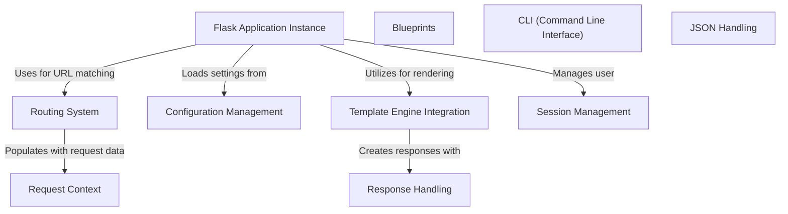

# Tutorial: 20250705_1300_code-flask

The Flask application (**Flask Application Instance**) handles incoming requests by using the **Routing System** to map URLs to specific functions.  These functions can then render templates using the **Template Engine Integration**, which in turn manages how responses are sent back to the client via **Response Handling**. Configuration is managed through **Configuration Management**.

**Source Repository:** [https://github.com/pallets/flask](https://github.com/pallets/flask)

## Abstraction Relationships

## Chapters

1. [Blueprints](01_blueprints.md)
2. [CLI (Command Line Interface)](02_cli-command-line-interface.md)
3. [Configuration Management](03_configuration-management.md)
4. [Flask Application Instance](04_flask-application-instance.md)
5. [JSON Handling](05_json-handling.md)
6. [Request Context](06_request-context.md)
7. [Response Handling](07_response-handling.md)
8. [Routing System](08_routing-system.md)
9. [Session Management](09_session-management.md)
10. [Template Engine Integration](10_template-engine-integration.md)
11. [Architecture Diagrams](11_diagrams.md)
12. [Code Inventory](12_code_inventory.md)
13. [Project Review](13_project_review.md)

---

*Generated by [SourceLens AI](https://github.com/openXFlow/sourceLensAI) using LLM: `gemini` (cloud) - model: `gemini-2.0-flash` | Language Profile: `Python`*