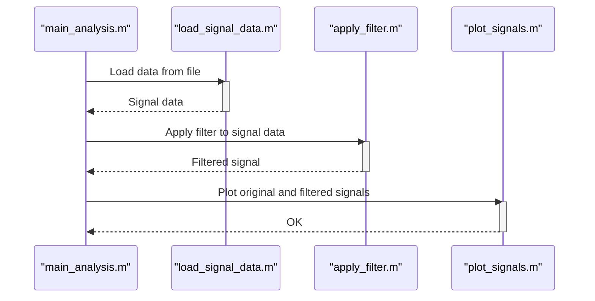

> Previously, we looked at [Data Loading](01_data-loading.md).

# Chapter 2: Functional Programming Approach
Let's begin exploring this concept. This chapter will demonstrate how to implement a signal processing pipeline using a functional programming style in MATLAB. We'll break down the processing steps into distinct functions, each responsible for a specific task.
**Motivation/Purpose**
The functional programming approach offers several benefits. Imagine building a complex machine from individual, well-defined components, each with a clear input and output. Functional programming is similar; it promotes code clarity, modularity, and testability by isolating functionality into reusable functions. This simplifies debugging and maintenance because each function's behavior is easily understood and verified. This contrasts with more monolithic or entangled code structures, where identifying the source of an issue can be much more difficult.
**Key Concepts Breakdown**
In the context of our signal processing project, the functional approach means that data transformation happens within functions. Each function receives input, performs a transformation, and returns output, ideally without modifying any external state (avoiding side effects). This paradigm ensures that the result of a function depends only on its input arguments, making it easier to reason about and predict its behavior.
**Usage / How it Works**
In our example, we define functions for loading data (`load_signal_data.m`), applying a filter (`apply_filter.m`), and plotting the results (`plot_signals.m`). The `main_analysis.m` script orchestrates the flow by calling these functions in a specific order.
**Code Examples (Short & Essential):**
The core functions are:
-   `load_signal_data(filename)`: Loads signal data from a `.mat` file.
-   `apply_filter(signal, window_size)`: Applies a moving average filter to the signal.
-   `plot_signals(t, original_signal, filtered_signal, plot_title)`: Visualizes the original and filtered signals.
**Inline Diagrams (Optional):**
Here's a simple sequence diagram illustrating the flow of data and function calls in the functional approach:

This diagram shows how `main_analysis.m` interacts with the other functions sequentially to load, filter, and plot the signal data.
**Relationships & Cross-Linking**
This functional approach contrasts with the [Object-Oriented Programming Approach](06_object-oriented-programming-approach.md) which will be discussed later. The functional approach builds on the data loading techniques introduced in [Data Loading](01_data-loading.md), uses the signal filtering methods described in [Signal Filtering](02_signal-filtering.md) and [Moving Average Filter](03_moving-average-filter.md), and relies on the visualization techniques from [Signal Visualization](04_signal-visualization.md).
**Conclusion**
The functional programming approach provides a structured and modular way to implement signal processing pipelines. By encapsulating specific tasks within functions, we achieve better code organization, testability, and maintainability. This concludes our look at this topic.

> Next, we will examine [Main Analysis Workflow](03_main-analysis-workflow.md).

---

*Generated by [SourceLens AI](https://github.com/openXFlow/sourceLensAI) using LLM: `gemini` (cloud) - model: `gemini-2.0-flash` | Language Profile: `Python`*