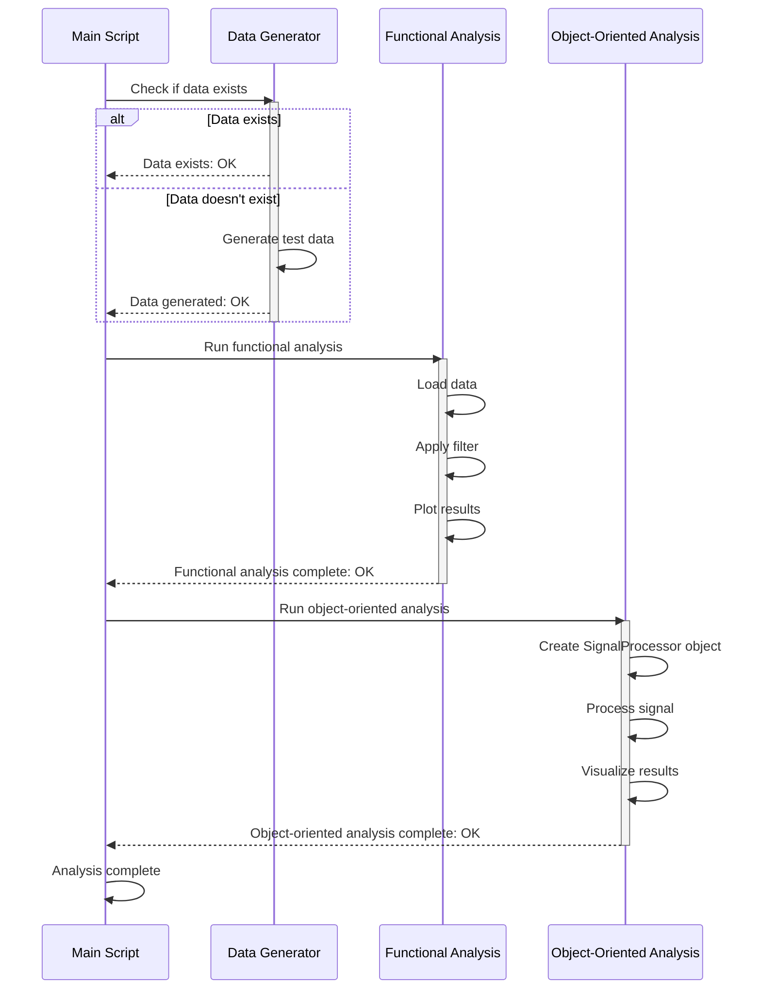

> Previously, we looked at [Functional Programming Approach](02_functional-programming-approach.md).

# Chapter 3: Main Analysis Workflow
Let's begin exploring this concept. This chapter delves into the heart of our project: the main analysis workflow. It's the conductor of the orchestra, coordinating all the individual pieces – data loading, filtering, and visualization – into a cohesive and meaningful signal processing operation.
**Why This Workflow?**
Imagine you're building a house. You wouldn't just randomly start laying bricks or hammering nails. You'd have a plan, a blueprint, that outlines the steps needed to complete the construction. The main analysis workflow is our blueprint for processing signals. It provides structure, ensuring that we consistently apply the correct operations in the correct order, leading to reliable and reproducible results. Without it, we'd be swimming in a sea of data, unsure of where to begin or how to extract valuable insights.
**Key Concepts**
The main analysis workflow orchestrates several key steps, already described in previous chapters:
1.  **Data Loading:** Retrieving the signal data from a source (e.g., a file). Covered in [Data Loading](01_data-loading.md).
2.  **Signal Filtering:** Reducing noise or isolating specific frequencies within the signal. Refer to [Signal Filtering](02_signal-filtering.md) and [Moving Average Filter](03_moving-average-filter.md).
3.  **Signal Visualization:** Presenting the signal data in a graphical format for easy interpretation. See [Signal Visualization](04_signal-visualization.md).
The `main_analysis.m` script demonstrates two approaches to implementing this workflow:
*   **Functional Programming:** A style that emphasizes using functions to transform data. Each step is a function that takes data as input and produces transformed data as output. Details in [Functional Programming Approach](05_functional-programming-approach.md).
*   **Object-Oriented Programming (OOP):** A style that organizes code into reusable "objects" containing data (attributes) and functions (methods) that operate on that data. See [Object-Oriented Programming Approach](06_object-oriented-programming-approach.md) and [SignalProcessor Class](07_signalprocessor-class.md).
**How it Works**
The `main_analysis.m` script acts as the central control point. It first initializes the environment by clearing existing variables and adding necessary paths. Then, it checks for the existence of the test data file. If the data doesn't exist, it generates it using the `generate_test_data` function. Finally, it executes both the functional and object-oriented approaches to signal processing, demonstrating two different ways to structure the same analysis.
Here is a sequence diagram that illustrates the high-level steps in the `main_analysis.m` script:

This diagram illustrates the flow of control, showing how the `main_analysis.m` script interacts with other components to perform the analysis.
**Code Example**
The core of the workflow lies in how `main_analysis.m` orchestrates the function calls or object method invocations. Here's a simplified view (in Python-like pseudocode, given the MATLAB nature of the project):
```python
# -- Python-like pseudocode representation of main_analysis.m --
# (MATLAB code is provided at the beginning of this chapter)
# 1. Initialization (equivalent MATLAB code handles this)
# ...
# 2. Data Generation (equivalent MATLAB code handles this)
# ...
# 3. Functional Approach
print("Running Functional Analysis")
signal_data = load_signal_data("test_signal.mat") # MATLAB's load_signal_data
filtered_signal = apply_filter(signal_data["noisy_signal"], 20) # MATLAB's apply_filter
plot_signals(signal_data["t"], signal_data["noisy_signal"], filtered_signal, "Functional Approach") # MATLAB's plot_signals
# 4. Object-Oriented Approach
print("Running Object-Oriented Analysis")
processor = SignalProcessor(signal_data["t"], signal_data["noisy_signal"]) # MATLAB's SignalProcessor
processor.process(20) # MATLAB's SignalProcessor.process()
processor.visualize() # MATLAB's SignalProcessor.visualize()
print("Analysis complete.")
```
This pseudocode highlights the key steps: loading data, applying the filter, and visualizing the result, both in the functional and object-oriented paradigms.
**Benefits of a Structured Workflow**
Having a well-defined workflow offers several advantages:
*   **Reproducibility:** Ensures that the analysis can be repeated with consistent results.
*   **Maintainability:** Makes the code easier to understand and modify.
*   **Scalability:** Provides a foundation for adding more complex processing steps in the future.
*   **Collaboration:** Facilitates teamwork by providing a clear and consistent structure.
This concludes our look at this topic.

> Next, we will examine [Moving Average Filter](04_moving-average-filter.md).


---

*Generated by [SourceLens AI](https://github.com/openXFlow/sourceLensAI) using LLM: `gemini` (cloud) - model: `gemini-2.0-flash` | Language Profile: `Python`*