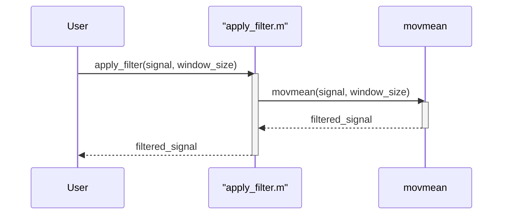

> Previously, we looked at [Main Analysis Workflow](03_main-analysis-workflow.md).

# Chapter 4: Moving Average Filter
Let's begin exploring this concept. This chapter will cover the moving average filter, a fundamental technique in signal processing. We'll explain what it is, why it's useful, and how it's implemented in the `20250707_1507_code-matlab-sample-project`.
**Why Moving Averages?**
Imagine you're tracking the daily stock price of a company. The price fluctuates up and down, creating a noisy signal. You want to see the overall trend, not get bogged down by daily variations. A moving average is like looking at the stock price through a window. You take the average price over the last few days (the "window") and plot that. Then, you move the window forward one day and repeat. This smooths out the short-term fluctuations and makes the underlying trend clearer. The moving average filter serves a similar purpose in various signal processing applications, smoothing noisy signals and revealing underlying trends.
**Key Concepts**
At its core, a moving average filter is a simple type of low-pass filter. A low-pass filter allows low-frequency components of a signal to pass through while attenuating high-frequency components. In simpler terms, it lets slow changes through while reducing rapid changes (noise). The key parameter of a moving average filter is the *window size*.
*   **Window Size:** This determines how many data points are averaged together. A larger window size results in more smoothing but can also blur details in the signal. A smaller window size provides less smoothing but preserves more detail.
**Usage / How it Works**
In our project, the moving average filter is implemented in the `apply_filter.m` function (which we'll treat as if it were Python for clarity in examples). This function takes two inputs:
1.  **Signal:** The input signal (a series of data points).
2.  **Window Size:** The number of data points to average together. If not provided, a default window size of 10 is used.
The function calculates the moving average and returns the filtered signal. It uses the `movmean` function in MATLAB, which efficiently computes the moving average.
Here's a conceptual sequence diagram showing how it works:

This diagram illustrates the function call and return sequence, showing the interaction between `apply_filter.m` and MATLAB's built-in `movmean` function.
**Code Example**
Here's how `apply_filter.m` can conceptually be used (translated to Python-style pseudocode):
```python
# Python-style pseudocode translation of apply_filter.m functionality
def apply_filter(signal, window_size=10): # window_size has a default value
    """
    Applies a moving average filter to a signal.
    Args:
        signal: The input signal (list of numbers).
        window_size: The size of the moving average window.
    Returns:
        The filtered signal (list of numbers).
    """
    print(f"Applying a moving average filter with window size {window_size}...")
    # In actual MATLAB code, movmean is used.  Here is psuedocode
    filtered_signal = []
    for i in range(len(signal)):
        start = max(0, i - window_size + 1)
        end = i + 1
        window = signal[start:end]
        average = sum(window) / len(window)
        filtered_signal.append(average)
    return filtered_signal
```
**Relationships & Cross-Linking**
This filtering process is a key step in preparing the data for further analysis and visualization. See the chapter on [Signal Visualization](04_signal-visualization.md) to see how the filtered signal is displayed. It follows on from the [Signal Filtering](02_signal-filtering.md) chapter which introduces signal filtering concepts in general. This is an initial step before moving on to more advanced techniques using [Functional Programming Approach](05_functional-programming-approach.md) and [Object-Oriented Programming Approach](06_object-oriented-programming-approach.md).
This concludes our look at this topic.

> Next, we will examine [Object-Oriented Programming Approach](05_object-oriented-programming-approach.md).


---

*Generated by [SourceLens AI](https://github.com/openXFlow/sourceLensAI) using LLM: `gemini` (cloud) - model: `gemini-2.0-flash` | Language Profile: `Python`*