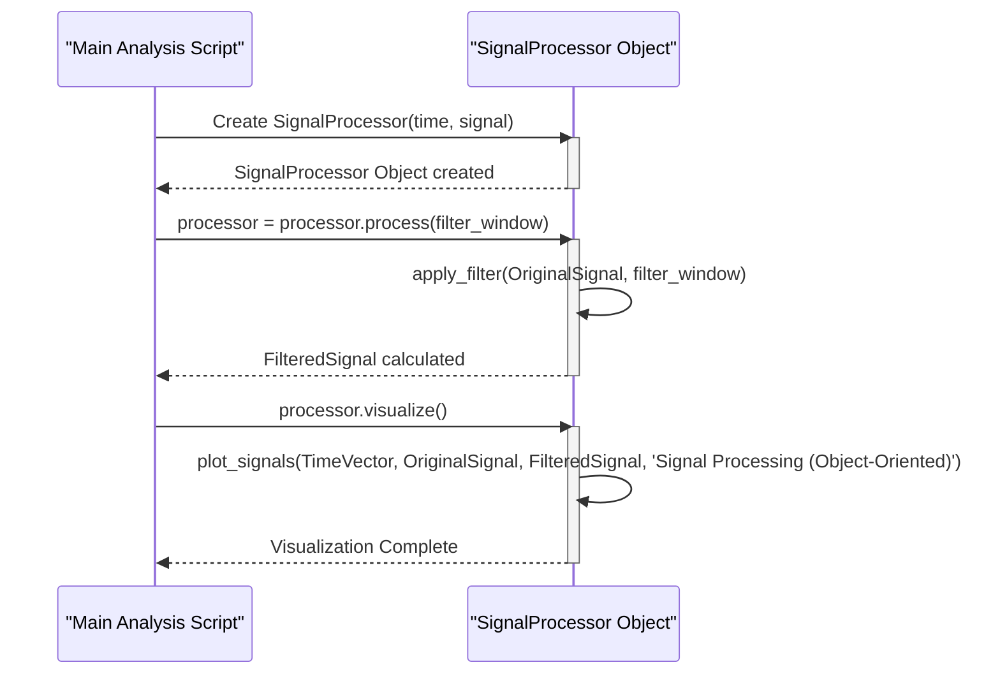

> Previously, we looked at [Moving Average Filter](04_moving-average-filter.md).

# Chapter 5: Object-Oriented Programming Approach
Let's begin exploring this concept. This chapter introduces the object-oriented programming (OOP) approach, demonstrating how it can be used to structure and manage signal processing tasks in a more organized and reusable way within the `20250707_1507_code-matlab-sample-project`.
**Why Object-Oriented Programming?**
Imagine you are building a house. You could simply pile up bricks and hope it stands. Or, you could create a blueprint, organize the materials, and hire specialists (plumbers, electricians, carpenters) each responsible for specific tasks. OOP is like creating that blueprint for your code. It allows you to bundle data (the signal itself) and the functions that operate on that data (filtering, visualization) into a single unit called an "object".
OOP offers several advantages:
*   **Modularity:** Break down complex problems into smaller, manageable objects.
*   **Reusability:** Create objects that can be used in different parts of your program or even in other projects.
*   **Encapsulation:** Hide the internal workings of an object and expose only the necessary interface, making code easier to understand and maintain. This means we don't need to worry about the *how* of the filter, only *that* it filters.
**Key Concepts**
*   **Class:** A blueprint or template for creating objects. In our case, the `SignalProcessor` class serves as a blueprint for creating signal processing objects.
*   **Object:** An instance of a class. Think of it as a specific house built from the blueprint.
*   **Properties:** The data associated with an object (e.g., the original signal, the filtered signal, the time vector). In MATLAB, these are defined within the `properties` block in the class definition.
*   **Methods:** The functions that an object can perform (e.g., filtering the signal, visualizing the signal). These are defined within the `methods` block in the class definition.
**How it Works in Our Project**
In this project, we use the `SignalProcessor` class to encapsulate signal processing functionalities. Instead of scattering functions throughout our code, we create a `SignalProcessor` object that holds the signal data and provides methods to process and visualize it.

The sequence diagram above shows the interactions between the `Main Analysis Script` and the `SignalProcessor` object. It illustrates how the script creates the object, calls its `process` method to apply the filter, and then calls its `visualize` method to display the results.
**Code Example: Creating and Using the SignalProcessor**
Here's a snippet (from `main_analysis.m`) demonstrating how the `SignalProcessor` is used:
```matlab
% Create an instance of the processor class
processor = SignalProcessor(signal_data.t, signal_data.noisy_signal);
% Process the signal using the object's method
processor = processor.process(filter_window);
% Visualize the results using the object's method
processor.visualize();
```
In this example, we first create an instance of the `SignalProcessor` class, passing in the time vector and the noisy signal. We then call the `process` method to apply the filter and the `visualize` method to display the results. This is a more organized approach compared to the [Functional Programming Approach](05_functional-programming-approach.md).
You can see the details of the `SignalProcessor` class in the [SignalProcessor Class](07_signalprocessor-class.md) chapter.
This concludes our look at this topic.

> Next, we will examine [Signal Filtering](06_signal-filtering.md).


---

*Generated by [SourceLens AI](https://github.com/openXFlow/sourceLensAI) using LLM: `gemini` (cloud) - model: `gemini-2.0-flash` | Language Profile: `Python`*