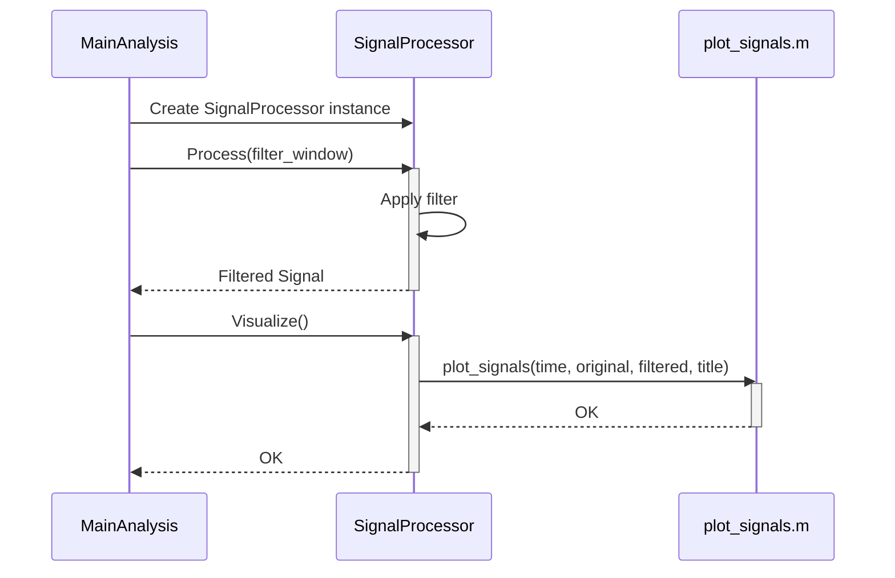

> Previously, we looked at [Signal Filtering](06_signal-filtering.md).

# Chapter 7: Signal Visualization
Let's begin exploring this concept. This chapter focuses on visualizing signals, both the original noisy signal and the filtered signal after processing. Visualizing the signals is crucial for understanding the effect of the filter on the data.
**Why Signal Visualization?**
Imagine you are trying to fix a blurry photograph. Applying a filter might reduce the blur, but how do you *know* if the filter is working correctly, or if it's making things worse? Signal visualization is like looking at the "before and after" photos. It allows us to:
*   **Verify the filter's effectiveness:** Did the filter actually reduce the noise, or did it also remove important details?
*   **Identify potential issues:** Is the filter introducing unwanted artifacts or distortions?
*   **Gain insights into signal characteristics:** Visual inspection can reveal patterns, trends, and anomalies that might be missed by numerical analysis alone.
Without visualization, we're essentially flying blind. We need a way to *see* what's happening to the signal.
**Key Concepts**
The core idea here is to create plots of the original and filtered signals and compare them visually.  We use the time axis as the X-axis and the amplitude of the signal as the Y-axis.  This provides a direct visual representation of how the signal changes over time.
**How it Works**
The general workflow involves:
1.  **Loading the signal data:** This includes the time vector and the original, noisy signal.  We've already covered this in [Data Loading](01_data-loading.md).
2.  **Applying the filter:** This step uses a filter (like the moving average filter we saw in [Moving Average Filter](03_moving-average-filter.md)) to smooth the signal. This has been previously covered in [Signal Filtering](02_signal-filtering.md).
3.  **Plotting the signals:** Using plotting functions (e.g., `plot_signals.m`), we generate a graph that displays both the original and filtered signals. This allows for a direct visual comparison.
**Code Example**
The `plot_signals.m` file provides a reusable function for generating these plots.
```python
--- File: plot_signals.m ---
% plot_signals.m
% A dedicated function for visualizing signals.
function plot_signals(t, original_signal, filtered_signal, plot_title)
    % PLOT_SIGNALS - Creates a plot of the original and filtered signals.
    %
    % Syntax: plot_signals(t, original_signal, filtered_signal, plot_title)
    %
    % Inputs:
    %    t               - Time vector.
    %    original_signal - The original, noisy signal.
    %    filtered_signal - The signal after filtering.
    %    plot_title      - The title for the plot.
    figure; % Create a new figure window
    hold on;
    plot(t, original_signal, 'b', 'DisplayName', 'Original Signal');
    plot(t, filtered_signal, 'r', 'LineWidth', 2, 'DisplayName', 'Filtered Signal');
    hold off;
    title(plot_title);
    xlabel('Time (s)');
    ylabel('Amplitude');
    legend show;
    grid on;
    fprintf('Signal plot generated: "%s"\n', plot_title);
end
% end of file: plot_signals.m
```
This function takes the time vector (`t`), the original signal (`original_signal`), the filtered signal (`filtered_signal`), and a plot title (`plot_title`) as inputs. It then creates a plot showing both signals on the same axes, allowing for a direct visual comparison.  The original signal is plotted in blue, and the filtered signal is plotted in red with a thicker line for emphasis.
**Functional vs. Object-Oriented Approaches**
As demonstrated in the `main_analysis.m` file, the signal visualization step is integrated into both the functional and object-oriented approaches.
*   **Functional Approach:** The `plot_signals` function is called directly after applying the filter.
*   **Object-Oriented Approach:** The `SignalProcessor` class encapsulates the plotting functionality within its `visualize` method. This keeps the plotting logic associated with the signal processing operations.

The above diagram illustrates how the `main_analysis.m` script interacts with `SignalProcessor` class and `plot_signals.m` function in the object-oriented approach. The `SignalProcessor` object encapsulates both the processing and visualization steps.
This concludes our look at this topic.

> Next, we will examine [SignalProcessor Class](08_signalprocessor-class.md).


---

*Generated by [SourceLens AI](https://github.com/openXFlow/sourceLensAI) using LLM: `gemini` (cloud) - model: `gemini-2.0-flash` | Language Profile: `Python`*