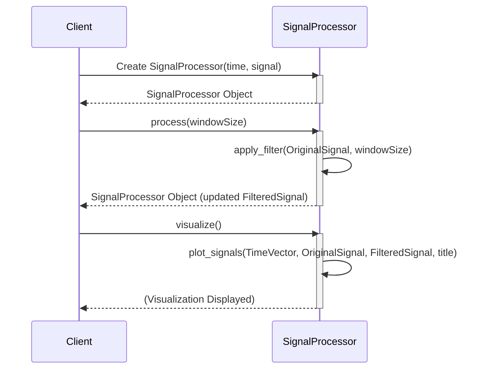

> Previously, we looked at [Signal Visualization](07_signal-visualization.md).

# Chapter 8: SignalProcessor Class
Let's begin exploring this concept. This chapter introduces the `SignalProcessor` class, a cornerstone of the object-oriented approach used in this project. We'll discuss its purpose, key components, and how it simplifies signal processing tasks.
**Motivation: Why a SignalProcessor Class?**
Imagine you're managing a complex project with numerous signal processing steps. Without a structured approach, you might end up with scattered functions and variables, making the code difficult to understand, maintain, and reuse. The `SignalProcessor` class solves this problem by encapsulating all signal processing functionalities into a single, manageable unit.
Think of it as a dedicated workstation for signal processing. Instead of having tools scattered across your lab, you have a single bench with all the necessary equipment neatly organized and readily available. The `SignalProcessor` class provides a similar level of organization and convenience for our signal processing tasks. It neatly bundles together the signal data (original and filtered), time vector, and methods for filtering and visualizing the signal. This promotes code reusability, readability, and maintainability.
**Key Concepts Breakdown:**
The `SignalProcessor` class consists of the following key components:
*   **Properties:** These are the data containers within the class.
    *   `OriginalSignal`: Stores the raw, unprocessed signal data.
    *   `FilteredSignal`: Stores the signal data after the filtering process.
    *   `TimeVector`: Stores the corresponding time values for the signal data.
*   **Methods:** These are the functions that operate on the data stored in the properties.
    *   `SignalProcessor(time, signal)` (Constructor): Initializes a new `SignalProcessor` object with the given time vector and original signal.
    *   `process(windowSize)`: Applies a moving average filter to the original signal using the specified window size.
    *   `visualize()`: Plots both the original and filtered signals.
**Usage / How it Works:**
The `SignalProcessor` class allows us to create objects that represent individual signals and their associated processing steps. Here's a high-level overview of how it works:
1.  **Instantiation:** Create a `SignalProcessor` object by passing the time vector and original signal to the constructor.
2.  **Processing:** Call the `process()` method, providing a `windowSize` for the moving average filter. This calculates the `FilteredSignal` and stores it within the object.
3.  **Visualization:** Call the `visualize()` method to generate a plot of the `OriginalSignal` and `FilteredSignal`.
**Code Examples:**
Here's the MATLAB code defining the `SignalProcessor` class:
```python
--- File: SignalProcessor.m ---
% SignalProcessor.m
% An example of a class definition (classdef) for object-oriented approach.
classdef SignalProcessor
    %SIGNALPROCESSOR A class to encapsulate signal processing operations.
    properties
        OriginalSignal
        FilteredSignal
        TimeVector
    end
    methods
        function obj = SignalProcessor(time, signal)
            %SIGNALPROCESSOR Construct an instance of this class
            %   Initializes the object with the time vector and original signal.
            if nargin > 0
                obj.TimeVector = time;
                obj.OriginalSignal = signal;
            end
        end
        function obj = process(obj, windowSize)
            %PROCESS Applies a filter to the signal stored in the object.
            fprintf('\n--- Processing via SignalProcessor object ---\n');
            obj.FilteredSignal = apply_filter(obj.OriginalSignal, windowSize);
        end
        function visualize(obj)
            %VISUALIZE Plots the signals stored in the object.
            if isempty(obj.FilteredSignal)
                error('Signal has not been processed yet. Call the process() method first.');
            end
            plot_signals(obj.TimeVector, obj.OriginalSignal, obj.FilteredSignal, 'Signal Processing (Object-Oriented)');
        end
    end
end
% end of file: SignalProcessor.m
```
**Illustrative Diagram**
The sequence diagram below shows how to interact with an instance of the `SignalProcessor` class:

This diagram illustrates the typical workflow: first, a `SignalProcessor` object is created. Then, the `process` method filters the signal, and finally, the `visualize` method plots the original and filtered signals.
**Relationships & Cross-Linking:**
This chapter builds upon the concepts introduced in [Object-Oriented Programming Approach](06_object-oriented-programming-approach.md). You can also see how this class is used in the [Main Analysis Workflow](08_main-analysis-workflow.md). The filtering mechanism employed here leverages the principles demonstrated in [Signal Filtering](02_signal-filtering.md) and [Moving Average Filter](03_moving-average-filter.md). The plotting functionality is described in greater detail in [Signal Visualization](04_signal-visualization.md).
**Conclusion:**
The `SignalProcessor` class provides a structured and reusable way to encapsulate signal processing operations. It promotes code organization and simplifies complex signal analysis tasks.
This concludes our look at this topic.

> Next, we will examine [Architecture Diagrams](09_diagrams.md).


---

*Generated by [SourceLens AI](https://github.com/openXFlow/sourceLensAI) using LLM: `gemini` (cloud) - model: `gemini-2.0-flash` | Language Profile: `Python`*