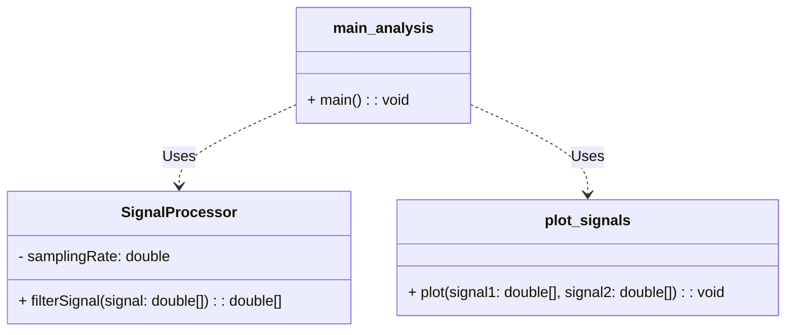
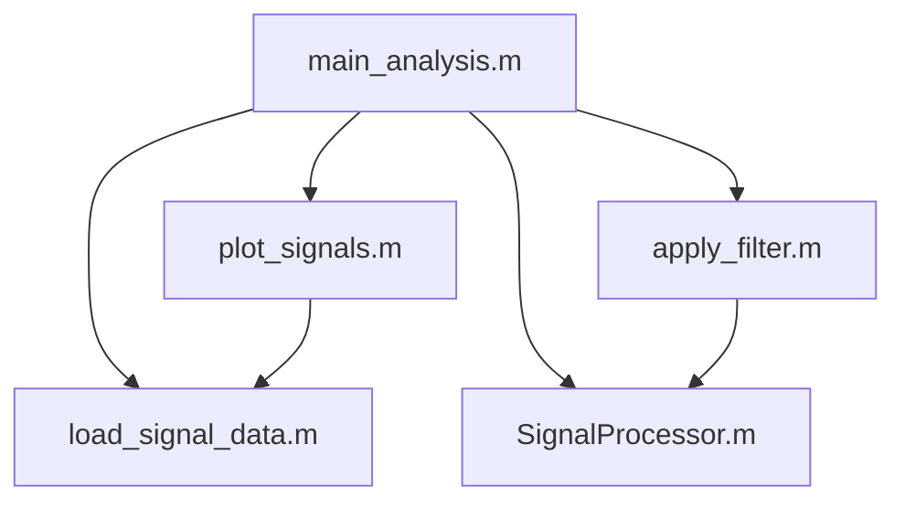
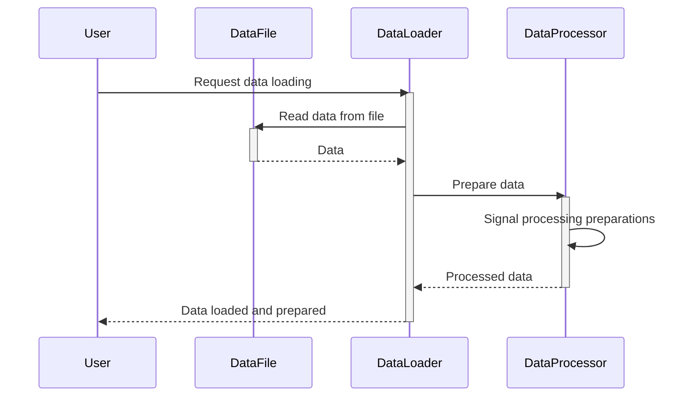
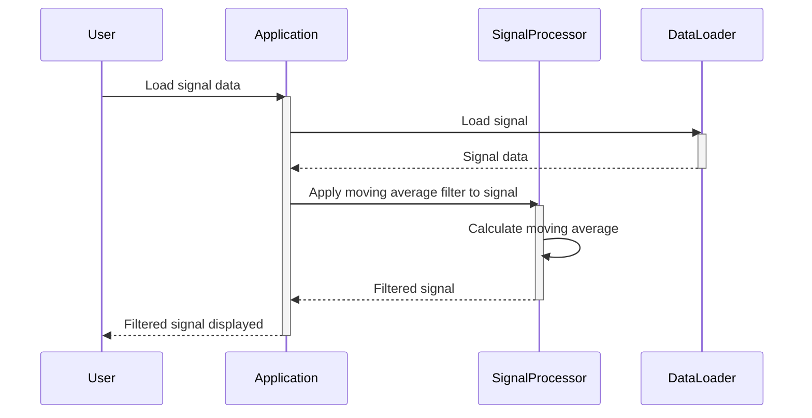
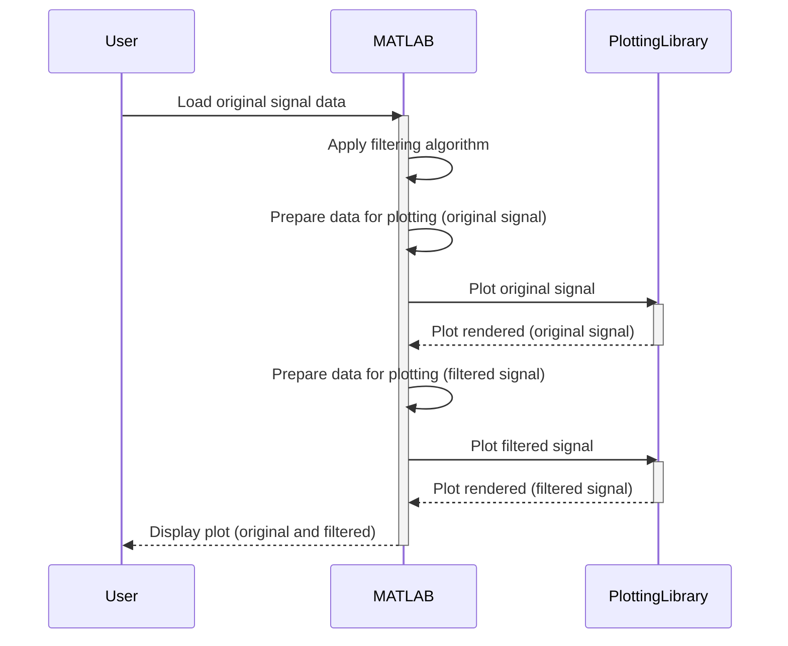
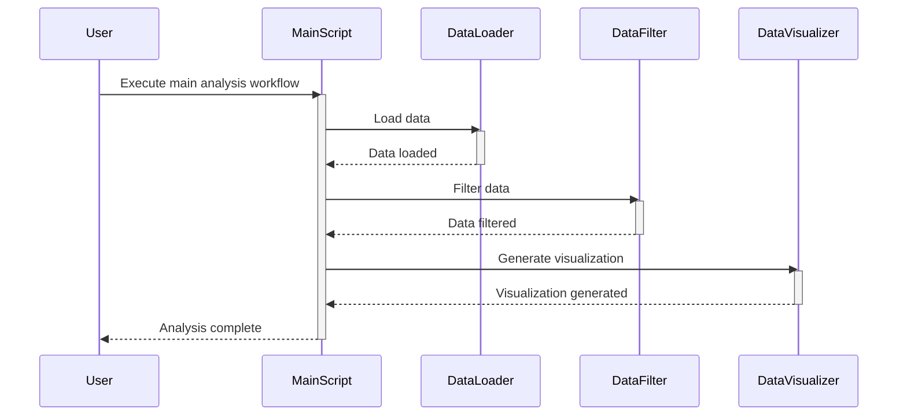
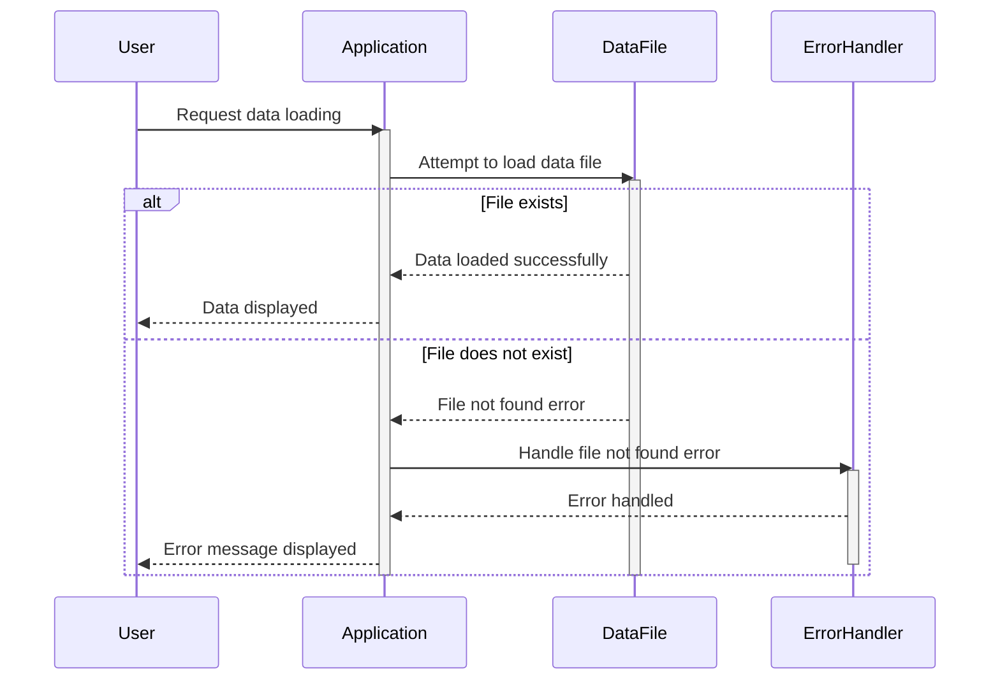

> Previously, we looked at [SignalProcessor Class](08_signalprocessor-class.md).

# Chapter 9: Architecture Diagrams
## Class Diagram
Key classes and their relationships in **20250707_1507_code-matlab-sample-project**.

## Package Dependencies
High-level module and package structure of **20250707_1507_code-matlab-sample-project**.

## Sequence Diagrams
These diagrams illustrate various interaction scenarios, showcasing operations between components for specific use cases.
### Loading data from a file and preparing it for signal processing.

### Applying a moving average filter to a loaded signal using the SignalProcessor class.

### Visualizing the original and filtered signals to compare their characteristics.

### Executing the main analysis workflow, encompassing data loading, filtering, and visualization.

### Handling an error during data loading when the specified file does not exist.

> Next, we will examine [Code Inventory](10_code_inventory.md).

---

*Generated by [SourceLens AI](https://github.com/openXFlow/sourceLensAI) using LLM: `gemini` (cloud) - model: `gemini-2.0-flash` | Language Profile: `Python`*