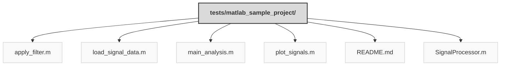

> Previously, we looked at [Architecture Diagrams](09_diagrams.md).

# Chapter 10: Code Inventory
## File Structure

## File Descriptions Summary
*   **`apply_filter.m`**: % apply_filter.m
*   **`load_signal_data.m`**: % load_signal_data.m
*   **`main_analysis.m`**: % =========================================================================
*   **`plot_signals.m`**: % plot_signals.m
*   **`README.md`**: MATLAB Sample Project: Signal Processing
*   **`SignalProcessor.m`**: % SignalProcessor.m
---
## Detailed File Content
No detailed structural information could be generated for the files based on the selected parser.

> Next, we will examine [Project Review](11_project_review.md).

---

*Generated by [SourceLens AI](https://github.com/openXFlow/sourceLensAI) using LLM: `gemini` (cloud) - model: `gemini-2.0-flash` | Language Profile: `Python`*