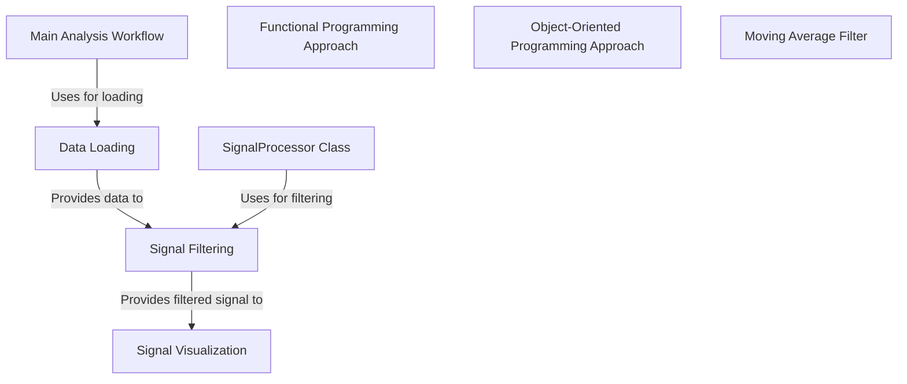

# Tutorial: 20250707_1507_code-matlab-sample-project

The project demonstrates signal processing using both functional and object-oriented approaches.  **Data Loading** retrieves data, which is then processed by *Signal Filtering*. The results of filtering are then displayed using **Signal Visualization**. The *Main Analysis Workflow* orchestrates these steps.

**Source Directory:** `C:\_jd_programming\python\11_sourceLens_project\sourceLens\tests\matlab_sample_project`

## Abstraction Relationships

## Chapters

1. [Data Loading](01_data-loading.md)
2. [Functional Programming Approach](02_functional-programming-approach.md)
3. [Main Analysis Workflow](03_main-analysis-workflow.md)
4. [Moving Average Filter](04_moving-average-filter.md)
5. [Object-Oriented Programming Approach](05_object-oriented-programming-approach.md)
6. [Signal Filtering](06_signal-filtering.md)
7. [Signal Visualization](07_signal-visualization.md)
8. [SignalProcessor Class](08_signalprocessor-class.md)
9. [Architecture Diagrams](09_diagrams.md)
10. [Code Inventory](10_code_inventory.md)
11. [Project Review](11_project_review.md)

---

*Generated by [SourceLens AI](https://github.com/openXFlow/sourceLensAI) using LLM: `gemini` (cloud) - model: `gemini-2.0-flash` | Language Profile: `Python`*