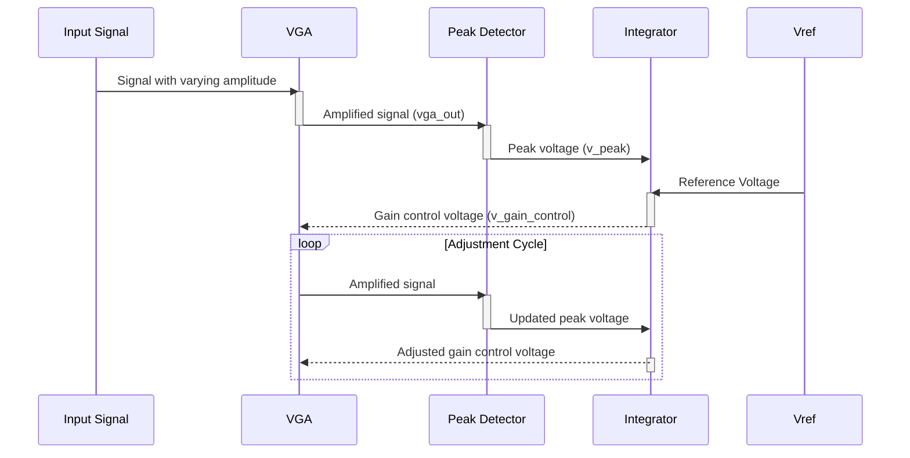

> Previously, we looked at the [Project Overview](index.md).

# Chapter 1: Automatic Gain Control (AGC) System
Let's begin exploring this concept. This chapter explains the Automatic Gain Control (AGC) system in our analog design project. We'll cover its purpose, how it works, and how the various components work together to achieve its goal.
**Why AGC? The Need for Control**
Imagine you're listening to the radio. Sometimes the signal is strong, and sometimes it's weak. Without AGC, a weak signal would be barely audible, while a strong signal could be deafening. An AGC system automatically adjusts the volume (gain) so that the sound level remains consistent, regardless of the input signal strength. In other words, the primary goal of the AGC system is to maintain a constant output amplitude even when the input amplitude varies. This is essential in many applications like audio processing, communication systems, and data acquisition where signal strength can fluctuate significantly.
**Key Components Working Together**
Our AGC system consists of three main building blocks, which we've already covered in previous chapters:
1.  **Variable Gain Amplifier (VGA):** [Variable Gain Amplifier (VGA)](05_variable-gain-amplifier-vga.md) - This amplifier's gain can be adjusted based on a control voltage.
2.  **Peak Detector:** [Peak Detector](06_peak-detector.md) - This circuit measures the peak voltage of the VGA's output.
3.  **Feedback Loop (Integrator):** [Feedback Loop (Integrator)](07_feedback-loop-integrator.md) - This compares the detected peak voltage to a reference voltage and generates the control voltage for the VGA, closing the loop.
**How the AGC System Works**
1.  **Input Signal:** The AGC receives an input signal whose amplitude may vary over time.
2.  **Variable Gain Amplifier:** The input signal is fed into the VGA. The VGA's gain is controlled by the control voltage generated by the feedback loop.
3.  **Peak Detection:** The output of the VGA is fed into the peak detector. The peak detector outputs a DC voltage that represents the peak amplitude of the VGA's output signal.
4.  **Feedback and Control:** The peak detector's output is compared to a reference voltage (Vref). The difference between the peak voltage and the reference voltage represents the error in the output amplitude.  This error signal is then integrated by the feedback loop (integrator). The integrator's output is the control voltage that adjusts the VGA's gain.
5.  **Automatic Adjustment:** If the output peak is lower than the reference voltage, the integrator increases the gain of the VGA. If the output peak is higher than the reference voltage, the integrator decreases the gain of the VGA. This feedback loop constantly adjusts the gain to keep the output amplitude close to the desired reference voltage.

This sequence diagram illustrates how the AGC system's components interact to maintain a constant output amplitude. The Integrator continuously adjusts the VGA's gain based on the difference between the detected peak and the reference voltage.
**Code Example: SPICE Netlist Snippets**
The following snippets from `agc_system.sp` highlight the key connections and parameter settings:
```python
--- File: agc_system.sp ---
* Automatic Gain Control (AGC) System
* Input Signal: Starts at 0.1V amplitude, steps up to 0.5V at 10ms
* PULSE(V1 V2 TD TR TF PW PER)
Vin in 0 PULSE(0 0.1V 0 1us 1us 10ms 20ms) SIN(0 1V 10kHz)
* 1. Variable Gain Amplifier (VGA) Stage
* Inputs: in, v_gain_control | Output: vga_out
X_VGA in vga_out v_gain_control vga_stage
* 2. Peak Detector Stage
* Measures the peak of the VGA output to create a DC control signal
* Input: vga_out | Output: v_peak
X_PEAK_DET vga_out v_peak peak_detector_circuit
* 3. Feedback Loop (Integrator)
* Compares the detected peak with a reference voltage (Vref) and integrates
* the error to generate the final gain control signal.
Vref v_ref 0 1.0V  ; Target output peak is 1.0V
R_int v_peak 10 10k
C_int 10 v_gain_control 1uF
* Ideal op-amp as an integrator
X_INT 0 10 v_gain_control opamp_ideal_for_int
```
In this SPICE netlist:
*   `Vin` defines the input signal, which has a changing amplitude.
*   `X_VGA` instantiates the variable gain amplifier.
*   `X_PEAK_DET` instantiates the peak detector.
*   `Vref` sets the target output peak voltage (1.0V).
*   `R_int` and `C_int` are the components of the integrator.
*   `X_INT` represents the ideal op-amp used as an integrator.
The transient analysis defined in `analysis/transient_analysis.inc` allows us to see how the AGC system responds to the varying input signal over time.
**Conclusion**
The Automatic Gain Control (AGC) system is a powerful example of a feedback control system. By continuously monitoring the output amplitude and adjusting the gain accordingly, it maintains a stable output despite variations in the input signal. The building blocks of this system – the variable gain amplifier, the peak detector, and the feedback loop – each play a critical role in achieving this functionality. This concludes our look at this topic.

> Next, we will examine [Feedback Loop (Integrator)](02_feedback-loop-integrator.md).


---

*Generated by [SourceLens AI](https://github.com/openXFlow/sourceLensAI) using LLM: `gemini` (cloud) - model: `gemini-2.0-flash` | Language Profile: `Python`*