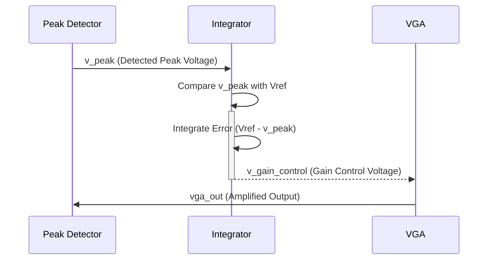

> Previously, we looked at [Automatic Gain Control (AGC) System](01_automatic-gain-control-agc-system.md).

# Chapter 2: Feedback Loop (Integrator)
Let's begin exploring this concept. This chapter will detail the role and functionality of the feedback loop, specifically the integrator component, within our Automatic Gain Control (AGC) system.
### Why an Integrator?
Imagine you're trying to maintain a constant water level in a tank. You have a sensor that tells you the current water level and a valve to adjust the water flow. If the water level is too low, you open the valve. If it's too high, you close it. A simple on/off control might work, but it can lead to oscillations (the water level going too high, then too low, repeatedly).
An integrator acts like a "smooth operator" in this scenario. Instead of reacting instantaneously to the difference between the desired level and the actual level, it *accumulates* the error over time. This accumulated error then drives the valve adjustment. This smoother, integrated response helps to avoid oscillations and achieve a more stable water level (or in our case, a stable output voltage). In our AGC system, we want to avoid sudden, drastic changes in gain, as they can cause distortion and instability. The integrator ensures that the gain adjustments are gradual and controlled.
### Key Concepts: Integrator Components
Our integrator consists of a few key components working together, all implemented within the `agc_system.sp` SPICE netlist:
1.  **Reference Voltage (Vref):** This is the target peak voltage we want our VGA output to achieve. It's set to 1.0V in our design (`Vref v_ref 0 1.0V`).
2.  **Error Calculation:** The integrator calculates the difference between the detected peak voltage (`v_peak`) and the reference voltage (`v_ref`). This difference represents the error signal. While not explicitly a distinct component in the netlist, the error is calculated by the integrator circuit using `v_peak` as its input, and comparing against `v_ref` which internally sits inside the op-amp.
3.  **Integration Resistor (R_int):** The resistor `R_int v_peak 10 10k` combined with the capacitor performs the mathematical integration, smoothing out the signal and providing stability.
4.  **Integration Capacitor (C_int):** The capacitor `C_int 10 v_gain_control 1uF` in conjunction with the resistor `R_int`, forms the core of the integrator. It stores the charge representing the accumulated error signal.
5.  **Ideal Op-Amp (X_INT):** The op-amp `X_INT 0 10 v_gain_control opamp_ideal_for_int` amplifies and buffers the integrated error signal, providing the necessary voltage to control the VGA gain. The ideal op-amp provides a very high gain, which is characteristic of how an ideal integrator behaves.
### How it Works
The integrator works by continuously comparing the actual peak voltage (`v_peak`) with the desired reference voltage (`Vref`). Any difference between these voltages is fed into the RC circuit, which integrates it over time. The output of the integrator is then fed into the VGA's gain control input. The polarity is arranged such that if `v_peak` is *lower* than `Vref`, the integrator *increases* the VGA's gain, and vice-versa. This process continues until `v_peak` converges to `Vref`.

The sequence diagram illustrates how the peak detector sends the detected peak voltage to the integrator. The integrator then compares this voltage with the reference and generates a gain control voltage, which is used to adjust the VGA's gain. The VGA then outputs an amplified signal, which is fed back to the peak detector, completing the loop.
### Code Example
Here's the relevant portion of the SPICE netlist that defines the feedback loop and integrator:
```python
"""
* 3. Feedback Loop (Integrator)
* Compares the detected peak with a reference voltage (Vref) and integrates
* the error to generate the final gain control signal.
Vref v_ref 0 1.0V  ; Target output peak is 1.0V
R_int v_peak 10 10k
C_int 10 v_gain_control 1uF
* Ideal op-amp as an integrator
X_INT 0 10 v_gain_control opamp_ideal_for_int
* Subcircuit for the integrator's opamp
.SUBCKT opamp_ideal_for_int v_plus v_minus v_out
E_INT_GAIN v_out 0 v_plus v_minus 1e6
.ENDS opamp_ideal_for_int
"""
```
The code defines the components of the integrator: a voltage source for the reference voltage, a resistor and a capacitor for the integrating function and the ideal op-amp circuit definition. The op-amp subcircuit simply amplifies the difference between its inputs with a very high gain (1e6), which is a characteristic of ideal op-amps.
### Relationships to Other Chapters
This chapter builds upon the concepts introduced in [Peak Detector](06_peak-detector.md) chapter, as it takes the peak voltage detected by the peak detector as its input. It also directly impacts the [Variable Gain Amplifier (VGA)](05_variable-gain-amplifier-vga.md), as the integrator's output controls the VGA's gain. Understanding how these components interact is crucial for grasping the overall [Automatic Gain Control (AGC) System](08_automatic-gain-control-agc-system.md).
This concludes our look at this topic.

> Next, we will examine [Op-amp (Ideal)](03_op-amp-ideal.md).


---

*Generated by [SourceLens AI](https://github.com/openXFlow/sourceLensAI) using LLM: `gemini` (cloud) - model: `gemini-2.0-flash` | Language Profile: `Python`*