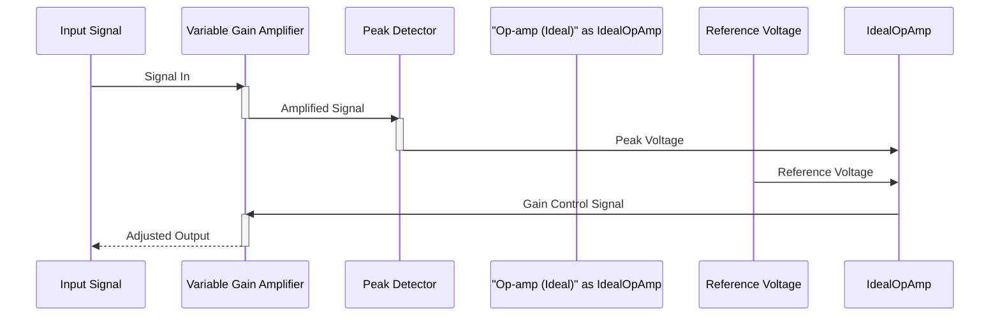

> Previously, we looked at [Feedback Loop (Integrator)](02_feedback-loop-integrator.md).

# Chapter 3: Op-amp (Ideal)
Let's begin exploring this concept. In this chapter, we'll discuss the "Op-amp (Ideal)" abstraction used within the `20250707_1627_code-analog-design-sample-project`, specifically its role in the integrator stage of the Automatic Gain Control (AGC) system.
**Motivation/Purpose:**
Imagine you're building a self-driving car. One crucial part is adjusting the sensitivity of the camera based on lighting conditions. Too dark, and you amplify the signal; too bright, and you dim it down. This is similar to what our AGC system does with an audio signal. The op-amp in the integrator is like the brain of that camera system, making tiny adjustments to maintain a stable output signal. We use an *ideal* op-amp model here as a starting point for simplicity and to focus on the core feedback loop behavior. An ideal op-amp helps abstract away some of the complexities of real-world op-amps, such as limited bandwidth and offset voltages, allowing us to concentrate on the fundamental integration process.
**Key Concepts Breakdown:**
The "Op-amp (Ideal)" abstraction represents a simplified operational amplifier. The critical properties of an ideal op-amp are:
*   **Infinite Input Impedance:** No current flows into the input terminals.
*   **Zero Output Impedance:** It can drive any load without voltage drop.
*   **Infinite Open-Loop Gain:** A tiny voltage difference between the inputs results in a massive output voltage. In practice, it is a very large gain.
In our context, it functions as a core part of the integrator circuit. The integrator smooths the error signal and provides the gain control voltage.
**Usage / How it Works:**
In our AGC system, the ideal op-amp is configured as an integrator in the feedback loop. It receives the difference between a reference voltage and the peak detected voltage of the output signal. This difference is the error signal. The op-amp integrates this error over time, and its output then adjusts the gain of the variable gain amplifier (VGA). The aim is to keep the output signal at a constant level by continuously correcting for any variations in the input signal amplitude.
Here’s a simplified view of how it fits within the larger AGC system:

The diagram shows the signal flow: The input signal is fed into the VGA, its output is measured by the peak detector, and the difference between that peak and the reference voltage (Vref) is integrated by the ideal op-amp. The op-amp's output controls the gain of the VGA, closing the feedback loop.
**Code Examples (Short & Essential):**
Here's the SPICE subcircuit definition for our ideal op-amp:
```python
--- File: agc_system.sp ---
* Subcircuit for the integrator's opamp
.SUBCKT opamp_ideal_for_int v_plus v_minus v_out
E_INT_GAIN v_out 0 v_plus v_minus 1e6
.ENDS opamp_ideal_for_int
```
This subcircuit uses a voltage-controlled voltage source (`E_INT_GAIN`). It takes two inputs (`v_plus`, `v_minus`) representing the non-inverting and inverting inputs of the op-amp, respectively. The output voltage (`v_out`) is simply a very large gain (1e6) multiplied by the voltage difference between the inputs. This implements the "infinite" gain of the ideal op-amp.
**Relationships & Cross-Linking:**
This ideal op-amp model is used in the [Feedback Loop (Integrator)](07_feedback-loop-integrator.md) stage. It receives its input from the [Peak Detector](06_peak-detector.md) and controls the [Variable Gain Amplifier (VGA)](05_variable-gain-amplifier-vga.md). The overall behavior is analyzed using [Transient Analysis](03_transient-analysis.md).
**Tone & Style:**
Remember, the "Op-amp (Ideal)" is an *abstraction*. It simplifies the real behavior of an operational amplifier. By using this idealization, we can focus on understanding the bigger picture: how the integrator, and subsequently the entire AGC system, operates.
This concludes our look at this topic.

> Next, we will examine [Peak Detector](04_peak-detector.md).


---

*Generated by [SourceLens AI](https://github.com/openXFlow/sourceLensAI) using LLM: `gemini` (cloud) - model: `gemini-2.0-flash` | Language Profile: `Python`*