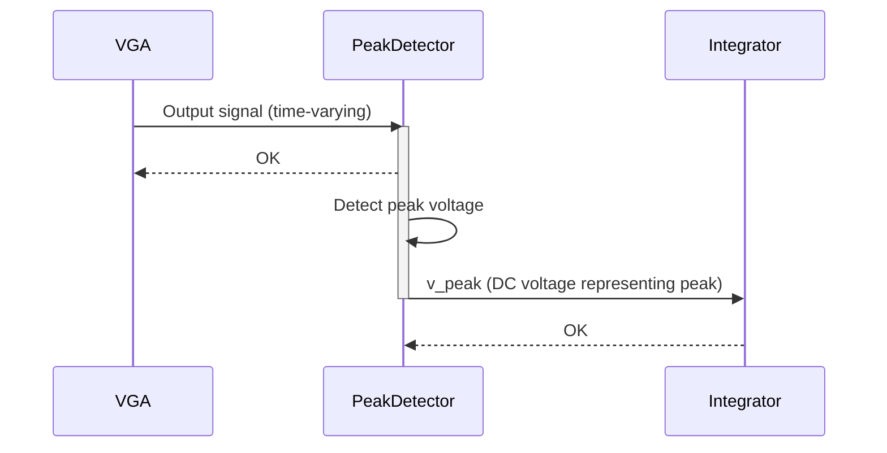

> Previously, we looked at [Op-amp (Ideal)](03_op-amp-ideal.md).

# Chapter 4: Peak Detector
Let's begin exploring this concept. This chapter focuses on the Peak Detector, a crucial component in our Automatic Gain Control (AGC) system. Its primary role is to measure the peak voltage of the Variable Gain Amplifier's (VGA) output signal.
**Why a Peak Detector?**
Imagine you're trying to maintain a consistent volume on your radio, even when the signal strength from the station varies. The peak detector is like the "volume meter" in that system. It tells us the *maximum* level the VGA's output is reaching. This information is vital for our AGC, which needs to know how strong the signal *actually* is so it can adjust the gain appropriately. Without a peak detector, the AGC would be blind to signal variations and unable to maintain a stable output. It effectively converts a time-varying signal (the VGA output) into a DC voltage representing the peak value. This DC voltage then becomes the feedback signal.
**Key Concepts:**
The peak detector in our circuit is implemented as a subcircuit called `peak_detector_circuit`. The core idea involves a diode and a capacitor. The diode allows current to flow and charge the capacitor when the input voltage (from the VGA) is higher than the voltage stored on the capacitor. The capacitor then holds this peak voltage. In a real-world implementation, a resistor is added to slowly discharge the capacitor. In our simulated model, we are using an ideal peak detector model, which prevents this leakage, for demonstration purposes.
**How it Works:**
1.  **Input Signal:** The peak detector receives the output signal from the [Variable Gain Amplifier (VGA)](05_variable-gain-amplifier-vga.md).
2.  **Peak Detection:** The internal circuit (a simplified diode-capacitor combination) tracks the peak voltage of the input signal. The capacitor charges to hold the peak voltage.
3.  **Output Voltage:** The output of the peak detector is a DC voltage (`v_peak`) that represents the measured peak voltage.
**Code Example:**
Here's how the peak detector is instantiated in the main SPICE netlist (`agc_system.sp`):
```python
--- File: agc_system.sp ---
...
* 2. Peak Detector Stage
* Measures the peak of the VGA output to create a DC control signal
* Input: vga_out | Output: v_peak
X_PEAK_DET vga_out v_peak peak_detector_circuit
...
```
This line creates an instance named `X_PEAK_DET` of the subcircuit `peak_detector_circuit`. The `vga_out` net is connected to the input of the peak detector, and the output (the detected peak voltage) is available on the `v_peak` net.
**Relationship to the Feedback Loop:**
The `v_peak` signal is then fed into the [Feedback Loop (Integrator)](07_feedback-loop-integrator.md), where it's compared to a reference voltage. The difference between the detected peak and the reference is integrated to generate the gain control signal for the VGA. This closes the loop and creates the automatic gain control functionality.
**Simple Illustration of Peak Detection Process:**

The sequence diagram illustrates the flow. The VGA sends its output to the Peak Detector, which detects the peak and outputs a DC voltage (v_peak) to the Integrator.
This concludes our look at this topic.

> Next, we will examine [SPICE Netlist](05_spice-netlist.md).


---

*Generated by [SourceLens AI](https://github.com/openXFlow/sourceLensAI) using LLM: `gemini` (cloud) - model: `gemini-2.0-flash` | Language Profile: `Python`*