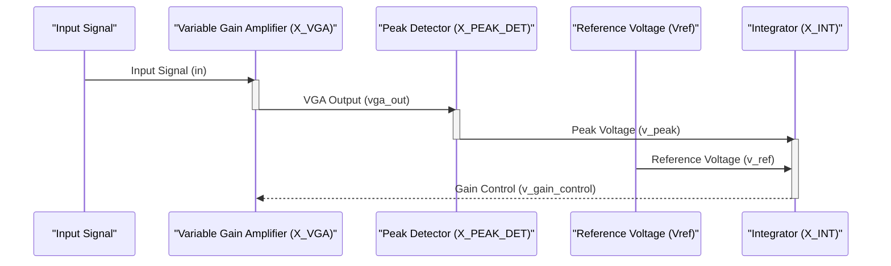

> Previously, we looked at [Peak Detector](04_peak-detector.md).

# Chapter 5: SPICE Netlist
Let's begin exploring this concept. This chapter will explain the structure and purpose of the SPICE netlist (`agc_system.sp`) within the `20250707_1627_code-analog-design-sample-project`. This file is the heart of our circuit simulation; it describes all the components, their connections, and the simulation settings.
Think of the SPICE netlist as the blueprint for our electronic circuit. Just like a building blueprint shows the layout of rooms, the placement of walls, and the connections between different systems (electrical, plumbing), the SPICE netlist describes the components in our circuit (resistors, capacitors, op-amps), how they are connected, and how we want to simulate the circuit's behavior. Without a clear blueprint, building a functional structure would be impossible. Similarly, without a well-defined SPICE netlist, simulating our analog circuit is simply not possible.
The `agc_system.sp` file serves a few key purposes:
*   **Circuit Definition:** It specifies all the components used in the Automatic Gain Control (AGC) system.
*   **Connectivity:** It defines how these components are interconnected. For example, which node of a resistor is connected to which node of an op-amp.
*   **Simulation Control:** It includes instructions for the simulation, such as the type of analysis (transient, DC), simulation time, and step size.
*   **Modularity:** The `agc_system.sp` file utilizes `.INCLUDE` statements to incorporate subcircuits and models defined in separate `.lib` files, promoting modularity and reusability. Think of this like importing libraries in Python; you define reusable components once, and then include them wherever needed.
Here's a breakdown of the key sections within `agc_system.sp`:
1.  **Includes:** The `.INCLUDE` directives tell the simulator to read and incorporate the contents of other files. This is how we include models for our op-amps, peak detectors, and any other custom components. These included files often define *subcircuits* which are like functions/methods in traditional programming - they encapsulate a block of functionality.
2.  **Main Circuit:** This section defines the top-level connections between the various components of the AGC system. It specifies the input signal and how the different stages (Variable Gain Amplifier, Peak Detector, Feedback Loop) are connected together.
3.  **Component Instantiation:** Components are instantiated using the `X_` prefix followed by a unique name for the instance. For example, `X_VGA` represents an instance of the `vga_stage` subcircuit. The node connections are listed after the instance name.
4.  **Power Supplies & Control Voltages:** Voltage sources like `Vref` are defined to provide power or control signals to the circuit.
5.  **Analysis:** The `.INCLUDE analysis/transient_analysis.inc` and `.INCLUDE analysis/dc_analysis.inc` directives include files that specify the type of simulation to perform. This includes things like the duration of the transient analysis and the range of DC voltages to sweep.
Let's look at a snippet from the `agc_system.sp` file to illustrate these concepts:
```python
--- File: agc_system.sp ---
* Automatic Gain Control (AGC) System
.INCLUDE models/opamp_gain_stage.lib
.INCLUDE models/peak_detector.lib
* --- Main Circuit ---
* Input Signal: Starts at 0.1V amplitude, steps up to 0.5V at 10ms
* PULSE(V1 V2 TD TR TF PW PER)
Vin in 0 PULSE(0 0.1V 0 1us 1us 10ms 20ms) SIN(0 1V 10kHz)
* 1. Variable Gain Amplifier (VGA) Stage
* Inputs: in, v_gain_control | Output: vga_out
X_VGA in vga_out v_gain_control vga_stage
* 2. Peak Detector Stage
* Measures the peak of the VGA output to create a DC control signal
* Input: vga_out | Output: v_peak
X_PEAK_DET vga_out v_peak peak_detector_circuit
* 3. Feedback Loop (Integrator)
* Compares the detected peak with a reference voltage (Vref) and integrates
* the error to generate the final gain control signal.
Vref v_ref 0 1.0V  ; Target output peak is 1.0V
R_int v_peak 10 10k
C_int 10 v_gain_control 1uF
* Ideal op-amp as an integrator
X_INT 0 10 v_gain_control opamp_ideal_for_int
```
In this code:
*   `.INCLUDE models/opamp_gain_stage.lib` and `.INCLUDE models/peak_detector.lib` tells the simulator to use the models in those files.
*   `Vin in 0 PULSE(0 0.1V 0 1us 1us 10ms 20ms) SIN(0 1V 10kHz)` defines the input voltage source. It's a pulsed signal with a sine wave component.
*   `X_VGA in vga_out v_gain_control vga_stage` instantiates the Variable Gain Amplifier (VGA). The `vga_stage` part is the *name* of a subcircuit (defined in one of the included `.lib` files), and `in`, `vga_out`, and `v_gain_control` are the nodes to which the VGA is connected.
*   `Vref v_ref 0 1.0V` defines a DC voltage source named `Vref` with a value of 1.0V connected between nodes `v_ref` and `0` (ground).
The power of SPICE netlists lies in their ability to describe complex circuits in a hierarchical and modular manner. The `agc_system.sp` file brings together several key components, each potentially described in its own separate file, to create the overall AGC system. The code above instantiates instances of other subcircuits which are defined in the included `.lib` files. For example, the opamp used in the feedback loop:
```python
--- File: agc_system.sp ---
* Subcircuit for the integrator's opamp
.SUBCKT opamp_ideal_for_int v_plus v_minus v_out
E_INT_GAIN v_out 0 v_plus v_minus 1e6
.ENDS opamp_ideal_for_int
```
This defines a subcircuit called `opamp_ideal_for_int` which has three pins: `v_plus`, `v_minus`, and `v_out`. It then defines a voltage-controlled voltage source `E_INT_GAIN` whose output is between nodes `v_out` and `0` (ground). The value is `1e6` multiplied by the voltage difference between the `v_plus` and `v_minus` pins.
Here's a high-level illustration of how the main components interact, as defined in the netlist.

The sequence diagram shows the flow of signals through the main components of the AGC system. The input signal is fed into the VGA, which amplifies the signal based on the gain control voltage. The output of the VGA is then fed into the Peak Detector, which measures the peak voltage. This peak voltage is compared to a reference voltage by the Integrator, which generates the gain control voltage. This gain control voltage is then fed back to the VGA, closing the feedback loop and achieving automatic gain control.
As the project proceeds, we will delve deeper into each of these components, understanding how they work and how their respective SPICE models were written. You will then have a fuller understanding of the `agc_system.sp` netlist. This SPICE Netlist is critical for connecting the components together in [Automatic Gain Control (AGC) System](08_automatic-gain-control-agc-system.md). The analysis of the SPICE Netlist itself is described in [Transient Analysis](03_transient-analysis.md).
This concludes our look at this topic.

> Next, we will examine [Transient Analysis](06_transient-analysis.md).


---

*Generated by [SourceLens AI](https://github.com/openXFlow/sourceLensAI) using LLM: `gemini` (cloud) - model: `gemini-2.0-flash` | Language Profile: `Python`*