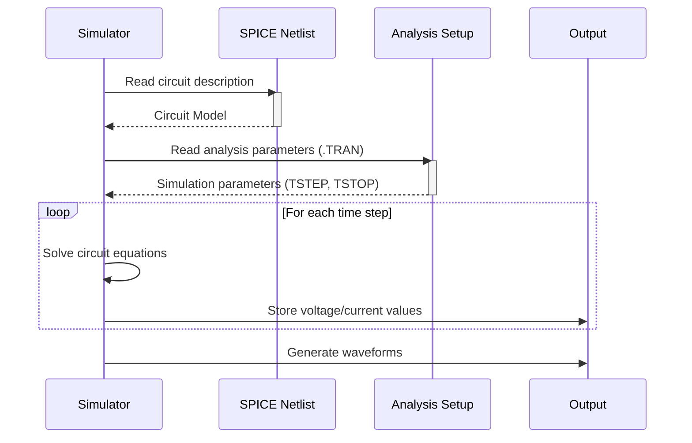

> Previously, we looked at [SPICE Netlist](05_spice-netlist.md).

# Chapter 6: Transient Analysis
Let's begin exploring this concept. This chapter will delve into Transient Analysis, a crucial simulation technique used to understand how our Automatic Gain Control (AGC) system behaves over time.
**Why Transient Analysis?**
Imagine you're testing a new car's suspension. You wouldn't just look at how it sits still; you'd want to see how it handles bumps, turns, and sudden stops. Similarly, in circuit design, we need to see how our circuits respond to changing inputs, especially in applications like the AGC, where the input signal is dynamic. Transient analysis is the tool that allows us to do this, showing us voltage and current changes over a specified time period. It's like taking a slow-motion video of your circuit in action.
**Key Concepts**
Transient analysis simulates the circuit's behavior as a function of time. The key parameters are:
*   **Start Time (TSTART):** The time at which the simulation begins (usually 0).
*   **Stop Time (TSTOP):** The total duration of the simulation.
*   **Step Time (TSTEP):** The time increment at which the simulator calculates the circuit's state. A smaller step time yields more accurate results but increases simulation time.
**How it Works**
In our AGC system, transient analysis helps us answer questions like:
*   How quickly does the AGC respond to a change in input signal amplitude?
*   Does the output amplitude settle to the desired level, and if so, how long does it take?
*   Are there any unwanted oscillations or instability in the AGC's response?
The simulator calculates the voltages and currents at each time step based on the circuit's components, connections (the netlist described in [SPICE Netlist](02_spice-netlist.md)), and the input signal. It then presents this data as waveforms, allowing us to visualize the circuit's dynamic behavior.
**Code Examples**
The following code snippet shows the transient analysis setup in our SPICE netlist:
```python
--- File: analysis/transient_analysis.inc ---
* Transient Analysis
* Run the simulation for 20ms to observe the AGC reaction.
* .TRAN TSTEP TSTOP
.TRAN 1us 20ms
.PROBE V(in) V(vga_out) V(v_peak) V(v_gain_control)
```
Here's a breakdown:
*   `.TRAN 1us 20ms`: This line tells the simulator to perform a transient analysis. The `TSTEP` is set to `1us` (1 microsecond), and the `TSTOP` is set to `20ms` (20 milliseconds). The simulation will run from 0ms to 20ms, calculating circuit values every 1us.
*   `.PROBE V(in) V(vga_out) V(v_peak) V(v_gain_control)`: This line specifies the voltages we want to observe during the simulation. In particular we will examine how the input voltage `V(in)`, the VGA output `V(vga_out)`, the output of the peak detector `V(v_peak)`, and the gain control voltage `V(v_gain_control)` behave. These probes are essential for understanding the AGC's operation.
**Visualizing the Simulation Process**
The following diagram shows a simplified sequence of events during a transient simulation.

In this sequence diagram, the simulator reads the SPICE netlist and analysis setup. The simulator then enters a loop, where for each time step it solves the circuit equations. At each time step, voltage and current values are stored, and finally the waveforms are generated.
**Relationships & Cross-Linking**
The transient analysis relies heavily on the circuit defined in the [SPICE Netlist](02_spice-netlist.md) and provides insights into the behavior of various components such as the [Variable Gain Amplifier (VGA)](05_variable-gain-amplifier-vga.md), [Peak Detector](06_peak-detector.md), and the entire [Automatic Gain Control (AGC) System](08_automatic-gain-control-agc-system.md).
**Conclusion**
Transient analysis is a powerful tool for understanding the dynamic behavior of circuits. By simulating the circuit over time, we can observe how it responds to varying inputs and identify potential issues such as instability or slow response times. This analysis is essential for verifying the performance of our AGC system and ensuring it meets our design requirements.
This concludes our look at this topic.

> Next, we will examine [Variable Gain Amplifier (VGA)](07_variable-gain-amplifier-vga.md).


---

*Generated by [SourceLens AI](https://github.com/openXFlow/sourceLensAI) using LLM: `gemini` (cloud) - model: `gemini-2.0-flash` | Language Profile: `Python`*