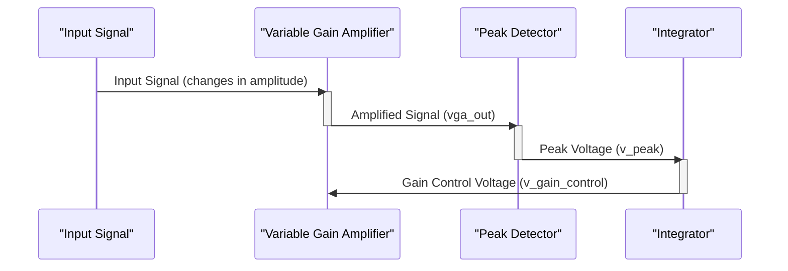

> Previously, we looked at [Transient Analysis](06_transient-analysis.md).

# Chapter 7: Variable Gain Amplifier (VGA)
Let's begin exploring this concept. This chapter delves into the Variable Gain Amplifier (VGA), a crucial building block within our Automatic Gain Control (AGC) system.
**Why a Variable Gain Amplifier?**
Imagine you're listening to the radio. Sometimes the signal is strong and clear, and other times it's weak and filled with static. An AGC is like a volume knob that automatically adjusts itself to keep the sound at a comfortable level. The VGA is the *heart* of this process. It's the component that actually *changes* the amplification, responding to the AGC's adjustments to maintain a constant output, regardless of the input signal's strength.
Without a VGA, our AGC system would be unable to dynamically adjust the gain, defeating its purpose.
**Key Concepts**
The VGA in our design consists of a operational amplifier (op-amp) combined with voltage-controlled resistors (VCRs). The VCRs adjust their resistance value based on the control voltage (`v_gain_control`). This variable resistance, in turn, alters the gain of the op-amp circuit.
*   **Operational Amplifier (Op-amp):** Provides the core amplification. We covered ideal op-amps in [Op-amp (Ideal)](01_op-amp-ideal.md).
*   **Voltage-Controlled Resistor (VCR):** A resistor whose resistance can be changed by applying a voltage. Crucially, our `v_gain_control` signal from the feedback loop, adjusts the resistance value dynamically. See [Voltage Controlled Resistor (VCR)](04_voltage-controlled-resistor-vcr.md).
**How it Works**
The VGA's gain is controlled by the `v_gain_control` signal. A higher `v_gain_control` voltage typically results in a lower resistance value for the VCR, thus *reducing* the gain of the amplifier. Conversely, a lower `v_gain_control` voltage leads to a higher resistance and *increased* gain.
This inverse relationship is essential for the AGC's feedback mechanism. If the output signal is too strong, the feedback loop increases `v_gain_control` to *reduce* the VGA's gain. If the output is too weak, `v_gain_control` is decreased to *increase* the gain.
**Code Example**
The core of our VGA implementation is encapsulated within the `vga_stage` subcircuit, as referenced in the main SPICE netlist:
```python
--- File: agc_system.sp ---
* 1. Variable Gain Amplifier (VGA) Stage
* Inputs: in, vga_out, v_gain_control
X_VGA in vga_out v_gain_control vga_stage
```
This line instantiates the VGA subcircuit.  The `in` node is the input signal, `vga_out` is the amplified output, and `v_gain_control` is the control voltage that adjusts the gain. The `vga_stage` parameter tells SPICE to use the defined `vga_stage` subcircuit (defined in `models/opamp_gain_stage.lib`).
The internals of the `vga_stage` are found within the `opamp_gain_stage.lib` file and make use of the voltage controlled resistor model. This illustrates the modularity of the design; the `agc_system.sp` only defines the overall system connections.
**Interaction within the AGC**
Here's a sequence diagram illustrating how the VGA interacts with other components within the AGC system:

In this diagram, the Input Signal (Vin) feeds into the VGA. The VGA amplifies this signal and sends the output to the Peak Detector (PD). The PD then calculates the peak voltage and feeds it to the Integrator (INT). The Integrator compares this peak voltage to a reference and adjusts the Gain Control Voltage (v_gain_control) which is then fed back to the VGA, thus completing the feedback loop.
**Relationships to Other Chapters**
The VGA builds directly on concepts presented in [Op-amp (Ideal)](01_op-amp-ideal.md) regarding amplification, and in [Voltage Controlled Resistor (VCR)](04_voltage-controlled-resistor-vcr.md) which details how we achieve variable resistance. The VGA's output is then fed into the [Peak Detector](06_peak-detector.md), the next component in the AGC chain.
This concludes our look at this topic.

> Next, we will examine [Voltage Controlled Resistor (VCR)](08_voltage-controlled-resistor-vcr.md).


---

*Generated by [SourceLens AI](https://github.com/openXFlow/sourceLensAI) using LLM: `gemini` (cloud) - model: `gemini-2.0-flash` | Language Profile: `Python`*