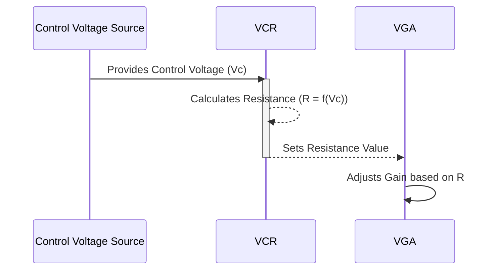

> Previously, we looked at [Variable Gain Amplifier (VGA)](07_variable-gain-amplifier-vga.md).

# Chapter 8: Voltage Controlled Resistor (VCR)
Let's begin exploring this concept. This chapter explains the Voltage Controlled Resistor (VCR), a crucial component enabling the variable gain functionality in our Variable Gain Amplifier (VGA), which in turn is part of the Automatic Gain Control (AGC) system.
**Motivation/Purpose**
Imagine a water faucet. The amount of water flowing through the faucet (current) depends on the water pressure (voltage) and how open the valve is (resistance). A normal resistor is like a faucet with a fixed opening. A VCR, however, is like a faucet where you can dynamically adjust the opening (resistance) using another knob (control voltage).
In our AGC system, we need to *automatically* adjust the gain of the amplifier based on the output signal's amplitude. The VCR allows us to do this by controlling the resistance, and therefore the gain, of the [Variable Gain Amplifier (VGA)](05_variable-gain-amplifier-vga.md) based on a control voltage generated by the [Feedback Loop (Integrator)](07_feedback-loop-integrator.md). Without the VCR, our gain would be fixed!
**Key Concepts Breakdown**
The VCR is characterized by these parameters:
*   **`r_min`:** The minimum resistance the VCR can achieve. This prevents the gain from becoming too high.
*   **`r_max`:** The maximum resistance the VCR can achieve. This limits the minimum gain.
*   **`v_ref`:** A reference voltage. The control voltage is compared to this reference to determine the resistance.  Think of this as a calibration point for the VCR's behavior.
The resistance of the VCR is *inversely* proportional to the control voltage.  A higher control voltage results in a lower resistance, and vice-versa.
**Usage / How it Works**
The VCR is used within the [Variable Gain Amplifier (VGA)](05_variable-gain-amplifier-vga.md) circuit. The control voltage, which comes from the [Feedback Loop (Integrator)](07_feedback-loop-integrator.md), adjusts the resistance of the VCR. This change in resistance alters the gain of the VGA, completing the feedback loop. The [Automatic Gain Control (AGC) System](08_automatic-gain-control-agc-system.md) uses this system to maintain a stable output signal amplitude.
**Code Examples (Short & Essential)**
The core of the VCR is implemented using Verilog-A, an analog hardware description language. Here's the code snippet from `models/voltage_controlled_resistor.va`:
```python
// Voltage Controlled Resistor (VCR)
// The resistance is inversely proportional to the control voltage.
`include "disciplines.vams"
module vcr(p, n, vc);
    inout p, n;
    input vc;
    electrical p, n, vc;
    parameter real r_min = 1k; // Minimum resistance
    parameter real r_max = 100k; // Maximum resistance
    parameter real v_ref = 1.0; // Reference control voltage
    real resistance;
    analog begin
        @(initial_step) begin
            resistance = r_max;
        end
        // Resistance is high for low Vc, and low for high Vc
        resistance = r_max / (V(vc)/v_ref + 1.0);
        // Clamp the resistance to its min/max values
        if (resistance < r_min) begin
            resistance = r_min;
        end
        if (resistance > r_max) begin
            resistance = r_max;
        end
        // Ohm's Law
        V(p, n) <+ resistance * I(p, n);
    end
endmodule
```
Let's break down the important parts:
*   `module vcr(p, n, vc);`: Defines the VCR module with terminals `p`, `n` (the resistor terminals) and `vc` (the control voltage).
*   `parameter real r_min = 1k;`: Sets the minimum resistance to 1 kilo-ohm.
*   `parameter real r_max = 100k;`: Sets the maximum resistance to 100 kilo-ohms.
*   `parameter real v_ref = 1.0;`: Sets the reference control voltage to 1 Volt.
*   `resistance = r_max / (V(vc)/v_ref + 1.0);`:  This is the *key* equation.  It calculates the resistance based on the control voltage `V(vc)`. Notice the inverse relationship: as `V(vc)` increases, `resistance` decreases. We add 1 in the denominator to prevent division by zero when V(vc) is zero.
*   The `if` statements clamp the resistance between `r_min` and `r_max`.
*   `V(p, n) <+ resistance * I(p, n);`: This implements Ohm's Law, relating the voltage across the resistor (`V(p, n)`) to the current through it (`I(p, n)`) and the resistance.  The `<+` operator indicates a contribution to the voltage equation.
**Inline Diagrams (Optional)**
Here's a sequence diagram showing how the VCR's resistance changes based on the control voltage in the context of the VGA:

This diagram illustrates that the control voltage influences the VCR, which then adjusts its resistance. This resistance value directly impacts the gain of the VGA.
**Relationships & Cross-Linking**
The VCR is essential for the functionality of the [Variable Gain Amplifier (VGA)](05_variable-gain-amplifier-vga.md). Its behavior directly influences the VGA's gain, which is controlled by the [Feedback Loop (Integrator)](07_feedback-loop-integrator.md). Understanding the VCR is crucial for grasping how the entire [Automatic Gain Control (AGC) System](08_automatic-gain-control-agc-system.md) works. The VCR itself relies on fundamental circuit concepts, such as Ohm's Law.
**Conclusion**
The Voltage Controlled Resistor (VCR) is a key component that allows for dynamic gain adjustment in our AGC system. By varying its resistance based on a control voltage, it enables the VGA to respond to changing input signal amplitudes.
This concludes our look at this topic.

> Next, we will examine [Architecture Diagrams](09_diagrams.md).


---

*Generated by [SourceLens AI](https://github.com/openXFlow/sourceLensAI) using LLM: `gemini` (cloud) - model: `gemini-2.0-flash` | Language Profile: `Python`*