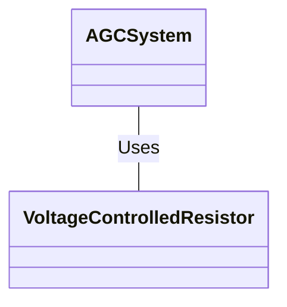
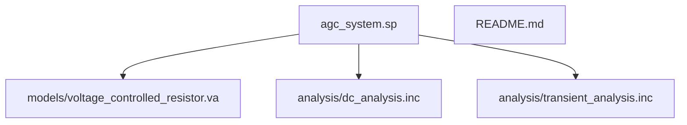

> Previously, we looked at [Voltage Controlled Resistor (VCR)](08_voltage-controlled-resistor-vcr.md).

# Chapter 9: Architecture Diagrams
## Class Diagram
Key classes and their relationships in **20250707_1627_code-analog-design-sample-project**.

## Package Dependencies
High-level module and package structure of **20250707_1627_code-analog-design-sample-project**.

> Next, we will examine [Code Inventory](10_code_inventory.md).

---

*Generated by [SourceLens AI](https://github.com/openXFlow/sourceLensAI) using LLM: `gemini` (cloud) - model: `gemini-2.0-flash` | Language Profile: `Python`*