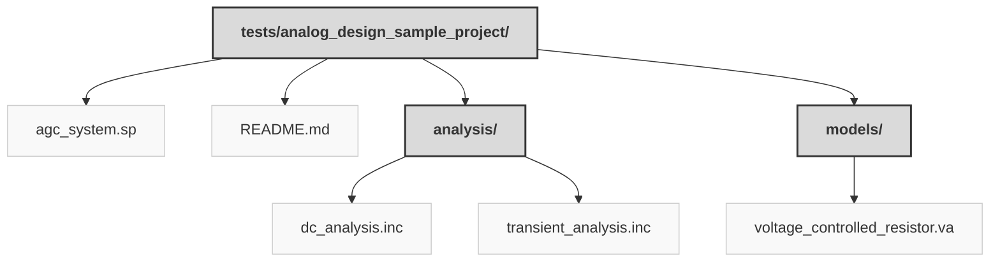

> Previously, we looked at [Architecture Diagrams](09_diagrams.md).

# Chapter 10: Code Inventory
## File Structure

## File Descriptions Summary
*   **`agc_system.sp`**: * Automatic Gain Control (AGC) System
*   **`README.md`**: Analog Sample Project: Automatic Gain Control (AGC) Amplifier
*   **`dc_analysis.inc`**: * DC Operating Point Analysis
*   **`transient_analysis.inc`**: * Transient Analysis
*   **`voltage_controlled_resistor.va`**: // Voltage Controlled Resistor (VCR)
---
## Detailed File Content
No detailed structural information could be generated for the files based on the selected parser.

> Next, we will examine [Project Review](11_project_review.md).

---

*Generated by [SourceLens AI](https://github.com/openXFlow/sourceLensAI) using LLM: `gemini` (cloud) - model: `gemini-2.0-flash` | Language Profile: `Python`*