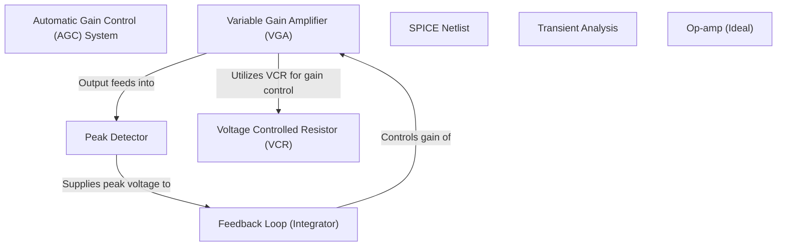

# Tutorial: 20250707_1627_code-analog-design-sample-project

The AGC system (*Abstraction 0*) regulates output amplitude by adjusting gain using a feedback loop. The **VGA (1)** amplifies the input signal, and the **Peak Detector (2)** measures its output peak.  This peak voltage is fed back to the **Feedback Loop (3)**, which controls the VGA's gain to maintain a constant output.

**Source Directory:** `C:\_jd_programming\python\11_sourceLens_project\sourceLens\tests\analog_design_sample_project`

## Abstraction Relationships

## Chapters

1. [Automatic Gain Control (AGC) System](01_automatic-gain-control-agc-system.md)
2. [Feedback Loop (Integrator)](02_feedback-loop-integrator.md)
3. [Op-amp (Ideal)](03_op-amp-ideal.md)
4. [Peak Detector](04_peak-detector.md)
5. [SPICE Netlist](05_spice-netlist.md)
6. [Transient Analysis](06_transient-analysis.md)
7. [Variable Gain Amplifier (VGA)](07_variable-gain-amplifier-vga.md)
8. [Voltage Controlled Resistor (VCR)](08_voltage-controlled-resistor-vcr.md)
9. [Architecture Diagrams](09_diagrams.md)
10. [Code Inventory](10_code_inventory.md)
11. [Project Review](11_project_review.md)

---

*Generated by [SourceLens AI](https://github.com/openXFlow/sourceLensAI) using LLM: `gemini` (cloud) - model: `gemini-2.0-flash` | Language Profile: `Python`*