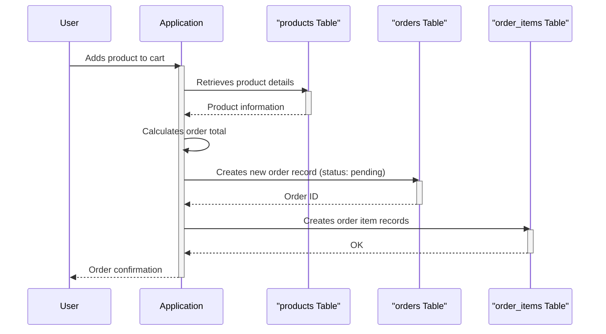

> Previously, we looked at [Data Seeding](02_data-seeding.md).

# Chapter 3: Database Tables
Let's begin exploring this concept. This chapter will introduce you to the fundamental building blocks of our e-commerce platform's database: the tables. We'll examine their structure and purpose within the system.
Why do we need database tables? Imagine a spreadsheet. Each sheet in the spreadsheet represents a different type of data – customers, products, orders, etc. A database table is essentially a structured, digital version of such a sheet, optimized for efficient storage, retrieval, and manipulation of data. Without these tables, we'd have no organized way to store information about our users, products, and transactions, making it impossible to run an e-commerce platform effectively.
Our database is designed around five core tables: `users`, `products`, `orders`, `order_items`, and `product_reviews`. Each table holds data related to a specific entity in our e-commerce ecosystem.
Here's a breakdown of each table:
*   **`users`:** Stores information about registered users, such as their email, password, name, and registration date.
*   **`products`:** Stores details about the products available for sale, including their SKU (Stock Keeping Unit), name, description, price, and current stock level.
*   **`orders`:** Records information about customer orders, including the user who placed the order, the order date, the current status (e.g., pending, shipped), and the total amount.
*   **`order_items`:** Represents the individual items included in each order, linking orders to specific products and recording the quantity and price of each item at the time of purchase.
*   **`product_reviews`:** Stores customer reviews for products, including the rating, comment, and review date.
These tables form the backbone of our database. Let's examine a simplified sequence diagram of a typical scenario involving multiple tables.

This diagram illustrates how the application interacts with the `products`, `orders`, and `order_items` tables when a user adds a product to their cart and creates an order. The application retrieves product information from the `products` table, creates a new order record in the `orders` table, and creates corresponding order item records in the `order_items` table.
Now, let's look at the SQL code used to define these tables.
```python
--- File: schema/01_tables.sql ---
-- 01_tables.sql
-- Defines the core tables for the e-commerce platform.
CREATE TABLE users (
    user_id INT GENERATED BY DEFAULT AS IDENTITY,
    email VARCHAR(255) NOT NULL UNIQUE,
    password_hash VARCHAR(255) NOT NULL,
    first_name VARCHAR(100),
    last_name VARCHAR(100),
    created_at TIMESTAMPTZ NOT NULL DEFAULT NOW()
);
CREATE TABLE products (
    product_id INT GENERATED BY DEFAULT AS IDENTITY,
    sku VARCHAR(50) NOT NULL UNIQUE,
    name VARCHAR(255) NOT NULL,
    description TEXT,
    price DECIMAL(10, 2) NOT NULL,
    stock_quantity INT NOT NULL DEFAULT 0
);
CREATE TABLE orders (
    order_id INT GENERATED BY DEFAULT AS IDENTITY,
    user_id INT NOT NULL,
    order_date TIMESTAMPTZ NOT NULL DEFAULT NOW(),
    status VARCHAR(50) NOT NULL DEFAULT 'pending', -- e.g., pending, shipped, delivered, cancelled
    total_amount DECIMAL(10, 2) NOT NULL
);
CREATE TABLE order_items (
    order_item_id INT GENERATED BY DEFAULT AS IDENTITY,
    order_id INT NOT NULL,
    product_id INT NOT NULL,
    quantity INT NOT NULL,
    price_per_unit DECIMAL(10, 2) NOT NULL
);
CREATE TABLE product_reviews (
    review_id INT GENERATED BY DEFAULT AS IDENTITY,
    product_id INT NOT NULL,
    user_id INT NOT NULL,
    rating INT NOT NULL, -- Rating from 1 to 5
    comment TEXT,
    review_date TIMESTAMPTZ NOT NULL DEFAULT NOW()
);
```
Each `CREATE TABLE` statement defines the structure of a table, including the column names, data types, and any constraints. For example, in the `users` table, the `user_id` column is an integer that is automatically generated, the `email` column is a string (VARCHAR) that cannot be null and must be unique, and the `created_at` column stores the timestamp of when the user was created, defaulting to the current time.
Understanding the structure and purpose of these tables is essential for working with the database and building the e-commerce platform. We will explore constraints, indexes and relationships in later chapters: [Constraints (Primary Keys, Checks)](02_constraints-primary-keys-checks.md), [Indexes](03_indexes.md), [Relationships (Foreign Keys)](04_relationships-foreign-keys.md).
This concludes our look at this topic.

> Next, we will examine [Indexes](04_indexes.md).


---

*Generated by [SourceLens AI](https://github.com/openXFlow/sourceLensAI) using LLM: `gemini` (cloud) - model: `gemini-2.0-flash` | Language Profile: `Python`*