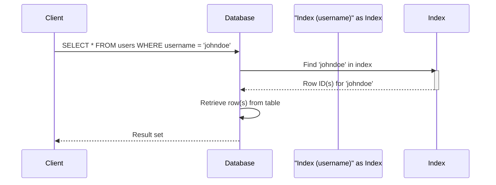

> Previously, we looked at [Database Tables](03_database-tables.md).

# Chapter 4: Indexes
Let's begin exploring this concept. This chapter explains what database indexes are, why they're important, and how they're used in the `20250707_1716_code-sql-db-sample-project`.
**Why Indexes? The Database Library Analogy**
Imagine a library with thousands of books. Without a catalog, finding a specific book would require searching every shelf. This is exactly what happens in a database without indexes: the database has to scan the entire table (the "bookshelves") to find the rows you're looking for.
An index is like the library's catalog. It's a separate data structure that stores a sorted list of values from one or more columns, along with pointers to the actual rows in the table. This allows the database to quickly locate the desired rows without scanning the entire table.
Indexes are crucial for improving the performance of queries, especially on large tables. They can significantly speed up `SELECT` queries, as well as `WHERE` clauses that use indexed columns.
**How Indexes Work**
At a high level, indexes work by creating a separate, sorted data structure that maps values in a column (or columns) to the physical location of the corresponding rows in the table. When you execute a query that filters on an indexed column, the database can use the index to quickly find the matching rows, instead of scanning the entire table.
Let's consider a simplified analogy:
1.  **Table:** A table named `users` with columns like `user_id`, `username`, and `email`.
2.  **Index:** An index on the `username` column. This index contains a sorted list of usernames, along with pointers to the corresponding rows in the `users` table.
3.  **Query:** A query like `SELECT * FROM users WHERE username = 'johndoe'`.
Without an index, the database would have to scan every row in the `users` table to find the row where `username` is 'johndoe'.
With an index, the database can use the index to quickly find the row where `username` is 'johndoe', and then directly retrieve the row from the `users` table.
**Example: Code and Explanation**
In our project, the indexes are defined in the `schema/02_constraints_and_indexes.sql` file. Here's an example:
```python
--- File: schema/02_constraints_and_indexes.sql ---
-- Indexes for performance
CREATE INDEX idx_orders_user_id ON orders(user_id);
CREATE INDEX idx_order_items_order_id ON order_items(order_id);
CREATE INDEX idx_order_items_product_id ON order_items(product_id);
CREATE INDEX idx_reviews_product_id ON product_reviews(product_id);
```
*   `CREATE INDEX idx_orders_user_id ON orders(user_id);`:  This statement creates an index named `idx_orders_user_id` on the `user_id` column of the `orders` table. This index will improve the performance of queries that filter on the `user_id` column of the `orders` table.
*   `CREATE INDEX idx_order_items_order_id ON order_items(order_id);`: This statement creates an index named `idx_order_items_order_id` on the `order_id` column of the `order_items` table. This index will improve the performance of queries that filter on the `order_id` column of the `order_items` table.
*   `CREATE INDEX idx_order_items_product_id ON order_items(product_id);`: This statement creates an index named `idx_order_items_product_id` on the `product_id` column of the `order_items` table.  This index will help find items related to a product faster.
*   `CREATE INDEX idx_reviews_product_id ON product_reviews(product_id);`: This statement creates an index named `idx_reviews_product_id` on the `product_id` column of the `product_reviews` table. This index will improve the performance of queries that filter on the `product_id` column of the `product_reviews` table, making it faster to retrieve reviews for a specific product.
**Tradeoffs**
While indexes significantly improve read performance, they come with a cost:
*   **Storage Space:** Indexes consume additional storage space.
*   **Write Performance:** Indexes can slow down write operations (e.g., `INSERT`, `UPDATE`, `DELETE`) because the database has to update the index whenever the data in the table changes.
Therefore, it's important to carefully consider which columns to index.  Index columns that are frequently used in `WHERE` clauses, but avoid indexing columns that are rarely used or that are frequently updated.
**Example: Sequence Diagram**
Here's a simple sequence diagram illustrating how an index is used during a database query.

This diagram illustrates the process:
1.  The client sends a query to the database.
2.  The database consults the index on the `username` column.
3.  The index returns the row ID(s) of the matching row(s).
4.  The database retrieves the row(s) from the table using the row ID(s).
5.  The database returns the result set to the client.
**Relationships to Other Concepts**
Indexes can work in conjunction with the constraints discussed in [Constraints (Primary Keys, Checks)](02_constraints-primary-keys-checks.md) to ensure data integrity and optimize query performance. For example, primary key constraints often have associated indexes to enforce uniqueness and speed up lookups. Indexes also play a crucial role when working with relationships defined using foreign keys, as covered in [Relationships (Foreign Keys)](04_relationships-foreign-keys.md), speeding up joins between tables.
This concludes our look at this topic.

> Next, we will examine [Product Catalog](05_product-catalog.md).


---

*Generated by [SourceLens AI](https://github.com/openXFlow/sourceLensAI) using LLM: `gemini` (cloud) - model: `gemini-2.0-flash` | Language Profile: `Python`*