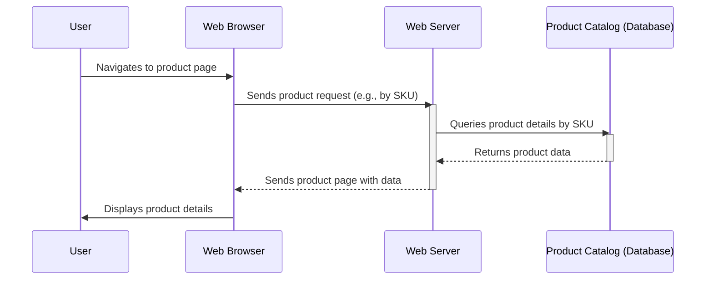

> Previously, we looked at [Indexes](04_indexes.md).

# Chapter 5: Product Catalog
Let's begin exploring this concept. This chapter delves into the "Product Catalog," a core component of our e-commerce platform responsible for managing product information. We'll discuss its purpose, key elements, and how it interacts with the database.
The Product Catalog is essentially the "brain" behind what you see on a typical online store. Think of it as a well-organized library of all the items available for sale. Each book (product) has its own entry with details like title (name), author (brand), summary (description), price, and the number of copies available (stock quantity). Without a Product Catalog, we wouldn't know what we're selling, how much it costs, or if we even have it in stock!
The `products` table defined in the `schema/01_tables.sql` script is the foundation of our Product Catalog. Let's break down the key columns:
*   **`product_id`:**  A unique identifier for each product. This uses auto-incrementing integer values making each product unique.
*   **`sku` (Stock Keeping Unit):**  A unique code assigned to each product variant. This is different from the `product_id` because one product might have different sizes or colors, each having its own SKU. Think of it as a product's internal ID.
*   **`name`:** The descriptive name of the product (e.g., "Men's T-Shirt - Blue").
*   **`description`:** A detailed description of the product, including features, materials, etc.
*   **`price`:** The price of the product. We use the `DECIMAL(10, 2)` data type to accurately represent currency values.
*   **`stock_quantity`:** The number of units currently in stock. This is crucial for inventory management.
The Product Catalog's primary function is to provide a centralized and organized way to access, create, update, and delete product information. Imagine a customer browsing the website. They click on a product. The system queries the Product Catalog (specifically the `products` table in our database) to retrieve all the necessary details to display on the product page.
Here's a simple example of how we might retrieve product information using SQL (although the actual code interaction in a real application would use a database connector library):
```python
--- File: Retrieving product data
-- Retrieving product data example
SELECT
    product_id,
    sku,
    name,
    description,
    price,
    stock_quantity
FROM
    products
WHERE
    sku = 'TSHIRT-BLUE-M'; -- Replace with an actual SKU
-- This query retrieves all the product information for a specific SKU.
```
This query shows how to retrieve the key details of a product based on its SKU. A more complex application might use the `product_id` instead.
Let's look at a simplified diagram to illustrate how the Product Catalog interacts with other parts of the system during a product view:

This sequence diagram illustrates the flow: the user requests a product page, the web server retrieves the product details from the product catalog (database), and then renders the page to the user.  We see the core dependency on the database in providing the product information.
Understanding the Product Catalog is fundamental to understanding how products are managed within our e-commerce platform. It's the single source of truth for product information. Its structure is closely tied to the database schema defined in [Database Tables](01_database-tables.md), [Constraints (Primary Keys, Checks)](02_constraints-primary-keys-checks.md), and [Indexes](03_indexes.md). The foreign key relationships to orders within the `order_items` table are explored in the [Relationships (Foreign Keys)](04_relationships-foreign-keys.md) chapter. The [Data Seeding](05_data-seeding.md) chapter demonstrated how to populate the `products` table with initial data.
This concludes our look at this topic.

> Next, we will examine [Relationships (Foreign Keys)](06_relationships-foreign-keys.md).


---

*Generated by [SourceLens AI](https://github.com/openXFlow/sourceLensAI) using LLM: `gemini` (cloud) - model: `gemini-2.0-flash` | Language Profile: `Python`*