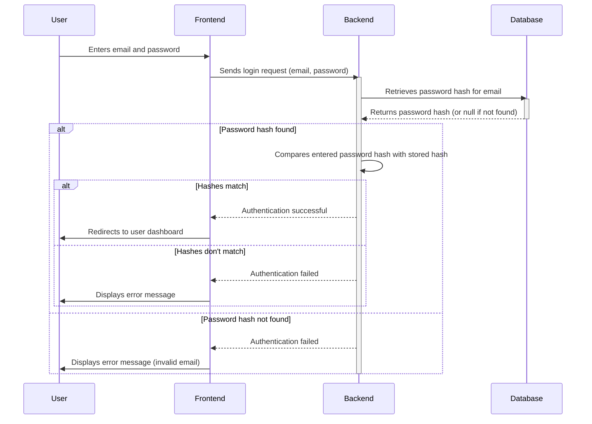

> Previously, we looked at [Stored Procedures](07_stored-procedures.md).

# Chapter 8: User Management
Let's begin exploring this concept. This chapter dives into the "User Management" aspect of our e-commerce platform, focusing on how we handle user accounts. This includes registration, login, and managing user profile information.
**Why User Management?**
Imagine your e-commerce site as a bustling city. Each user is like a resident. To allow residents to access services (like placing orders, writing reviews, or saving preferences), we need a system to manage their identities – a "User Management" system. This system allows residents to register (move in), log in (show their ID), and manage their profiles (update their address or preferences). Without it, chaos would ensue – anyone could claim to be anyone else, and tracking orders or providing personalized experiences would be impossible. It ensures only valid and authorized people can access and modify their accounts.
**Key Concepts:**
The User Management system revolves around these core concepts:
*   **Registration:** The process of creating a new user account. This involves collecting necessary information like email, password, first name, and last name.
*   **Authentication (Login):** Verifying a user's identity by checking their email and password against stored credentials.
*   **Authorization:** Determining what a user is allowed to do after successful authentication. For example, an admin user might have access to more features than a regular customer.
*   **Profile Management:** Allowing users to view and update their personal information.
**How User Management Works:**
At a high level, the user management system facilitates these key actions:
1.  **User Registration:** A new user provides their information, which is then validated, and the password is securely hashed before being stored in the database.
2.  **User Login:** A user enters their email and password. The system retrieves the stored password hash for that email and compares it to the hash of the entered password. If they match, the user is authenticated.
3.  **Profile Viewing/Updating:** Authenticated users can view their stored information and make updates. These updates are validated and then stored in the database.
**Code Examples:**
The following snippet shows the database table definition for the `users` table, which is the foundation of our user management system.
```python
--- File: schema/01_tables.sql ---
CREATE TABLE users (
    user_id INT GENERATED BY DEFAULT AS IDENTITY,
    email VARCHAR(255) NOT NULL UNIQUE,
    password_hash VARCHAR(255) NOT NULL,
    first_name VARCHAR(100),
    last_name VARCHAR(100),
    created_at TIMESTAMPTZ NOT NULL DEFAULT NOW()
);
```
*   `user_id`: A unique identifier for each user (primary key).
*   `email`: User's email address (must be unique).
*   `password_hash`: A securely hashed version of the user's password. **Important: We NEVER store passwords in plain text!**
*   `first_name`, `last_name`: User's first and last names.
*   `created_at`: Timestamp indicating when the user account was created.
This next example shows the constraints applied to the users table.
```python
--- File: schema/02_constraints_and_indexes.sql ---
-- Primary Keys
ALTER TABLE users ADD PRIMARY KEY (user_id);
-- Foreign Keys (none directly on users table, but user_id is used in other tables)
```
As you can see, the `user_id` column is defined as the primary key. The `users` table does not directly contain any foreign keys. However, as shown in the `orders` table and `product_reviews` tables, the `user_id` field is referenced as a foreign key, establishing relationships with other tables. We touched on primary keys in [Constraints (Primary Keys, Checks)](02_constraints-primary-keys-checks.md), and on foreign keys in [Relationships (Foreign Keys)](04_relationships-foreign-keys.md).
Below is a `mermaid` sequence diagram illustrating the user login process:

This sequence diagram illustrates the typical login process. The `User` interacts with the `Frontend`, which communicates with the `Backend`. The `Backend` retrieves the stored password hash from the `Database` and performs the authentication logic.
**Relationship with Other Modules:**
The User Management system is tightly integrated with other parts of the e-commerce platform. For example:
*   **Orders:** Orders are associated with users through the `user_id` foreign key in the `orders` table (as seen in [Database Tables](01_database-tables.md)). This allows us to track a user's order history.
*   **Product Reviews:** Product reviews are associated with users through the `user_id` foreign key in the `product_reviews` table. This allows us to display which user wrote a specific review.
This concludes our look at this topic.

> Next, we will examine [Views](09_views.md).


---

*Generated by [SourceLens AI](https://github.com/openXFlow/sourceLensAI) using LLM: `gemini` (cloud) - model: `gemini-2.0-flash` | Language Profile: `Python`*